单纯学习源码的效率是很低的，编程的一大乐趣就是其交互性，所以首先我们需要将引擎跑起来。本节我们将完成环境的配置工作，配置引擎的编译、运行以及开发环境。

## WSL

考虑到大家可以比较轻松地获得一台装有 Windows 系统的机器，为了减少大家花在配置环境上的时间，小册选择使用 WSL 作为开发环境。

WSL 全称是（Windows Subsystem for Linux）。顾名思义，是在 Windows 系统下提供了一个 Linux 子系统，可以一定程度上兼顾 Windows 系统的交互便利性以及 Linux 上开发的便捷性。

## 安装 WSL

下面我们开始安装 WSL，首先需要以管理员身份启动命令行工具：


在点击了「Run as administrator」后，会出现一个确认框，我们选择确定即可：


接着我们在命令行工具中输入 `wsl --install`：

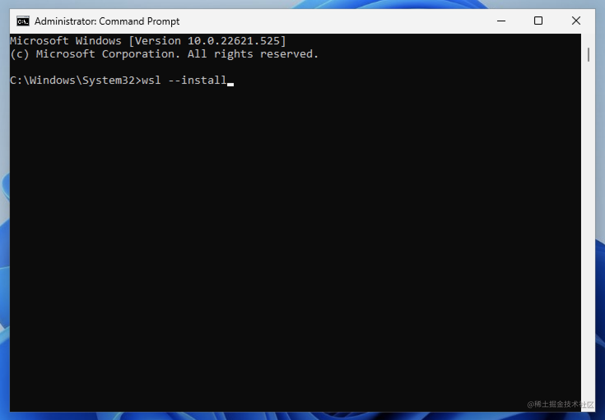

进度条走完后同样会出现一个确认框，我们选择确定：


接着会出现安装 WSL 运行所需的基础环境的进度条：


基础环境安装完毕后，会自动进入到 WSL 以及 Linux 发行版的安装（默认为 Ubuntu）：


安装完毕后会提示我们变更将在重启后生效：


重启之后我们打开 Ubuntu 程序：

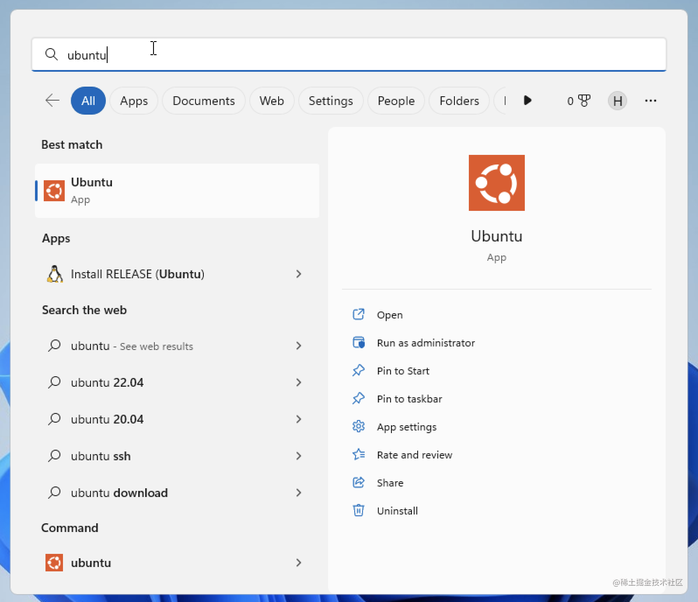

打开程序后会继续剩余的 WSL 安装工作，耐心等待后会提示我们为子系统创建一个新用户：

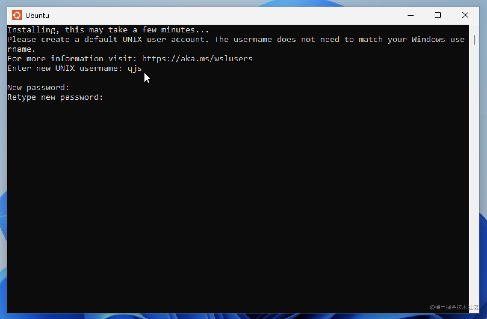

输入用户名密码之后，会看到安装成功并进入子系统的界面：

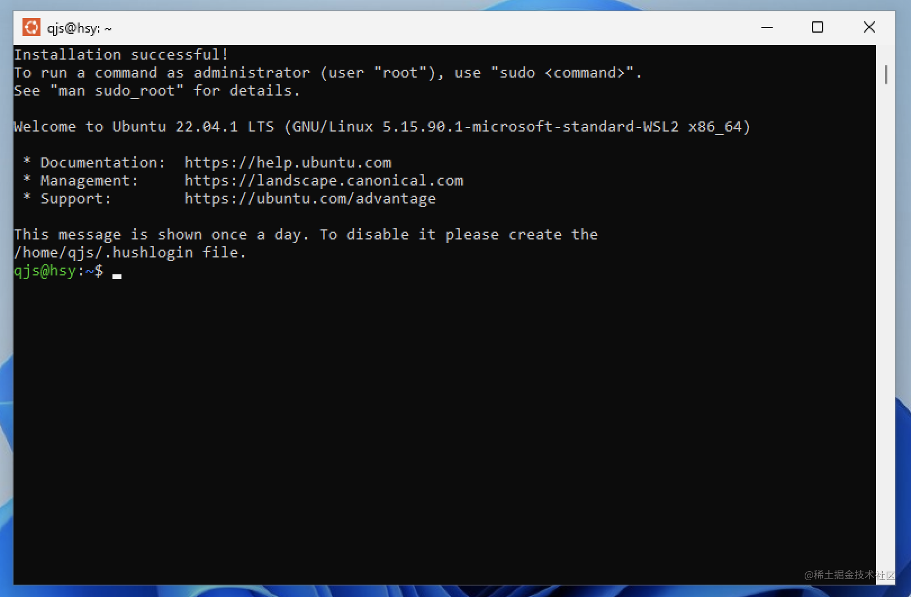

首次进入子系统，我们可以运行命令 `sudo apt update` 来更新一下本地软件仓库中的软件版本信息：

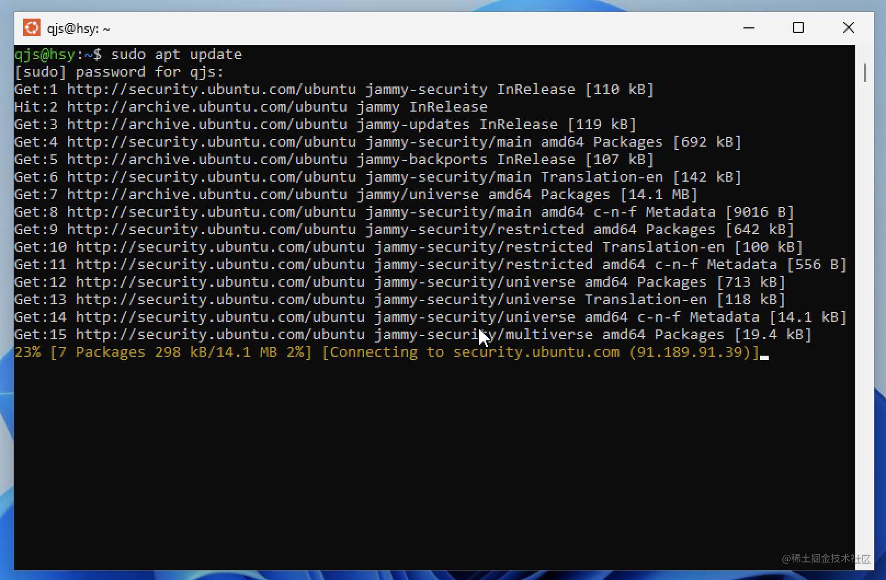

接着使用命令 `sudo apt upgrade` 升级一下系统中已经安装的软件的版本：

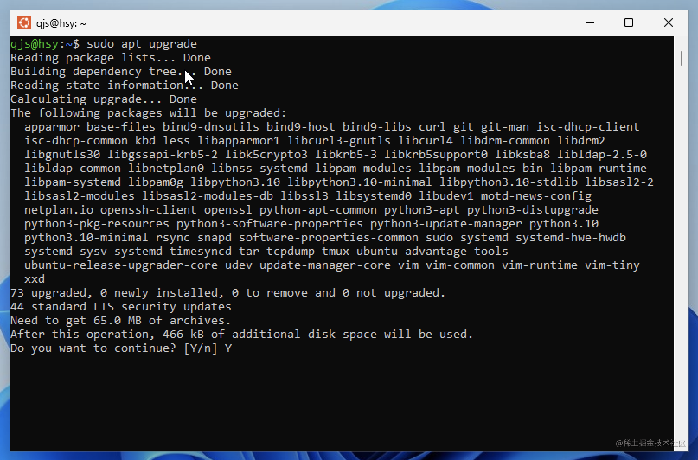

这样我们的 WSL 就算是安装完毕了，最后我们可以将 Ubuntu 程序固定到任务栏：

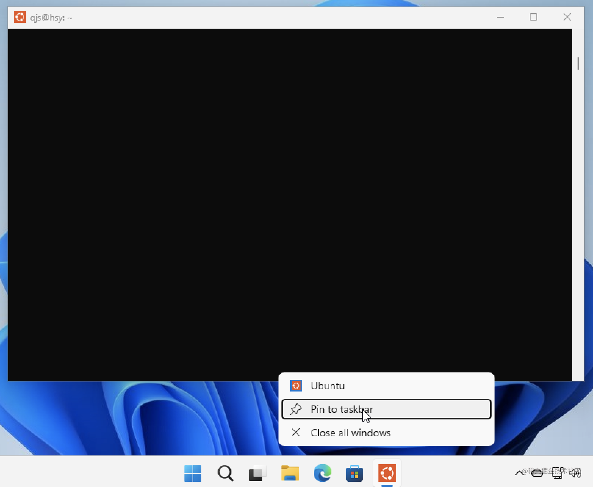

后续我们就可以点击任务栏的图标快速地呼出 WSL 交互窗口了。

回顾一下：

- WSL 中使用的 Linux 发行版是 Ubuntu，和我们直接使用 Ubuntu 作为宿主操作系统的区别不是很大

- 使用了两个 Ubuntu 系统中的包管理命令 `apt update` 和 `apt upgrade` 来进行系统更新

  > `sudo` 可以搭配其他命令，表示以管理员身份运行

## 安装 C 语言编译环境

quickjs 使用 C 语言编写，我们需要继续在 Ubuntu 中安装用于编译 C 语言的工具。

我们首先使用命令 `lsb_release -a` 查看我们 Ubuntu 系统的版本号：

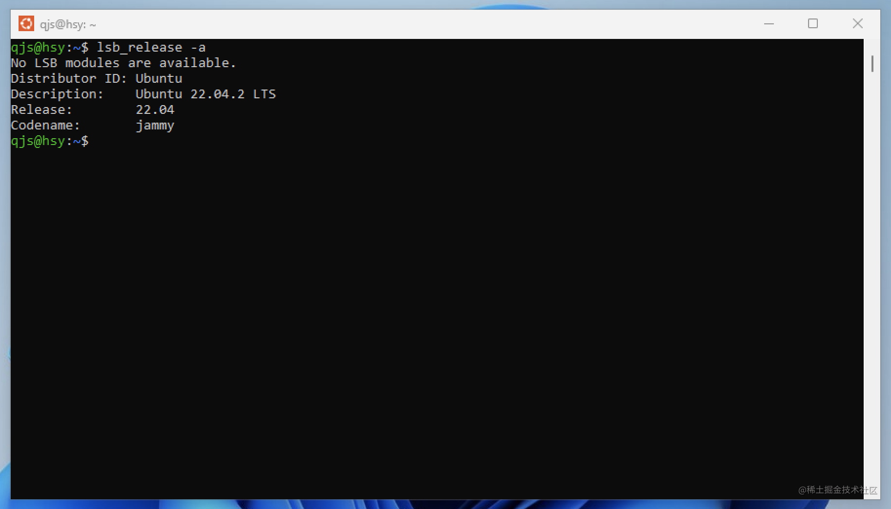

> 如果软件安装失败，可将系统版本号与错误信息相结合，利用 Google 搜寻解决方式

接着我们运行命令 `sudo apt install clang lld ninja-build clangd`：

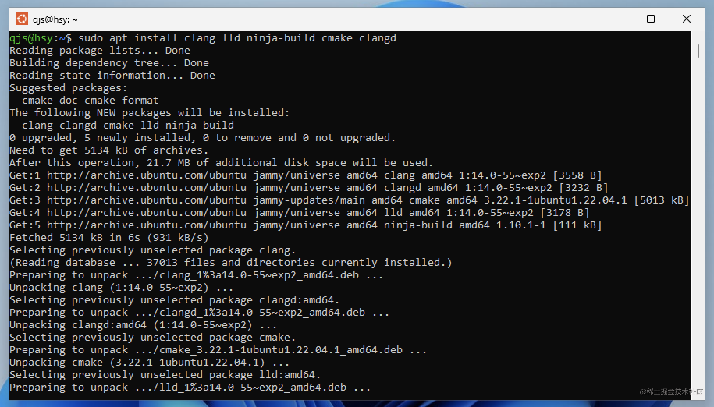

上面的命令分别安装了：

- `clang` - 编译器，对应前端编译工具链中的 babel

- `lld` - 链接器，C 语言的编译是以文件为单位，其中的函数调用在编译后先转换为占位符，通过链接器可以将这些占位符替换为相应的内存地址

- `ninja-build` - 构建工具，类似前端工具链中的 webpack

- `clangd` - 类似 [TypeScript & JavaScript Language Server](https://github.com/typescript-language-server/typescript-language-server)，可以对代码进行分析，常用来对编辑器的功能进行增强，比如补全，跳转定义等

## CMake

CMake 是一个抽象了底层构建细节的构建工具，对用户提供统一的编程接口，内部自动适配不同的构建工具链。

我们知道 webpack 和 parcel 的配置是不一样的，那么 CMake 的作用是提供一个统一二者的配置方式，用户可以自由地切换底层使用的是 webpack 还是 parcel。

抽象 webpack 和 parcel 的配置这一功能可能在前端领域的作用并不是很大，但对于 C 语言来说却很有用。

C 语言是跨平台的，但 C 语言的编译方式不是跨平台的，不同的操作系统上需要使用不同的编译器、链接器、构建工具等，这些工具的配置格式及操作方式之间的差异是比较大的。

有了 CMake 后，用户仅需面对 CMake 的配置格式及操作方式，在不同的平台上由 CMake 自动地完成对底层工具链的调用，从而达到编译方式的的跨平台。

## 安装 CMake

由于默认软件仓库中的 cmake 版本低于我们所需的版本，所以需要多一些步骤进行安装。

首先安装添加仓库秘钥所需的软件包：

```bash
sudo apt install software-properties-common
```

接着安装第三方仓库所需的秘钥：

```bash
wget -O - https://apt.kitware.com/keys/kitware-archive-latest.asc 2>/dev/null | gpg --dearmor - | sudo tee /etc/apt/trusted.gpg.d/kitware.gpg >/dev/null
```

将第三方仓库加入到本地的仓库列表中：

```bash
sudo apt-add-repository 'deb https://apt.kitware.com/ubuntu/ jammy main'
```

更新本地软件仓库并安装 cmake：

```bash
sudo apt update && sudo apt install cmake
```

## Hello QuickJS

接下来我们通过编译 QuickJS 来测试上一节中的编译工具是否成功安装。

首先将 QuickJS 源码克隆到本地：

```bash
git clone https://github.com/hsiaosiyuan0/slowjs.git
```

> 这里并不是使用的 quickjs 仓库中的源码，而是经过笔者调整后的源码，其中的原因会在后面的章节中进行解释

在 Linux 平台上默认会使用 GCC 作为编译器，在这本小册中，我们将固定使用 clang 作为编译器，cmake 支持通过设置环境变量 `CC` 指定编译器。

我们可以运行下面的命令，省去重复设置环境变量 `CC` 的过程：

```bash
# 将配置追加到 .bashrc 文件末尾，.bashrc 在每次进入到 Linux 子系统时会被自动执行
echo 'export CC=clang' >> ~/.bashrc
# 仅用于本次加载上一步的追加的配置
source ~/.bashrc
```

接着我们进入源码目录，运行下面的命令让 cmake 生成构建信息，用于驱动底层的构建工具：

```bash
cmake -S . --preset=default
```

可以看到类似下面的输出：

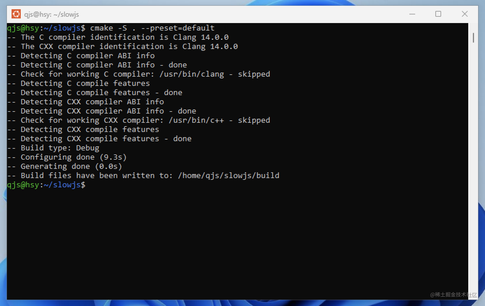

> 其中 `The C compiler identification is Clang 14.0.0` 表明我们已经成功将 C 编译器调整为了 clang

继续执行下面的命令进行编译：

```bash
cmake --build --preset=qjs
```

编译完成后，会生成一个位于 `./build/qjs/qjs` 的可执行文件，这就是 quickjs 引擎了。我们可以打印它的帮助信息：

```bash
./build/qjs/qjs -h
```

会看到类似下面的输出：

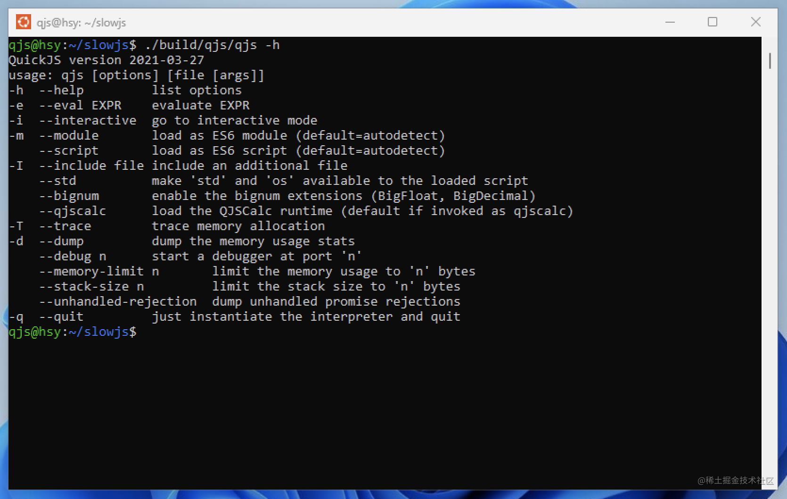

我们可以生成一段脚本来测试引擎的执行效果：

```bash
echo 'print("hello from quickjs")' > tmp_test.js
```

然后使用命令 `./build/qjs/qjs ./tmp_test.js` 来执行测试脚本，即可收到来自 quickjs 的问候：

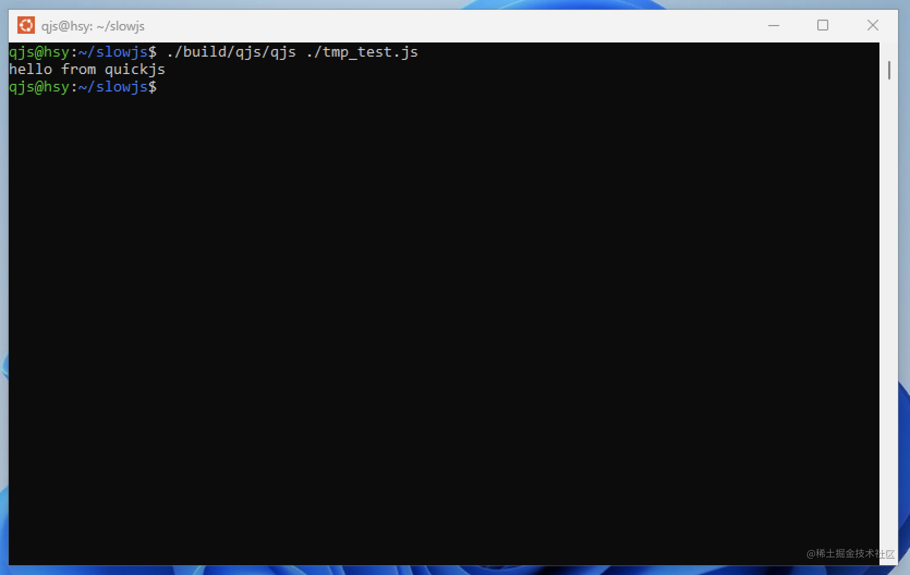

## 安装和配置 VSCode

有了编译和运行环境后，我们继续配置一下开发环境。可以在 VSCode 官方的 [下载页面](https://code.visualstudio.com/Download) 获得其安装包。

VSCode 安装完毕后，我们需要安装一个插件，使得 VSCode 能够连接到 WSL。切换到 VSCode 的插件管理界面，搜索 `WSL` 并安装:

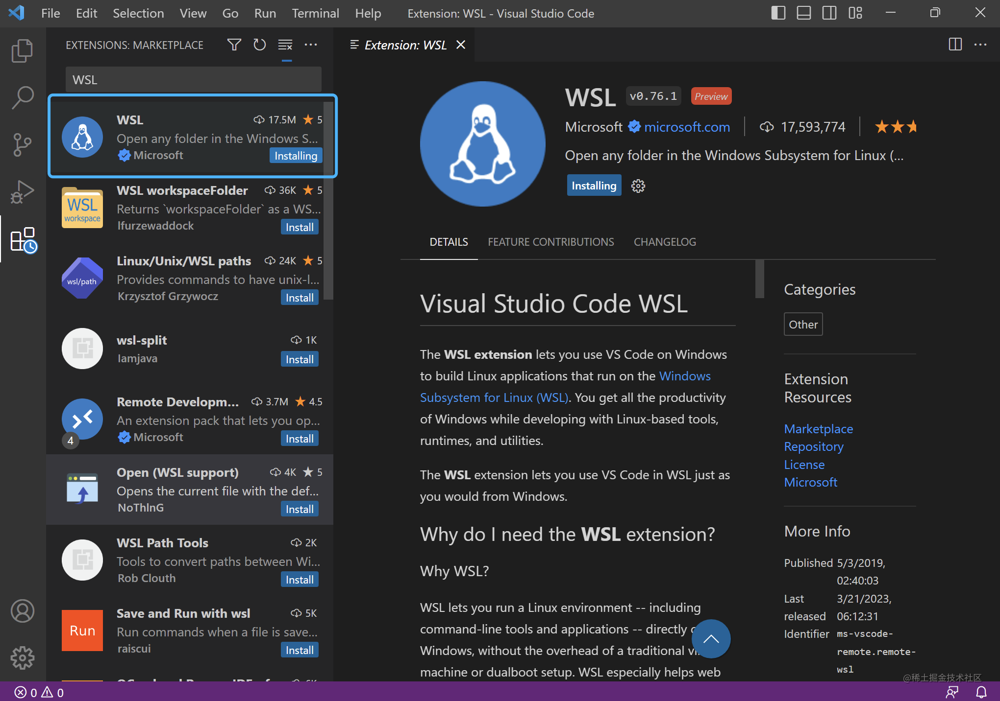

我们使用 VSCode 打开之前克隆的源码所在目录：

1. 打开 Ubuntu，通过命令 `cd slowjs` 切换到之前克隆下来的源码所在目录

2. 输入 `code .` 尝试使用 VSCode 打开该目录：

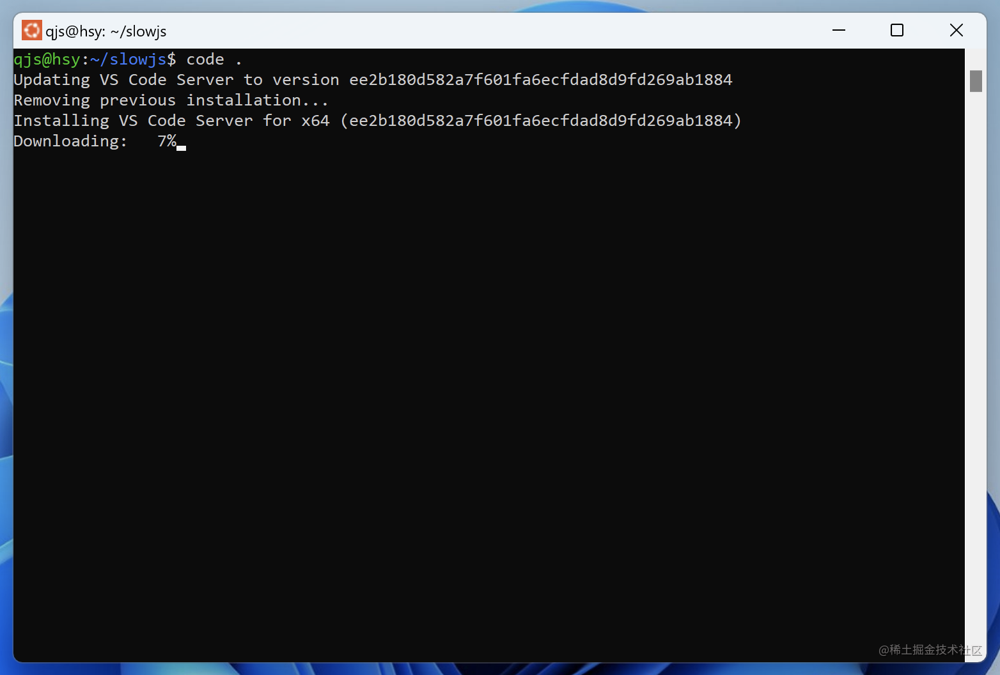

VSCode 是运行在 Windows 中的，而这里的 `code .` 命令是在 Linux 子系统中运行的，由于两个系统是相互独立的，需要借助一些辅助工具。首次运行 `code .` 出现类似上面的界面，表示正在自动安装这些辅助工具

辅助工具安装完毕后，会自动启动 VSCode 并看到类似下面的界面：

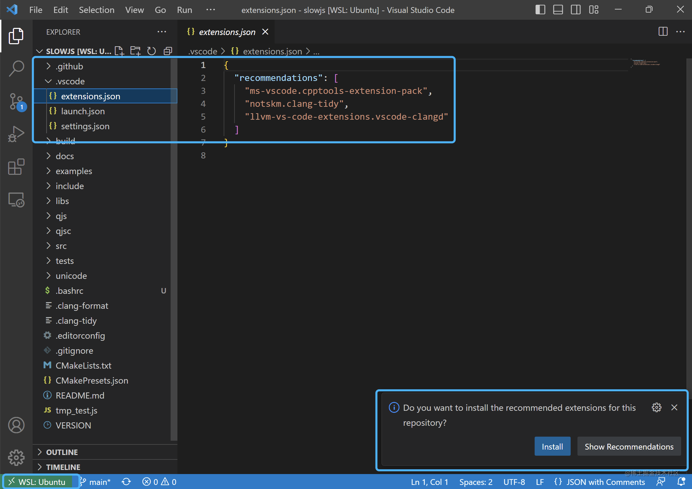

界面中包含了这几部分内容：

- 左下角的绿色图标，表示我们的 VSCode 已经成功连接到 Ubuntu 子系统

- 左上角示意的是在工程的 `.vscode/extensions.json` 文件中包含了一些工程推荐的 VSCode 插件，这些插件主要是增强 VSCode 对 C 语言项目的智能提示

- 当 VSCode 打开工程发现我们尚未安装工程推荐的插件时，会出现右下角的提示。我们点击右下角提示框中的 `Install` 即可安装工程推荐的插件

推荐插件安装完毕后，我们点开一个 C 文件，将鼠标移动到标识符之上，如果看到类型提示即表示插件已经安装成功：

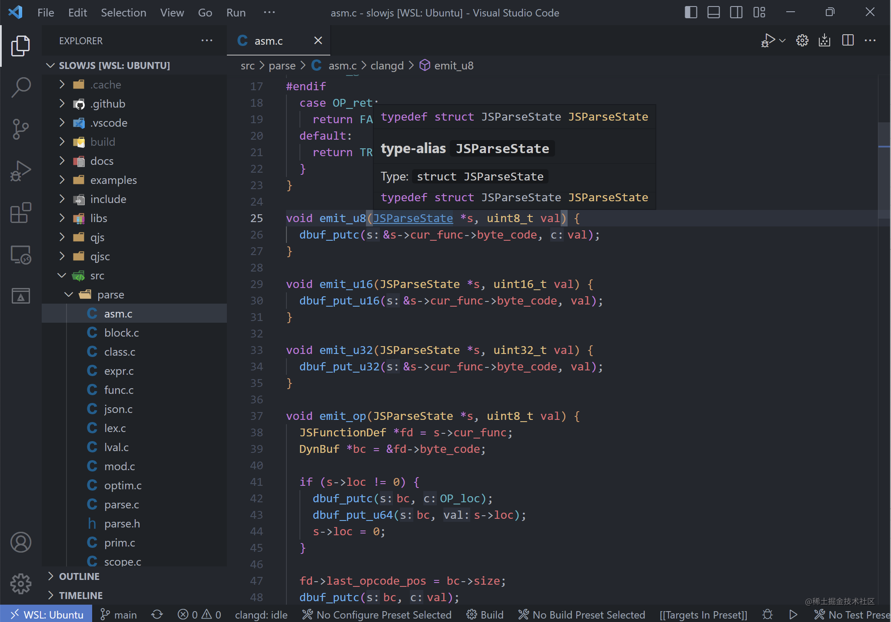

## 小结

本节我们配置了引擎编译、运行以及开发的环境，迈出了引擎学习的第一步。看来将引擎跑起来也并不难，下一节开始，我们将逐步介绍源码结构以及一些编译的细节。