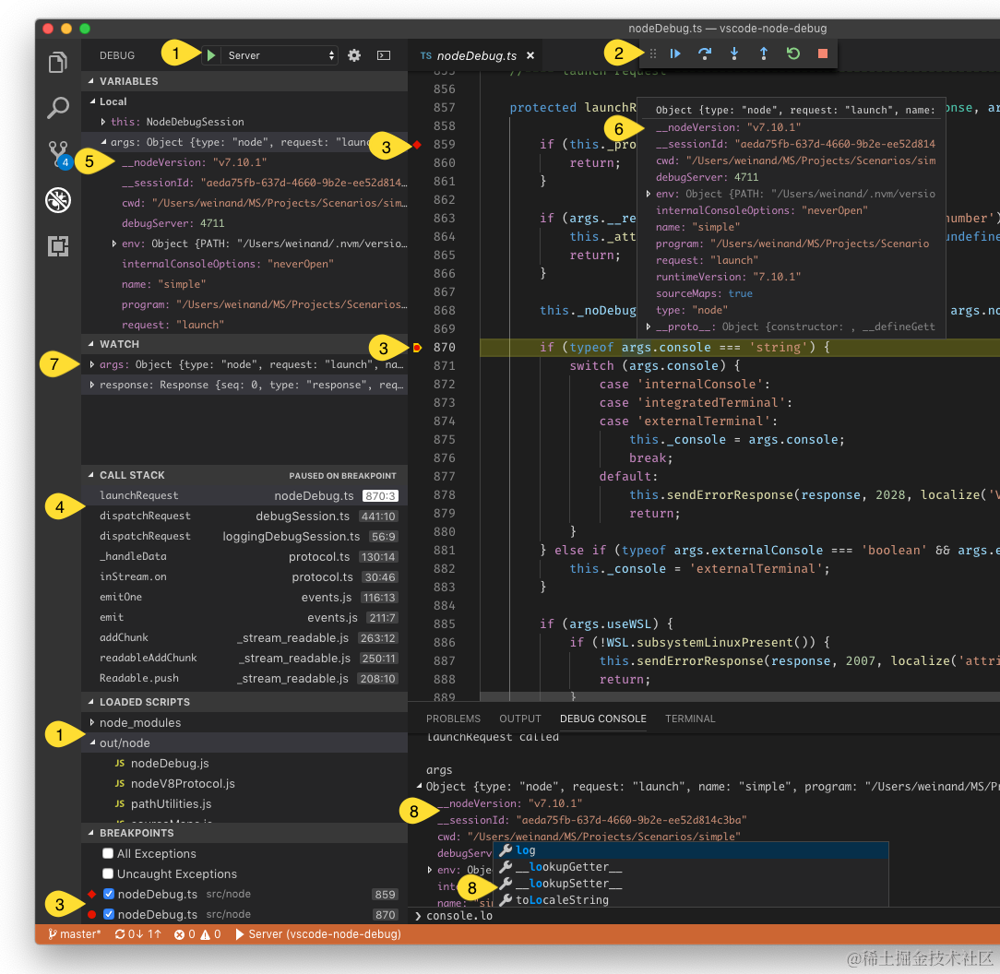

相信大家都使用过 `console.log` 来调试吧，虽然大部分情况下是可行的，但是其有一个固有的缺点 - 对源码有侵入性，主要的表现是：

*   需要打印的变量必须手动指定

*   需要调试调用步骤时，得在源码多处打上日志

经过前面章节的学习，我们知道变量信息以及函数间的调用关系已经存放在调用栈中，如果有一种方式：

*   可以让我们指定多个源码位置（断点）而不必修改源码，程序运行到这些位置后就暂停，等待我们的继续操作

*   而我们可以进行的后续操作包括：查看当前的调用栈信息，决定下一步的运行方式（进入接下来的函数调用，还是直接运行到下一个断点位置）等等

这就是断点调试，当我们遇到一些奇形怪状的问题是，它将非常有效。QuickJS 引擎还没有提供断点调试的功能，刚好给了我们动手实践的机会。

下面我们将一起实现「Instr Debugger - Instruction Debugger」的功能，以此为引擎增加断点调试的能力。

## 功能简介

虽然断点调试大家可能都用过，但对于其内部的架构形式，大家可能还不了解。断点调试功能在各个编辑器或者 IDE 上的实现方式类似，我们以 VSCode 为例，简单介绍下其内部组成。

下图是我们作为开发者，在 VSCode 中使用断点调试时看到的界面：



> 图片取值 [Debugger Extension](https://code.visualstudio.com/api/extension-guides/debugger-extension)

上图这样的界面，对于整个断点调试功能而言，只属于前端界面，是的，断点调试和其他大部分编辑器功能一样，都采用了前后分离的架构：


> 图片取自 [Debugger Extension](https://code.visualstudio.com/api/extension-guides/debugger-extension)

*   最左边是调试功能的前端展示，可以想象成是浏览器加上我们的前端页面脚本

*   最右边则是提供实际调试能力的后端，类似我们的服务端，内部包含一些业务逻辑，对外提供一些接口

*   中间的 Adapter 类似一个位于前后端之间的规范

    VSCode 作为一个编辑器，可以编辑 JS，Go 等多种语言，这些语言的调试器各有不同。
    好比我们用 JS 和 Go 分别写了一个商城服务端，商城服务端的核心功能就那么些，所以接口功能都是类似的，不同主要体现在这些接口的路径、参数、响应格式可能会有不同。

    如果可以将接口路径、出入参格式这些差异点都进行约束，那前端负责展示的代码就不用频繁地变动，从而同时适配 JS、Go 编写的后端，Adapter 就起到约束（约定）的作用。

我们即将实现的内容为最右侧的调试能力，为了方便和外部集成，我们的 Debugger 会将调试的能力做成接口给外部调用。

由于缺少 Adapter 实现，我们的 Debugger 并不能直接在 VSCode 中使用。开发 VSCode 插件超出了本课程的范畴，有兴趣的读者可以参考 [Debug Adapter Protocol](https://microsoft.github.io/debug-adapter-protocol/) 中的内容，编写一个 [Debugger Extension](https://code.visualstudio.com/api/extension-guides/debugger-extension) 以达到在 VSCode 中调试的效果。

## 任务解构

我们来解构一下实现断点调试需要做的工作。断点调试有很多子功能，比如 Step-over，Setp-in，Setp-out，Conditional breakpoints​ 等等​，为了简化问题，我们先实现最基本的断点调试功能 - 运行到指定的位置就暂定。

我们目前已经掌握的信息是：

1.  源码编译后会产生一个指令序列，引擎的执行，就是挨个执行指令序列中的指令

2.  VSCode，也就是调试器的前端，会在某个文件的特定位置（LoC - Line of code）打上断点

3.  引擎运行到断点表示的文件位置时，就需要暂停，等待用户的下一步指令

于是问题可以转变为：

*   如何将断点表示的文件位置信息和指令关联起来（LoC 和 pc）

    这个问题很好理解吧，结合上面 1，2 两点，引擎运行时眼里只有指令，如果不能将指令关联到 LoC，将无法得知是否命中断点

*   其次是如何暂停，命中断点之后我们的引擎需要暂停并等待用户的下一步指令

*   最后是查看断点处的调用栈信息，这也是我们断点的一个主要目的

## 完善 LoC 信息

引擎原本的实现中是不支持列（Column）信息的，在解析阶段只记录了行号，我们首要的任务是把列（Column）的信息补上，这样我们才有可能支持行内断点。

我们创建一个测试脚本 `test.js`：

```js
function test() {}

console.log(test())
```

然后使用 VSCode 打卡该脚本，设置下面的断点，并点击「Run and Debug」：


可以看到程序运行到断点处就暂停了，并且我们可以继续设置行内的断点：


我们在修改引擎源码时遵循一个原则 -「尽量不破坏原本的代码结构」，这也是我们在对其他项目进行修改时的首要原则。

解析期间的行号信息记录在 `JSParseState` 中：

```c
typedef struct JSParseState {
  JSContext *ctx;
  int last_line_num; /* line number of last token */
  int line_num;      /* line number of current offset, starts from 1 */
  // ...
} JSParseState;
```

字段 `line_num` 记录的就是解析期间的行号信息，注意其类型是 `int`。`int` 所占的字长和平台相关：

*   如果是 16 位的处理器，那么 `int` 就占 2 个字节

*   如果是 32 位或者 64 位处理器，那么 `int` 就占 4 个字节

现在来说大部分处理器都至少是 32 位的，但还记得我们说 QuickJS 考虑嵌入式的场景吗？所以目前还不能排除 16 位处理器的情况，直到我们通过搜索源码发现下面的线索：


上面的代码是引擎原本的实现，可以看到在输出行号的时候，使用了 `int32` 作为存储类型，那么简单来说，不管 `line_num` 会不会运行在 16 位处理器上，我们按引擎的方式，使用 4 个字节来存储它是没有问题的。

为了方便处理，我们同样使用 4 个字节来存放 Column 信息：

```c
typedef struct JSParseState {
  JSContext *ctx;
  int last_line_num; /* line number of last token */
  int line_num;      /* line number of current offset, starts from 1 */
  int col_num;       /* column number of current offset , starts from 1 */
}
```

使用 4 字节是考虑到：

*   前端的代码被压缩后可能只有一行，2 个字节表示的数值范围（65535）很可能并不能表示所有 Column 数

*   2 字节既然不够，往上选择 3 这样的基数字节数可能反而会拉低计算时的效率

*   选择 4 个字节，即使源码都在一行，那么 4G 的单个文件大小也足够囊括绝大部分场景了

`JSParseState` 同时存放了词法解析和语法解析的状态，`line_num` 和 `col_num` 作为词法解析的信息，需要存放到解析结果 Token 之上：

```c
typedef struct JSToken {
  int val;
  int line_num; /* line number of token start, starts from 1 */
  int col_num;  /* column number of token start, starts from 1 */
  // ...
}
```

词法解析原本是通过函数 `next_token` 完成，我们的要做的事情包括：

*   在原本记录行号的地方同时记录列号

*   在原本行号发生变化的地方，重置列号

*   读取源码的游标在行内前进时，变化列号

### 记录列号

```c
__exception int next_token(JSParseState *s) {
  const uint8_t *p;
  int c;
  BOOL ident_has_escape;
  JSAtom atom;

  if (js_check_stack_overflow(s->ctx->rt, 0)) {
    return js_parse_error(s, "stack overflow");
  }

  free_token(s, &s->token);

  p = s->last_ptr = s->buf_ptr;
  s->got_lf = FALSE;
  s->last_line_num = s->token.line_num;
redo:
  s->token.line_num = s->line_num;
  s->token.col_num = s->col_num;     // here
  s->token.ptr = p;
  // ...
}
```

记录列号很简单，在将解析状态保存至 Token 的位置，添加保存列号的代码

### 重置列号

因为换新行了，所以列号需要从头开始累计。搜索 [lex.c](https://github.com/hsiaosiyuan0/quickjs/blob/03d27569d32c74ab46e56b37cb1f525950635da3/src/parse/lex.c#L111) 文件，在 `s->line_num++` 下方追加 `s->col_num = 1`：

```c
__exception int next_token(JSParseState *s) {
   // ...
      case '\n':
        /* ignore escaped newline sequence */
        p++;
        if (sep != '`') {
          s->line_num++;
          s->col_num = 1;
        }
        continue;
   // ...
}
```

### 变化列号

当解析状态在源码的行内发生变化时，列号也需要随之变化：

```c
__exception int next_token(JSParseState *s) {
  const uint8_t *p;
  // ...
redo:
  switch (c) {
  case 0:
    if (p >= s->buf_end) {
      s->token.val = TOK_EOF;
    } else {
      goto def_token;      // 1
    }
    break;                 // 2
  // ...
  case '/':
    if (p[1] == '*') {
      advance_col(s, p);   // 4
      goto redo;
    }
    // ...
    break;
  // ...
  case '\n':
    p++;
  line_terminator:
    s->got_lf = TRUE;
    s->line_num++;
    s->col_num = 1;
    goto redo;             // 3
  // ...
  default:
  // ...
  def_token:
    s->token.val = c;
    p++;
    break;
  }
  // ...
  advance_col(s, p);       // 5
  s->buf_ptr = p;          // 6
}
```

在 `next_token` 函数内部，`p` 起始指向的是存放源码的内存首地址，后续对 `p` 的偏移，则可能要伴随对列号的增加。

`next_token` 函数有个特殊之处 - 存在多处的跳转语句：

*   位置 `1` 会调转到 `def_token` 段，然后跳出 `switch` 语句

*   位置 `2` 会跳出 `switch` 语句

*   位置 `3` 则会调到开头的 `redo` 段

我们要确保不会因为跳转而导致列号被重复累加，因此：

*   类似位置 `4` 处这样跳转回开头的情况，如果没有处理列号，就需要调用 `advance_col` 来对列号进行计算

    比如位置 `3` 上方处理过列号了，就不用再次处理

*   跳出 `switch` 语句后会运行位置 `5`，因为还没有设置过列号，所以需要调用 `advance_col`

继续看看 `advance_col` 的实现：

```c
static inline void advance_col(JSParseState *s, const uint8_t *p) {
  const uint8_t *tp = s->token.ptr;
  while (tp < p) {
    unicode_from_utf8(tp, UTF8_CHAR_LEN_MAX, &tp);
    s->col_num += 1;
  }
}
```

`s->token.ptr` 表示当前 Token 指代的源码内存首地址，是在进入 `next_token` 时设置的：

```c
__exception int next_token(JSParseState *s) {
  // ...
redo:
  s->token.line_num = s->line_num;
  s->token.col_num = s->col_num;
  s->token.ptr = p;                 // here
  // ...
}
```

所以 `advance_col` 的工作方式是：

*   其中的 `tp` 表示的是 Token 指代的源码内存首地址的拷贝

*   `unicode_from_utf8` 函数的作用则是以 `tp` 位置开始，按 utf8 编码对 `tp` 进行偏移，注意 `&tp` 的用法，偏移的结果还会写入 `tp`

*   跳出条件是 `tp < p`，而 `p` 是当前 Token 指代的源码内存的结束地址

于是 `advance_col` 就可以计算出 Token 内的码点数。记录码点数而不是字节数，目的是贴合使用者的认知，因为我们在编辑器中移动光标（也就是 Column 变化）是以码点为单位的。

### 保存行号

我们知道在词法解析阶段，行号信息会保存在 Token 上，而到了语法解析阶段，就转而生成相应的指令序列了，那么中间少一个过程等待我们探究 - 原本的行号是如何保存的呢？

得益于我们在前面的章节快速浏览了一遍全部指令，其中一个指令 `OP_line_num` 提供了相关的线索，在源码中搜索其相关信息，可以在函数 `emit_op` 中发现端倪：

```c
static void emit_op(JSParseState *s, uint8_t val)
{
    JSFunctionDef *fd = s->cur_func;
    DynBuf *bc = &fd->byte_code;

    /* Use the line number of the last token used, not the next token,
       nor the current offset in the source file.
     */
    if (unlikely(fd->last_opcode_line_num != s->last_line_num)) { // 1
        dbuf_putc(bc, OP_line_num);
        dbuf_put_u32(bc, s->last_line_num);
        fd->last_opcode_line_num = s->last_line_num;
    }
    fd->last_opcode_pos = bc->size;
    dbuf_putc(bc, val);
}
```

`emit_op` 函数用于输出指令，其中位置 `1` 处的条件判断表示，如果当前的行号与上个指令的行号不同，就输出 `OP_line_num` 指令，其操作数是编码在代码段的 4 字节，表示行号。换句话说，如果指令对应源码中的行首，那么其之前一个位置会是 `OP_line_num` 指令和其操作数。

最终的指令序列中是不会包含 `OP_line_num` 指令的，除了通过打印最终的字节码可以发现这个结论，从引擎执行的角度思考，执行过程中指令 `OP_line_num` 引发的额外跳转势必会拉低性能。那么我们考虑 `OP_line_num` 是不是在解析的后续阶段中被移除了，可能的位置有：

*   第二阶段执行的函数 [resolve\_variables](https://github.com/hsiaosiyuan0/quickjs/blob/1aff94a4db5eaa4b2f7a190623ce82f1870b277f/src/parse/optim.c#L1206)

*   第三阶段执行的函数 [resolve\_labels](https://github.com/hsiaosiyuan0/quickjs/blob/1aff94a4db5eaa4b2f7a190623ce82f1870b277f/src/parse/optim.c#L1684)

通过查看两个函数的实现，可以发现关键在第三阶段的函数 `resolve_labels` 中：

```c
static __exception int resolve_labels(JSContext *ctx, JSFunctionDef *s)
{
    for (pos = 0; pos < bc_len; pos = pos_next) {
        int val;
        op = bc_buf[pos];
        len = opcode_info[op].size;
        pos_next = pos + len;
        switch(op) {
        case OP_line_num:
            /* line number info (for debug). We put it in a separate
               compressed table to reduce memory usage and get better
               performance */
            line_num = get_u32(bc_buf + pos + 1);               // 1
            break;
        }
        // ...
        case OP_call_method:
            {
                /* detect and transform tail calls */
                int argc;
                // ...
                add_pc2line_info(s, bc_out.size, line_num);     // 2
                put_short_code(&bc_out, op, argc);
                break;
            }
            goto no_change;
    }
}
```

*   位置 `1` 会将指令 `OP_line_num` 的操作数、也就是行号读取到变量 `line_num` 中

*   位置 `2` 则将 `line_num` 通过函数 `add_pc2line_info` 记录到调试信息中

将指令和行号的关联操作放在第三阶段也是可以理解的，因为第二阶段中的优化操作是会变化指令序列的，等到指令序列固定下来，才好去关联行号。

继续看函数 [add\_pc2line\_info](https://github.com/bellard/quickjs/blob/6d61ea6875f8b32ea8c0a7b5d39db92fd5c025bd/quickjs.c#L31137-L31149) 的实现：

```c
/* the pc2line table gives a line number for each PC value */
static void add_pc2line_info(JSFunctionDef *s, uint32_t pc, int line_num)
{
    if (s->line_number_slots != NULL
    &&  s->line_number_count < s->line_number_size
    &&  pc >= s->line_number_last_pc
    &&  line_num != s->line_number_last) {
        s->line_number_slots[s->line_number_count].pc = pc;
        s->line_number_slots[s->line_number_count].line_num = line_num;
        s->line_number_count++;
        s->line_number_last_pc = pc;
        s->line_number_last = line_num;
    }
}
```

注意 `add_pc2line_info` 被调用时的第二个实参 `bc_out.size`，并不是传递的指令本身（不要被形参的名称 `pc` 迷惑），而是指令的位置相对函数体指令序列首地址的偏移量。换句话说该函数是将行号和指令偏移两者的对应关系存放到了数组 [JSFunctionDef::LineNumberSlot](https://github.com/bellard/quickjs/blob/6d61ea6875f8b32ea8c0a7b5d39db92fd5c025bd/quickjs.c#L19926) 中。

这里需要突出一下 `pc` 采用的是「相对函数体指令序列首地址的偏移量」这一设定，我们的需求是建立指令到行号的映射关系，但是相同的指令会出现多次。我们不如自己想一想，还有什么方式能做到标识指令，又可以做到至少在函数内唯一，采用指令地址的相对偏移量就很巧妙。

回到主线中，这里我们也需要调整一下，将列信息也进行记录：

```c
static void add_pc2line_info(JSFunctionDef *s, uint32_t pc, uint64_t loc) {
  if (s->loc_slots != NULL && s->loc_count < s->loc_size &&
      pc >= s->loc_last_pc && loc != 0 && (loc != s->loc_last)) {
    s->loc_slots[s->loc_count].pc = pc;
    s->loc_slots[s->loc_count].line_num = LOC_LINE(loc);
    s->loc_slots[s->loc_count].col_num = LOC_COL(loc);
    s->loc_count++;
    s->loc_last_pc = pc;
    s->loc_last = loc;
  }
}
```

注意我们将 `JSFunctionDef::LineNumberSlot` 换成了 [JSFunctionDef::loc\_slots](https://github.com/hsiaosiyuan0/quickjs/blob/1aff94a4db5eaa4b2f7a190623ce82f1870b277f/src/parse/parse.h#L315)：

```c
typedef struct LocSlot {
  uint32_t pc;
  int line_num;
  int col_num;
} LocSlot;
```

如果我们继续搜索 `line_number_slots` 会发现它被函数 [compute\_pc2line\_info](https://github.com/bellard/quickjs/blob/6d61ea6875f8b32ea8c0a7b5d39db92fd5c025bd/quickjs.c#L31151) 所使用：

```c
static void compute_pc2line_info(JSFunctionDef *s)
{
    if (!(s->js_mode & JS_MODE_STRIP) && s->line_number_slots) {
        int last_line_num = s->line_num;
        uint32_t last_pc = 0;
        int i;

        js_dbuf_init(s->ctx, &s->pc2line);
        for (i = 0; i < s->line_number_count; i++) {
            uint32_t pc = s->line_number_slots[i].pc;
            int line_num = s->line_number_slots[i].line_num;
            int diff_pc, diff_line;

            if (line_num < 0)
                continue;

            diff_pc = pc - last_pc;
            diff_line = line_num - last_line_num;
            if (diff_line == 0 || diff_pc < 0)
                continue;

            // 1
            if (diff_line >= PC2LINE_BASE &&
                diff_line < PC2LINE_BASE + PC2LINE_RANGE &&
                diff_pc <= PC2LINE_DIFF_PC_MAX) {
                // 2
                dbuf_putc(&s->pc2line, (diff_line - PC2LINE_BASE) +
                          diff_pc * PC2LINE_RANGE + PC2LINE_OP_FIRST);
            } else {
                // 3
                /* longer encoding */
                dbuf_putc(&s->pc2line, 0);
                dbuf_put_leb128(&s->pc2line, diff_pc);
                dbuf_put_sleb128(&s->pc2line, diff_line);
            }
            last_pc = pc;
            last_line_num = line_num;
        }
    }
}
```

函数挨个处理了 `line_number_slots` 中的映射关系，做了位置 `1` 处的某种转换后，存放到了 `JSFunctionDef::pc2line` 中。

这里的转换其实是压缩，将行号和指令偏移地址都处理成和上一个映像关系之间的偏移量，也就是代码中的 `diff_line` 和 `diff_pc`。

计算了 `diff` 后，在保存的时候，采用了位置 `1` 处的压缩策略：

*   尝试将 `diff_line` 和 `diff_pc` 压缩到 1 个 `uint8` 内，即位置 `2`

*   否则将 `diff_line` 和 `diff_pc` 使用 LEB128 算法分别压缩，即位置 `3`

我们简单介绍一下位置 `2` 处的 1 个 `uint8` 编码是如何完成的：

*   首先确定的是 1 个 `uint8` 数值范围 `[0,255]` 内哪部分用于保存 `diff_line`，哪一部分用于保存 `diff_pc`

    当前的实现是 `[0,4]` 保存 `diff_line`，而 5 的倍数保存 `diff_pc`：

    

*   为了和位置 `3` 处多字节的压缩作区分，计数从 1 开始，所以要加上 `PC2LINE_OP_FIRST`

*   为了保存 `diff_line` 负数，通过 `PC2LINE_BASE` 和 `PC2LINE_RANGE` 将范围调整为 `[-1,3]`：

    ```c
    #define PC2LINE_BASE     (-1)
    #define PC2LINE_RANGE    5
    ```

*   也就使得 `diff_pc` 的最大值的计算方式变为：

    ```c
    #define PC2LINE_DIFF_PC_MAX ((255 - PC2LINE_OP_FIRST) / PC2LINE_RANGE)
    ```

了解了 `compute_pc2line_info` 的工作后，我们也需要将列信息进行记录（位置 `1` 和 `2`）：

```c
static void compute_pc2line_info(JSFunctionDef *s) {
  if (!(s->js_mode & JS_MODE_STRIP) && s->loc_slots) {
    // ...
    for (i = 0; i < s->loc_count; i++) {
      // ...
      if (diff_line >= PC2LINE_BASE &&
          diff_line < PC2LINE_BASE + PC2LINE_RANGE &&
          diff_pc <= PC2LINE_DIFF_PC_MAX) {
        dbuf_putc(&s->pc2line, (diff_line - PC2LINE_BASE) +
                                   diff_pc * PC2LINE_RANGE + PC2LINE_OP_FIRST);
        dbuf_put_sleb128(&s->pc2line, col_num);      // 1
      } else {
        /* longer encoding */
        dbuf_putc(&s->pc2line, 0);
        dbuf_put_leb128(&s->pc2line, diff_pc);
        dbuf_put_sleb128(&s->pc2line, diff_line);
        dbuf_put_sleb128(&s->pc2line, col_num);      // 2
      }
      last_pc = pc;
      last_line_num = line_num;
    }
  }
}
```

### 单元测试

我们对引擎源码进行了一些调整以支持记录 Column 信息，为了验证调整的是否正确，也为了后续如果我们继续对引擎源码变更时不至于破坏已有的正确性，我们需要编写一些单元测试。

单元测试分为两部分，放在不同的目录下：

*   [tests/test-col](https://github.com/hsiaosiyuan0/slowjs/tree/3e372cdf928bbd1f3404522ab0217fcb2e109679/tests/test-col) 用于测试词法解析过程中的 Column 信息是否正确

*   [tests/test-op\_loc](https://github.com/hsiaosiyuan0/slowjs/tree/3e372cdf928bbd1f3404522ab0217fcb2e109679/tests/test-op_loc) 用于测试指令生成过程中的 Column 信息是否正确

以 test-col 为例，包含下面的结构：

    .
    ├── cases
    │   ├── break.js
    │   ├── continue.js
    │   ├── dowhile.js
    │   ├── expr_basic.js
    │   ├── for_basic.js
    │   ├── forin_basic.js
    │   ├── forin_destruct.js
    │   ├── forof_basic.js
    │   ├── forof_destruct.js
    │   ├── if_basic.js
    │   ├── return.js
    │   ├── switch.js
    │   ├── throw.js
    │   ├── unicode.js
    │   ├── vardec_basic.js
    │   ├── vardec_destruct.js
    │   └── while_basic.js
    └── run-tests.js

我们的单测对主要的语句进行了覆盖，按不同的语句放到了不同的文件中。可以通过下面的方式运行 test-col：

```bash
cmake -S . --preset=dump-token
cmake --build --preset=test-col && echo $?
```

最后打印 `0` 的话就表示执行成功。类似的，可以通过下面的命令运行 test-op\_loc：

```bash
cmake -S . --preset=dump-bytecode-2
cmake --build --preset=test-op_loc && echo $? # 0 表示成功
```

我们看看单测文件的内容，以 [tests/test-col/cases/break.js](https://github.com/hsiaosiyuan0/slowjs/blob/30d190fbc87031ba8f7894e04d5e488df1beb43e/tests/test-col/cases/break.js#L1) 为例：

```js
var a = 1;

outer: while (a > 1) {
  while (a < 1) {
    break outer;
  }
}

/* EXPECT(outer):
ident: 'outer' 5:11
*/
```

注释中的 `EXPECT` 的用法是：

*   括号中表示单测名称，以便单测不通过时进行提示

*   跟在 `:` 后的内容，表示预期匹配的内容，匹配的源信息则来自引擎的输出结果

比如命令 `cmake -S . --preset=dump-token` 会开启宏 [DUMP\_TOKEN](https://github.com/hsiaosiyuan0/quickjs/blob/03d27569d32c74ab46e56b37cb1f525950635da3/src/parse/lex.c#L596)，这样引擎在脚本的时候，会将 Token 的调试信息也打印到标准输出：

<details>
  <summary>点击展开</summary>

```bash
./build/qjs/qjs tests/test-col/cases/if_basic.js

ident: 'var' 1:1
ident: 'a' 1:5
token: '=' 1:7
number: 1 1:9
token: ';' 1:10
ident: 'if' 3:1
token: '(' 3:4
ident: 'print' 3:5
token: '(' 3:10
ident: 'a' 3:11
token: ')' 3:12
token: ')' 3:13
token: '{' 3:15
token: '}' 4:1
ident: 'else' 4:3
ident: 'if' 4:8
token: '(' 4:11
string: '😀' 4:12
token: '�' 4:16
ident: 'a' 4:20
token: ')' 4:21
token: '{' 4:23
token: '}' 5:1
eof
pass 2
        check_define_var a,0
        define_var a,0
        push_i32 1
        loc 1:9
        put_var a
        undefined
        put_loc 0: "<ret>"
        get_var print
        get_var a
        loc 3:10
        call 1
        if_false 1:72
        goto 2:102
        label 1:72
   72:  undefined
        put_loc 0: "<ret>"
        push_atom_value "\u00ed\u00a0\u00bd\u00ed\u00b8\u0080"
        get_var a
        strict_eq
        if_false 3:97
        label 3:97
   97:  label 2:102
  102:  get_loc 0: "<ret>"
        return

1
```

</details>

引擎原本是将 `dump_token` 注释掉的，我们取消注释：

```c
__exception int next_token(JSParseState *s) {
  // ...
#ifdef DUMP_TOKEN
  dump_token(s, &s->token);
#endif
 // ...
}
```

为其添加构建参数开关，这样指定了特定的构建参数，宏 `DUMP_TOKEN` 才生效，进而调用 `dump_token`：

```cmake
option(QJS_DUMP_TOKEN "Dump token while parsing" OFF)
if(QJS_DUMP_TOKEN)
  target_compile_definitions(quickjs PUBLIC DUMP_TOKEN=y)
endif()
```

当然也需要对 `dump_token` 进行一些调整，使之可以输出 Column 信息：

```c
void __attribute((unused)) dump_token(JSParseState *s, const JSToken *token) {
  // ...
  switch (token->val) {
  case TOK_NUMBER: {
    double d;
    JS_ToFloat64(s->ctx, &d, token->u.num.val); /* no exception possible */
    printf("number: %.14g %d:%d\n", d, line, col); // here
  } break;
  // ...
  }
  // ...
}
```

单测是通过文件 [run-tests.js](https://github.com/hsiaosiyuan0/slowjs/blob/30d190fbc87031ba8f7894e04d5e488df1beb43e/tests/test-col/run-tests.js) 执行的，其中的主要函数是 `test`：

```js
function test(name) {
  const fds = os.pipe();

  // 1
  const qjs = `${proj}/build/qjs/qjs`;
  const target = `${cwd}/cases/${name}.js`;

  // 2
  os.exec([qjs, target], {
    stdout: fds[1],
    block: true,
  });
  os.close(fds[1]);

  // 3
  const f = std.fdopen(fds[0], "r");
  const bc = f.readAsString();
  f.close();

  // 4
  const tf = std.fdopen(os.open(target, os.O_RDONLY), "r");
  const code = tf.readAsString();
  tf.close();
  const cases = extractExpect(code);

  // 5
  for (const { name: subname, excepted } of cases) {
    if (!bc.includes(excepted)) {
      throw new Error(
        `failed to test [${name}] at [${subname}],
--got--:
|${bc}|
--excepted--:
|${excepted}|`
      );
    }
  }
}
```

`test` 函数的参数是 `cases` 目录下的文件名，其中的主要逻辑为：

*   位置 `1` 处表示我们将使用增加了自定义构建参数编译的 `qjs` 来运行测试脚本

*   位置 `2` 表示执行单测脚本，并得到其打印到标准输出上的内容

*   位置 `3`、`4` 表示读取单测源文件，提取其中的 `EXPECT` 规则作为待校验条目

*   位置 `5` 依次执行待校验的条目，判断位置 `2` 处的脚本输出内容中是否包含单测条目预期的内容

## 服务设计

前面已经提到调试采用的是前后端分离架构，现在我们来看看服务端的具体设计。

我们把每个调试界面想象成浏览器，好比 C/S 架构中有会话的概念，我们的调试也有会话 Session，我们启动了一个调试服务后，客户端可以通过发起多个会话，开启并行的调试。

HTTP 协议因为是无状态的，所以需要借助 Cookie 实现会话，我们的调试服务则简单得多，仅需通过活动的 TCP 长连接表示会话即可，当连接断开，我们就认为会话结束。

我们将服务端的线程设计成下面的样子：


*   对于 Debugger server 来说，每进来 1 个新的客户端连接，就会开启 1 个新的线程，用于处理用户的命令，称该线程为 Control thread

*   每个 Control thread 会再创建 1 个用于执行用户脚本的线程，称之为 Eval thread

在注重并发效率的服务端设计上，不会为每个客户端连接都分配一个线程。我们的场景并发数有限，为了简单我们采用客户端连接和 Control thread 一比一的方式。

Control thread 再开一个 Eval thread 执行用户脚本的目的是，比如引擎执命中了某个断点后，应该进入休眠状态等待用户的下一步指令，分为两个线程后，Eval thread 进入休眠状态时，Control thread 可以继续响应用户的操作。

> 看完本节可能有读者会发现其实 Control thread 和 Eval thread 还是可以合并的，那么就留给有兴趣的读者了，我们的实践还是保持 [KISS](https://en.wikipedia.org/wiki/KISS_principle) 一点

我们继续看一下服务的启动过程。首先是用户通过 `--debug PORT` 启动调试服务，进入 [qjs.c](https://github.com/hsiaosiyuan0/quickjs/blob/808719bff473e2edd8fb514499640c225415fca7/qjs/qjs.c#L475) 中的逻辑：

```c
  if (debug_port) {
    serve_debug(debug_port);
    return 0;
  }
```

其中 `server_debug` 的实现为：

```c
void serve_debug(uint64_t port) {
  // ...
  serv = new_serv(port);                                                   // 1
  if (!serv)
    fatal("failed to make serv\n");

  s = bind(serv->fd, (struct sockaddr *)&serv->addr, sizeof(serv->addr));  // 2
  // ...
  s = listen(serv->fd, 512);                                               // 3
  // ...
  while (1) {
    // ...
    s = select(max_fd + 1, &rfds1, &wfds1, NULL, &timeout);                // 4

    if (s < 0)
      fatal("failed to select: [%s]\n", strerror(errno));

    if (FD_ISSET(serv->fd, &rfds1)) {                                      // 5
      sess = accept_conn(serv);
      // ...
      sess_start(sess);
    }

    if (!list_empty(&serv->sessions)) {                                    // 6
      list_for_each_safe(sess_iter, sess_iter1, &serv->sessions) {         
        sess = list_entry(sess_iter, sess_t, link);
        if (FD_ISSET(sess->conn.fd, &rfds1)) {                             // 7
          if (sess_enqueue_in_msg(sess)) {
            // ...
          }
        }

        if (FD_ISSET(sess->conn.fd, &wfds1)) {                             // 8
          msg = sess_dequeue_out_msg(sess);
          if (msg) {
            len = send(sess->conn.fd, msg->buf.buf, msg->buf.size, 0);
            // ...
          }
        }

        if (sess->invalid)
          serv_free_sess(serv, sess);
      }
    }
  }
}
```

*   位置 `1` 处创建一个 [serv\_t]() 实例：

    ```c
    typedef struct serv_t {
      struct sockaddr_in addr;
      int fd;
      struct list_head sessions;
    } serv_t;
    ```

    其中的字段 `sessions` 保存的是会话对象

*   位置 `2`、`3` 则将服务在指定的端口启动

*   位置 `4` 通过 `select` 接收新的客户端连接，`selec` 在前面的章节中有介绍，这里就不冗述了

*   新的客户端连接到达后，进入到位置 `5` 创建一个新的 Control thread，其中会创建新的会话对象，追加到 `serv_t::sessions` 之中

*   如果存在已建立的会话，即位置 `6` 处的条件判断成立，进入位置 `7` 和 `8` 分别用于读取用户的指令、以及将指令的处理结果返回给用户

上面是一个整体过程，我们继续看下其中的会话对象是如何创建的。首先是通过函数 `new_sess` 创建会话对象：

```c
sess_t *new_sess() {
  sess_t *sess = calloc(1, sizeof(sess_t));
  if (!sess)
    return NULL;

  pthread_cond_init(&sess->wakeup, NULL);

  pthread_mutex_init(&sess->in_msgs_lock, NULL);
  init_list_head(&sess->in_msgs);

  pthread_mutex_init(&sess->out_msgs_lock, NULL);
  init_list_head(&sess->out_msgs);

  return sess;
}
```

我们将客户端传入的内容称为 Incoming message，需要返回给客户端的内容称为 Outcoming message，分别通过 `sess_t::in_msgs` 和 `sess_t::out_msgs` 表示。

我们会在主线程，也就是启动调试服务的线程中通过 `select` 读取客户端的输入，存放到 Control thread 的 `sess_t::in_msgs` 中，Control thread 则需要消费 `sess_t::in_msgs` 中的内容，解析用户指令完成后续操作。由于两个线程需要同时操作 `sess_t::in_msgs`，我们为其加入了相应的锁 `sess_t::in_msgs_lock`。

当 Control thread 处理完 `sess_t::in_msgs` 中的任务，就会进入休眠状态，为了避免 CPU 空转，休眠采用的是操作系统提供的 API `pthread_cond_wait`，这就需要借助 Thread condition variable `sess_t::wakeup` 了，以便主线程唤醒 Control thread。

创建了会话对象后，需要添加到服务对象上：

```c
sess_t *accept_conn(serv_t *serv) {
  sess_t *sess = new_sess();
  if (!sess)
    fatal("failed to make sess\n");

  sess->conn.fd = accept(serv->fd, (struct sockaddr *)&sess->conn.addr,
                         &sess->conn.addr_len);
  if (sess->conn.fd < 0)
    fatal("failed to accept new conn\n");

  list_add_tail(&sess->link, &serv->sessions);
  return sess;
};
```

接着进入到 Control thread 的创建过程：

```c
void sess_start(sess_t *sess) {
  int s = pthread_create(&sess->thead_id, NULL, &sess_handler, sess);
  if (s)
    fatal("failed to start sess\n");
}
```

可见线程的创建也是通过操作系统提供的 API `pthread_create` 创建一个新的线程，并在线程中运行函数 `sess_handler`：

```c
void *sess_handler(void *arg) {
  // ...
  // setup rt in thread
  rt_setup(&sess->rt, &sess->ctx);                                              // 1

  pthread_mutex_lock(&sess->in_msgs_lock);                                      // 2
  while (1) {  
    // ...

    msg = sess_dequeue_in_msg(sess);
    if (msg) {
      msg_trim_end(msg);
      dbuf_putc(&msg->buf, 0);                                                  // 3 
      event = JS_ParseJSON(sess->ctx, (char *)msg->buf.buf, msg->buf.size - 1,  // 4
                           "<input>");
      if (JS_IsException(event)) {
        // ...
      }

      sess_event_handle(sess, event);                                           // 5
      continue;
    }
    pthread_cond_wait(&sess->wakeup, &sess->in_msgs_lock);                      // 6
  }
  pthread_mutex_unlock(&sess->in_msgs_lock);                                    // 7
  return NULL;
}
```

*   位置 `2`、`6`、`7` 的代码可以进一步简化成：

    ```c
    pthread_mutex_lock(&sess->in_msgs_lock);  
    while(1) {
      // ...
      pthread_cond_wait(&sess->wakeup, &sess->in_msgs_lock); 
    }
    pthread_mutex_unlock(&sess->in_msgs_lock); 
    ```

    *   首次进入 `sess_handler` 会执行 `pthread_mutex_lock` 将 `in_msgs_lock` 上锁，很好理解，因为在循环中我们将消费 `in_msgs` 中的内容

    *   进入到循环中，对 `in_msgs` 中的消息进行弹出处理后，会调用 `pthread_cond_wait(cond_val, lock)`

        该函数的作用是，调用后进入操作系统的逻辑，用户程序则进入休眠状态。操作系统会帮我们释放锁 `lock` 并观察 `cond_val`，一旦其状态发生变化，则将 `lock` 上锁并返回用户程序，也就是回到 `while` 循环的头部进入下一次迭代。

        由此可见，在后续和用户的交互中，Control thread 的主要逻辑都在 `while` 中

    *   至于 `while` 外的 `pthread_mutex_unlock`，则是因为 `pthread_cond_wait` 返回到用户程序时 `lock` 是上锁的，为了保持锁的平衡，需要补上该函数调用

*   位置 `1` 处设置的 `JSRuntime` 和 `JSContext` 用于将 Control thread 和用户之间传递的消息使用 JSON 格式编解码。我们不能共用 Eval thead 中的 `JSRuntime` 和 `JSContext`，因为 JS 的单线程特性

*   位置 `4` 处的 `JS_ParseJSON` 的参数要求 CString，所以在位置 `2` 处补上末尾的 `\0`

*   位置 `5` 则用于处理用户的指令，并且会将处理结果写入到 `out_msgs` 中

## 调试指令

用户指令的处理依靠函数 `sess_event_handle` 完成，下面是其主要结构：

```c
void sess_event_handle(sess_t *sess, JSValue event) {
  // ...
  act = JS_GetPropertyStr(sess->ctx, event, "type");
  // ...
  args = JS_GetPropertyStr(sess->ctx, event, "data");
  // ...
  if (!strcmp("launch", act_cstr)) {
    // ...
  }

  if (!strcmp("setBreakpoint", act_cstr)) {
    // ...
  }

  if (!strcmp("run", act_cstr)) {
    // ...
  }

  if (!strcmp("continue", act_cstr)) {
    // ...
  }

  if (!strcmp("availableBreakpoints", act_cstr)) {
    // ...
  }

  if (!strcmp("dumpStackframe", act_cstr)) {
    // ...
  }

  if (!strcmp("listStackframes", act_cstr)) {
    // ...
  }
}
```

可见用户输入的指令基本格式为：字段 `type` 表示指令名称，`data` 则表示指令的参数。下面我们将介绍主要指令的内部操作方式。

### launch

launch 指令用于载入待调试的脚本，其格式为：

```json
{ "type": "launch", "data": { "file": "./tmp_test.js" } }
```

指令对应的内部操作为：

```c
int s =
        pthread_create(&sess->eval_thread_id, NULL, &debug_user_script, sess);
```

边界情况的处理我们都跳过了，主要就是通过函数 `pthread_create` 开始 Eval thread，其中执行的函数为 `debug_user_script`：

```c
void *debug_user_script(void *arg) {
  sess_t *sess = arg;

  rt_setup(&sess->eval_rt, &sess->eval_ctx);             // 1

  if (js_debug_init(sess->eval_ctx))                     // 2
    goto fail;

  js_debug_wait_ready2start(sess->eval_ctx);             // 3
  if (eval_file(sess->eval_ctx, sess->eval_file, 1)) {   // 4
    sess->eval_errmsg = "failed to eval user script";
    goto fail;
  }
  // ...
}
```

*   位置 `1` 处设置用于执行用户脚本的 `JSRuntime` 和 `JSContext`

*   位置 `2` 处用进行一些调试前的准备工作

*   位置 `3` 通过操作系统提供的信号量，让 Eval thread 先暂停，等待用户说「可以执行了」再继续往下执行，以便用户在脚本运行前设置断点

*   位置 `4` 则是执行用户脚本，当然需要等待用户放行

我们通过函数 `js_debug_init` 看看都进行了哪些准备工作：

```js
int js_debug_init(JSContext *ctx) {
#if defined(__APPLE__)
  ctx->debug.ready2start = dispatch_semaphore_create(0);         // 1
#else
  if (sem_init(&ctx->debug.ready2start, 0, 0))                   // 2
    return -1;
#endif

  if (pthread_mutex_init(&ctx->debug.bp_mutex, NULL))            // 3
    return -1;

  if (pthread_cond_init(&ctx->debug.bp_cond, NULL))              // 4
    return -1;

  init_list_head(&ctx->debug.bps);                               // 5

  JS_SetPCInterruptHandler(ctx->rt, &js_debug_interrupt, ctx);   // 6
  return 0;
}
```

*   位置 `1`、`2` 只是信号量的创建在不同平台的差异化 API

*   位置 `3`、`4` 看起来是初始化一些用于线程同步的变量

*   位置 `5` 初始化用于存放用户设置的断点的结构

*   位置 `6` 设置自定义的指令执行拦截器

函数 `JS_SetPCInterruptHandler` 是我们新添加的：

```c
void JS_SetPCInterruptHandler(JSRuntime *rt, JSPcInterruptHandler *cb,
                              void *opaque) {
  rt->pc_interrupt_handler = cb;
  rt->pc_interrupt_opaque = opaque;
}
```

该函数可以将自定义的指令执行拦截器设置到字段 `JSRuntime::pc_interrupt_handler` 之上，同时也支持通过 `JSRuntime::pc_interrupt_opaque` 来存放自定义指令执行拦截器所需的上下文。

该字段得以工作的关键在于我们拓展了指令执行部分，我们将：

```c
JSValue JS_CallInternal(JSContext *caller_ctx, JSValueConst func_obj,
                 JSValueConst this_obj, JSValueConst new_target,
                 int argc, JSValue *argv, int flags)
{
   // ...

#define SWITCH(pc)    goto *dispatch_table[opcode = *pc++];
   // ...
}
```

拓展为：

```c
#define SWITCH(pc)    do {                                      \
                          if (js_pc_interrupts(pc, caller_ctx)) \
                            return JS_EXCEPTION;                \
                        goto *dispatch_table[opcode = *pc++];   \
                      } while(0);
```

可以发现，在每个指令执行前，我们加上了对函数 `js_pc_interrupts` 的调用：

```c
static inline int js_pc_interrupts(const uint8_t *pc, JSContext *ctx) {
  JSRuntime *rt = ctx->rt;
  if (rt->pc_interrupt_handler)
    return rt->pc_interrupt_handler(pc, rt, rt->pc_interrupt_opaque);
  return 0;
}
```

该函数会尝试调用 `JSRuntime::pc_interrupt_handler` 指定的自定义指令执行拦截器。注意调用 `js_pc_interrupts` 时传递的 `pc` 和上文提到的类似 - 并不是指令本身，而是指令相对于函数体指令序列首地址的偏移量。

这样思路就更加清晰起来，在自定义的指令执行拦截器中，我们只需查看 `pc` 对应的 LoC 信息是否命中用户设置的断点，命中的话就进入休眠状态，等待用户的操作，这也就是函数 `js_debug_interrupt` 中的内容：

```c
static int js_debug_interrupt(const uint8_t *pc, JSRuntime *rt, void *opaque) {
  JSContext *ctx;

  if (unlikely(rt->debug)) {
    ctx = opaque;

    uint32_t len;
    JSBreakpoint *bps = js_debug_bps_from_pc(pc, rt, ctx, &len);       // 1
    if (len == 0)                                                      // 2
      return 0;

    for (uint32_t i = 0; i < len; i++) {
      if (bps[i].file && js_debug_get_bp(ctx, bps[i])) {             
        pthread_mutex_lock(&ctx->debug.bp_mutex);                      // 3
        ctx->debug.paused = TRUE;
        pthread_cond_wait(&ctx->debug.bp_cond, &ctx->debug.bp_mutex);  // 4
        ctx->debug.paused = FALSE;
        pthread_mutex_unlock(&ctx->debug.bp_mutex);                    // 5
        break;
      }
    }
  }
  return 0;
}
```

*   位置 `1` 处表示查看 `pc` 命中的断点，如果没有命中，则按位置 `2` 处的处理返回即可

*   因为需要设置线程间共享的变量 `paused`，所以通过位置 `3` 处的调用先加锁

*   进入位置 `4` 后我们知道 Eval thread 就会进行休眠状态，并且释放 `bp_mutex` 锁

*   等到用户发出后续指令，系统会在位置 `4` 唤醒线程继续执行，设置状态后再次释放 `bp_mutex` 锁

为了方便读者理解，我们将指令执行拦截器放到指令序列执行的流程中整体来看：

```c
JSValue JS_CallInternal(JSContext *caller_ctx, JSValueConst func_obj,
                 JSValueConst this_obj, JSValueConst new_target,
                 int argc, JSValue *argv, int flags)
{
   for (;;) {
 // ...
    js_pc_interrupts(pc); // 1 

    SWITCH(pc) {
    CASE(OP_push_i32):
      // ...
      BREAK;
    CASE(OP_push_const):
      // ...
      BREAK;
#if SHORT_OPCODES
    CASE(OP_push_minus1):
    CASE(OP_push_0):
    CASE(OP_push_1):
    // ...
    }
   }
}
```

位置 `1` 处的函数 `js_pc_interrupts` 内部会调用我们的自定义拦截器 `js_debug_interrupt`，我们在其中通过操作系统提供的 API `pthread_cond_wait` 将 CPU 的控制权转交给操作系统，这样 Eval thread 会进入休眠状态，已达到暂停执行的目的。

### run

launch 指令执行后，待调试脚本并没有立即执行，而是在等待用户的下一步指令，这是通过操作系统提供的信号量 API 实现的，与之对应的是 run 指令，可以启动对待调试脚本的执行：

```json
{ "type": "run" }
```

指令对应的操作为：

```c
  if (!strcmp("run", act_cstr)) {
    if (sess->eval_retval != -2) {
      err_msg = "debugger does not launch yet";
      goto fail;
    }

    js_debug_on(sess->eval_ctx);
    js_debug_ready2start(sess->eval_ctx);
    goto succ;
  }
```

其中的关键是函数 `js_debug_ready2start`，其内部会触发信号量：

```c
void js_debug_ready2start(JSContext *ctx) {
#if defined(__APPLE__)
  dispatch_semaphore_signal(ctx->debug.ready2start);
#else
  sem_post(&ctx->debug.ready2start);
#endif
}
```

### continue

Eval thread 的休眠是通过下面的等待 `bp_cond` 这个 Thead condition variable 实现的：

```c
pthread_cond_wait(&ctx->debug.bp_cond, &ctx->debug.bp_mutex);
```

所以 continue 的使用方式是：

```json
{ "type": "continue" }
```

内部实现则是通过函数 `js_debug_continue` 调用操作系统的 API 改变 `bp_cond` 的状态：

```c
void js_debug_continue(JSContext *ctx) {
  if (!ctx->debug.paused)
    return;

  pthread_cond_signal(&ctx->debug.bp_cond);
}
```

### setBreakpoint

setBreakpoint 指令用于设置断点：

```json
{
  "type": "setBreakpoint",
  "data": { "file": "./tmp_test.js", "line": 3, "col": 0 }
}
```

相应的参数包括需调试的文件，行列号。我们在编辑器中设置断点时，其背后的逻辑会为我们拼装类似结构的参数。

指令对应的操作为：

```c
  if (!strcmp("setBreakpoint", act_cstr)) {
    if (!JS_IsObject(args))
      goto fail;

    // 1
    JSValue file = JS_GetPropertyStr(sess->ctx, args, "file");
    // ...

    const char *file_cstr = JS_ToCString(sess->ctx, file);
    // ...

    JSValue line = JS_GetPropertyStr(sess->ctx, args, "line");
    // ...

    JSValue col = JS_GetPropertyStr(sess->ctx, args, "col");
    // ...

    int line_num, col_num;
    JS_ToInt32(sess->ctx, &line_num, line);
    JS_ToInt32(sess->ctx, &col_num, col);
    // 2
    js_debug_set_breakpoint(sess->eval_ctx, file_cstr, line_num, col_num);
    JS_FreeCString(sess->ctx, file_cstr);
    JS_FreeValue(sess->ctx, file);

    goto succ;
  }
```

函数的操作主要分为 2 步：

*   首先是位置 `1` 往下的几步操作，对用户提交的断点信息进行提取

*   然后是位置 `2` 处通过函数 `js_debug_set_breakpoint` 将断点信息告知引擎

`js_debug_set_breakpoint` 函数的实现为：

```c
int js_debug_set_breakpoint(JSContext *ctx, const char *file, int line,
                            int col) {
  return js_debug_add_bp(ctx, (JSBreakpoint){(struct list_head){},
                                             JS_NewAtom(ctx, file), line, col});
}
```

可见其仅仅是调用了我们为引擎添加的函数 `js_debug_add_bp`：

```c
int js_debug_add_bp(JSContext *ctx, JSBreakpoint bp) {
  JSBreakpoint *bpp;
  if (js_debug_get_bp(ctx, bp))                 // 1
    return 0;

  bpp = malloc(sizeof(*bpp));                   // 2
  if (!bpp)
    return -1;

  memcpy(bpp, &bp, sizeof(bp));
  list_add_tail(&bpp->link, &ctx->debug.bps);   // 3
  return 0;
}
```

*   位置 `1` 处先判断用户是否已经设置过相同位置的断点，如果设置过则不继续操作

*   位置 `2` 和 `3` 处则是先将断点的信息进行拷贝，然后存放到 `JSContext::debug::bps` 中

### listStackframes

listStackframes 指令用于打印当前的调用栈：

```json
{ "type": "listStackframes" }
```

指令内部会调用我们新添加的函数 `js_debug_list_stackframes`：

```c
JSValue js_debug_list_stackframes(JSContext *ctx) {
  struct JSStackFrame *sf = ctx->rt->current_stack_frame;         // 1
  JSValue ret = JS_NewArray(ctx);                                 // 2
  if (JS_IsException(ret))
    return JS_NULL;

  if (!sf)
    return ret;

  while (sf) {                                                    // 7
    JSValue frame = JS_NewObject(ctx);
    if (JS_IsException(frame))
      goto fail;

    JSValue fn = sf->cur_func;                                    // 3
    if (!JS_IsUndefined(fn)) {
      JSObject *p = JS_VALUE_GET_OBJ(fn);                         // 4
      JSFunctionBytecode *b = p->u.func.function_bytecode;
      JS_SetPropertyStr(ctx, frame, "name", JS_AtomToString(ctx, b->func_name));
      JS_SetPropertyStr(ctx, frame, "file",
                        JS_AtomToString(ctx, b->debug.filename));
      JS_SetPropertyStr(ctx, frame, "line",
                        JS_NewInt32(ctx, b->debug.line_num));
      js_array_push(ctx, ret, 1, (JSValueConst *)&frame, 0);      // 5
    }
    JS_FreeValue(ctx, frame);
    sf = sf->prev_frame;                                          // 6
  }

  return ret;

fail:
  JS_FreeValue(ctx, ret);
  return JS_NULL;
}
```

函数内对应的操作为：

*   位置 `1` 处先取得调用栈顶部的活动栈帧

*   由于调用栈有多个栈帧，所以位置 `2` 处的返回值创建了一个数组

*   接着进入循环开始遍历调用栈，位置 `3` 处会取得当前栈帧对应的函数对象

*   位置 `4` 处创建一个对象用于保存调用栈信息，包括调用栈对应的函数名，文件名，以及函数在文件内的行号

*   位置 `5` 会将保存了调用栈帧信息的对象压入返回值数组中

*   位置 `6` 我们已经处理完当前调用栈帧的信息，通过 `JSStackFrame::prev_frame` 访问当前调用栈帧的上一个调用栈，作为下一次迭代的处理目标

*   位置 `7` 处没有调用栈帧需要处理，则跳出循环

### dumpStackframe

dumpStackframe 指令用于打印指定的调用栈帧中的变量信息：

```json
{ "type": "dumpStackframe", "data": { "i": 0 } }
```

`i` 为需要打印的调用栈帧的索引，可以通过 listStackframes 指令先打印可选的调用栈帧。

指令实现会调用我们新添加的函数 [js\_debug\_dump\_stackframe](https://github.com/hsiaosiyuan0/quickjs/blob/023dc7f27b771edd358a2bd5cd880a5c68c74936/src/vm/debug.c#L256)：

```c
JSValue js_debug_dump_stackframe(JSContext *ctx, int i) {
  // 1
  struct JSStackFrame *sf = js_debug_get_stackframe(ctx, i);
  if (!ctx->debug.paused || !sf)
    return JS_NULL;

  JSValue fn = sf->cur_func;
  if (JS_IsUndefined(fn))
    return JS_NULL;

  // 2
  JSObject *p = JS_VALUE_GET_OBJ(fn);
  JSFunctionBytecode *b = p->u.func.function_bytecode;

  // 3
  JSValue ret = JS_NewObject(ctx);
  if (JS_IsException(ret))
    return JS_NULL;
  
  // 4
  JSValue args = JS_NewArray(ctx);
  // ...
  JS_SetPropertyStr(ctx, ret, "args", args);

  JSValue vars = JS_NewArray(ctx);
  // ...
  JS_SetPropertyStr(ctx, ret, "vars", vars);

  JSValue closure_vars = JS_NewArray(ctx);
  // ...
  JS_SetPropertyStr(ctx, ret, "closure_vars", closure_vars);

  // 5
  for (int i = 0; i < sf->arg_count; i++) {
    // ...
  }

  // 6
  for (int i = 0; i < b->var_count; i++) {
    // ...
  }

  // 7
  JSVarRef **var_refs = p->u.func.var_refs;
  for (int i = 0; i < b->closure_var_count; i++) {
    // ...
  }

  // 8
  JS_SetPropertyStr(ctx, ret, "name", JS_AtomToString(ctx, b->func_name));
  JS_SetPropertyStr(ctx, ret, "file", JS_AtomToString(ctx, b->debug.filename));
  JS_SetPropertyStr(ctx, ret, "line", JS_NewInt32(ctx, b->debug.line_num));

  return ret;

  // ...
}
```

*   位置 `1` 处先根据用户指定的调用栈帧索引，取得要 dump 的栈帧，取得栈帧后会继续取得其上的函数对象 `fn`

*   变量的元信息保存在函数对象的 `u.func.function_bytecode` 中，所以需要位置 `2` 处的操作将其取回

*   位置 `3` 处我们创建一个对象用于保存返回结果

*   位置 `4` 处创建几个对象用于分别存放参数、变量、以及闭包变量的信息

*   位置 `5`、`6`、`7` 处结合元信息对上一步的内容进行提取处理

*   位置 `8` 将处理后的结果挂到返回对象上

## 断点匹配

上面的内容我们已经将整体的流程都介绍了一遍，最后我们看一下用户设置的断点是如何被匹配到的。

我们的自定义的指令执行拦截器 `js_debug_interrupt` 中调用了函数 `js_debug_bps_from_pc` 来查询当前 `pc` 对应的断点：

```c
static JSBreakpoint *js_debug_bps_from_pc(const uint8_t *pc, JSRuntime *rt,
                                          JSContext *ctx, uint32_t *len) {

  JSBreakpoint *ret = NULL;
  JSValue bps, bp, line, col;
  struct JSStackFrame *sf = rt->current_stack_frame;
  *len = 0;

  if (!sf)
    return NULL;

  JSValue fn = sf->cur_func;                                                     // 1
  JSFunctionBytecode *b = JS_VALUE_GET_OBJ(fn)->u.func.function_bytecode;

  size_t delta = pc - b->byte_code_buf;
  JSAtom file = b->debug.filename;
  JSValue debug_info = js_debug_pc2line(ctx, JS_NULL, 1, (JSValueConst *)&fn);   // 2
  if (JS_IsException(debug_info))
    return NULL;

  // `debug_info` always has `pc2bp`
  JSValue pc2bp = JS_GetPropertyStr(ctx, debug_info, "pc2bp");                   // 3
  bps = JS_GetPropertyUint32(ctx, pc2bp, delta);                                 // 4
  if (JS_IsUndefined(bps))
    goto done;

  if (js_get_length32(ctx, len, bps) || *len == 0)                               // 5
    goto done;

  ret = calloc(*len, sizeof(JSBreakpoint));                                      // 6
  if (!ret)
    goto done;

  for (uint32_t i = 0; i < *len; i++) {                                          // 7
    // ...
  }
  // ...
}
```

*   首先我们在位置 `1` 处取得当前调用栈帧对应的函数对象，以及函数的元信息

*   上文我们已经知道函数的元信息上包含了 pc 到 LoC 的映射关系，由于这些映射关系是经过压缩处理的，位置 `2` 会对映射关系做进一步的处理方便匹配

*   进一步处理后的调试信息包含了字段 `pc2bp`，顾名思义就是提供了 pc 到相应断点的映射关系，位置 `3` 会取得这部分数据

*   位置 `4` 是以 pc 作为键，取得 `pc2bp` 上对应的断点信息

*   取得的断点信息是一个数组，位置 `5`、`6` 会先创建等长的 `JSBreakpoint` 数组，然后在位置 `7` 的循环中对信息进行拷贝

于是我们知道函数 `js_debug_bps_from_pc` 会根据传入的 pc，找到其关联的断点信息，我们称之为用户可选断点。

得到用户可选断点后，只需看其中是否包含了用户设置的断点即可。

我们继续了解下函数 `js_debug_pc2line` 的实现，为了方便理解，我先介绍一下该函数的返回结果采用的格式：

```json
{
  "file": "tmp_test_1.mjs",
  "line": 16,
  "bps": [
    {
      "op": "put_loc1",
      "pc": 22,
      "line": 17,
      "col": 11
    }
  ],
  "line2bps": {
    "17": [
      {
        "op": "put_loc1",
        "pc": 22,
        "line": 17,
        "col": 11
      }
    ]
  },
  "pc2bp": {
    "22": [
      {
        "op": "put_loc1",
        "pc": 22,
        "line": 17,
        "col": 11
      }
    ]
  }
}
```

*   字段 `file` 表示函数所属的文件名

*   字段 `line` 表示函数在文件内定义的起始行号

*   字段 `bps` 表示函数内所有用户可选的断点

*   字段 `line2bps` 的键是行号，值是行内可选的断点

*   字段 `pc2bp` 的键是 pc 在函数内的偏移量，值是对应的断点

    一般只有一个元素，如果 pc 刚好又是行首的指令，那么数组元素会是 2 个，第一个元素和第二个元素的字段值相同

函数的作用就是对 pc 到 LoC 的关系进行处理，返回上面的结果。了解结果的格式后再看函数的实现会变得清晰很多：

```c
JSValue js_debug_pc2line(JSContext *ctx, JSValueConst this_val, int argc,
                         JSValueConst *argv) {
  // ...

  // 1
  bps = JS_NewArray(ctx);
  // ...

  line2bps = JS_NewObject(ctx);
  // ...

  pc2bp = JS_NewObject(ctx);
  // ...

  // 2
  p = JS_VALUE_GET_OBJ(argv[0]);
  b = p->u.func.function_bytecode;
  if (!b->has_debug) {
    JS_ThrowTypeError(ctx,
                      "function does not have debug info, maybe in strip mode");
    goto fail3;
  }

  buf = b->debug.pc2line_buf;
  buf_pos = buf;
  buf_end = buf + b->debug.pc2line_len;
  line = b->debug.line_num;

  // 3
  while (buf_pos < buf_end) {
    pc2line = JS_NewObject(ctx);
    if (JS_IsException(pc2line)) {
      goto fail3;
    }

    pl = *buf_pos++;
    // 4
    if (pl == 0) {
      // ...
    } else {
      // ...
    }

    len = get_sleb128(&col, buf_pos, buf_end);
    if (len < 0) {
      goto fail;
    }
    buf_pos += len;

    // 5
    op = b->byte_code_buf[pc];
    oi = &short_opcode_info(op);

    // 6
    JS_SetPropertyStr(ctx, pc2line, "op", JS_NewString(ctx, oi->name));
    JS_SetPropertyStr(ctx, pc2line, "pc", JS_NewInt32(ctx, pc));
    JS_SetPropertyStr(ctx, pc2line, "line", JS_NewInt32(ctx, line));
    JS_SetPropertyStr(ctx, pc2line, "col", JS_NewInt32(ctx, col));
    JS_SetPropertyUint32(ctx, bps, i++, pc2line);

    // 7
    pc2bp_bps = JS_GetPropertyUint32(ctx, pc2bp, pc);
    if (JS_IsUndefined(pc2bp_bps)) {
      // ...
    }
    js_array_push(ctx, pc2bp_bps, 1, (JSValueConst *)&pc2line, 0);
    JS_FreeValue(ctx, pc2bp_bps);

    line_bps = JS_GetPropertyUint32(ctx, line2bps, line);
    if (JS_IsUndefined(line_bps)) {
      // ...
    }
    js_array_push(ctx, line_bps, 1, (JSValueConst *)&pc2line, 0);
    JS_FreeValue(ctx, line_bps);
  }

  // ...

  JS_SetPropertyStr(ctx, ret, "file", JS_AtomToString(ctx, b->debug.filename));
  JS_SetPropertyStr(ctx, ret, "line", JS_NewInt32(ctx, b->debug.line_num));
  JS_SetPropertyStr(ctx, ret, "bps", bps);
  JS_SetPropertyStr(ctx, ret, "line2bps", line2bps);
  JS_SetPropertyStr(ctx, ret, "pc2bp", pc2bp);

  return ret;

  // ...
}
```

*   位置 `1` 处很简单，实例化一些容器结果用于存放处理结果

*   位置 `2` 则是取出函数对象上的元信息，访问其中的 pc 到行列号的映射关系 `JSFunctionBytecode::debug::pc2line_buf`

*   位置 `3` 的循环表示对 `pc2line_buf` 进行解压。因为前面我们也介绍了，这部分数据是有一个简单的压缩，即位置 `4` 处的条件判断：

    *   `0` 开头表示 LEB128 算法压缩

    *   否则是 1 个 uint8 的压缩

*   位置 `5` 处会补上指令的信息 - 根据 pc 作为偏移量找到指令，然后再通过 `short_opcode_info` 宏取得指令的元信息

*   每解压出一对 pc 到 LoC 的映射关系，就将它们保存在一个新建的 JS 对象中，即位置 `6`

*   位置 `7` 则是将断点加入到用于返回的容器结构中

现在我们再次回到函数 `js_debug_interrupt` 中：

```c
static int js_debug_interrupt(const uint8_t *pc, JSRuntime *rt, void *opaque) {
  JSContext *ctx;

  if (unlikely(rt->debug)) {
    ctx = opaque;

    uint32_t len;
    // 1
    JSBreakpoint *bps = js_debug_bps_from_pc(pc, rt, ctx, &len);
    if (len == 0)
      return 0;

    // 2
    for (uint32_t i = 0; i < len; i++) {
      if (bps[i].file && js_debug_get_bp(ctx, bps[i])) {
        pthread_mutex_lock(&ctx->debug.bp_mutex);
        ctx->debug.paused = TRUE;
        pthread_cond_wait(&ctx->debug.bp_cond, &ctx->debug.bp_mutex);
        ctx->debug.paused = FALSE;
        pthread_mutex_unlock(&ctx->debug.bp_mutex);
        break;
      }
    }
  }
  return 0;
}
```

*   位置 `1` 处的结果就是我们分享的内容 - pc 对应的可选断点

*   下面的终点就是位置 `2` 处的，看可选断点是否出现在用户的目标断点中

我们看一下函数 `js_debug_get_bp` 的内容：

```c
JSBreakpoint *js_debug_get_bp(JSContext *ctx, JSBreakpoint bp) {
  struct list_head *el;
  JSBreakpoint *iter = NULL;
  JSBreakpoint *bpp = NULL;

  list_for_each(el, &ctx->debug.bps) {
    iter = list_entry(el, JSBreakpoint, link);
    if (iter->file == bp.file && iter->line == bp.line && iter->col == bp.col) {
      bpp = iter;
      break;
    }
  }
  return bpp;
}
```

该函数就像我们预期的那样，传入的 `bp` 是可选断点，函数体内遍历用户的预期断点，看相互之前是否存在匹配

## 小结

本节由于内容比较多，我们再回顾下所学的内容：

*   我们先回忆了下断点调试有哪些功能

*   然后我们介绍了编辑器中的断点调试其实是采用的前后端分离的架构

*   最为一个重要的前置准备工作，我们先一起为引擎补充了对列号的记录

*   接着我们介绍了断点调试服务端的内部设计，我们采用客户端连接、Control thread、Eval thread 三者 1:1:1 的方式管理会话和工作线程

*   在服务跑起来、线程模型确定后，我们就几个主要的调试指令和其内部操作进行了介绍，我们重点介绍了线程是如何通过调用操作系统的 API 进行暂停（休眠的）的，并且对引擎源码进行了拓展，以支持自定义的指令执行拦截器

*   在介绍完整体功能后，我们具体看了下断点是如何匹配的

断点调试的功能不光可以将我们已学的知识做一个串联，本身也是属于比较高级的功能，能够手动实现一个调试器，相信一定可以让大家加深对引擎的理解。
