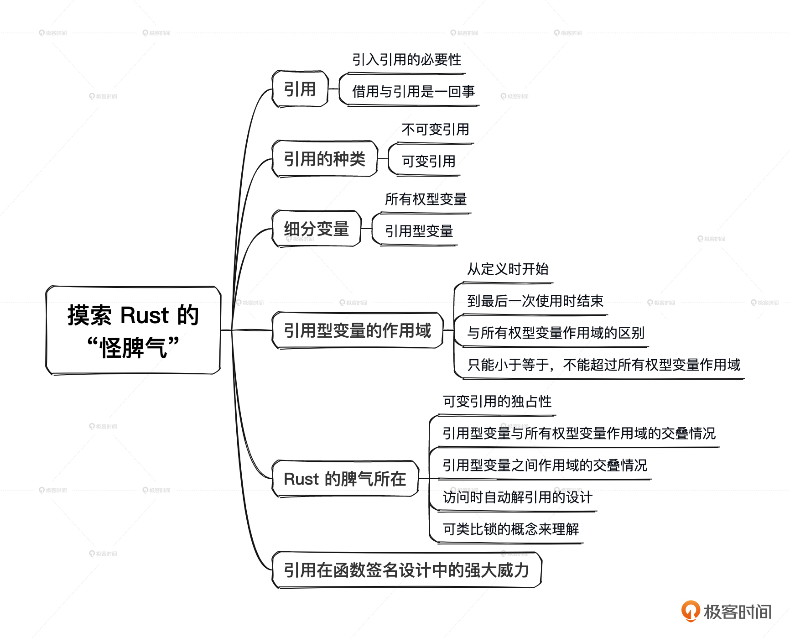

# 03｜所有权（下）：Rust中借用与引用的规则是怎样的？
你好，我是Mike。今天我们继续探讨Rust中所有权这一关键设计。

上节课我们了解了计算机内存结构知识，理解了Rust在内存资源管理上特立独行的设计——所有权，也知道了Rust准备采用所有权来重构整个软件体系。那么这节课我们继续学习所有权的相关内容——借用与引用，学完这节课我们就会对Rust语言的所有权方案有一个相对完整的认知了。

这节课我会用一些精心设计的示例，让你体会Rust引用的独特之处。

## 借用与引用

我们来复习一下上一节课最后一个例子。我们想在函数 `foo` 执行后继续使用字符串s1，我们通过把字符串的所有权转移出来，来达到我们的目的。

```plain
fn foo(s: String) -> String {
    println!("{s}");
    s
}

fn main() {
    let s1 = String::from("I am a superman.");
    let s1 = foo(s1);
    println!("{s1}");
}

```

这样可以是可以，不过很麻烦。一是会给程序员造成一些心智负担，还得想着把值传回来再继续使用。如果代码中到处都是所有权传来传去，会让代码显得相当冗余，毕竟很多时候函数返回值是要用作其他类型的返回的。为了解决这个问题，Rust引入了借用的概念。

借用概念也是实际生活中思维的映射。比如你有一样东西，别人想用一下，可以从你这里借，你可以借出。那“引用”概念又是什么呢？其实在Rust中， **借用和引用是一体两面**。你把东西借给别人用，也就是别人持有了对你这个东西的引用。这里你理解就好，后面我们会混用这两个词。

在Rust中，变量前用“&”符号来表示引用，比如 `&x`。

其实 **引用也是一种值，并且是固定尺寸的值**，一般来说，与机器CPU位数一致，比如64位或32位。因为是值，所以就可以赋给另一个变量。同时它又是固定的而且是小尺寸的值，那其实赋值的时候，就可以直接复制一份这个引用。

让我们来看一下如何使用引用。

```plain
fn main() {
    let a = 10u32;
    let b = &a;        // b是变量a的一级引用
    let c = &&&&&a;    // c是变量a的多级引用
    let d = &b;        // d是变量a的间接引用
    let e = b;         // 引用b再赋值给e

    println!("{a}");
    println!("{b}");
    println!("{c}");
    println!("{d}");
    println!("{e}");
}
// 输出
10
10
10
10
10

```

从上面示例中可以看出，Rust识别了我们一般情况下的意图，不会打印出引用的内存地址什么的，而是打印出了被引用对象的值。示例中的c实际是a的5次引用，但是打印时仍然正确获取到了a的值。d是a的间接引用，但是仍然正确获取到了a的值。这里我们可以看出Rust与C这种纯底层语言的显著区别，Rust对程序员更友好，它会更多地面向业务。因为人们还是普遍关注最终那个值的部分，而不是中间过程的内存地址。

上面示例中，b和e都是对a的一级引用。由于引用是固定尺寸的值， `let e = b` 做的就是引用的复制操作，并没有再复制一份a的值。

那对字符串来说会怎样呢？我们改一下上面的示例。

```plain
fn main() {
    let s1 = String::from("I am a superman.");
    let s2 = &s1;
    let s3 = &&&&&s1;
    let s4 = &s2;
    let s5 = s2;

    println!("{s1}");
    println!("{s2}");
    println!("{s3}");
    println!("{s4}");
    println!("{s5}");
}
// 输出
I am a superman.
I am a superman.
I am a superman.
I am a superman.
I am a superman.

```

结果符合我们的期望。同样，这些引用都没有导致堆中的字符串资源被复制一份或多份。字符串的所有权仍然在s1那里，s2、s3、s4、s5都是对这个所有权变量的引用。从这里开始，我们可以将变量按一个新的维度划分为 **所有权型变量** 和 **引用型变量**。

也可以看出，在Rust中，一个所有权型变量（如 s1）带有值和类型的信息，一个引用型变量（如 s2、s3、s4、s5）也带有值和类型的信息，不然它没法正确回溯到最终的值。这些信息是Rust编译器帮我们维护的。

## 不可变引用、可变引用

上一节课，我们看到Rust的变量具有可变性。那么同样的规则，是不是可以施加到引用上来呢？当然可以。这正是Rust语言设计一致性的体现。

实际上默认 `&x` 指的是不可变引用。而要获取到可变引用，需要使用 `&mut` 符号，如 `&mut x`。

好家伙，我们一下子又引入了两个新概念：不可变引用和可变引用。让我们好好来消化一下它们。

- 引用分成不可变引用和可变引用。
- `&x` 是对变量x的不可变引用。
- `&mut x` 是对变量x的可变引用。

你应该发现了，这里mut和x中间有个空格，为什么呢？很简单，就是为了避免和 `&mutx` 混淆。

不可变引用和可变引用对应的现实概念也是很容易理解的。比如，你把你的书借给别人，并且嘱咐，只能阅读，不能在书上记笔记。这就相当于不可变引用。如果你允许他在书上面写写划划，那就相当于可变引用。

为什么会有可变引用的存在呢？这个事情是这样的。到目前为止，如果要对一个变量内容进行修改，我们必须拥有所有权型变量才行。而很多时候，我们没法拥有那个资源的所有权，比如你引用一个别人的库，它没有把所有权类型暴露出来，但是确实又有更新其内部状态的需求。因此需要一个东西，它既是一种引用，又能够修改指向资源的内容。于是就引入了 **可变引用**。

我们前面举的引用的例子，实际只是访问（打印）变量的值，没有修改它们，所以没问题。现在我们再来看一下，如果要使用引用修改变量的值，应该怎么做。

```plain
fn main() {
    let a = 10u32;
    let b = &mut a;
    *b = 20;

    println!("{b}");
}

```

提示：

```plain
error[E0596]: cannot borrow `a` as mutable, as it is not declared as mutable
  --> src/main.rs:19:13
   |
19 |     let b = &mut a;
   |             ^^^^^^ cannot borrow as mutable
   |
help: consider changing this to be mutable
   |
18 |     let mut a = 10u32;
   |         +++

```

报错了。怎么回事呢？

前面我们说过，要修改一个变量的值，变量名前要加 `mut` 修饰符，我们忘加了（不要害羞，这是很正常的事情），Rust编译器给我们指出来了。

现在我们加上。

```plain
fn main() {
    let mut a = 10u32;
    let b = &mut a;
    *b = 20;

    println!("{b}");
}
// 输出
20

```

接下来改动一下例子。

```plain
fn main() {
    let mut a = 10u32;
    let b = &mut a;
    *b = 20;

    println!("{b}");
    println!("{a}");    // 这里多打印了一行a
}
// 输出
20
20

```

正确输出了修改后的值。

我们再换一下两个打印语句的位置试试。

```plain
fn main() {
    let mut a = 10u32;
    let b = &mut a;
    *b = 20;

    println!("{a}");  // 这一句移到前面来
    println!("{b}");
}

```

编译居然报错了！

```plain
   Compiling playground v0.0.1 (/playground)
error[E0502]: cannot borrow `a` as immutable because it is also borrowed as mutable
 --> src/main.rs:6:15
  |
3 |     let b = &mut a;
  |             ------ mutable borrow occurs here
...
6 |     println!("{a}");  // 这一句移到的前面来
  |               ^^^ immutable borrow occurs here
// 提示说这里发生了不可变借用
7 |     println!("{b}");
  |               --- mutable borrow later used here
// 在这后面使用了可变借用
  |
  = note: this error originates in the macro `$crate::format_args_nl` which comes from the expansion of the macro `println` (in Nightly builds, run with -Z macro-backtrace for more info)

```

只是移动了一下打印语句，就会导致程序编译不通过。什么道理！我能充分理解你初学Rust的心情。

那这到底是为什么呢？我们先总结一下观察到的事情。

- 打印语句 `println!` 中，不管是传所有权型变量还是引用型变量，都能打印出预期的值。实际上 `println!` 中默认会对所有权变量做不可变借用操作（对应代码里的第6行）。
- 可变引用调用的时机（对应代码里的第7行）和不可变引用调用的时机（对应代码里的第6行），好像有顺序要求。目前我们尚不清楚这种机制是什么。

为了让问题暴露得更加明显，我又设计了另外一个例子。

```plain
fn main() {
    let mut a = 10u32;
    let b = &mut a;
    *b = 20;
    let c = &a;      // 在利用b更新了a的值后，c再次借用a
}

```

这个代码是可以顺利编译的。但是加了一句打印就又不行了！

```plain
fn main() {
    let mut a = 10u32;
    let b = &mut a;
    *b = 20;
    let c = &a;       // 在利用b更新了a的值后，c再次借用a

    println!("{b}");  // 加了一句打印语句
}

```

提示：

```plain
   Compiling playground v0.0.1 (/playground)
error[E0502]: cannot borrow `a` as immutable because it is also borrowed as mutable
// 不能将a借用为不可变的，因为它已经被可变借用了
  --> src/main.rs:5:13
  |
3 |     let b = &mut a;
  |             ------ mutable borrow occurs here
// 可变借用发生在这里
4 |     *b = 20;
5 |     let c = &a;
  |             ^^ immutable borrow occurs here
// 不可变借用发生在这里
6 |
7 |     println!("{b}");  // 加了一句打印语句
  |               --- mutable borrow later used here
// 可变借用在这里使用了

```

怎么回事呢？

我们试着改一下打印语句。

```plain
fn main() {
    let mut a = 10u32;
    let b = &mut a;
    *b = 20;
    let c = &a;

    println!("{c}");  // 不打印b了，换成打印c
}
// 输出
20

```

这下编译通过了，打印出 20。

我们尝试一下把变量c的定义移到前面一些，结果又不能编译了。

```plain
fn main() {
    let mut a = 10u32;
    let c = &a;        // c的定义移到这里来了
    let b = &mut a;
    *b = 20;

    println!("{c}");
}

```

提示：

```plain
   Compiling playground v0.0.1 (/playground)
error[E0502]: cannot borrow `a` as mutable because it is also borrowed as immutable
 --> src/main.rs:4:13
  |
3 |     let c = &a;        // c的定义移到这里来了
  |             -- immutable borrow occurs here
4 |     let b = &mut a;
  |             ^^^^^^ mutable borrow occurs here
...
7 |     println!("{c}");
  |               --- immutable borrow later used here

```

你有没有感觉Rust就像一头发疯的野牛！不听使唤。而我们现在要做的就是摸清它的脾气，驯服它！

再尝试修改代码，又编译通过了。

```plain
fn main() {
    let mut a = 10u32;
    let c = &a;           // c的定义移到这里来了
    let b = &mut a;
    *b = 20;

    println!("{b}");      // 这里打印的变量换成b
}

```

到这里为止，我们已经积累了不少素材了，从这些素材中你有没有发现什么规律？ **引用的最后一次调用时机很关键**。

前面我们讲过，一个所有权型变量的作用域是从它定义时开始到花括号结束。而引用型变量的作用域不是这样， **引用型变量的作用域是从它定义起到它最后一次使用时结束。** 比如上面的示例中，所有权型变量a的作用域是2~8行；不可变引用c的作用域只有第3行，它定义了，但并没有被使用，所以它的作用域就只有那一行；可变引用b的作用域是4~7行。

同时，我们发现还存在一条规则： **一个所有权型变量的可变引用与不可变引用的作用域不能交叠**，也可以说不能同时存在。我们用这条规则分析前面的示例。

```plain
fn main() {
    let mut a = 10u32;
    let c = &a;
    let b = &mut a;
    *b = 20;

    println!("{c}");
}

```

所有权型变量a的作用域是2~8行，不可变引用c的作用域是3~7行，可变引用b的作用域是4~5行。b和c的作用域交叠了，因此无法编译通过。

后面你可以采用我的这种分析方法来分析每一个例子。

接下来我们再看一个例子。

```plain
fn main() {
    let mut a = 10u32;
    let b = &mut a;
    *b = 20;
    let d = &mut a;

    println!("{d}");      // 打印d
}
// 输出
20

```

这个例子打印出 20。那我们尝试打印b试试。

```plain
fn main() {
    let mut a = 10u32;
    let b = &mut a;
    *b = 20;
    let d = &mut a;

    println!("{b}");      // 打印b
}

```

编译不通过，提示：

```plain
   Compiling playground v0.0.1 (/playground)
error[E0499]: cannot borrow `a` as mutable more than once at a time
// 在一个时刻不能把`a`以可变借用形式借用超过一次
 --> src/main.rs:5:13
  |
3 |     let b = &mut a;
  |             ------ first mutable borrow occurs here
4 |     *b = 20;
5 |     let d = &mut a;
  |             ^^^^^^ second mutable borrow occurs here
6 |
7 |     println!("{b}");
  |               --- first borrow later used here

```

编译器抱怨：“在一个时刻不能把a以可变借用形式借用超过一次”。分析代码后，我们发现确实这两个可变借用的作用域交叠了！b的作用域是3～7行，d的作用域是第5行，难怪会报错。于是我们又学到了一条经验： **同一个所有权型变量的可变借用之间的作用域也不能交叠**。

然后，让我们继续看。

```plain
fn main() {
    let mut a = 10u32;
    let r1 = &a;
    a = 20;

    println!("{r1}");
}

```

编译报错：

```plain
   Compiling playground v0.0.1 (/playground)
error[E0506]: cannot assign to `a` because it is borrowed
// 不能给a赋值，因为它被借用了
 --> src/main.rs:4:5
  |
3 |     let r1 = &a;
  |              -- `a` is borrowed here
4 |     a = 20;
  |     ^^^^^^ `a` is assigned to here but it was already borrowed
5 |
6 |     println!("{r1}");
  |               ---- borrow later used here

```

提示在有借用的情况下，不能对所有权变量进行更改值的操作（写操作）。

有可变借用存在的情况下也一样。

```plain
fn main() {
    let mut a = 10u32;
    let r1 = &mut a;
    a = 20;

    println!("{r1}");
}

```

编译报错：

```plain
   Compiling playground v0.0.1 (/playground)
error[E0506]: cannot assign to `a` because it is borrowed
 --> src/main.rs:4:5
  |
3 |     let r1 = &mut a;
  |              ------ `a` is borrowed here
4 |     a = 20;
  |     ^^^^^^ `a` is assigned to here but it was already borrowed
5 |
6 |     println!("{r1}");
  |               ---- borrow later used here

```

提示在有借用的情况下，不能对所有权变量进行更改值的操作（写操作）。

通过前面这么多例子的摸索，你是不是找到了一些规律？到此为止，我们可以做一下阶段性的总结，得出关于引用（借用）的一些规则。

- 所有权型变量的作用域是从它定义时开始到所属那层花括号结束。
- 引用型变量的作用域是从它定义起到它最后一次使用时结束。
- 引用（不可变引用和可变引用）型变量的作用域不会长于所有权变量的作用域。这是肯定的，不然就会出现悬锤引用，这是典型的内存安全问题。
- 一个所有权型变量的不可变引用可以同时存在多个，可以复制多份。
- 一个所有权型变量的可变引用与不可变引用的作用域不能交叠，也可以说不能同时存在。
- 某个时刻对某个所有权型变量只能存在一个可变引用，不能有超过一个可变借用同时存在，也可以说，对同一个所有权型变量的可变借用之间的作用域不能交叠。
- 在有借用存在的情况下，不能通过原所有权型变量对值进行更新。当借用完成后（借用的作用域结束后），物归原主，又可以使用所有权型变量对值做更新操作了。

下面我们再来试试可变引用能否被复制。

```plain
fn main() {
    let mut a = 10u32;
    let r1 = &mut a;
    let r2 = r1;

    println!("{r1}")
}

```

出错了，提示：

```plain
error[E0382]: borrow of moved value: `r1`
 --> src/main.rs:6:16
  |
3 |     let r1 = &mut a;
  |         -- move occurs because `r1` has type `&mut u32`, which does not implement the `Copy` trait
4 |     let r2 = r1;
  |              -- value moved here
5 |
6 |     println!("{r1}")
  |                ^^ value borrowed here after move

```

它说r1的值移动给了r2，因此r1不能再被使用了。

我们修改一下例子。

```plain
fn main() {
    let mut a = 10u32;
    let r1 = &mut a;
    let r2 = r1;

    println!("{r2}");    // 打印r2
}
// 输出
10

```

成功打印。

从这个例子可以看出，可变引用的再赋值，会执行移动操作。赋值后，原来的那个可变引用变量就不能用了。这有点类似于所有权的转移，因此 **一个所有权型变量的可变引用也具有所有权特征**，它可以被理解为那个所有权变量的独家代理，具有 **排它性**。

## 多级引用

我们来看剩下的一些语言细节。下面这段代码展示了 `mut` 修饰符， `&mut` 和 `&` 同时出现的情况。

```plain
fn main() {
    let mut a1 = 10u32;
    let mut a2 = 15u32;

    let mut b = &mut a1;
    b = &mut a2;

    let mut c = &a1;
    c = &a2;
}

```

下面我们再来看一个多级可变引用的例子。

```plain
fn main() {
    let mut a1 = 10u32;
    let mut b = &mut a1;
    *b = 20;

    let c = &mut b;
    **c = 30;          // 多级解引用操作

    println!("{c}");
}
// 输出
30

```

假如我们解引用错误会怎样，来看看。

```plain
fn main() {
    let mut a1 = 10u32;
    let mut b = &mut a1;
    *b = 20;

    let c = &mut b;
    *c = 30;            // 这里对二级可变引用只使用一级解引用操作

    println!("{c}");
}

```

哦！会报错。

```plain
   Compiling playground v0.0.1 (/playground)
error[E0308]: mismatched types
 --> src/main.rs:7:10
  |
7 |     *c = 30;
  |     --   ^^ expected `&mut u32`, found integer
  |     |
  |     expected due to the type of this binding
  |
help: consider dereferencing here to assign to the mutably borrowed value
  |
7 |     **c = 30;
  |     +

```

它正确识别到了中间引用的类型为 `&mut u32`，而我们却要给它赋值为 `u32`，一定是代码写错了，然后还给我们建议了正确的写法。强大！

我们再来看一个例子。

```plain
fn main() {
    let mut a1 = 10u32;
    let b = &mut a1;
    let mut c = &b;
    let d = &mut c;

    ***d = 30;

    println!("{d}");
}

```

提示：

```plain
error[E0594]: cannot assign to `***d`, which is behind a `&` reference
  --> src/main.rs:21:5
   |
21 |     ***d = 30;
   |     ^^^^^^^^^ cannot assign

For more information about this error, try `rustc --explain E0594`.

```

提示：不能这样更新目标的值，因为目标躲在一个 `&` 引用后面。

这里，我们又可以发现Rust中三条关于引用的知识点。

- 对于多级可变引用，要利用可变引用去修改目标资源的值的时候，需要做正确的多级解引用操作，比如例子中的 `**c`，做了两级解引用。
- 只有全是多级可变引用的情况下，才能修改到目标资源的值。
- 对于多级引用（包含可变和不可变），打印语句中，可以自动为我们解引用正确的层数，直到访问到目标资源的值，这很符合人的直觉和业务的需求。

## 用引用改进函数的定义

有了引用这个设施，我们可以改进前面将字符串所有权传进函数，然后又传出来的例子。第一个例子是将字符串的不可变引用传进函数参数。

```plain
fn foo(s: &String) {
    println!("in fn foo: {s}");
}

fn main() {
    let s1 = String::from("I am a superman.");
    foo(&s1);    // 注意这里传的是字符串的引用 &s1
    println!("{s1}");    // 这里可以打印s1的值了
}

```

可以看到，打印出了正确的结果。

```plain
in fn foo: I am a superman.
I am a superman.

```

然后我们试试将字符串的可变引用传进函数，并修改字符串的内容。

```plain
fn foo(s: &mut String) {
    s.push_str(" You are batman.");
}

fn main() {
    let mut s1 = String::from("I am a superman.");
    println!("{s1}");
    foo(&mut s1);    // 注意这里传的是字符串的可变引用 &mut s1
    println!("{s1}");
}

```

输出：

```plain
I am a superman.
I am a superman. You are batman.

```

与我们的期望一致。我们成功地使用引用，来改进函数的传参过程以及函数的定义，我们这里的 `foo` 函数，不再需要费力地把所有权再传回来了。

从代码中可以看到，这里Rust的代码 `&s1` 和 `&mut s1` 留下了清晰的足迹。如果一个函数参数接受的是可变引用或所有权参数，那么它里面的逻辑一般都会对其引用的资源进行修改。如果一个函数参数只接受不可变引用，那么它里面的逻辑，就一定不会修改被引用的资源。简单的一个参数的签名形式，就将函数的意图初步划分出来了。就是这么清晰，非常利于代码的阅读。

## 小结

这节课我带着你摸了一遍Rust这头野牛的怪脾气，现在已经大致清楚了。下面我们一起来总结一下这节课的主要内容。

在同一时刻，同一个所有权变量的不可变引用和可变引用两者不能同时存在，不可变引用可以同时存在多个。可变引用具有排它性，只能同时存在一个。

借用结束后，原本的所有权变量会重新恢复可读可写的状态。不可变引用可以被任意复制多份，但是可变引用不能被复制，只能转移，这也体现了 **可变引用具有一定的所有权特征**。所有权和引用模型是Rust语言编写高可靠和高性能代码的基础，理解这些模型有助于优化程序的效率，提高代码质量。



本文通过探索性的方式尝试遍历不可变引用与可变引用的各种形式和可能的组合，由此揭开了Rust中引用的各种性质以及同所有权的关系，并总结出了多条相关规则。看起来略显繁琐，但每个示例其实非常简单，理解起来并不困难。请一定记住， **不要死记硬背那些条条框框，请你亲自敲上面的代码示例，编译并运行它，在实践中去理解它们**。久而久之，就会形成一种思维习惯，觉得Rust中的这种设计是理所当然的了。

## 思考题

1. 请思考，为何在不可变引用存在的情况下（只是读操作），原所有权变量也无法写入？

```plain
fn main() {
    let mut a: u32 = 10;
    let b = &a;
    a = 20;

    println!("{}", b);
}

```

1. 请回答，可变引用复制的时候，为什么不允许copy，而是move？

欢迎你把你思考后的答案分享到评论区，和我一起讨论，也欢迎你把这节课分享给需要的朋友，邀他一起学习，我们下节课再见！