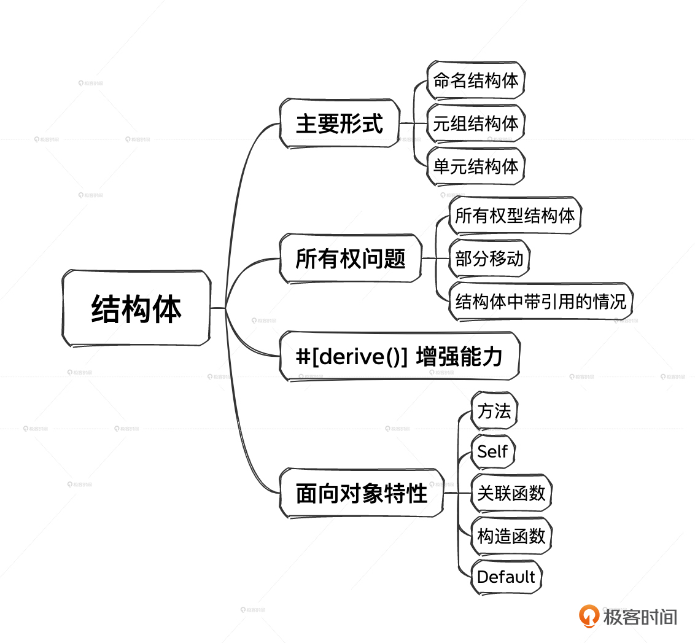

# 05｜复合类型（上）：结构体与面向对象特性
你好，我是Mike。今天我们来学习Rust中的复合类型——结构体。

结构体是由其他的基础类型或复合类型组成的，当它所有字段同时实例化后，就生成了这个结构体的实例。在Rust中，结构体使用 **struct** 关键字进行定义。

这节课我们会通过各种各样的示例来了解结构体，其中有部分示例来自于官方The Book。我们一起来看一下。

## 结构体示例

下面我们先来看一下结构体示例，定义一个User结构体。

```plain
struct User {
    active: bool,
    username: String,
    email: String,
    sign_in_count: u64,
}

```

示例中的 User 结构体由4个字段组成。

1. active字段：bool类型，表示这个用户是否是激活状态。
2. username字段：字符串类型，表示这个用户的名字。
3. email字段：字符串类型，表示这个用户的邮箱名。
4. sign\_in\_count字段：u64类型，用来记录这个用户登录了多少次。

User 完全由4个基础类型的字段组合而成。User的实例化需要这4个字段同时起作用，缺一不可。比如：

```plain
fn main() {
    let user1 = User {
        active: true,
        username: String::from("someusername123"),
        email: String::from("someone@example.com"),
        sign_in_count: 1,
    };
}

```

结构体类型也可以参与更复杂结构体的构建。

```plain
struct Class {
  serial_number: u32,
  grade_number: u32,
  entry_year: String,
  members: Vec<User>,
}

```

代码里的 Class 表示班级，serial\_number表示几班，grade\_number表示几年级，entry\_year表示起始年份，members是一个User的动态数组。

从这里，我们已经可以想象出，结构体类型可以不断往上一层一层地套。而在实际应用中， **结构体往往是一个程序的骨干，用来承载对目标问题进行建模和描述的重任。**

## 结构体的形式

结构体有三种形式，分别是命名结构体、元组结构体和单元结构体，下面我们一个一个看。

### 命名结构体

命名结构体是指每个字段都有名字的结构体，比如前面提到的User结构体，它的每个字段都有明确的名字和类型。

如果在实例化结构体之前，命名了结构体字段名的同名变量，那么用下面这种写法可以偷懒少写几个字符。

```plain
fn main() {
    let active = true;
    let username = String::from("someusername123");
    let email = String::from("someone@example.com");
    let user1 = User {
        active,    // 这里本来应该是 active: active,
        username,  // 这里本来应该是 username: username,
        email,     // 这里本来应该是 email: email,
        sign_in_count: 1,
    };
}

```

这样会显得代码更简洁，同时也没有歧义。

结构体创建好之后，可以更新结构体的部分字段。下面的示例里就单独更新了email字段。

```plain
fn main() {
    let mut user1 = User {
        active: true,
        username: String::from("someusername123"),
        email: String::from("someone@example.com"),
        sign_in_count: 1,
    };

    user1.email = String::from("anotheremail@example.com");
}

```

注意 user1 前面的mut修饰符，不加的话就没办法修改这个结构体里的字段。

而如果我们已经有了一个User的实例 user1，想再创建一个新的user2，而两个实例之间只有部分字段不同。这时，Rust也提供了偷懒的办法，比如：

```plain
fn main() {
    let active = true;
    let username = String::from("someusername123");
    let email = String::from("someone@example.com");
    let user1 = User {
        active,
        username,
        email,
        sign_in_count: 1,
    };
    let user2 = User {
        email: String::from("another@example.com"),
        ..user1    // 注意这里，直接用 ..user1
    };
}

```

用这种写法可以帮助我们少写很多重复代码。特别是当这个结构体比较大的时候，比如有几十个字段，而我们只想更新其中的一两个字段的时候，就显得特别有用了，这能够让我们的代码保持干净清爽。

比如有一个场景就正好符合这个语法特性。用户的信息存在数据库里，当我们要更新一个用户的一个字段的信息时，首先需要从数据库里把这个用户的信息取出来，做一些基本的校验，然后把要更新的字段替换成新的内容，再把这个新的用户实例存回数据库。

这个过程可以这样写：

```plain
// 这个示例是伪代码
let user_id = get_id_from_request;
let new_user_name = get_name_from_request();
let old_user: User = get_from_db(user_id);
let new_user: User = User {
    username: new_user_name,
    ..old_user    // 注意这里的写法
}
new_user.save()

```

有了这些语法糖，用Rust写业务代码是非常清爽的。

### 元组结构体

除了前面那种最普通的命名结构体形式，Rust中也支持一种匿名结构体的形式，也叫做元组结构体。所谓元组结构体，也就是 **元组和结构体的结合体。**

元组结构体长什么样子呢？你可以看一下示例。

```plain
struct Color(i32, i32, i32);
struct Point(i32, i32, i32);

fn main() {
    let black = Color(0, 0, 0);
    let origin = Point(0, 0, 0);
}

```

可以看到，元组结构体有类型名，但是无字段名，也就是说字段是匿名的。在有些情况下这很有用，因为想名字是一件很头痛的事情。并且某些场景下用元组结构体表达会更有效。比如对于RGB颜色对、三维坐标这种各分量之间有对称性，又总是一起出现的情景，直接用元组结构体表达会显得更紧凑。

上述示例中，我们看到，Color类型和Point类型的元组部分其实是一样的，都是 `(i32, i32, i32)`，但是由于类型名不同，它们就是不同的类型，因此上面的 black 实例和 origin 实例就是两个完全不同的东西，前者表示黑色，后者表示原点。

### 单元结构体

Rust还支持单元结构体。单元结构体就是只有一个类型名字，没有任何字段的结构体。单元结构体在定义和创建实例的时候，连后面的花括号都可以省略。比如：

```plain
struct ArticleModule;

fn main() {
    let module = ArticleModule;    // 请注意这一句，也做了实例化操作
}

```

可以看到，这个示例中结构体ArticleModule类型实际创建了一个实例，ArticleModule的定义和实例化都没有使用花括号。这种写法非常紧凑，所以要注意分辨，不然会疑惑：类型为什么能直接赋给一个变量。

那没有字段的结构体有什么用呢？其实它就相当于定义了一种类型，它的名字就是一种信息，有类型名就可以进行实例化，承载很多东西。后面我们在代码中会经常看到单元结构体。

## 结构体中的所有权问题

### 部分移动

Rust的结构体有一种与所有权相关的特性，叫做部分移动（Partial Move）。就是说结构体中的部分字段是可以被移出去的，我们来看下示例。

```plain
#[derive(Debug)]
struct User {
    active: bool,
    username: String,
    email: String,
    sign_in_count: u32,
}

fn main() {
    let active = true;
    let username = String::from("someusername123");
    let email = String::from("someone@example.com");
    let user1 = User {
        active,
        username,
        email,
        sign_in_count: 1,
    };

    let email = user1.email;  // 在这里发生了partially moved

    println!("{:?}", user1)   // 这一句无法通过编译
}

```

提示：

```plain
error[E0382]: borrow of partially moved value: `user1`
  --> src/main.rs:22:22
   |
20 |     let email = user1.email;
   |                 ----------- value partially moved here
21 |
22 |     println!("{:?}", user1)
   |                      ^^^^^ value borrowed here after partial move

```

下面这句对于我们习惯的编程的人来说，其实是非常普通的一行，就是将结构体的一个字段值赋值给一个新的变量。

```plain
let email = user1.email;

```

但这里就发生了一件很奇妙的事情，因为email字段是String类型，是一种所有权类型，于是email字段的值被移动了。移动后，email变量拥有了那个值的所有权。而user1中的email字段就被标记无法访问了。

我们稍微改一下这段代码，不直接打印user1实例整体，而是分别打印email之外的另外三个字段。

```plain
let email = user1.email;

println!("{}", user1.username);      // 分别打印另外3个字段
println!("{}", user1.active);
println!("{}", user1.sign_in_count);

```

这时可以得到正确的输出。而如果单独打印 email 字段，也是不行的，你可以自己试试。这就是结构体中所有权字段被部分移动的情景。

### 字段是引用类型

还是用前面我们定义的User类型，它里面的所有字段都是带所有权的字段。而在赋值行为上，bool和u32会默认复制一份新的所有权，而String会移动之前那份所有权到新的变量。全部定义带所有权的字段，是我们定义结构体类型的主要方式。

但是既然都是类型，Rust的结构体没有理由不能支持借用类型。比如：

```plain
struct User {
    active: &bool,       // 这里换成了 &bool
    username: &str,      // 这里换成了 &str
    email: &str,         // 这里换成了 &str
    sign_in_count: &u32, // 这里换成了 &u32
}

```

我们把4个字段都换成了对应的引用形式。

这种写法当然是可以的，不过上面的代码暂时还没办法通过Rust的编译，我们需要加一些额外的标注才能让其通过，这个我们在这里不展开讲解，后面第20讲我会针对这个问题展开描述。我这里把这种写法提出来是为了让你意识到，几乎所有的地方，Rust都会把问题一分为二，一是所有权形式的表示，二是借用形式的表示。借用形式的表示又可进一步细分为不可变借用的表示和可变借用的表示。

一般来说，对于业务系统我们用的几乎都是所有权形式的结构体，而这就已经够用了。对于初学者来说，切忌贪图所有语言特性，应该以实用为主。

## 给结构体添加标注

在Rust中，我们可以给类型添加标注。

```plain
#[derive(Debug)]        // 这里，在结构体上面添加了一种标注
struct User {
    active: bool,
    username: String,
    email: String,
    sign_in_count: u32,
}

```

这样标注后，就可以在打印语句的时候把整个结构体打印出来了。

```plain
println!("{:?}", user1);    // 注意这里的 :? 符号

```

这种 `#[derive(Debug)]` 语法在Rust中叫 **属性标注**，具体来说这里用的是 **派生宏属性，** 派生宏作用在下面紧接着的结构体类型上，可以为结构体自动添加一些功能。这些知识我们后面会讲解。目前为止你只需要知道它起什么作用就可以了。比如，派生 Debug 这个宏可以让我们在 `println!` 中用 `{:?}` 格式把结构体打印出来，这对于调试是非常方便的。

如果你学过Java，可能会非常眼熟，这跟Java中的标注语法非常像，功能也是类似的，都会对原代码的元素产生作用。不过，Rust这个特性作为一套完整的宏机制，要强大得多。它让Rust的语言表达能力又上了一个台阶。

后面我们会经常看到各种派生宏，到时候我们再做讲解。

## 面向对象特性

Rust不是一门面向对象的语言，但是它确实有部分面向对象的特性。 **而Rust承载面向对象特性的主要类型就是结构体。Rust有个关键字 impl可以用来给结构体或其他类型实现方法，也就是关联在某个类型上的函数。**

### 方法（实例方法）

使用 impl 关键字为结构体实现方法，可以像下面这样：

```plain
#[derive(Debug)]
struct Rectangle {
    width: u32,
    height: u32,
}

impl Rectangle {                // 就像这样去实现
    fn area(self) -> u32 {      // area就是方法，被放在impl实现体中
        self.width * self.height
    }
}

fn main() {
    let rect1 = Rectangle {
        width: 30,
        height: 50,
    };

    println!(
        "The area of the rectangle is {} square pixels.",
        rect1.area()      // 使用点号操作符调用area方法
    );
}
// 输出
The area of the rectangle is 1500 square pixels.

```

上面示例中，我们给Rectangle类型实现了area方法，并在Rectangle的实例rect1上使用点号（.）操作符调用了这个方法。

### Self

请注意看area方法的签名。

```plain
fn area(self) -> u32

```

你会发现，这个参数好像有点特殊，是一个单 self，不太像标准的参数定义语法。

实际上这里是Rust的一个语法糖，self 的完整写法是 self: Self，而Self是Rust里一个特殊的类型名，它表示正在被实现（impl）的那个类型。

前面我们说过，Rust中所有权形式和借用形式总是成对出现，在 impl 的时候也是如此。方法的签名中也会对应三种参数形式。我们扩展一下上面的例子。

```plain
impl Rectangle {
    fn area1(self) -> u32 {
        self.width * self.height
    }
    fn area2(&self) -> u32 {
        self.width * self.height
    }
    fn area3(&mut self) -> u32 {
        self.width * self.height
    }
}

```

3种形式都是可以的。

方法是实现在类型上的特殊函数，它的第一个参数是Self类型，包含3种形式。

1. self: Self：传入实例的所有权。
2. self: &Self：传入实例的不可变引用。
3. self: &mut Self：传入实例的可变引用。

因为是标准用法，所以Rust帮我们简写成了 self、&self、&mut self。这种简写并不会产生歧义。

上述代码展开后是这样的：

```plain
impl Rectangle {
    fn area1(self: Self) -> u32 {
        self.width * self.height
    }
    fn area2(self: &Self) -> u32 {
        self.width * self.height
    }
    fn area3(self: &mut Self) -> u32 {
        self.width * self.height
    }
}

```

方法调用的时候，直接在实例上使用 . 操作符调用，然后第一个参数是实例自身，会默认传进去，因此不需要单独写出来。

```plain
rect1.area1();  // 传入rect1
rect1.area2();  // 传入&rect1
rect1.area3();  // 传入&mut rect1

```

看到这里，你是不是感觉很熟悉，有没有C++、Java 等方法的this指针的既视感？不过，在Rust中，基本上一切都是显式化的，不存在隐藏提供一个参数给你的情况。这样就会少很多坑，如果你是JavaScript开发者，在这一点上应该深有体会。

实例的引用也是可以直接调用方法的。比如，对于不可变引用，可以像下面这样调用。Rust会自动做正确的多级解引用操作。

```plain
#[derive(Debug)]
struct Rectangle {
    width: u32,
    height: u32,
}

impl Rectangle {
    fn area(&self) -> u32 {
        self.width * self.height
    }
}

fn main() {
    let rect1 = Rectangle {
        width: 30,
        height: 50,
    };

    // 在这里，取了实例的引用
    let r1 = &rect1;
    let r2 = &&rect1;
    let r3 = &&&&&&&&&&&&&&&&&&&&&&rect1;  // 不管有多少层
    let r4 = &&r1;

    // 以下4行都能打印出正确的结果
    r1.area();
    r2.area();
    r3.area();
    r4.area();
}

```

对同一个类型，impl可以分开写多次。这在组织代码的时候比较方便。

```plain
impl Rectangle {
    fn area(&self) -> u32 {
        self.width * self.height
    }
}

impl Rectangle {
    fn can_hold(&self, other: &Rectangle) -> bool {
        self.width > other.width && self.height > other.height
    }
}

```

### 关联函数（静态方法）

前面我们讲过，方法的第一个参数为self，从函数参数定义上来说，第一个参数当然也可以不是self。如果实现在类型上的函数，它的第一个参数不是self参数，那么它就叫做此类型的关联函数。

```plain
impl Rectangle {
    fn numbers(rows: u32, cols: u32) -> u32 {
        rows * cols
    }
}

```

调用时，关联函数使用类型配合路径符 `::` 来调用。注意这里与实例用点运算符调用方法的区别。

```plain
Rectangle::numbers(10, 10);

```

你有没有感觉，Rust中的关联函数跟 C++、Java里的静态方法起着类似的作用？确实差不多。但是Rust这里不需要额外引入一个 static 修饰符去定义，因为靠是否有Self参数就已经能明确地区分实例方法与关联函数了。

### 构造函数

不像C++、Java等语言，Rust中没有专门的构造函数，但是用于构造实例的需求是不会变的。那Rust中一般是怎么处理的呢？

首先，Rust中结构体可以直接实例化，比如前面定义的Rectangle。

```plain
#[derive(Debug)]
struct Rectangle {
    width: u32,
    height: u32,
}

fn main() {
    let rect1 = Rectangle {
        width: 30,
        height: 50,
    };
}

```

基于这一点，Rust社区一般约定使用 new() 这个名字的关联函数，像下面这样把类型的实例化包起来。

```plain
impl Rectangle {
  pub fn new(width: u32, height: u32) -> Self {
    Rectangle {
        width,
        height,
    }
  }
}

```

然后，使用下面这行代码创建新实例。

```plain
let rect1 = Rectangle::new(30, 50);

```

但是 new 这个名字并不是强制的。所以你在社区的很多库里还会看到 `from()`、 `from_xxx()` 等其他名字起构造函数的功能。Rust在这块儿并没有强制要求，多熟悉社区中的惯用法，能写出更地道的Rust代码。

### Default

在对结构体做实例化的时候，Rust又给我们提供了一个便利的设施，Default。

我们可以像下面这样使用：

```plain
#[derive(Debug, Default)]      // 这里加了一个Default派生宏
struct Rectangle {
    width: u32,
    height: u32,
}

fn main() {
    let rect1: Rectangle = Default::default();    // 使用方式1
    let rect2 = Rectangle::default();             // 使用方式2

    println!("{:?}", rect1);
    println!("{:?}", rect2);
}

// 打印出如下：
Rectangle { width: 0, height: 0 }
Rectangle { width: 0, height: 0 }

```

Default有两种使用方式，一种是直接用 `Default::default()`，第二种是用类型名 `::default()`，它们的实例化效果是一样的。

可以看到，打出来的实例字段值都0，是因为u32类型默认值就是 0。对于通用类型，比如u32这种类型来说，取 0 是最适合的值了，想一想取其他值是不是没办法被大多数人接受？

但是，对于我们特定场景的Rectangle这种，我们可能希望给它赋一个初始的非 0 值。在Rust中，这可以做到，但是需要用到后面的知识。目前我们就可以先用约定的 new 关联函数+参数来达到我们的目的。

```plain
#[derive(Debug)]
struct Rectangle {
    width: u32,
    height: u32,
}

impl Rectangle {
  pub fn new(width: u32, height: u32) -> Self {
    Rectangle {
        width,
        height,
    }
  }
}

const INITWIDTH: u32 = 50;
const INITHEIGHT: u32 = 30;

fn main() {
    // 创建默认初始化值的Rectangle实例
    let rect1 = Rectangle::new(INITWIDTH , INITHEIGHT);
}

```

## 小结

这节课我们详细讨论了Rust中结构体相关的知识，现在来复习一下。

结构体中有命名结构体、元组结构体、单元结构体几种表现形式，除此之外，结构体中的所有权问题也是需要重点关注的，尤其是部分移动的概念。然后我们介绍了如何通过在结构体上添加标注来增强结构体的能力。

我们还进一步了解了如何利用impl关键字为结构体实现面向对象特性。不过需要注意的是， **Rust语言本身并不是一门完整的面向对象语言**，比如它缺乏继承等机制。但是这并不重要，OOP不是编程语言的全部，Rust语言从设计之初就没有走向OOP的方向。后面我们会看到，Rust利用trait等机制，能够提供比OOP语言更解耦的抽象、更灵活的配置。

结构体是用户自定义类型的主要实现者，你要熟练掌握。除了具体的语法知识点之外，我建议你用所有权和借用的思路去贯穿Rust整个知识体系。



## 思考题

可以给 i8 类型做 impl 吗？

欢迎你把思考后的结果分享到评论区，也欢迎你把这节课分享给需要的朋友，我们下节课再见！