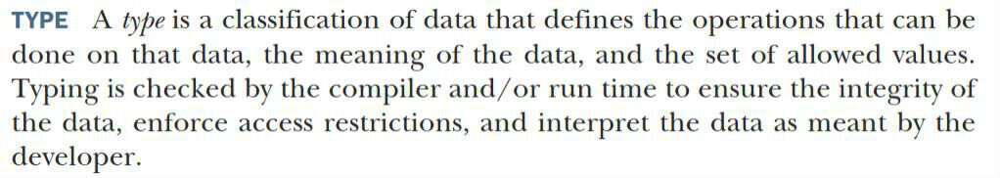
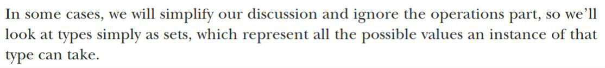
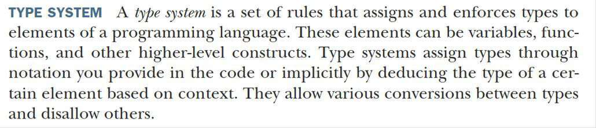

# 07｜类型与类型参数：给Rust小助手提供更多信息
你好，我是Mike。今天我们一起来学习Rust中类型相关的知识。

这块儿知识在其他大部分语言入门材料中讲得不多，但是对于Rust而言，却是非常重要而有趣的。我们都知道，计算机硬件执行的代码其实是二进制序列。而 **对一个二进制值来说，正是类型赋予了它意义**。

比如 01100001 这个二进制数字，同样的内存表示，如果是整数，就表示97。如果是字符，就表示 `'a'` 这个 char。如果没有类型去赋予它额外的信息，当你看到这串二进制编码时，是不知道它代表什么的。

## 类型

《Programming.with.Types》2019 这本书里对类型做了一个定义，翻译出来是这样的：类型是对数据的分类，这个分类定义了这些数据的意义、被允许的值的集合，还有能在这些数据上执行哪些操作。编译器或运行时会检查类型化过程，以确保数据的完整性，对数据施加访问限制，以及把数据按程序员的意图进行解释。

有些情况下，我们会简化讨论，把操作部分忽略掉，所以我们可以简单地 **把类型看作集合，这个集合表达了这个类型的实例能取到的所有可能的值**。

### 类型系统

这本书里还定义了类型系统的概念。

书里是这样说的：类型系统是一套规则集——把类型赋予和施加到编程语言的元素上。这些元素可以是变量、函数和其他高阶结构。类型系统通过你在代码中提供的标注来给元素赋予类型，或者根据它的上下文隐式地推导某个元素的类型。类型系统允许在类型间做各种转换，同时禁止其他的一些转换。

举例来说，刚刚我们提到的类型的标注就像这种 `let a: u32 = 10;`。我们用 `: u32` 这种语法对变量a进行了标注，表明变量a的类型是 `u32` 类型。 `u32` 可以转换成 `u64`。

```plain
let b = a as u64;

```

但是 `u32` 不能直接转换到String上去。

```plain
fn main() {
    let a: u32 = 10;
    let b = a as String;    // 错误的

    println!("{b}");
}

```

### 类型化的好处

类型化有5大好处：正确性、不可变性、封装性、组合性、可读性。这5大好处中的每一个都是软件工程理论推崇的。

Rust语言非常强调 **类型化**，它的类型系统非常严格，隐式转换非常少，在某些简单场景下甚至会引起初学者的不适。

比如下面这个代码：

```plain
fn main() {
    let a = 1.0f32;
    let b = 10;

    let c = a * b;
}

```

编译错误，提示你不能将一个浮点数和一个整数相乘。

```plain
error[E0277]: cannot multiply `f32` by `{integer}`
 --> src/main.rs:5:15
  |
5 |     let c = a * b;
  |               ^ no implementation for `f32 * {integer}`
  |
  = help: the trait `Mul<{integer}>` is not implemented for `f32`
  = help: the following other types implement trait `Mul<Rhs>`:
            <&'a f32 as Mul<f32>>
            <&f32 as Mul<&f32>>
            <f32 as Mul<&f32>>
            <f32 as Mul>

```

初学者遇到这种情况，往往会觉得Rust过于严苛，一个很自然的操作都不让我通过，烦死了，马上就想放弃了。

当遇到这种基础类型转换错误时，可以尝试使用 **as 操作符** 显式地将类型转成一致。

修改上述代码如下：

```plain
fn main() {
    let a = 1.0f32;
    let b = 10 as f32;    // 添加了 as f32

    let c = a * b;
}

```

这段代码就可以编译通过了。

这里其实展示出Rust的一个非常明显的特点： **尽可能地显式化**。显式化包含两层意思。

1. 不做自动隐式转换。
2. 没有内置转换策略。

不做自动隐式转换，可以这样来理解，比如前面的示例，当别人来看你的代码的时候，多了 `as f32` 这几个字符，他就明白你是在做类型转换，就会自然地警觉起来，分析上下文，估计出下面算出的结果是什么类型。这相当于由程序员为编译器明确地提供了一些额外的信息。

没有内置转换策略这一点，我们可以拿JavaScript社区中流传的一张梗图来对比说明。


取图里的一个示例，在 JavaScript 里， `9 + "1"` 计算出来的结果是 `"91"`。这其实就涉及两个不同类型之间相加如何处理的问题。在这个问题上，JavaScript 自己内置了策略，把两个不同类型的值加起来，硬生生算出了一个结果。而当遇到 `91- "1"` 时，策略又变了，算出了数字 90。这些就是内置类型转换策略的体现。

而在Rust中， `9+"1"` 是不可能通过编译的，更不要说计算出一个神奇的结果了。如果要写出类似的代码，在Rust中可以这样做。

```plain
fn main() {
    let a = 9 + '1' as u8;
    let b = 9.to_string() + "1";
}

```

有没有觉得特别清晰！我们一眼就能推断出 a 和 b 的类型，a为u8类型，b为String类型。

这就是Rust的严谨，它有着严密的类型体系，在类型化上绝不含糊。它从底层到上层构建了一套完整严密的类型大厦。你的项目越大，使用Rust感觉也就越舒服，原因之一就是严谨的类型系统在为你保驾护航。

## 类型作为一种约束

前面提到，类型是变量所有可能取得的值的集合。换句话说，类型实际上限制或定义了变量的取值空间。因此， **类型对于变量来说，也是一种约束**。

实际上，Rust中的 : （冒号）在语法层面上就是约束。

示例：

```plain
let a: u8 = 10;
let b: String = "123".to_string();

```

上述示例中，变量a被限制为只能在u8这个类型的值空间取值，也就是0到255这256个整数里的一个，而10属于这个空间。变量b被限制为只能在字符串值空间内取值。不管字符串的值空间多大（其实是无限），这些值与u8、u32这些类型的值也是不同的。

关于 : 作为约束的体现，我们会在后面的课程中不断看到。

## 多种类型如何表示？

前面我们讲到了，用一种类型来对变量的取值空间进行约束。这确实非常好，有利于程序的健壮性。但有时也会遇到这种方式不够用的场景。比如在Rust中，我们把整数分成 u8、u16、u32、u64。现在我想写一个函数，它的参数支持整数，也就是说要同时能接受u8、u16、u32、u64这几种类型的值，应该怎么办？如果只是采用前面的理论，这个需求是没法做到的。

再看另外一个实际的例子，我有一个日志函数，可以给这个函数传入数字、字符串等类型。这种需求很常见。如何让这一个日志函数同时支持数字和字符串作为参数呢？这就很头痛了。

这里实际提出了这样一个问题： **在Rust语言中，有没有办法用某种方式来表示多种类型？** 答案是有的。

## 类型参数

在Rust语言中定义类型的时候，可以使用 **类型参数**。比如标准库里常见的 ` Vec<T>`，就带一个类型参数T，它可以支持不同类型的列表，如 `Vec<u8>`、 `Vec<u32>`、 `Vec<String>` 等。这里这个 T 就表示一个类型参数，在定义时还不知道它具体是什么类型。只有在使用的时候，才会对这个 T 赋予一个具体的类型。

这里这个 `Vec<T>`，是一个类型整体，单独拆开来讲Vec类型是没有意义的。T是 `Vec<T>` 中的类型参数，它其实也是信息，提供给Rust编译器使用。而带类型参数的类型整体（比如 `Vec<T>`）就叫做 **泛型**（generic type）。

### 结构体中的类型参数

我们来看一个例子，自定义一个结构体 `Point<T>`。

```plain
struct Point<T> {
    x: T,
    y: T,
}

```

这是一个二维平面上的点，由x、y两个坐标轴来定义。因为x、y的取值有可能是整数，也有可能是浮点数，甚至有可能是其他值，比如无穷精度的类型。所以我们定义一个类型参数 T，定义的时候需要把T放在结构体类型名字后面，用 `<>` 括起来，也就是 `struct Point<T>`。这里的 `Point<T>` 整体就成为了泛型。然后，标注 x 和 y 分量的类型都是 T。可以看到，T占据了冒号后面定义类型的位置。所以说它是 **占位类型** 也没有问题。

对这个结构体的例子来说，其实还隐藏了一个很重要的细节：x和y字段的类型都是T，意味着 x 和 y 两个分量的类型是一样的。

我们来看这个Point结构体类型如何实例化。

```plain
struct Point<T> {
    x: T,
    y: T,
}

fn main() {
    let integer = Point { x: 5, y: 10 };     // 一个整数point
    let float = Point { x: 1.0, y: 4.0 };    // 一个浮点数point
}

```

符合我们预期，正常编译通过。那如果实例化的时候，给x和y赋予不同的类型值会怎样呢？我们来试试。

```plain
struct Point<T> {
    x: T,
    y: T,
}

fn main() {
    let wont_work = Point { x: 5, y: 4.0 };
}

$ cargo run
   Compiling chapter10 v0.1.0 (file:///projects/chapter10)
error[E0308]: mismatched types
 --> src/main.rs:7:38
  |
7 |     let wont_work = Point { x: 5, y: 4.0 };
  |                                      ^^^ expected integer, found floating-point number

```

编译器正确地指出了问题，说期望整数却收到了浮点数，所以不通过。

这里有个细节，那就是编译器对 `Point<T>` 中的T参数进行了推导，因为它首先遇到的是x的值 5，是一个整数类型，因此编译器就把 T 具体化成了整数类型（具体哪一种还没说，不过在这里不重要），当再收到y分量的值的时候，发现是浮点数类型，和刚才的整数类型不一致了。而Point中定义的时候，又要求x和y的类型是相同的，这个时候就产生了冲突，于是报错。

那么，如何解决这个问题呢？Rust并没有限制我们只能定义一个类型参数呀！定义多个就好了，把x分量和y分量定义成不同的参数化类型。

```plain
struct Point<T, U> {
    x: T,
    y: U,
}

fn main() {
    let both_integer = Point { x: 5, y: 10 };
    let both_float = Point { x: 1.0, y: 4.0 };
    let integer_and_float = Point { x: 5, y: 4.0 };
}

```

像这样，代码就可以顺利通过编译了。

再次强调，前面两个示例里的 `Point<T>` 和 `Point<T, U>` 都是一个类型整体。这个时候，你把 Point 这个符号本身单独拿出来是没有意义的。

在使用的时候，可以用turbofish语法 `::<>` 明确地给泛型，或者说是给Rust编译器提供类型参数信息，我们修改一下上面两个示例。

```plain
struct Point<T> {
    x: T,
    y: T,
}

fn main() {
    let integer = Point::<u32> { x: 5, y: 10 };
    let float = Point::<f32> { x: 1.0, y: 4.0 };
}

```

```plain
struct Point<T, U> {
    x: T,
    y: U,
}

fn main() {
    let both_integer = Point::<u32, u32> { x: 5, y: 10 };
    let both_float = Point::<f32, f32> { x: 1.0, y: 4.0 };
    let integer_and_float = Point::<u32, f32> { x: 5, y: 4.0 };
}

```

注意，使用时提供类型参数信息用的是 `::<>`，而定义类型参数的时候只用到 `<>`，注意它们的区别。Rust把定义和使用两个地方通过语法明确地区分开了，而有的语言并没有区分这两个地方。

到这里，我们会体会到，类型参数存在两个过程， **一个是定义时，一个是使用时**。这两个过程的区分很重要。这里所谓的“使用时”，仍然是在编译期进行分析的，也就是分析你在代码的某个地方用到了这个带类型参数的类型，然后把这个参数具体化，从而形成一个最终的类型版本。

比如 `Point<T>` 类型的具化类型可能是 `Point<u32>`、 `Point<f32>` 等等； `Point<T, U>` 类型的具化类型可能是 `Point<u32, u32>`、 `Point<u32, f32>`、 `Point<f32, u32>`、 `Point<f32, f32>` 等等。到底有多少种具化版本，是看你在后面代码使用时，会用到多少种不同的具体类型。这个数目是由编译器自动帮我们计算展开的。

这种在编译期间完成的类型展开成具体版本的过程，被叫做 **编译期单态化。** 单态化的意思就是把处于混沌未知的状态具体化到一个单一的状态。

### 在泛型上做impl

当类型是一个泛型时，要对其进行impl的话，需要处理类型参数，形式相比于我们在 [第 5 讲](https://time.geekbang.org/column/article/720991) 讲到的impl 结构体，有一点变化。这里我们还是用 `Point<T>` 举例。

```plain
struct Point<T> {
    x: T,
    y: T,
}

impl<T> Point<T> {        // 注意这一行
    fn play(n: T) {}      // 注意这一行
}

```

在对 `Point<T>` 做 impl 的时候，需要在 impl 后面加一个 `<T>`，表示在impl 的 block 中定义类型参数T，供impl block中的元素使用，这些元素包括： `impl<T> Point<T>` 里 `Point<T>` 中的T和整个 impl 的花括号body中的代码，如 `play()` 函数的参数就用到了这个T。

有一个细节需要注意： `struct Point<T>` 里 `Point<T>` 中的 T 是定义类型参数T， `impl<T> Point<T>` 中的 `Point<T>` 中的T是使用类型参数T，这个T是在impl后面那个尖括号中定义的。

在对泛型做了 impl 后，对其某一个具化类型继续做 impl 也是可以的，比如：

```plain
struct Point<T> {
    x: T,
    y: T,
}

impl<T> Point<T> {
    fn play(n: T) {}
}

impl Point<u32> {      // 这里，对具化类型 Point<u32> 继续做 impl
    fn doit() {}
}

```

下面我们来看具体场景中的类型参数的使用。

### 枚举中的类型参数

前面讲过，枚举的变体可以挂载任意其他类型作为负载。因此每个负载的位置，都可以出现类型参数。比如最常见的两个枚举， `Option<T>` 与 `Result<T, E>`，就是泛型。

`Option<T>` 用来表示有或无。

```plain
enum Option<T> {
    Some(T),
    None,
}

```

`Result<T, E>` 用来表示结果，正确或错误。Ok变体带类型参数T，Err变体带类型参数E。

```plain
enum Result<T, E> {
    Ok(T),
    Err(E),
}

```

我们后面会详细阐述 `Option<T>` 和 `Result<T, E>` 的用法。

现在再看一个更复杂的枚举中带类型参数的例子。

```plain
struct Point<T> {
    x: T,
    y: T,
}

enum Aaa<T, U> {
    V1(Point<T>),
    V2(Vec<U>),
}

```

我们来解释一下，枚举 `Aaa<T, U>` 的变体 V1 带了一个 `Point<T>` 的负载，变体V2带了一个 `Vec<U>` 的负载。由于出现了两个类型参数T和U，所以需要在Aaa后面的尖括号里定义这两个类型参数。

实际上，类型参数也是一种复用代码的方式，可以让写出的代码更紧凑。下面我们来看具体的应用场景。

### 函数中的类型参数

需求是这样的：很多不同的类型，其实它们实现某个逻辑时，逻辑是一模一样的。因此如果没有类型参数，就得对每个具体的类型重新实现一次同样的逻辑，这样就显得代码很臃肿。重复的代码也不好维护，容易出错。

示例：

```plain
struct PointU32 {
    x: u32,
    y: u32,
}

struct PointF32 {
    x: f32,
    y: f32,
}

fn print_u32(p: PointU32) {
    println!("Point {}, {}", p.x, p.y);
}

fn print_f32(p: PointF32) {
    println!("Point {}, {}", p.x, p.y);
}

fn main() {
    let p = PointU32 {x: 10, y: 20};
    print_u32(p);

    let p = PointF32 {x: 10.2, y: 20.4};
    print_f32(p);
}

```

上面示例中，因为我们没有使用类型参数，那就得针对不同的字段类型（u32，f32）分别定义结构体（PointU32，PointF32）和对应的打印函数（print\_u32，print\_f32），并分别调用。

而有了类型参数的话，这样的需求代码只需要写一份，让编译器来帮我们分析到时候要应用到多少种不同的类型上。

上面的代码可以优化成这样：

```plain
struct Point<T> {
    x: T,
    y: T,
}

fn print<T: std::fmt::Display>(p: Point<T>) {
    println!("Point {}, {}", p.x, p.y);
}

fn main() {
    let p = Point {x: 10, y: 20};
    print(p);

    let p = Point {x: 10.2, y: 20.4};
    print(p);
}

```

是不是清爽多了！

实际上，清爽只是我们看到的样子。在编译的时候，Rust编译器会帮助我们把这种泛型代码展开成前面那个示例的样子。这种脏活累活，Rust编译器帮我们完成了。

细心的你可能发现了，print函数的类型参数在定义的时候，多了一个东西。

```plain
fn print<T: std::fmt::Display>(p: Point<T>) {

```

这里 `T: std::fmt::Display` 的意思是要求 T 满足某些条件/约束。这里具体来说就是 T 要满足可以被打印的条件。因为我们这个函数的目的是把 x 和 y 分量打印出来，那么它确实要能被打印才行，比如得能转换成人类可见的某种格式。

关于这种约束，我们后面会详细讲述。

### 方法中的类型参数

结构体中可以有类型参数，函数中也可以有类型参数，它们组合起来，方法上当然也可以有类型参数。

示例：

```plain
struct Point<T> {
    x: T,
    y: T,
}

impl<T> Point<T> {          // 在impl后定义impl block中要用到的类型参数
    fn x(&self) -> &T {     // 这里，在方法的返回值上使用了这个类型参数
        &self.x
    }
}

fn main() {
    let p = Point { x: 5, y: 10 };
    println!("p.x = {}", p.x());
}
// 输出
p.x = 5

```

上面的示例中， `Point<T>` 的方法 `x()` 的返回值类型就是 &T，使用到了 `impl<T>` 这里定义的类型参数T。

下面我们继续看更复杂的内容，方法中的类型参数和结构体中的类型参数可以不同。

```plain
struct Point<X1, Y1> {
    x: X1,
    y: Y1,
}

// 这里定义了impl block中可以使用的类型参数X3, Y3，
impl<X3, Y3> Point<X3, Y3> {
    // 这里单独为mixup方法定义了两个新的类型参数 X2, Y2
    // 于是在mixup方法中，可以使用4个类型参数：X3, Y3, X2, Y2
    fn mixup<X2, Y2>(self, other: Point<X2, Y2>) -> Point<X3, Y2> {
        Point {
            x: self.x,
            y: other.y,
        }
    }
}

fn main() {
    let p1 = Point { x: 5, y: 10.4 };
    let p2 = Point { x: "Hello", y: 'c' };

    let p3 = p1.mixup(p2);

    println!("p3.x = {}, p3.y = {}", p3.x, p3.y);
}

// 输出
p3.x = 5, p3.y = c

```

可以看到，我们在 `Point<X3, Y3>` 的方法 `mixup()` 上新定义了两个类型参数X2、Y2，于是在 `mixup()` 方法中，可以同时使用4个类型参数：X2、Y2、X3、Y3。你可以品味一下这个示例，不过这种复杂情况，现在的你只需要了解就可以了。

接下来我们来聊一聊Rust里的类型体系构建方法。

## 类型体系构建方法

类型体系构建指的是如何从最底层的小砖块开始，通过封装、组合、集成，最后修建成一座类型上的摩天大楼。在Rust里，主要有四大基础设施参与这个搭建的过程。

- struct 结构体
- enum 枚举
- 洋葱结构
- type 关键字

### struct和enum

struct是Rust里把简单类型组合起来的主要结构。struct里的字段可以是基础类型，也可以是其他结构体或枚举等复合类型，这样就可以一层一层往上套。结构体struct表达的是一种元素间同时起作用的结构。

而枚举enum表达的是一种元素间在一个时刻只有一种元素起作用的结构。因此枚举类型特别适合做配置和类型聚合之类的工作。

你可以看一下下面的综合示例，它是对某个学校的数学课程建模的层级模型。

```plain
struct Point(u32, u32);  // 定义点

struct Rectangle {  // 长方形由两个点决定
  p1: Point,
  p2: Point,
}

struct Triangle(Point, Point, Point);  // 三角形由三个点组成

struct Circle(Point, u32);  // 圆由点和半径组成

enum Shape {   // 由枚举把长方形，三角形和圆形聚合在一起
  Rectangle(Rectangle),
  Triangle(Triangle),
  Circle(Circle),
}

struct Axes;   // 定义坐标

struct Geometry {    // 几何学由形状和坐标组成
  shape: Shape,
  axes: Axes,
}

struct Algebra;      // 定义代数

enum Level {         // 定义学校的级别
  Elementary,        // 小学
  Secondary,         // 初中
  High,              // 高中
}

enum Course {          // 数学要学习几何和代数，由枚举来聚合
  Geometry(Geometry),
  Algebra(Algebra),
}

struct MathLesson {      // 定义数学课程，包括数学的科目和级别
  math: Course,
  level: Level,
}

```

请根据注释认真体会其中类型的层级结构。你甚至可以试着去编译一下上述代码，看看是不是可以编译通过。

偷偷告诉你答案：是可以通过的！

### newtype

结构体还有一种常见的封装方法，那就是用单元素的元组结构体。比如定义一个列表类型 `struct List(Vec<u8>);`。它实际就是 `Vec<u8>` 类型的一个新封装，相当于给里面原来那种类型取了一个新名字，同时也把原类型的属性和方法等屏蔽起来了。

有时，你还可以看到没有具化类型参数的情形。

```plain
struct List<T>(Vec<T>);

```

这种模式非常常见，于是业界给它取了个名字，叫做 newtype 模式，意思是用新的类型名字替换里面原来那个类型名字。

### 洋葱结构

Rust中的类型还有另外一种构建方法——洋葱结构。我们来看一个示例，注意代码里的type关键字在这里的作用是把一个类型重命名，取了一个更短的名字。

```plain
// 你可以试着编译这段代码
use std::collections::HashMap;

type AAA = HashMap<String, Vec<u8>>;
type BBB = Vec<AAA>;
type CCC = HashMap<String, BBB>;
type DDD = Vec<CCC>;
type EEE = HashMap<String, DDD>;

```

最后EEE展开就是这样的：

```plain
HashMap<String, Vec<HashMap<String, Vec<HashMap<String, Vec<u8>>>>>>;

```

可以看到，尖括号的层数很多，像洋葱一样一层一层的，因此叫洋葱类型结构。只要你开心，你可以把这个层次无限扩展下去。

我们再来看一个结合 newtype 和 struct 的更复杂的示例。

```plain
use std::collections::HashMap;

struct AAA(Vec<u8>);
struct BBB {
  hashmap: HashMap<String, AAA>
}
struct CCC(BBB);
type DDD = Vec<CCC>;
type EEE = HashMap<String, Vec<DDD>>;

最后，EEE展开就类似下面这样（仅示意，无法编译通过）
HashMap<String, Vec<Vec<CCC(BBB {hashmap: HashMap<String, AAA<Vec<u8>>>})>>>

```

可以看到，洋葱结构在嵌套层级多了之后，展开是相当复杂的。

### type关键字

type关键字很重要，它的作用是在洋葱结构表示太长了之后，把一大串类型的表达简化成一个简短的名字。在Rust中使用type关键字，可以使类型大厦的构建过程变得清晰可控。

type关键字还可以处理泛型的情况，比如：

```plain
type MyType<T> = HashMap<String, Vec<HashMap<String, Vec<HashMap<String, Vec<T>>>>>>;

```

因为最里面那个是类型 `Vec<T>`，T 类型参数还在。因此给这个洋葱类型重命名的时候，需要把这个 T 参数带上，于是就变成了 `MyType<T>`。

这种写法在标准库里很常见，最佳示例就是关于各种 `Result*` 的定义。

在 `std::io` 模块里，取了一个与 `std::result::Result<T, E>` 同名的 Result 类型，把 `std::result::Result<T, E>` 定义简化了，具化其Error类型为 `std::io::Error`，同时仍保留了第一个类型参数 T。于是得到了 `Result<T>`。

```plain
pub type Result<T> = Result<T, Error>;

```

刚开始接触Rust的时候，你可能会对这种表达方式产生疑惑，其实道理就在这里。以后你在阅读Rust生态中各种库的源码时，也会经常遇到这种封装方式，所以我们要习惯它。

关于这种定义更多的资料参见：

[https://doc.rust-lang.org/std/result/enum.Result.html](https://doc.rust-lang.org/std/result/enum.Result.html)

[https://doc.rust-lang.org/std/io/type.Result.html](https://doc.rust-lang.org/std/io/type.Result.html)

[https://doc.rust-lang.org/std/io/struct.Error.html](https://doc.rust-lang.org/std/io/struct.Error.html)

## 小结


这节课我们对Rust中类型相关的知识做了一个专门的讲解。现代编程语言的趋势是越来越强调类型化，比如 TypeScript、Rust。一个成熟的类型系统对于编写健壮的程序来说至关重要。类型可以看作是对变量取值空间的一种约束。

在Rust中，有很多对多种类型做统一处理的需求，因此引入了类型参数和泛型的概念。它们实际是在类型化道路上的必然选择，因为单一的类型确实不方便，或者不能满足我们的需求。你要先克服对这种参数化设计的畏惧感，只要花一些时间熟悉这节课我们提到的那些形式，这些概念就不难掌握。

然后，这节课我们还讲解了4种类型体系建模方法，你可以在后面的实践过程中慢慢加深理解。

## 思考题

如果你给某个泛型实现了一个方法，那么，还能为它的一个具化类型再实现同样的方法吗？

欢迎你把思考后的结果分享到评论区，也欢迎你把这节课的内容分享给需要的朋友，我们下节课再见！

#### 《Programming.with.Types》原文摘录





