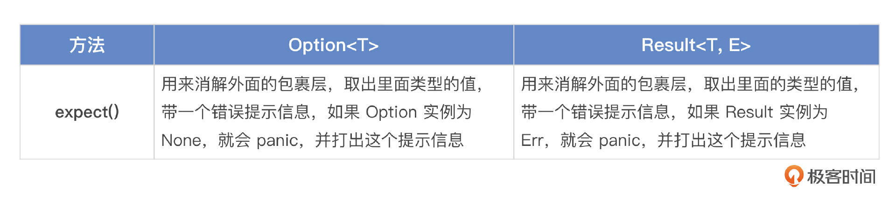
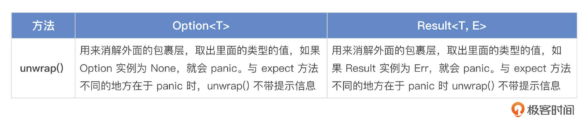
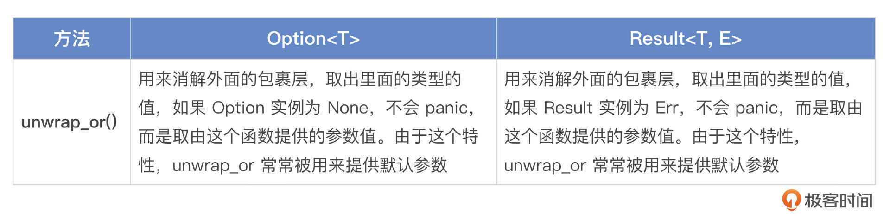
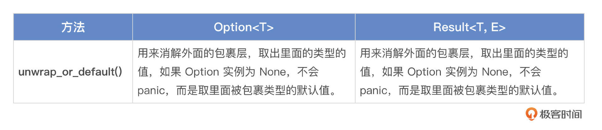
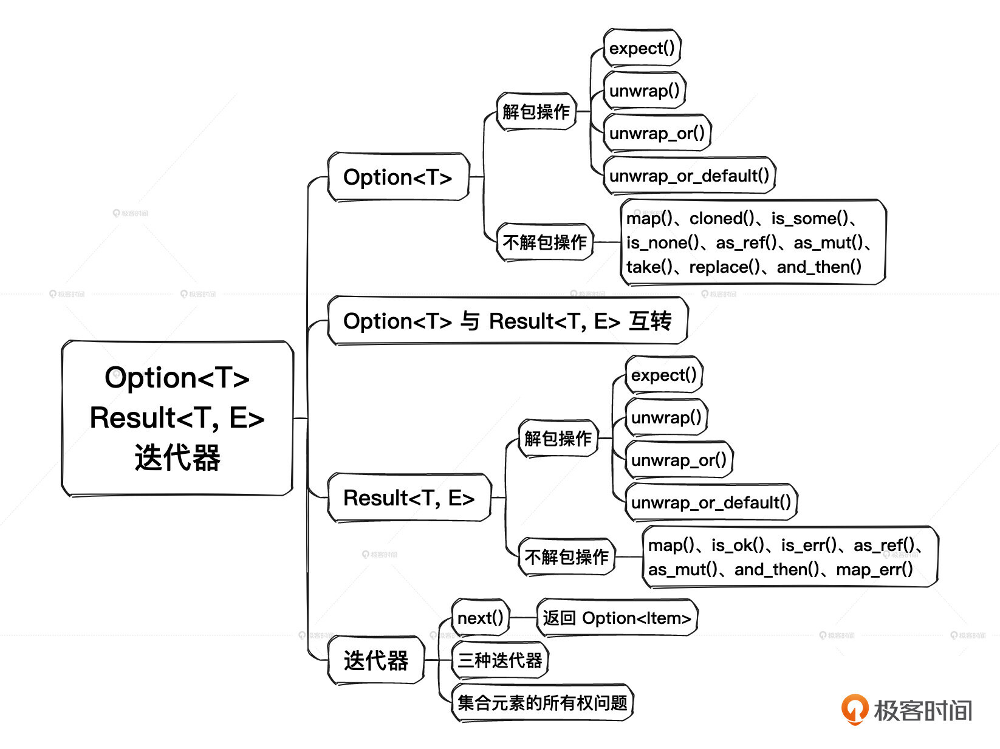

# 08｜Option<T>与Result<T, E>、迭代器
你好，我是Mike，今天我们一起来重点学习在Rust中高频使用的 `Option<T>`、 `Result<T, E>`、迭代器，通过学习这些内容，我们可以继续夯实集合中所有权相关的知识点。

`Option<T>` 和 `Result<T, E>` 并不是Rust的独创设计，在Rust之前，OCaml、Haskell、Scala等已经使用它们很久了。新兴的一批语言Kotlin、Swift 等也和Rust一样引入了这两种类型。而C++17之后也引入了它们。

这其实能说明使用 `Option<T>` 和 `Result<T, E>` 逐渐成了编程语言圈子的一种新共识。而迭代器已经是目前几乎所有主流语言的标配了，所以我们也来看看Rust中的迭代器有什么独到的地方。

如果你习惯了命令式编程或OOP编程，那么这节课我们提到各种操作对你来说可能有点陌生，不过也不用担心，这节课我设计了大量示例，你可以通过熟悉这些示例代码，掌握Rust中地道的编程风格。

## `Option<T>` 与 `Result<T, E>`

`Option<T>` 与 `Result<T, E>` 在Rust代码中随处可见，但是我们到现在才开始正式介绍，就是因为它们实际是带类型参数的枚举类型。

### `Option<T>` 的定义

```plain
pub enum Option<T> {
    None,
    Some(T),
}

```

`Option<T>` 定义为包含两个变体的枚举。一个是不带负载的None，另一个是带一个类型参数作为其负载的Some。 `Option<T>` 的实例在Some和None中取值， 表示这个实例有取空值的可能。

你可以把 `Option<T>` 理解为把空值单独提出来了一个维度。在没有 `Option<T>` 的语言中，空值是分散在其他类型中的。比如空字符串、空数组、数字0、NULL指针等。并且有的语言还把空值区分为空值和未定义的值，如 nil、undefined等。

Rust做了两件事情来解决这个混乱的场面。第一，Rust中所有的变量定义后使用前都必须初始化，所以不存在未定义值这个情况。第二，Rust把空值单独提出来统一定义成 `Option<T>::None`，并在标准库层面上就做好了规范，上层的应用在设计时也应该遵循这个规范。

我们来看一个示例。

```plain
let s = String::from("");
let a: Option<String> = Some(s);

```

变量a是携带空字符串的 `Option<String>` 类型。这里，空字符串""的“空”与None所表示的“无”表达了不同的意义。

如果早点发明Option，Tony Hoare就不会自责了。Tony Hoare在 [一次分享](https://www.infoq.com/presentations/Null-References-The-Billion-Dollar-Mistake-Tony-Hoare/) 中说，他在1965年发明的空引用（Null references）是一个“十亿美元”的错误。

他是这样说的：我把它叫做我的十亿美元错误。那个时候，我正在为一个面向对象语言中的引用设计第一个全面的类型系统。我的目标是让编译器自动施加检查，来确保对引用的所有使用都是绝对安全的。但是我当时无法抵抗空引用的诱惑，就是因为它非常容易实现。这导致了难以计数的错误、漏洞和系统崩溃，在后续40年里这可能已经导致了十亿美元的痛苦和破坏。

Rust通过所有权并借用检查器、 `Option<T>`、 `Result<T, E>` 等一整套机制全面解决了Hoare想解决的问题。

### `Result<T, E>` 的定义

我们先来看一个示例。

```plain
pub enum Result<T, E> {
    Ok(T),
    Err(E),
}

```

`Result<T, E>` 被定义为包含两个变体的枚举。这两个变体各自带一个类型参数作为其负载。 `Ok(T)` 用来表示结果正确， `Err(E)` 用来表示结果有错误。

对比其他语言函数错误返回的约定，C、CPP、Java语言里有时用返回0来表示函数执行正确，有时又不是这样，你需要根据代码所在的上下文环境来判断返回什么值代表正确，返回什么值代表错误。

而Go语言强制对函数返回值做出了约定。

```plain
ret, err := function()
if err != nil {

```

约定要求函数返回两个值，正确的情况下， `ret` 存放返回值， `err` 为 `nil`。如果函数要返回错误值，那么会给 `err` 变量填充具体的内容，于是就出现了经典的满屏 `if err ！= nil` 代码，成了Go语言圈的一个梗。可以看到，Go语言已经朝着把错误信息和正常返回值类型剥离开来的方向走出了一步。

而Rust没有像Go那样设计，一是因为Rust不存在单独的 `nil` 这种空值，二是Rust直接用带类型参数的枚举就可以达到这个目的。

一个枚举实例在一个时刻只能是那个枚举类型的某一个变体。所以一个函数的返回值，不论它是正确的情况还是错误的情况，都能用 `Result<T, E>` 类型统一表达，这样会显得更紧凑。同时还因为 `Result<T, E>` 是一种类型，我们可以在它之上添加很多操作，用起来很方便。下面我用例子来给你讲解。

```plain
let r: Result<String, String> = function();

```

这个例子表示将函数返回值赋给变量r，返回类型是 `Result<String, String>`。在正确的情况下，返回内容为String类型；错误的情况下，被返回的错误类型也是String。你是不是在想：两种可以一样？当然可以，这两个类型参数可以被任意类型代入。

`Result<T, E>` 被用来支撑Rust的错误处理机制，所以非常重要。我们会在第18讲详细讲述基于 `Result<T, E>` 的错误处理。

### 解包

现在我们遇到了一个问题，比如 `Option<u32>::Some(10)` 和 `10u32` 明显已经不是同一种类型了。我们真正想要的值被“包裹”在了另外一种类型里面。这种“包裹”是通过枚举变体来实现的。那我们想获取被包在里面的值应该怎么做呢？

其实有很多办法，我们先讲一类解包操作。这里我列出了三种方法，分别是 `expect()`、 `unwrap()`、 `unwrap_or()`。我给出了它们解包的具体操作和示例代码，你可以看一下有什么不同。



示例：

```plain
// Option
let x = Some("value");
assert_eq!(x.expect("fruits are healthy"), "value");
// Result
let path = std::env::var("IMPORTANT_PATH")
    .expect("env variable `IMPORTANT_PATH` should be set by `wrapper_script.sh`");

```



示例：

```plain
// Option
let x = Some("air");
assert_eq!(x.unwrap(), "air");
// Result
let x: Result<u32, &str> = Ok(2);
assert_eq!(x.unwrap(), 2);

```



示例：

```plain
// Option
assert_eq!(Some("car").unwrap_or("bike"), "car");
assert_eq!(None.unwrap_or("bike"), "bike");

// Result
let default = 2;
let x: Result<u32, &str> = Ok(9);
assert_eq!(x.unwrap_or(default), 9);

let x: Result<u32, &str> = Err("error");
assert_eq!(x.unwrap_or(default), default);

```



示例：

```plain
// Option
let x: Option<u32> = None;
let y: Option<u32> = Some(12);

assert_eq!(x.unwrap_or_default(), 0);
assert_eq!(y.unwrap_or_default(), 12);

// Result
let good_year_from_input = "1909";
let bad_year_from_input = "190blarg";
let good_year = good_year_from_input.parse().unwrap_or_default();
let bad_year = bad_year_from_input.parse().unwrap_or_default();

assert_eq!(1909, good_year);
assert_eq!(0, bad_year);

```

可以看到，解包操作挺费劲的。如果我们总是先用 `Option<T>` 或 `Result<T, E>` 把值包裹起来，用的时候再手动解包，那其实说明没有真正抓住到 `Option<T>` 和 `Result<T, E>` 的设计要义。在Rust中，很多时候我们不需要解包也能操作里面的值，这样就不用做看起来多此一举的解包操作了。下面我们来看一下在不解包的情况下，我们可以怎样做。

### 不解包的情况下如何操作？

不解包的情况下如果想要获取被包在里面的值就需要用到 `Option<T>` 和 `Result<T, E>` 里的一些常用方法。

`Option<T>` 上的常用方法和示例：

- map()：在 Option 是 Some 的情况下，通过 map 中提供的函数或闭包把 Option 里的类型转换成另一种类型。在 Option 是 None 的情况下，保持 None 不变。map() 会消耗原类型，也就是获取所有权。

```plain
let maybe_some_string = Some(String::from("Hello, World!"));
let maybe_some_len = maybe_some_string.map(|s| s.len());
assert_eq!(maybe_some_len, Some(13));

let x: Option<&str> = None;
assert_eq!(x.map(|s| s.len()), None);

```

- cloned()：通过克隆 Option 里面的内容，把 `Option<&T>` 转换成 `Option<T>`。

```plain
let x = 12;
let opt_x = Some(&x);
assert_eq!(opt_x, Some(&12));
let cloned = opt_x.cloned();
assert_eq!(cloned, Some(12));

```

- is\_some()：如果 Option 是 Some 值，返回 true。

```plain
let x: Option<u32> = Some(2);
assert_eq!(x.is_some(), true);

let x: Option<u32> = None;
assert_eq!(x.is_some(), false);

```

- is\_none()：如果 Option 是 None 值，返回 true。

```plain
let x: Option<u32> = Some(2);
assert_eq!(x.is_none(), false);

let x: Option<u32> = None;
assert_eq!(x.is_none(), true);

```

- as\_ref()：把 `Option<T>` 或 `&Option<T>` 转换成 `Option<&T>`。创建一个新 Option，里面的类型是原来类型的引用，就是从 `Option<T>` 到 `Option<&T>`。原来那个 `Option<T>` 实例保持不变。

```plain
let text: Option<String> = Some("Hello, world!".to_string());
let text_length: Option<usize> = text.as_ref().map(|s| s.len());
println!("still can print text: {text:?}");

```

- as\_mut()：把 `Option<T>` 或 `&mut Option<T>` 转换成 `Option<&mut T>`。

```plain
let mut x = Some(2);
match x.as_mut() {
Some(v) => *v = 42,
None => {},
}
assert_eq!(x, Some(42));

```

- take()：把 Option 的值拿出去，在原地留下一个 None 值。这个非常有用。相当于把值拿出来用，但是却没有消解原来那个 Option。

```plain
let mut x = Some(2);
let y = x.take();
assert_eq!(x, None);
assert_eq!(y, Some(2));

let mut x: Option<u32> = None;
let y = x.take();
assert_eq!(x, None);
assert_eq!(y, None);

```

- replace()：在原地替换新值，同时把原来那个值抛出来。

```plain
let mut x = Some(2);
let old = x.replace(5);
assert_eq!(x, Some(5));
assert_eq!(old, Some(2));

let mut x = None;
let old = x.replace(3);
assert_eq!(x, Some(3));
assert_eq!(old, None);

```

- and\_then()：如果 Option 是 None，返回 None；如果 Option 是 Some，就把参数里面提供的函数或闭包应用到被包裹的内容上，并返回运算后的结果。

```plain
fn sq_then_to_string(x: u32) -> Option<String> {
x.checked_mul(x).map(|sq| sq.to_string())
}

assert_eq!(Some(2).and_then(sq_then_to_string), Some(4.to_string()));
assert_eq!(Some(1_000_000).and_then(sq_then_to_string), None); // overflowed!
assert_eq!(None.and_then(sq_then_to_string), None);

```

我们再看 `Result<T, E>` 上的常用方法和示例。

- map()：当 Result 是 Ok 的时候，把 Ok 里的类型通过参数里提供的函数运算并且可以转换成另外一种类型。当 Result 是 Err 的时候，原样返回 Err 和它携带的内容。

```plain
let line = "1\n2\n3\n4\n";

for num in line.lines() {
match num.parse::<i32>().map(|i| i * 2) {
Ok(n) => println!("{n}"),
Err(..) => {}
}
}

```

- is\_ok()：如果 Result 是 Ok，返回 true。

```plain
let x: Result<i32, &str> = Ok(-3);
assert_eq!(x.is_ok(), true);

let x: Result<i32, &str> = Err("Some error message");
assert_eq!(x.is_ok(), false);

```

- is\_err()：如果 Result 是 Err，返回 true。

```plain
let x: Result<i32, &str> = Ok(-3);
assert_eq!(x.is_err(), false);

let x: Result<i32, &str> = Err("Some error message");
assert_eq!(x.is_err(), true);

```

- as\_ref()：创建一个新 Result，里面的两种类型分别是原来两种类型的引用，就是从 `Result<T, E>` 到 `Result<&T, &E>`。原来那个 `Result<T, E>` 实例保持不变。

```plain
let x: Result<u32, &str> = Ok(2);
assert_eq!(x.as_ref(), Ok(&2));

let x: Result<u32, &str> = Err("Error");
assert_eq!(x.as_ref(), Err(&"Error"));

```

- as\_mut()：创建一个新 Result，里面的两种类型分别是原来两种类型的可变引用，就是从 `Result<T, E>` 到 `Result<&mut T, &mut E>`。原来那个 `Result<T, E>` 实例保持不变。

```plain
fn mutate(r: &mut Result<i32, i32>) {
match r.as_mut() {
Ok(v) => *v = 42,
Err(e) => *e = 0,
}
}
let mut x: Result<i32, i32> = Ok(2);
mutate(&mut x);
assert_eq!(x.unwrap(), 42);
let mut x: Result<i32, i32> = Err(13);
mutate(&mut x);
assert_eq!(x.unwrap_err(), 0);

```

- and\_then()：当 Result 是 Ok 时，把这个方法提供的函数或闭包应用到 Ok 携带的内容上面，并返回一个新的 Result。当 Result 是 Err 的时候，这个方法直接传递返回这个 Err 和它的负载。这个方法常常用于一路链式操作，前提是过程里的每一步都需要返回 Result。

```plain
fn sq_then_to_string(x: u32) -> Result<String, &'static str> {
x.checked_mul(x).map(|sq| sq.to_string()).ok_or("overflowed")
}

assert_eq!(Ok(2).and_then(sq_then_to_string), Ok(4.to_string()));
assert_eq!(Ok(1_000_000).and_then(sq_then_to_string), Err("overflowed"));
assert_eq!(Err("not a number").and_then(sq_then_to_string), Err("not a number"));

```

- map\_err()：当 Result 是 Ok 时，传递原样返回。当 Result 是 Err时，对 Err 携带的内容使用这个方法提供的函数或闭包进行运算及类型转换。这个方法常常用于转换 Result 的 Err 的负载的类型，在错误处理流程中大量使用。

```plain
fn stringify(x: u32) -> String { format!("error code: {x}") }
let x: Result<u32, u32> = Ok(2);
assert_eq!(x.map_err(stringify), Ok(2));
let x: Result<u32, u32> = Err(13);
assert_eq!(x.map_err(stringify), Err("error code: 13".to_string()));

```

### `Option<T>` 与 `Result<T, E>` 的相互转换

`Option<T>` 与 `Result<T, E>` 之间是可以互相转换的。转换的时候需要注意， `Result<T, E>` 比 `Option<T>` 多一个类型参数，所以它带的信息比 `Option<T>` 多一份，因此核心要点就是 **要注意信息的添加与抛弃**。

#### `从Option<T>` 到 `Result<T, E>：ok_or()`

`Option<T>` 实例如果是 `Some`，直接把内容重新包在 `Result<T, E>::Ok()` 里。如果是 `None`，使用 `ok_or()` 里提供的参数作为 `Err` 的内容。

```plain
let x = Some("foo");
assert_eq!(x.ok_or(0), Ok("foo"));

let x: Option<&str> = None;
assert_eq!(x.ok_or(0), Err(0));

```

#### 从 `Result<T, E>` 到 `Option<T>：ok()`

如果 `Result<T, E>` 是 `Ok`，就把内容重新包在 `Some` 里。如果 `Result<T, E>` 是 `Err`，就直接换成 `None`，丢弃 `Err` 里的内容，同时原 `Result<T, E>` 实例被消费。

```plain
let x: Result<u32, &str> = Ok(2);
assert_eq!(x.ok(), Some(2));

let x: Result<u32, &str> = Err("Nothing here");
assert_eq!(x.ok(), None);

```

#### 从 `Result<T, E>` 到 `Option<T>：err()`

如果 `Result<T, E>` 是 `Ok`，直接换成 `None`，丢弃 `Ok` 里的内容。如果 `Result<T, E>` 是 `Err`，把内容重新包在 `Some` 里，同时原 `Result<T, E>` 实例被消费。

```plain
let x: Result<u32, &str> = Ok(2);
assert_eq!(x.err(), None);

let x: Result<u32, &str> = Err("Nothing here");
assert_eq!(x.err(), Some("Nothing here"));

```

下面我们讲讲迭代器。

## 迭代器

迭代器其实很简单，就是对一个集合类型进行遍历。比如对 `Vec<T>`、对 `HashMap<K, V>` 等进行遍历。使用迭代器有一些好处，比如：

1. 按需使用，不需要把目标集合一次性全部加载到内存，使用一点加载一点。
2. 惰性计算，可以用来表达无限区间，比如第一讲我们说的range，可以表达1到无限这个集合，这种在其他有些语言中很难表达。
3. 可以安全地访问边界，不需要使用有访问风险的下标操作符。

### `next()` 方法

迭代器上有一个标准方法，叫作 `next()`，这个方法返回 `Option<Item>`，其中 Item 就是组成迭代器的元素。这个方法的字面意思就是 **迭代出下一个元素**。如果这个集合被迭代完成了，那么最后一次执行会返回 `None`。比如下面的例子，在迭代器上调用 `.next()` 返回 `u32` 数字。

```plain
fn main() {
    let a: Vec<u32> = vec![1, 2, 3, 4, 5];
    let mut an_iter = a.into_iter();    // 将Vec<u32>转换为迭代器

    while let Some(i) = an_iter.next() {  // 调用 .next() 方法
        println!("{i}");
    }
}
// 输出
1
2
3
4
5

```

实际上，Rust中不止 `into_iter()` 这一种将集合转换成迭代器的方法。

### `iter()`、 `iter_mut()`、 `into_iter()` 与三种迭代器

Rust中的迭代器根据所有权三态可以分成三种。

1. 获取集合元素不可变引用的迭代器，对应方法为 `iter()`。
2. 获取集合元素可变引用的迭代器，对应方法为 `iter_mut()`。
3. 获取集合元素所有权的迭代器，对应方法为 `into_iter()`。

在Rust标准库约定中，如果你看到一个类型上实现了 `iter()` 方法，那么它会返回获取集合元素不可变引用的迭代器；如果你看到一个类型上实现了 `iter_mut()` 方法，那么它会返回获取集合元素可变引用的迭代器；如果你看到一个类型上实现了 `into_iter()` 方法，那么它会返回获取集合元素所有权的迭代器。调用了这个迭代器后，迭代器的执行会消耗掉原集合。

我们来看这三种不同的迭代器的一个对比。

```plain
fn main() {
    let mut a = [1, 2, 3];    // 一个整数数组

    let mut an_iter = a.iter();  // 转换成第一种迭代器

    assert_eq!(Some(&1), an_iter.next());
    assert_eq!(Some(&2), an_iter.next());
    assert_eq!(Some(&3), an_iter.next());
    assert_eq!(None, an_iter.next());

    let mut an_iter = a.iter_mut();  // 转换成第二种迭代器

    assert_eq!(Some(&mut 1), an_iter.next());
    assert_eq!(Some(&mut 2), an_iter.next());
    assert_eq!(Some(&mut 3), an_iter.next());
    assert_eq!(None, an_iter.next());

    let mut an_iter = a.into_iter();  // 转换成第三种迭代器，并消耗掉a

    assert_eq!(Some(1), an_iter.next());
    assert_eq!(Some(2), an_iter.next());
    assert_eq!(Some(3), an_iter.next());
    assert_eq!(None, an_iter.next());

    println!("{:?}", a);
}

```

你还可以与字符串数组进行对比加深理解。

```plain
fn main() {
    let mut a = ["1".to_string(), "2".to_string(), "3".to_string()];
    let mut an_iter = a.iter();

    assert_eq!(Some(&"1".to_string()), an_iter.next());
    assert_eq!(Some(&"2".to_string()), an_iter.next());
    assert_eq!(Some(&"3".to_string()), an_iter.next());
    assert_eq!(None, an_iter.next());

    let mut an_iter = a.iter_mut();

    assert_eq!(Some(&mut "1".to_string()), an_iter.next());
    assert_eq!(Some(&mut "2".to_string()), an_iter.next());
    assert_eq!(Some(&mut "3".to_string()), an_iter.next());
    assert_eq!(None, an_iter.next());

    let mut an_iter = a.into_iter();

    assert_eq!(Some("1".to_string()), an_iter.next());
    assert_eq!(Some("2".to_string()), an_iter.next());
    assert_eq!(Some("3".to_string()), an_iter.next());
    assert_eq!(None, an_iter.next());

    println!("{:?}", a);    // 请你试试这一行有没有问题？
}

```

对于整数数组 `[1,2,3]` 而言，调用 `into_iter()` 实际会复制一份这个数组，再将复制后的数组转换成迭代器，并消耗掉这个复制后的数组，因此最后的打印语句能把原来那个a打印出来。对于字符串数组 `["1".to_string(), "2".to_string(), "3".to_string()]` 而言，调用 `into_iter()` 会直接消耗掉这个字符串数组，因此最后的打印语句不能把原来那个a打印出来。

为什么会有这个差异呢？你可以从我们 [第 2 讲](https://time.geekbang.org/column/article/718916) 所有权相关知识中找到答案。

### for 语句的真面目

有了迭代器的背景知识后，我们终于要解开Rust语言里面for语句的真面目了。for语句是一种语法糖。语句 `for item in c {}` 会展开成下面这样：

```plain
let mut tmp_iter = c.into_iter();
while let Some(item) = tmp_iter.next() {}

```

也就是说，for语句默认使用获取元素所有权的迭代器模式，自动调用了 `into_iter()` 方法。因此，for语句会消耗集合 c。同时也说明，要将一个类型放在for语句里进行迭代，需要这个类型实现了迭代器 `into_iter()` 方法。

标准库中常见的 Range、Vec、HashMap、BtreeMap等都实现了 `into_iter()` 方法，因此它们可以放在for语句里进行迭代。

for语句作为一种基础语法，它会消耗掉原集合。有时候希望不获取原集合元素所有权，比如只是打印一下，这时只需要获取集合元素的引用 ，应该怎么办呢？

Rust中也考虑到了这种需求，提供了配套的辅助语法。

- 用 `for  in &c {}` 获取元素的不可变引用，相当于调用 `c.iter()`。
- 用 `for  in &mut c {}` 获取元素的可变引用，相当于调用 `c.iter_mut()`。

用这两种形式就不会消耗原集合所有权。

我们来看示例。

```plain
fn main() {
    let mut a = ["1".to_string(), "2".to_string(), "3".to_string()];

    for item in &a {
        println!("{}", item);
    }

    for item in &mut a {
        println!("{}", item);
    }

    for item in a {    // 请想一想为什么要把这一句放在后面
        println!("{}", item);
    }

    // println!("{:?}", a);  // 你可以试试把这一句打开
}
// 输出
1
2
3
1
2
3
1
2
3

```

因为 `into_iter()` 会消耗集合所有权，因此在上面示例中我们把它放在最后去展示。

### 获取集合类型中元素的所有权

我们来看一个简单的例子，一般来说，我们想要获取Vec里的一个元素，只需要下标操作就可以了。

```plain
fn main() {
    let s1 = String::from("aaa");
    let s2 = String::from("bbb");
    let s3 = String::from("ccc");
    let s4 = String::from("ddd");

    let v = vec![s1, s2, s3, s4];
    let a = v[0];    // 这里，我们想访问 s1 的内容
}

```

这段代码稀松平常，在Rust中却没办法编译通过。

```
error[E0507]: cannot move out of index of `Vec<String>`
  --> src/main.rs:11:13
   |
11 |     let a = v[0];
   |             ^^^^ move occurs because value has type `String`, which does not implement the `Copy` trait
   |
help: consider borrowing here
   |
11 |     let a = &v[0];
   |             +

```

提示不能从 `Vec<String>` 中用下标操作符移出元素。我们改一下代码。

```
fn main() {
    let s1 = String::from("aaa");
    let s2 = String::from("bbb");
    let s3 = String::from("ccc");
    let s4 = String::from("ddd");

    let v = vec![s1, s2, s3, s4];
    let a = &v[0];  // 明确a只获得v中第一个元素的引用
}

```

明确a只获得v中第一个元素的引用，这下可以编译通过了。这里，你可以顺便思考一下，对于 `Vec<u32>` 这种类型的动态数组，let a = v\[0\]; 这种代码可以编译通过吗？你可以立即动手测试一下。

在上面示例中，你可能为了从集合中获得 s1 的所有权，而不得不使用 `let a = v[0].clone()`。而根据我们这节课讲的迭代器知识，使用 `into_iter()` 就可以拿到并操作上述动态数组v中元素的所有权。

```plain
fn main() {
    let s1 = String::from("aaa");
    let s2 = String::from("bbb");
    let s3 = String::from("ccc");
    let s4 = String::from("ddd");

    let v = vec![s1, s2, s3, s4];
    for s in v {      // 这里，s拿到了集合元素的所有权
        println!("{}", s);
    }
}

```

这也体现了Rust对权限有相当细致的管理。对于下标索引这种不安全的操作，禁止获得集合元素所有权；对于迭代器这种安全的操作，允许它获得集合元素所有权。

## 小结

我们这节课详细探讨了Rust中的 `Option<T>` 和 `Result<T, E>` 的定义及常见操作。学习了如何以解包和不解包方式使用它们。内容比较细，风格可能也是你不太熟悉的。不过现在你只需要先了解这种代码风格，以后的项目实践中再慢慢掌握它们。

我们还介绍了迭代器的概念。迭代器的 `next()` 方法会返回一个 `Option<Item>` 类型。在所有权三态理论的指导下Rust中的迭代器也划分成了三种，可以通过不同的方法获取到集合元素的不可变引用、可变引用和所有权，这是Rust和其他语言的迭代器很不一样的地方。每种迭代器都有各自适用的场景，正确使用迭代器能提高代码的可靠性和可阅读性。



学习完这节课的内容之后，你应该能更深刻地感受到所有权概念在Rust语言中的支配地位。

## 思考题

你可以用同样的思路去研究一下，看看如何拿到 HashMap 中值的所有权。

[https://doc.rust-lang.org/std/collections/struct.HashMap.html](https://doc.rust-lang.org/std/collections/struct.HashMap.html)

欢迎你把你的成果展示在评论区，也欢迎你把这节课的内容分享给需要的朋友，邀他一起学习，我们下节课再见！