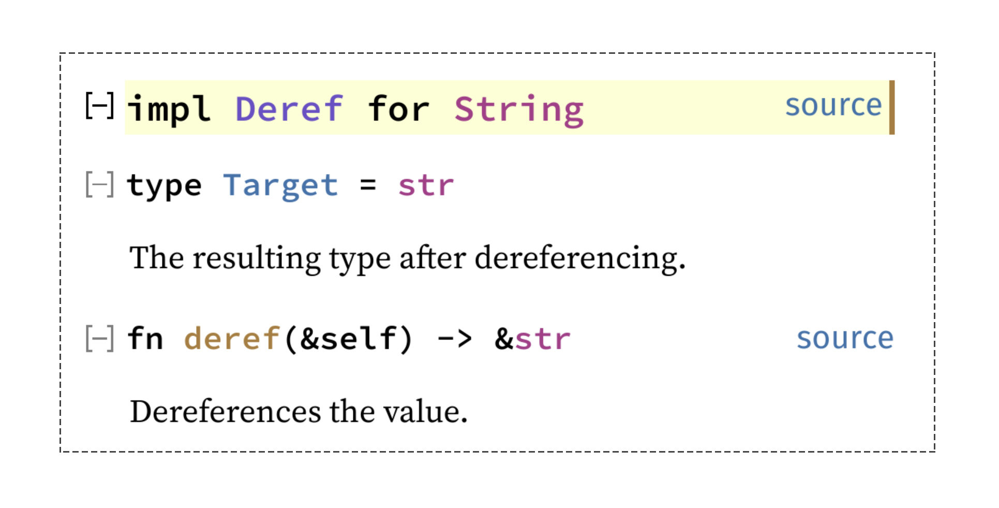
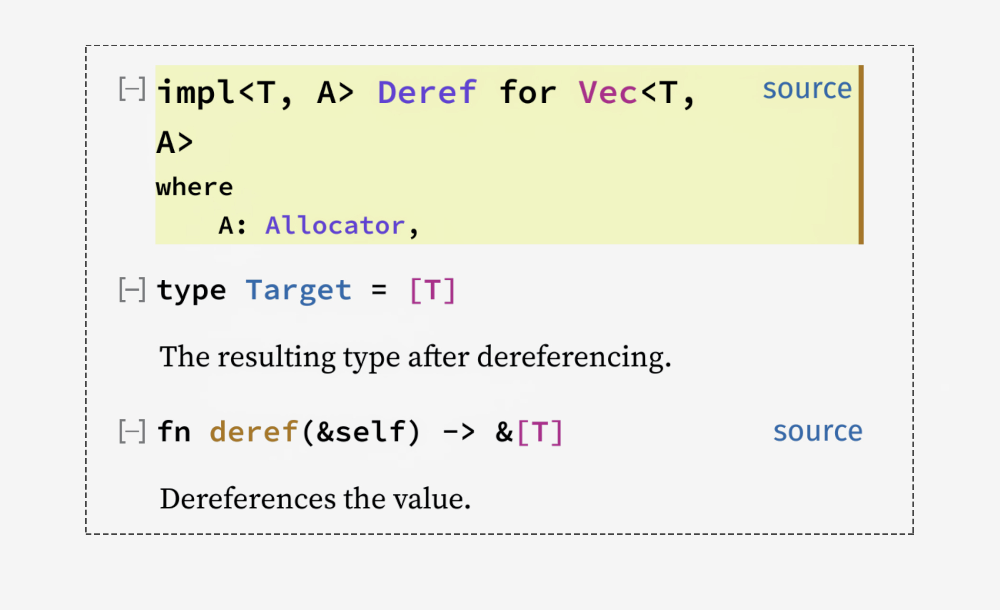
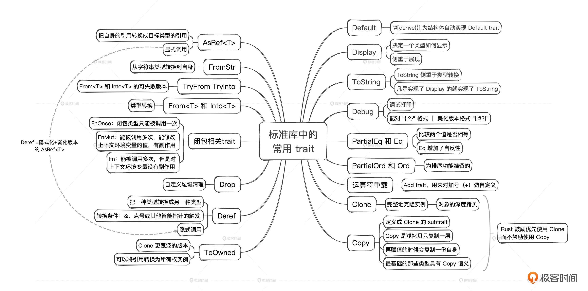

# 11｜常见trait解析：标准库中的常见trait应该怎么用？
你好，我是Mike，今天我们一起来学习Rust中的常见trait。

前面两节课我们已经讲过trait在Rust中的重要性了，这节课就是trait在Rust标准库中的应用。Rust标准库中包含大量的trait定义，甚至Rust自身的某些语言特性就是在这些trait的帮助下实现的。这些trait和标准库里的各种类型一起，构成了整个Rust生态的根基，只有了解它们才算真正了解Rust。

注：这节课大量代码来自 [Tour of Rust’s Standard Library Traits](https://github.com/pretzelhammer/rust-blog/blob/master/posts/tour-of-rusts-standard-library-traits.md)，我加了必要的注解和分析。

学习完这节课的内容，你会对很多问题都豁然开朗。下面就让我们来学习标准库里一些比较常用的trait。

## 标准库中的常用trait

### Default

我们来看Default trait的定义以及对Default trait的实现和使用。

```plain
trait Default {
    fn default() -> Self;
}

```

```plain
struct Color(u8, u8, u8);
impl Default for Color {
    // 默认颜色是黑色 (0, 0, 0)
    fn default() -> Self {
        Color(0, 0, 0)
    }
}

fn main() {
    let color = Color::default();
    // 或
    let color: Color = Default::default();
}

```

还有其他一些地方用到了Default，比如 `Option<T>` 的 `unwrap_or_default()`，在类型参数上调用 `default()` 函数。

```plain
fn paint(color: Option<Color>) {
    // 如果没有颜色参数传进来，就用默认颜色
    let color = color.unwrap_or_default();
    // ...
}

// 由于default()是在trait中定义的关联函数，因此可方便的由类型参数调用
fn guarantee_length<T: Default>(mut vec: Vec<T>, min_len: usize) -> Vec<T> {
    for _ in 0..min_len.saturating_sub(vec.len()) {
        vec.push(T::default());  // 这里用了 T::default() 这种形式
    }
    vec
}

```

前面讲过，如果是struct，还可以使用部分更新语法，这个时候其实是Default在发挥作用。

```plain
#[derive(Default)]
struct Color {
    r: u8,
    g: u8,
    b: u8,
}
impl Color {
    fn new(r: u8, g: u8, b: u8) -> Self {
        Color {
            r,
            g,
            b,
        }
    }
}
impl Color {
    fn red(r: u8) -> Self {
        Color {
            r,
            ..Color::default()    // 注意这一句
        }
    }
    fn green(g: u8) -> Self {
        Color {
            g,
            ..Color::default()    // 注意这一句
        }
    }
    fn blue(b: u8) -> Self {
        Color {
            b,
            ..Color::default()    // 注意这一句
        }
    }
}

```

Rust标准库实际给我们提供了一个标注，也就是 `#[derive()]` 里面放 Default，方便我们为结构体自动实现Default trait。

```plain
#[derive(Default)]
struct Color {
    r: u8,
    g: u8,
    b: u8
}

#[derive(Default)]
struct Color2(u8, u8, u8);

```

注意这里的细节，我们用 `#[derive()]` 在两个结构体上作了标注，这里面出现的这个 Default 不是trait，它是一个同名的派生宏（我们后面会讲到）。这种派生宏标注帮助我们实现了 Default trait。Rustc能正确区分Default到底是宏还是trait，因为它们出现的位置不一样。

为什么可以自动实现Default trait呢？因为Color里面的类型是基础类型u8，而u8是实现了Default trait的，默认值为 0。

### Display

我们看Display trait的定义。

```plain
trait Display {
    fn fmt(&self, f: &mut Formatter<'_>) -> Result;
}

```

Display trait对应于格式化符号 `"{}"`，比如 `println!("{}", s)`，用于决定一个类型如何显示，其实就是把类型转换成字符串表达。Display需要我们自己手动去实现。

示例：

```plain
use std::fmt;
#[derive(Default)]
struct Point {
    x: i32,
    y: i32,
}
// 为Point实现 Display
impl fmt::Display for Point {
    // 实现唯一的fmt方法，这里定义用户自定义的格式
    fn fmt(&self, f: &mut fmt::Formatter<'_>) -> fmt::Result {
        write!(f, "({}, {})", self.x, self.y)  // write!宏向stdout写入
    }
}

fn main() {
    println!("origin: {}", Point::default());
    // 打印出 "origin: (0, 0)"
    // 在 format! 中用 "{}" 将类型表示/转换为 String
    let stringified = format!("{}", Point::default());
    assert_eq!("(0, 0)", stringified); // ✅
}

```

### ToString

我们来看ToString trait 定义。

```plain
trait ToString {
    fn to_string(&self) -> String;
}

```

它提供了一个 to\_string() 方法，方便把各种类型实例转换成字符串。但实际上不需要自己去给类型实现ToString trait，因为标准库已经给我们做了总实现（ [第 9 讲](https://time.geekbang.org/column/article/723496) 提到过），像下面这个样子。

```plain
impl<T: Display> ToString for T

```

也就是说，凡是实现了Display的就实现了ToString。这两个功能本质是一样的，就是把类型转换成字符串表达。只不过Display侧重于展现，ToString侧重于类型转换。下面这个示例证明这两者是等价的。

```plain
#[test] // ✅
fn display_point() {
    let origin = Point::default();
    assert_eq!(format!("{}", origin), "(0, 0)");
}
#[test] // ✅
fn point_to_string() {
    let origin = Point::default();
    assert_eq!(origin.to_string(), "(0, 0)");
}
#[test] // ✅
fn display_equals_to_string() {
    let origin = Point::default();
    assert_eq!(format!("{}", origin), origin.to_string());
}

```

所以把一个符合条件的类型实例转换成字符串有两种常用方法。

```plain
let s = format!("{}", obj);
// 或
let s = obj.to_string();

```

### Debug

Debug 跟 Display 很像，也主要是用于调试打印。打印就需要指定格式，区别在于Debug trait 是配对 `"{:?}"` 格式的，Display是配对 `"{}"` 的。它们本身都是将类型表示或转换成 String 类型。一般来说，Debug的排版信息比Display要多一点，因为它是给程序员调试用的，不是给最终用户看的。Debug还配套了一个美化版本格式 `"{:#?}"`，用来把类型打印得更具结构化一些，适合调试的时候查看，比如json结构会展开打印。

Rust标准库提供了Debug宏。一般来说，我们都是以这个宏为目标类型自动生成Debug trait，而不是由我们自己手动去实现，这一点和Display正好相对，std标准库里并没有提供一个 Display 宏，来帮助我们自动实现 Display trait，需要我们手动实现它。

再提醒你一下，Rust的类型能够自动被derive的条件是，它里面的每个元素都能被derive，比如下面这个结构体里的每个字段，都是i32类型的，这种基础类型在标准库里已经被实现过Debug trait了，所以可以直接在Point上做derive为Point类型实现Debug trait。这个原则适用于所有trait，后面不再赘述。

```plain
#[derive(Debug)]
struct Point {
    x: i32,
    y: i32,
}

```

### PartialEq和Eq

如果一个类型上实现了PartialEq，那么它就能比较两个值是否相等。这种可比较性满足数学上的对称性和传递性，我们通过两个例子具体来看。

- 对称性（symmetry）： `a == b` 导出 `b == a`。
- 传递性（transitivity）： `a == b && b == c` 导出 `a == c`。

而Eq定义为PartialEq的subtrait，在PartialEq的对称性和传递性的基础上，又添加了自反性，也就是对所有 `a` 都有 `a == a`。最典型的就是Rust中的浮点数只实现了PartialEq，没实现Eq，因为根据IEEE的规范，浮点数中存在一个NaN，它不等于自己，也就是 NaN ≠ NaN。而对整数来说，PartialEq和Eq都实现了。

如果一个类型，它的所有字段都实现了PartialEq，那么使用标准库中定义的PartialEq派生宏，我们可以为目标类型自动实现可比较能力，用==号，或者用 `assert_eq!()` 做判断。

```plain
#[derive(PartialEq, Debug)]    // 注意这一句
struct Point {
    x: i32,
    y: i32,
}

fn example_assert(p1: Point, p2: Point) {
    assert_eq!(p1, p2);        // 比较
}

fn example_compare_collections<T: PartialEq>(vec1: Vec<T>, vec2: Vec<T>) {
    if vec1 == vec2 {    // 比较
        // some code
    } else {
        // other code
    }
}

```

### PartialOrd和Ord

PartialOrd和PartialEq差不多，PartialEq只判断相等或不相等，PartialOrd在这个基础上进一步判断是小于、小于等于、大于还是大于等于。可以看到，它就是为排序功能准备的。

PartialOrd被定义为 PartialEq的subtrait。它们在类型上可以用过程宏一起derive实现。

```plain
#[derive(PartialEq, PartialOrd)]
struct Point {
    x: i32,
    y: i32,
}

#[derive(PartialEq, PartialOrd)]
enum Stoplight {
    Red,
    Yellow,
    Green,
}

```

类似的，Ord 定义为 Eq + PartialOrd 的 subtrait。如果我们为一个类型实现了 Ord，那么对那个类型的所有值，我们可以做出一个严格的总排序，比如u8，我们可以严格地从0排到255，形成一个确定的从小到大的序列。

同样的，浮点数实现了 PartialOrd，但是没实现 Ord。

由于Ord严格的顺序性，如果一个类型实现了Ord，那么这个类型可以被用作BTreeMap或BTreeSet的key。

> BTreeMap、BTreeSet：相对于HashMap和HashSet，是两种可排序结构。

示例：

```plain
use std::collections::BTreeSet;

#[derive(Ord, PartialOrd, PartialEq, Eq)]  // 注意这一句，4个都写上
struct Point {
    x: i32,
    y: i32,
}

fn example_btreeset() {
    let mut points = BTreeSet::new();
    points.insert(Point { x: 0, y: 0 }); // 作key值插入
}

// 实现了Ord trait的类型的集合，可调用 .sort() 排序方法
fn example_sort<T: Ord>(mut sortable: Vec<T>) -> Vec<T> {
    sortable.sort();
    sortable
}

```

### 运算符重载

Rust提供了一个Add trait，用来对加号（+）做自定义，也就是运算符重载。

你可以看一下Add的定义，它带一个类型参数Rhs，这里的类型参数可以是任意名字，默认类型是Self，一个关联类型Output，一个方法add()。

```plain
trait Add<Rhs = Self> {
    type Output;
    fn add(self, rhs: Rhs) -> Self::Output;
}

```

像下面我给出的这个示例一样去使用它就可以，非常简单。

```plain
struct Point {
    x: i32,
    y: i32,
}

// 为 Point 类型实现 Add trait，这样两个Point实例就可以直接相加
impl Add for Point {
    type Output = Point;
    fn add(self, rhs: Point) -> Point {
        Point {
            x: self.x + rhs.x,
            y: self.y + rhs.y,
        }
    }
}

fn main() {
    let p1 = Point { x: 1, y: 2 };
    let p2 = Point { x: 3, y: 4 };
    let p3 = p1 + p2; // 这里直接用+号作用在两个Point实例上
    assert_eq!(p3.x, p1.x + p2.x); // ✅
    assert_eq!(p3.y, p1.y + p2.y); // ✅
}

```

实际上，Rust标准库提供了一套完整的与运算符对应的trait，你在 [这里](https://doc.rust-lang.org/std/ops/index.html) 可以找到可重载的运算符。你可以按类似的方式练习如何自定义各种运算符。

### Clone

定义：

```plain
trait Clone {
    fn clone(&self) -> Self;
}

```

这个trait给目标类型提供了clone()方法用来完整地克隆实例。使用标准库里面提供的Clone派生宏可以方便地为目标类型实现Clone trait。

比如：

```plain
#[derive(Clone)]
struct Point {
    x: u32,
    y: u32,
}

```

因为每一个字段（u32类型）都实现了Clone，所以通过derive，自动为Point类型实现了Clone trait。实现后，Point的实例 point 使用 point.clone() 就可以把自己克隆一份了。

通过方法的签名，可以看到方法使用的是实例的不可变引用。

```plain
    fn clone(&self) -> Self;

```

这里面有两种情况。

- 第一种是已经拿到实例的所有权，clone一份生成一个新的所有权并被局部变量所持有。
- 第二种是只拿到一个实例的引用，想拿到它的所有权，如果这个类型实现了Clone trait，那么就可以clone一份拿到这个所有权。

clone() 是对象的深度拷贝，可能会有比较大的额外负载，但是就大多数情况来说其实还好。不要担心在Rust中使用clone()，先把程序功能跑通最重要。Rust的代码，性能一般都不会太差，毕竟起点很高。

注：浅拷贝是按值拷贝一块连续的内存，只复制一层，不会去深究这个值里面是否有到其它内存资源的引用。与之相对，深拷贝就会把这些引用对象递归全部拷贝。

在Rust生态的代码中，我们经常看到clone()。为什么呢？因为它把对实例引用的持有转换成了对对象所有权的持有。一旦我们拿到了所有权，很多代码写起来就比较轻松了。

### Copy

接下来，我们看Copy trait的定义。

```plain
trait Copy: Clone {}

```

定义为Clone的subtrait，并且不包含任何内容，仅仅是一个标记（marker）。有趣的是，我们不能自己为自定义类型实现这个trait。比如下面这个示例就是不行的。

```plain
impl Copy for Point {} // 这是不行的

```

但是Rust标准库提供了Copy过程宏，可以让我们自动为目标类型实现Copy trait。

```plain
#[derive(Copy, Clone)]
struct SomeType;

```

因为Copy是Clone的subtrait。所以理所当然要把Clone trait也一起实现，我们在这里一次性derive过来。

Copy和Clone的区别是，Copy是浅拷贝只复制一层，不会去深究这个值里面是否有到其他内存资源的引用，比如一个字符串的动态数组。

```plain
struct Atype {
    num: u32,
    a_vec: Vec<u32>,
}
fn main() {
    let a = Atype {
        num: 100,
        a_vec: vec![10, 20, 30],
    };
    let b = a;  // 这里发生了移动
}

```

代码第10行的操作是将a的所有权移动给b（ [第 2 讲](https://time.geekbang.org/column/article/718916) 的内容）。

如果我们给这个结构体实现了Clone trait的话，我们可以调用.clone() 来产生一份新的所有权。

```plain
#[derive(Clone, Debug)]
struct Atype {
    num: u32,
    a_vec: Vec<u32>,    // 动态数组资源在堆内存中
}
fn main() {
    let a = Atype {
        num: 100,
        a_vec: vec![10, 20, 30],
    };
    let mut b = a.clone();  // 克隆，也将堆内存中的Vec资源部分克隆了一份
    b.num = 200;            // 更改b的值
    b.a_vec[0] = 11;
    b.a_vec[1] = 21;
    b.a_vec[2] = 31;

    println!("{a:?}");  // 对比两份值
    println!("{b:?}");
}
// 输出
Atype { num: 100, a_vec: [10, 20, 30] }
Atype { num: 200, a_vec: [11, 21, 31] }

```

通过例子可以看到，clone()一份新的所有权出来，b改动的值不影响a的值。

而一旦你想在 Atype 上实现 Copy trait的话，就会报错。

```plain
error[E0204]: the trait `Copy` cannot be implemented for this type
 --> src/main.rs:1:10
  |
1 | #[derive(Copy, Clone, Debug)]
  |          ^^^^
...
4 |     a_vec: Vec<u32>,    // 动态数组资源在堆内存中
  |     --------------- this field does not implement `Copy`

```

它说动态数组字段 a\_vec 没有实现Copy trait，所以你不能对Atype实现Copy trait。原因也好理解，Vec是一种所有权结构，如果你在它上面实现了Copy，那再赋值的时候，就会出现对同一份资源的两个指向，冲突了！

一旦一个类型实现了Copy，它就会具备一个特别重要的特性： **再赋值的时候会复制一份自身**。那么就相当于新创建一份所有权。我们来看下面这个值全在栈上的类型。

```plain
#[derive(Clone)]
struct Point {
    x: u32,
    y: u32,
}

fn main() {
  let a = Point {x: 10, y: 10};
  let b = a; // 这里发生了所有权move，a在后续不能使用了
}

```

我们对 Point 实现Clone和Copy。

```plain
#[derive(Copy, Clone)]
struct Point {
    x: u32,
    y: u32,
}

fn main() {
  let a = Point {x: 10, y: 10};
  let b = a; // 这里发生了复制，a在后续可以继续使用
  let c = a; // 这里又复制了一份，这下有3份了
}

```

仔细体会一下，现在你知道我们在第2讲里面讲到的复制与移动的语义区别根源在哪里了吧！

你可能会问，Point结构体里面的字段其实全都是固定尺寸的，并且u32是copy语义的，按理说Point也是编译时已知固定尺寸的，为什么它默认不实现copy语义呢？

这其实是Rust设计者故意这么做的。因为Copy trait其实关联到赋值语法，仅仅从这个语法（let a = b;），很难一下子看出来这到底是copy还是move，它是一种 **隐式行为**。

而在所有权的第一设计原则框架下，Rust默认选择了move语义。所以方便起见，Rust设计者就只让最基础的那些类型，比如u32、bool等具有copy语义。而用户自定义的类型，一概默认move语义。如果用户想给自定义类型赋予copy语义内涵，那么他需要显式地在那个类型上添加Copy的derive。

我们再回过头来看Clone，一个类型实现了Clone后，需要显式地调用 .clone() 方法才会导致对象克隆，这就在代码里面留下了足迹。而如果一个类型实现了Copy，那么它在用 = 号对实例再赋值的时候就发生了复制，这里缺少了附加的足迹。这就为潜在的Bug以及性能的降低埋下了隐患，并且由于没有附加足迹，导致后面再回头来审查的时候非常困难。

试想，如果是.clone()，那么我们只需要用代码搜索工具搜索代码哪些地方出现了clone函数就可以了。这个设计，在 `Option<T>` 和 `Result<T, E>` 的 `unwrap()` 系列函数上也有体现。

**显式地留下足迹，是Rust语言设计重要的哲学之一**。

至于Copy为什么要定义成Clone的subtrait，而不是反过来，也是跟这个设计哲学相关。可以这么说，一般情况下，Rust鼓励优先使用Clone而不鼓励使用Copy，于是让开发者在derive Copy的时候，也必须derive Clone，相当于多打了几个字符，多付出了一点代价。也许开发者这时会想，可能Clone就能满足我的要求了，能在结构体上的derive宏里面少打几个字符，也是一件好事儿。

还有一个原因其实是，Clone和Copy在本质上其实是一样的，都是内存的按位复制，只是复制的规则有一些区别。

### ToOwned

ToOwned相当于是Clone更宽泛的版本。ToOwned给类型提供了一个 `to_owned()` 方法，可以将引用转换为所有权实例。

常见的比如：

```plain
let a: &str = "123456";
let s: String = a.to_owned();

```

通过查看标准库和第三方库接口文档，你可以确定有没实现这个trait。

### Deref

Deref trait可以用来把一种类型转换成另一种类型，但是要在引用符号&、点号操作符 . 或其他智能指针的触发下才会产生转换。比如标准库里最常见的 &String 可以自动转换到 &str（请回顾 [第 4 讲](https://time.geekbang.org/column/article/720426)），就是因为String类型实现了Deref trait。



还有 `&Vec<T>` 可以自动转换为 `&[T]`，也是因为 `Vec[T]` 实现了Deref。



到这里，Rust里很多魔法就开始揭开神秘面纱了。有了这些trait以及在各种类型上的实现，Rust让我们可以写出顺应直觉、赏心悦目、功能强大的代码。

你还可以在标准库文档中搜索Deref，查阅所有实现了Deref trait的 [implementors](https://doc.rust-lang.org/std/ops/trait.Deref.html#implementors)。

这里需要提醒你一下，有人尝试 [用 Deref 机制去实现 OOP 继承](https://github.com/pretzelhammer/rust-blog/blob/master/posts/tour-of-rusts-standard-library-traits.md#deref--derefmut)，但是那是徒劳和不完整的，有兴趣的话你可以看一下我给出的链接。

### Drop

Drop trait用于给类型做自定义垃圾清理（回收）。

```plain
trait Drop {
    fn drop(&mut self);
}

```

实现了这个trait的类型的实例在走出作用域的时候，触发调用drop()方法，这个调用发生在这个实例被销毁之前。你可以看一下它的使用方式。

```plain
struct A;
impl Drop for A {
  fn drop(&mut self){
    // 可以尝试在这里打印点东西看看什么时候调用
  }
}

```

一般来说，我们不需要为自己的类型实现这个trait，除非遇到特殊情况，比如我们要调用外部的C库函数，然后在C那边分配了资源，由C库里的函数负责释放，这个时候我们就要在Rust的包装类型（对C库中类型的包装）上实现Drop，并调用那个C库中释放资源的函数。课程最后两讲FFI编程中，你会看到Drop的具体使用。

### 闭包相关trait

标准库中有3个trait与闭包相关，分别是FnOnce、FnMut、Fn。你可以看一下它们的定义。

```plain
trait FnOnce<Args> {
    type Output;
    fn call_once(self, args: Args) -> Self::Output;
}
trait FnMut<Args>: FnOnce<Args> {
    fn call_mut(&mut self, args: Args) -> Self::Output;
}
trait Fn<Args>: FnMut<Args> {
    fn call(&self, args: Args) -> Self::Output;
}

```

前面我们也讲过，闭包就是一种能捕获上下文环境变量的函数。

```plain
let range = 0..10;
let get_range_count = || range.count();

```

代码里的这个 get\_range\_count 就是闭包，range是被这个闭包捕获的环境变量。

虽然说它是一种函数，但是不通过fn进行定义。在Rust中，并不把这个闭包的类型处理成fn这种函数指针类型，而是有单独的类型定义。

那么，具体是什么类型呢？其实我们也不知道。闭包的类型是由Rust编译器在编译时确定的，并且在确定类型的时候要根据这个闭包捕获上下文环境变量时的行为来确定。

总的来说有三种行为（⚠️ 所有权三态再现）。

1. 获取了上下文环境变量的所有权，对应 FnOnce。
2. 只获取了上下文环境变量的&mut引用，对应 FnMut。
3. 只获取了上下文环境变量的&引用，对应 Fn。

根据这三种不同的行为，Rust编译器在编译时把闭包生成为这三种不同类型中的一种。这三种不同类型的闭包，具体类型形式我们不知道，Rust没有暴露给我们。但是Rust给我们暴露了FnOnce、FnMut、Fn这3个trait，就刚好对应于那三种类型。结合我们前面讲到的trait object，就能在我们的代码中对那些类型进行描述了。

FnOnce代表的闭包类型只能被调用一次，比如；

```plain
fn main() {
    let range = 0..10;
    let get_range_count = || range.count();
    assert_eq!(get_range_count(), 10); // ✅
    get_range_count(); // ❌
}

```

再调用就报错了。

FnMut代表的闭包类型能被调用多次，并且能修改上下文环境变量的值，不过有一些副作用，在某些情况下可能会导致错误或者不可预测的行为。比如：

```plain
fn main() {
    let nums = vec![0, 4, 2, 8, 10, 7, 15, 18, 13];
    let mut min = i32::MIN;
    let ascending = nums.into_iter().filter(|&n| {
        if n <= min {
            false
        } else {
            min = n;  // 这里修改了环境变量min的值
            true
        }
    }).collect::<Vec<_>>();
    assert_eq!(vec![0, 4, 8, 10, 15, 18], ascending); // ✅
}

```

Fn 代表的这类闭包能被调用多次，但是对上下文环境变量没有副作用。比如：

```plain
fn main() {
    let nums = vec![0, 4, 2, 8, 10, 7, 15, 18, 13];
    let min = 9;
    let greater_than_9 = nums.into_iter().filter(|&n| n > min).collect::<Vec<_>>();
    assert_eq!(vec![10, 15, 18, 13], greater_than_9); // ✅
}

```

另外，fn这种函数指针，用在不需要捕获上下文环境变量的场景，比如：

```plain
fn add_one(x: i32) -> i32 {
    x + 1
}

fn main() {
    let mut fn_ptr: fn(i32) -> i32 = add_one;  // 注意这里的类型定义
    assert_eq!(fn_ptr(1), 2); // ✅

    // 如果一个闭包没有捕捉环境变量，它可以通过类型转换转成 fn 类型
    fn_ptr = |x| x + 1; // same as add_one
    assert_eq!(fn_ptr(1), 2); // ✅
}

```

### `From<T>` 和 `Into<T>`

接下来，我们看 Rust 标准库中的两个关联的 trait `From<T>` 和 `Into<T>`，它们用于类型转换。 `From<T>` 可以把类型T转为自己，而 `Into<T>` 可以把自己转为类型T。

```plain
trait From<T> {
    fn from(T) -> Self;
}
trait Into<T> {
    fn into(self) -> T;
}

```

可以看到它们是互逆的trait。实际上，Rust只允许我们实现 `From<T>`，因为实现了From后，自动就实现了Into，请看标准库里的这个实现。

```plain
impl<T, U> Into<U> for T
where
    U: From<T>,
{
    fn into(self) -> U {
        U::from(self)
    }
}

```

对一个类型实现了From后，就可以像下面这样约束和使用。

```plain
fn function<T>(t: T)
where
    // 下面这两种约束是等价的
    T: From<i32>,
    i32: Into<T>
{
    // 等价
    let example: T = T::from(0);
    let example: T = 0.into();
}

```

我们来举一个具体的例子。

```plain
struct Point {
    x: i32,
    y: i32,
}
impl From<(i32, i32)> for Point {    // 实现从(i32, i32)到Point的转换
    fn from((x, y): (i32, i32)) -> Self {
        Point { x, y }
    }
}
impl From<[i32; 2]> for Point {      // 实现从[i32; 2]到Point的转换
    fn from([x, y]: [i32; 2]) -> Self {
        Point { x, y }
    }
}
fn example() {
    // 使用from()转换不同类型
    let origin = Point::from((0, 0));
    let origin = Point::from([0, 0]);
    // 使用into()转换不同类型
    let origin: Point = (0, 0).into();
    let origin: Point = [0, 0].into();
}

```

其实From是单向的。对于两个类型要互相转的话，是需要互相实现From的。

本身， `From<T>` 和 `Into<T>` 都隐含了所有权， `From<T>` 的Self是具有所有权的， `Into<T>` 的T也是具有所有权的。 `Into<T>` 有个常用的比 `From<T>` 更自然的场景是，如果你已经拿到了一个变量，想把它变成具有所有权的值，Into写起来更顺手。因为 `into()` 是方法，而 `from()` 是关联函数。

比如：

```plain
struct Person {
    name: String,
}
impl Person {
    // 这个方法只接收String参数
    fn new1(name: String) -> Person {
        Person { name }
    }
    // 这个方法可接收
    // - String
    // - &String
    // - &str
    // - Box<str>
    // - char
    // 这几种参数，因为它们都实现了Into<String>
    fn new2<N: Into<String>>(name: N) -> Person {
        Person { name: name.into() }  // 调用into()，写起来很简洁
    }
}

```

### TryFrom TryInto

`TryFrom<T>` 和 `TryInto<T>` 是 `From<T>` 和 `Into<T>` 的可失败版本。如果你认为转换可能会出现失败的情况，就选择这两个trait来实现。

```plain
trait TryFrom<T> {
    type Error;
    fn try_from(value: T) -> Result<Self, Self::Error>;
}

trait TryInto<T> {
    type Error;
    fn try_into(self) -> Result<T, Self::Error>;
}

```

可以看到，调用 `try_from()` 和 `try_into()` 后返回的是Result，你需要对Result进行处理。

### FromStr

从字符串类型转换到自身。

```plain
trait FromStr {
    type Err;
    fn from_str(s: &str) -> Result<Self, Self::Err>;
}

```

其实我们前面已经遇到过这个trait，它就是字符串的 `parse()` 方法背后的trait。

```plain
use std::str::FromStr;

fn example<T: FromStr>(s: &str) {
    // 下面4种表达等价
    let t: Result<T, _> = FromStr::from_str(s);
    let t = T::from_str(s);
    let t: Result<T, _> = s.parse();
    let t = s.parse::<T>(); // 最常用的写法
}

```

### `AsRef<T>`

`AsRef<T>` 的定义类似下面这个样子：

```plain
trait AsRef<T> {
    fn as_ref(&self) -> &T;
}

```

它把自身的引用转换成目标类型的引用。和Deref的区别是， `**deref()` 是隐式调用的，而 `as_ref()` 需要你显式地调用\*\*。所以代码会更清晰，出错的机会也会更少。

`AsRef<T>` 可以让函数参数中传入的类型更加多样化，不管是引用类型还是具有所有权的类型，都可以传递。比如；

```plain
// 使用 &str 作为参数可以接收下面两种类型
//  - &str
//  - &String
fn takes_str(s: &str) {
    // use &str
}
// 使用 AsRef<str> 作为参数可以接受下面三种类型
//  - &str
//  - &String
//  - String
fn takes_asref_str<S: AsRef<str>>(s: S) {
    let s: &str = s.as_ref();
    // use &str
}
fn example(slice: &str, borrow: &String, owned: String) {
    takes_str(slice);
    takes_str(borrow);
    takes_str(owned); // ❌
    takes_asref_str(slice);
    takes_asref_str(borrow);
    takes_asref_str(owned); // ✅
}

```

在这个例子里，具有所有权的String字符串也可以直接传入参数中了，相对于 &str 的参数类型表达更加扩展了一步。

你可以把 Deref 看成是隐式化（或自动化）+弱化版本的 `AsRef<T>`。

## 小结

这节课我们快速过了一遍标准库里最常见的一些trait，内容比较多。你可以先有个印象，后面遇到的时候再回过头来查阅。



这些trait非常重要，它们一起构成了Rust生态宏伟蓝图的基础。很多前面讲到的一些神奇的“魔法”都在这节课揭开了面纱。trait这种设计真的给Rust带来了强大的表达力和灵活性，对它理解越深刻，越能体会Rust的厉害。trait完全解构了从C++、Java以来编程语言的发展范式，从紧耦合转换成松散的平铺式，让新特性的添加不会对语言本身造成沉重的负担。

到这节课为止，我们的第一阶段基础篇的学习就完成了。我们用11讲的内容详细介绍了Rust语言里最重要的部分，然而还有很多Rust的细节没办法展开，这需要你借助我提供的链接还有已有的资料持续学习。

基础篇相当于苦练内功，从下节课开始我们进入进阶篇，学习Rust语言及生态中面向实际场景的外功招式。

## 思考题

请举例说明 `Deref` 与 `AsRef<T>` 的区别。欢迎你把你思考后的答案分享到评论区，我们一起讨论，也欢迎你把这节课的内容分享给其他朋友，邀他一起学习Rust，我们下节课再见！