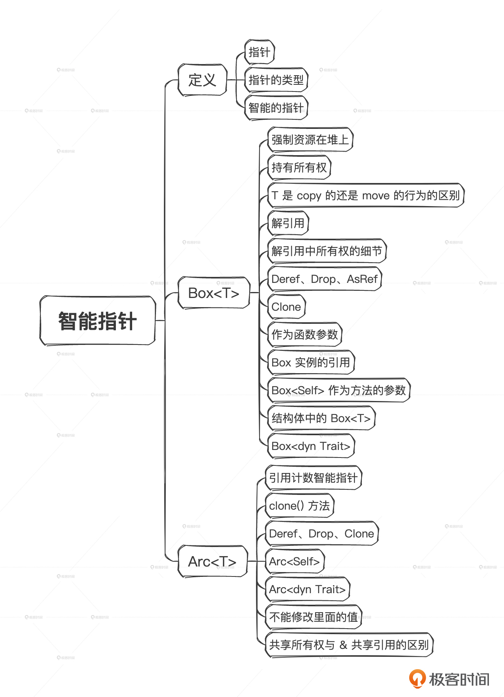

# 12｜智能指针：从所有权看智能指针
你好，我是Mike。从今天开始，我们进入Rust进阶篇。

相对于基础篇，进阶篇更像外功招式，主要是掌握一些实用的基础设施，提高编程效率。这节课我们就在所有权视角下来学习Rust中的智能指针。

## 智能指针

学习智能指针之前，我们先来了解一下指针是什么。

### 指针和指针的类型

如果一个变量，里面存的是另一个变量在内存里的地址值，那么这个变量就被叫做 **指针**。而我们前面讲到的引用（用&号表示）就是一种指针。

**引用是必定有效的指针**，它一定指向一个目前有效（比如没有被释放掉）的类型实例。而指针不一定是引用。也就是说，在Rust中，还有一些其他类型的指针存在，我们这节课就来学习其中一些。

我们这里要再次明晰一下 **引用的类型**。引用分为不同的类型，单独的&符号本身没有什么意义，但是它和其他类型组合起来就能形成各种各样的引用类型。比如：

- &str 是字符串切片引用类型。
- &String 是所有权字符串的引用类型。
- &u32 是u32的引用类型。

注：&str、&String、&u32都是一个整体。

这三种都是引用类型，作为引用类型，它们之间是不同的。但是同一种引用类型的实例，比如 &10u32和&20u32，它们的类型是相同的。

那么，指针其实也类似，指向不同类型实例的指针，它的类型也是有区别的，这叫做 **指针的类型**。

### 智能指针

Rust中指针的概念非常灵活，比如，它可以是一个结构体类型，只要其中的一个字段存储其他类型实例的地址，然后对这个结构体实现一些Rust标准库里提供的trait，就可以把它变成指针类型。这种指针可以在传统指针的基础上添加一些额外信息，比如放在额外的一些字段中；也可以做一些额外操作，比如管理引用计数，资源自动回收等。从而显得更加智能，所以被叫做 **智能指针**。

其实，我们前面碰到的 String 和 `Vec<T>` 就是一种智能指针。我们来看标准库代码中 [String](https://doc.rust-lang.org/src/alloc/string.rs.html#365) 的定义和 [`Vec<T>`](https://doc.rust-lang.org/src/alloc/vec/mod.rs.html#396) 的定义。

```plain
pub struct String {
    vec: Vec<u8>,
}

```

```plain
pub struct Vec<T, #[unstable(feature = "allocator_api", issue = "32838")] A: Allocator = Global> {
    buf: RawVec<T, A>,
    len: usize,
}

```

通过代码我们可以看到，String和 `Vec<T>` 实际都定义为结构体。

注：Rust中智能指针的概念也直接来自于C++。C++里面有 [unique\_ptr](https://en.cppreference.com/w/cpp/memory/unique_ptr)、 [shared\_ptr](https://en.cppreference.com/w/cpp/memory/shared_ptr)。

智能指针可以让代码的开发相对来说容易一些。经过前面的学习，我们知道Rust基于所有权出发，定义了一套完整的所有权和借用规则。很多我们习以为常的代码写法，在Rust中变成了“违法”，这导致很多人觉得学习Rust的门槛很高。而智能指针可以在某些方面降低这种门槛。

它如何能做到呢？我们稍后揭秘。

前面我们看到过这种代码：

```plain
fn foo() -> u32 {
    let i = 100u32;
    i
}
fn main() {
    let _i = foo();
}

```

我们看到， `foo()` 函数将i返回用的不是move行为，而是copy行为，将100u32这个值复制了一份，返回给外面的\_i。 `foo()` 函数调用结束后， `foo()` 里的局部变量i被销毁。

我们再回忆一下另一段代码。

```plain
fn foo() -> String {
    let s = "abc".to_string();
    s
}
fn main() {
    let _s = foo();
}

```

上述代码可以在函数 `foo()` 里生成一个字符串实例，这个字符串实例资源在堆内存中分配，s是foo函数里的局部变量，拥有字符串资源的所有权。在代码的最后一行，s把所有权返回给外部调用者并传递给\_s。 `foo()` 调用完成后，栈上的局部变量s被销毁。

这种写法可行是因为返回了资源的所有权。如果我们把代码里的String换成&String，把s换成&s就不行了。

```plain
fn foo() -> &String {
    let s = "abc".to_string();
    &s
}
fn main() {
    let _s = foo();
}

```

你可能会问，既然String资源本身是在堆中，为什么我们不能拿到这个资源的引用而返回呢？

我们来看看为什么不行。在 `foo()` 函数里，其实我们返回的并不是那个堆里字符串资源的引用，而是栈上局部变量s的引用。堆里的字符串资源由栈上的变量s管理，而s在 `foo()` 函数调用完成后，就被销毁了，堆里的字符串资源也一并被回收了，所以刚刚那段代码当然行不通了。

同样的，下面这段代码也是不允许的。

```plain
fn foo() -> &u32 {
    let i = 100u32;
    &i
}
fn main() {
    let _i = foo();
}

```

那么，我们有什么办法能让这种意图变得可行呢？其实是有的，比如使用 `Box<T>` 智能指针。

## `Box<T>`

`Box<T>` 是一个类型整体，作为智能指针 `Box<T>` 可以把资源强行创建在堆上，并获得资源的所有权，让资源的生命期得以被程序员精确地控制。

注：堆上的资源，默认与整个程序进程的存在时间一样久。

我们来看使用 `Box<T>` 如何处理前面那个示例。

```plain
fn foo() -> Box<u32> {
    let i = 100u32;
    Box::new(i)
}
fn main() {
    let _i = foo();
}

```

通过Box，我们把栈上 i 的值，强行copy了一份并放在堆上某个地址，然后Box指针指向这个地址。

返回一个整数 i 的指针确实没多大用，如果我们定义了一个结构体，可以采用类似的办法从函数中返回结构体的Box指针。

```plain
struct Point {
    x: u32,
    y: u32
}

fn foo() -> Box<Point> {
    let p = Point {x: 10, y: 20};  // 这个结构体的实例创建在栈上
    Box::new(p)
}
fn main() {
    let _p = foo();
}

```

这就很有用了。

我们看示例的第7行，Point 的实例 p 实际是创建在栈上的。通过 `Box::new(p)`，把p实例强行按位复制了一份，并且放到了堆上，我们记为 p’。然后 `foo()` 函数返回，把Box指针实例move给了\_p。之后，\_p拥有了对 p’ 的所有权。

### `Box<T>` 中的所有权分析

我们继续深入，回顾一下上面示例里讲到的，编译期间已知尺寸的类型实例会默认创建在栈上。Point有两个字段：x、y，它们的尺寸是固定的，都是4个字节，所以Point的尺寸就是8个字节，它的尺寸也是固定的。所以它的实例会被创建在栈上。第7行的 p 拥有这个Point实例的所有权。注意Point并没有默认实现Copy，虽然它的尺寸是固定的。

在创建 `Box<Point>` 实例的时候会发生所有权转移：资源从栈上move到了堆上，原来栈上的那片资源被置为无效状态，因此下面的代码编译不会通过。

```plain
struct Point {
    x: u32,
    y: u32
}

fn foo() -> Box<Point> {
    let p = Point {x: 10, y: 20};
    let boxed = Box::new(p);  // 创建Box实例
    let q = p;                // 这一句用来检查p有没有被move走
    boxed
}
fn main() {
    let _p = foo();
}

```

编译提示：

```plain
error[E0382]: use of moved value: `p`
 --> src/main.rs:9:13
  |
7 |     let p = Point {x: 10, y: 20};
  |         - move occurs because `p` has type `Point`, which does not implement the `Copy` trait
8 |     let boxed = Box::new(p);     // 创建Box实例
  |                          - value moved here
9 |     let q = p;        // 这一句用来检查p有没有被move走
  |             ^ value used here after move

```

之所以会发生所有权这样的转移，是因为 Point 类型本身就是 move 语义的。作为对照，我们来看一个示例。

```plain
fn foo() -> Box<u8> {
    let i = 5;
    let boxed = Box::new(i);  // 创建Box实例
    let q = i;                // 这一句用来检查i有没有被move走
    boxed
}

fn main() {
    let _i = foo();
}

```

这个示例就可以编译通过。也就是说，在执行 `Box::new()` 创建 Box 实例时，具有copy语义的整数类型和具有move语义的Point类型行为不一样。整数会copy一份自己，Point实例会把自己move到Box里面去。

一旦创建好Box实例后，这个实例就具有了对里面资源的所有权了，它是move语义的，你可以看一下示例。

```plain
fn foo() -> Box<u8> {
    let i = 5;
    let boxed = Box::new(i);    // 创建Box实例
    let q = i;                  // 这一句用来检查i有没有被move走
    let boxed2 = boxed;         // 这一句检查boxed实例是不是move语义
    boxed
}

fn main() {
    let _i = foo();
}

```

不能编译通过，提示：

```plain
error[E0382]: use of moved value: `boxed`
 --> src/main.rs:6:5
  |
3 |     let boxed = Box::new(i);    // 创建Box实例
  |         ----- move occurs because `boxed` has type `Box<u8>`, which does not implement the `Copy` trait
4 |     let q = i;                  // 这一句用来检查i有没有被move走
5 |     let boxed2 = boxed;         // 这一句检查boxed实例是不是move语义
  |                  ----- value moved here
6 |     boxed
  |     ^^^^^ value used here after move

```

这个示例就验证了我们刚才的说法。

### `Box<T>` 的解引用

前面我们讲过，创建一个Box实例把栈上的内容包起来，可以把栈上的值移动到堆上，比如：

```plain
let val: u8 = 5;
let boxed: Box<u8> = Box::new(val); // 这里 boxed 里面那个u8就是堆上的值

```

还可以在Box实例上使用 **解引用符号**\*，把里面的堆上的值再次移动回栈上，比如：

```plain
let boxed: Box<u8> = Box::new(5);
let val: u8 = *boxed;    // 这里这个val整数实例就是在栈上的值

```

解引用是 `Box::new()` 的 **逆操作**，可以看到整个过程是相反的。

对于具有copy语义的u8类型来说，解引用回来后，boxed还能使用，我们看下示例。

```plain
fn main() {
    let boxed: Box<u8> = Box::new(5);
    let val: u8 = *boxed;

    println!("{:?}", val);
    println!("{:?}", boxed);  // 用于u8类型，解引用后，boxed实例还能用
}
// 输出
5
5

```

而对于具有move语义的类型来说，情况就不一样了，会发生所有权的转移。比如：

```plain
#[derive(Debug)]
struct Point {
    x: u32,
    y: u32
}

fn main() {
    let p = Point {x: 10, y: 20};
    let boxed: Box<Point> = Box::new(p);
    let val: Point = *boxed;  // 这里做了解引用，Point实例回到栈上

    println!("{:?}", val);
    println!("{:?}", boxed);  // 解引用后想把boxed再打印出来
}

```

编译出错，提示 `*boxed` 已经 move了。

```plain
error[E0382]: borrow of moved value: `boxed`
  --> src/main.rs:13:22
   |
10 |     let val: Point = *boxed;
   |                      ------ value moved here
...
13 |     println!("{:?}", boxed);
   |                      ^^^^^ value borrowed here after move

```

因此 boxed 不能再使用。也就是说，如果 `Box<T>` 的 T 是 move 语义的，那么对这个Box实例做解引用操作，会把这个Box实例的所有权释放。

关于这些细节，其实你不用太担心能不能一次性掌握好，因为你用错的时候，Rustc小助手会贴心地准确提示你，所以不要有心理负担。

### `Box<T>` 实现了trait

`Box<T>` 的好处在于它的明确性，它里面的资源一定在堆上，所以我们就不用再去关心资源是在栈上还是堆上这种细节问题了。一种类型，被 `Box<>` 包起来的过程就叫作这个类型的 **盒化**（boxed）。

Rust在标准库里为 `Box<T>` 实现了 `Deref`、 `Drop`、 `AsRef<T>` 等trait，所以 `Box<T>` 可以直接调用T实例的方法，访问T实例的值。

```plain
#[derive(Debug)]
struct Point {
    x: u32,
    y: u32,
}

impl Point {
    fn play(&self) {
        println!("I'am a method of Point.");
    }
}

fn main() {
    let boxed: Box<Point> = Box::new(Point{x: 10, y: 20});
    boxed.play();    // 点操作符触发deref
    println!("{:?}", boxed);
}
// 输出
I'am a method of Point.
Point { x: 10, y: 20 }

```

`Box<T>` 拥有对T实例的所有权，所以可以对T实例进行写操作。

```plain
#[derive(Debug)]
struct Point {
    x: u32,
    y: u32,
}

fn main() {
    let mut boxed: Box<Point> = Box::new(Point{x: 10, y: 20});
    *boxed = Point {    // 这一行，使用解引用操作更新值
        x: 100,
        y: 200
    };
    println!("{:?}", boxed);
}
// 输出
Point { x: 100, y: 200 }

```

### `Box<T>` 的Clone

`Box<T>` 能否Clone，需要看 T 是否实现了 Clone，因为我们也需要把 T 的资源克隆一份。你可以看一下我给出的示例。

```plain
#[derive(Debug, Clone)]
struct Point {
    x: u32,
    y: u32,
}

impl Point {
    fn play(&self) {
        println!("I'am a method of Point.");
    }
}

fn main() {
    let mut boxed: Box<Point> = Box::new(Point{x: 10, y: 20});
    let mut another_boxed = boxed.clone();   // 克隆
    *another_boxed = Point{x: 100, y: 200};  // 修改新的一份值
    println!("{:?}", boxed);                 // 打印原来一份值
    println!("{:?}", another_boxed);         // 打印新的一份值
}
// 输出
Point { x: 10, y: 20 }
Point { x: 100, y: 200 }

```

### `Box<T>` 作为函数参数

我们可以把 `Box<T>` 作为参数传入函数，这个我们前面已经见过了。

```plain
#[derive(Debug)]
struct Point {
    x: u32,
    y: u32,
}

fn foo(p: Box<Point>) {    // 这里参数类型是 Box<Point>
    println!("{:?}", p);
}

fn main() {
    foo(Box::new(Point {x: 10, y: 20}));
}
// 输出
Point { x: 10, y: 20 }

```

### `&Box<T>`

`Box<T>` 本身作为一种类型，对它做引用操作当然是可以的。

```plain
#[derive(Debug)]
struct Point {
    x: u32,
    y: u32,
}

impl Point {
    fn play(&self) {
        println!("I'am a method of Point.");
    }
}

fn main() {
    let boxed: Box<Point> = Box::new(Point{x: 10, y: 20});
    boxed.play();        // 调用类型方法
    let y = &boxed;      // 取boxed实例的引用
    y.play();            // 调用类型方法
    println!("{:?}", y);
}
// 输出
I'am a method of Point.
I'am a method of Point.
Point { x: 10, y: 20 }

```

在示例中，boxed是一个所有权型变量，y是一个引用型变量。它们都能调用到Point类型上的方法。

对Box实例做可变引用（&mut）也是可以的，你可以看一下示例。

```plain
#[derive(Debug)]
struct Point {
    x: u32,
    y: u32,
}

impl Point {
    fn play(&self) {
        println!("I'am a method of Point.");
    }
}

fn main() {
    let mut boxed: Box<Point> = Box::new(Point{x: 10, y: 20});
    let y = &mut boxed;     // 这里&mut Box<Point>
    y.play();               // 调用类型方法
    println!("{:?}", y);    // 修改前的值
    **y = Point {x: 100, y: 200};  // 注意这里用了二级解引用
    println!("{:?}", y);    // 修改后的值
}
// 输出
I'am a method of Point.
Point { x: 10, y: 20 }
Point { x: 100, y: 200 }

```

这个示例里值得注意的是第18行，做了两次解引用，第一次是对&mut 做的，第二次是对 `Box<T>` 做的。

### `Box<Self>`

前面我们讲过，类型的方法可以用 self、&self、&mut self 三种形态传入Self参数。其中第一种self形态还有一种变体 `Box<Self>`，你可以看一下示例。

```plain
#[derive(Debug)]
struct Point {
    x: u32,
    y: u32,
}

impl Point {
    fn play_ref(&self) {
        println!("I'am play_ref of Point.");
    }
    fn play_mutref(&mut self) {
        println!("I'am play_mutref of Point.");
    }
    fn play_own(self) {
        println!("I'am play_own of Point.");
    }
    fn play_boxown(self: Box<Self>) {    // 注意这里
        println!("I'am play_boxown of Point.");
    }
}

fn main() {
    let mut boxed: Box<Point> = Box::new(Point{x: 10, y: 20});
    boxed.play_ref();
    boxed.play_mutref();
    boxed.play_boxown();
    // boxed.play_own();  // play_boxown()和 play_own() 只能同时打开一个
}

```

注意示例中， `play_boxown()` 和 `play_own()` 只能同时打开一个，这是为什么呢？你思考一下。

### 结构体中的Box

`Box<T>` 作为类型，当然是可以出现在struct里的，你可以看一下示例。

```plain
struct Point {
    x: u32,
    y: u32,
}
struct Triangle {
    one: Box<Point>,    // 三个字段类型都是 Box<Point>
    two: Box<Point>,
    three: Box<Point>,
}
fn main() {
    let t = Triangle {
        one: Box::new(Point {
            x: 10,
            y: 10,
        }),
        two: Box::new(Point {
            x: 20,
            y: 20,
        }),
        three: Box::new(Point {
            x: 10,
            y: 20,
        }),
    };
}

```

### `Box<dyn trait>`

回忆 [第 10 讲](https://time.geekbang.org/column/article/724776) 的trait object，它代表一种类型，这种类型可以代理一批其他的类型。但是 dyn trait 本身的尺寸在编译期是未知的，所以 dyn trait 的出现总是要借助于引用或智能指针。而 `Box<dyn trait>` 是最常见的，甚至比 `&dyn trait` 更常见。原因就是 `Box<dyn Trait>` 拥有所有权，这就是 `Box<T>` 方便的地方，而 `&dyn Trait` 不拥有所有权，有的时候就没那么方便。

我们来看使用 `Box<dyn trait>` 做函数参数的一个示例。

```plain
struct Atype;
struct Btype;
struct Ctype;

trait TraitA {}

impl TraitA for Atype {}
impl TraitA for Btype {}
impl TraitA for Ctype {}

fn doit(x: Box<dyn TraitA>) {}

fn main() {
    let a = Atype;
    doit(Box::new(a));
    let b = Btype;
    doit(Box::new(b));
    let c = Ctype;
    doit(Box::new(c));
}

```

这个示例里的 `doit()` 函数能接收 Atype、Btype、Ctype 三种不同类型的实例。

如果 dyn trait 出现在结构体里，那么 `Box<dyn trait>` 形式就比 `&dyn trait` 形式要方便得多。比如，下面示例里的结构体字段类型是 `Box<dyn TraitA>`，能正常编译。

```plain
struct Atype;
struct Btype;
struct Ctype;

trait TraitA {}

impl TraitA for Atype {}
impl TraitA for Btype {}
impl TraitA for Ctype {}

struct MyStruct {
    x: Box<dyn TraitA>  // 结构体的字段类型是 Box<dyn TraitA>
}

fn main() {
    let a = Atype;
    let t1 = MyStruct {x: Box::new(a)};
    let b = Btype;
    let t2 = MyStruct {x: Box::new(b)};
    let c = Ctype;
    let t3 = MyStruct {x: Box::new(c)};
}

```

而下面这个示例，结构体字段类型是 `&dyn TraitA`，就没办法通过编译。

```plain
struct Atype;
struct Btype;
struct Ctype;

trait TraitA {}

impl TraitA for Atype {}
impl TraitA for Btype {}
impl TraitA for Ctype {}

struct MyStruct {
    x: &dyn TraitA    // 结构体字段类型是 &dyn TraitA
}

```

报错如下：

```plain
error[E0106]: missing lifetime specifier
  --> src/lib.rs:12:8
   |
12 |     x: &dyn TraitA
   |        ^ expected named lifetime parameter
   |
help: consider introducing a named lifetime parameter
   |
11 ~ struct MyStruct<'a> {
12 ~     x: &'a dyn TraitA
   |

```

这个错误涉及到第20讲引用的生命期的概念，现在我们不去深究。

`Box<T>` 智能指针的内容就讲到这里，下面我们看另一种智能指针 `Arc<T>`。

## `Arc<T>`

`Box<T>` 是单所有权或独占所有权模型的智能指针，而 `Arc<T>` 是共享所有权模型的智能指针，也就是多个变量可以同时拥有一个资源的所有权。和 `Box<T>` 一样， `Arc<T>` 也会保证被包装的内容被分配在堆上。

### clone

Arc的主要功能是和 `clone()` 配合使用。在Arc实例上每一次新的 `clone()` 操作，总是会将资源的引用数+1，而保持原来那一份资源不动，这个信息记录在Arc实例里面。每一个指向同一个资源的Arc实例走出作用域，就会给这个引用计数-1。直到最后一个Arc实例消失，目标资源才会被销毁释放。你可以看一下示例。

```plain
use std::sync::Arc;

#[derive(Debug)]    // 这里不需要目标type实现Clone trait
struct Point {
    x: u32,
    y: u32,
}

impl Point {
    fn play(&self) {
        println!("I'am a method of Point.");
    }
}

fn main() {
    let arced: Arc<Point> = Arc::new(Point{x: 10, y: 20});
    let another_arced = arced.clone();      // 克隆引用
    println!("{:?}", arced);                // 打印一份值
    println!("{:?}", another_arced);        // 打印同一份值
    arced.play();
    another_arced.play();
    let arc3_ref = &another_arced;
    arc3_ref.play();
}
// 输出
Point { x: 10, y: 20 }
Point { x: 10, y: 20 }
I'am a method of Point.
I'am a method of Point.
I'am a method of Point.

```

我们可以看到，相比于 `Box<T>`， `Arc<T>` 的clone不要求T实现了Clone trait。 `Arc<T>` 的克隆行为只会改变Arc的引用计数，而不会克隆里面的内容。由于不需要克隆原始资源，所以性能是很高的。

类似于 `Box<T>`， `Arc<T>` 也实现了Deref、Drop、Clone等trait。因此， `Arc<T>` 也可以符合人类的习惯，访问到里面类型T的方法。 `Arc<T>` 的不可变引用 `&Arc<>` 也可以顺利调用到T上的方法。

### Arc

和 `Box<T>` 一样，Arc也可以用在方法中的self参数上面，作为所有权self的一个变体形式。

我们继续扩展上面的代码，你可以看一下扩展后的样子。

```plain
use std::sync::Arc;

#[derive(Debug)]
struct Point {
    x: u32,
    y: u32,
}

impl Point {
    fn play_ref(&self) {
        println!("I'am play_ref of Point.");
    }
    fn play_mutref(&mut self) {
        println!("I'am play_mutref of Point.");
    }
    fn play_own(self) {
        println!("I'am play_own of Point.");
    }
    fn play_boxown(self: Box<Self>) {    // 注意这里
        println!("I'am play_boxown of Point.");
    }
    fn play_arcown(self: Arc<Self>) {    // 注意这里
        println!("I'am play_arcown of Point.");
    }
}

fn main() {
    let mut boxed: Box<Point> = Box::new(Point{x: 10, y: 20});
    boxed.play_ref();
    boxed.play_mutref();
    boxed.play_boxown();
    // boxed.play_own();  // play_boxown()和 play_own() 只能同时打开一个

    let arced: Arc<Point> = Arc::new(Point{x: 10, y: 20});
    arced.play_ref();
    // arced.play_mutref();  // 不能用
    // arced.play_own();     // 不能用，Arc<T> 中的T无法被移出
    arced.play_arcown();
}
// 输出
I'am play_ref of Point.
I'am play_mutref of Point.
I'am play_boxown of Point.
I'am play_ref of Point.
I'am play_arcown of Point.

```

通过这个示例我们可以看到，不能通过 `Arc<>` 直接修改里面类型的值，也不能像 `Box<>` 的解引用操作那样，把里面的内容从 `Arc<>` 中移动出来。你可以试着打开示例里注释掉的几行看看Rustc小助手的提示信息。

### `Arc<dyn trait>`

我们还可以把前面 `Box<dyn trait>` 的示例改编成 `Arc<T>` 的。

```plain
use std::sync::Arc;

struct Atype;
struct Btype;
struct Ctype;

trait TraitA {}

impl TraitA for Atype {}
impl TraitA for Btype {}
impl TraitA for Ctype {}

struct MyStruct {
    x: Arc<dyn TraitA>
}

fn main() {
    let a = Atype;
    let t1 = MyStruct {x: Arc::new(a)};
    let b = Btype;
    let t2 = MyStruct {x: Arc::new(b)};
    let c = Ctype;
    let t3 = MyStruct {x: Arc::new(c)};
}

```

### 值的修改

多所有权条件下，怎么修改Arc里面的值呢？答案是不能修改。虽然 `Arc<T>` 是拥有所有权的，但 `Arc<T>` 不提供修改T的能力，这也是 `Arc<T>` 和 `Box<T>` 不一样的地方。后面我们在并发编程部分会讲到Mutex、RwLock等锁。想要修改Arc里面的内容，必须配合这些锁才能完成，比如 `Arc<Mutex<T>>`。

其实很好理解，共享所有权的场景下，如果任意一方能随意修改被包裹的值，那就会影响其他所有权的持有者，整个就乱套了。所以要修改的话必须引入锁的机制。

### `Arc<T>` 与不可变引用&的区别

首先，它们都是共享对象的行为，本质上都是指针。但 `Arc<T>` 是共享了所有权模型，而&只是共享借用模型。共享借用模型就得遵循借用检查器的规则——借用的有效性依赖于被借用资源的scope。对于这个的分析是非常复杂的。而所有权模型是由自己来管理资源的scope，所以处理起来比较方便。

## 小结

这节课我们一起学习了最常用的两个智能指针： `Box<T>` 和 `Arc<T>`。其实Rust里还有很多智能指针，比如 Rc、Cell、RefCell 等等，每一种智能指针类型都有自己的特点。但是不管怎样，学习的方法都是一样的，那就是从所有权的视角去分析研究。你可以在后面遇到那些类型的时候，再根据这节课提供的方法去研究它们。

后面我们会看到，在智能指针的加持下，Rust代码写起来会非常流畅，可以和Java不相上下。再结合Rust强大的类型系统建模能力，等你写得熟练之后，在中大项目中，使用Rust甚至会有超越Python的开发效率。



## 思考题

你试着打开示例中的这两句，看看报错信息，然后分析一下是为什么？

```plain
    // arced.play_mutref();  // 不能用
    // arced.play_own();     // 不能用

```

欢迎你把自己的分析分享到评论区，也欢迎你把这节课的内容分享给其他朋友，我们下节课再见！