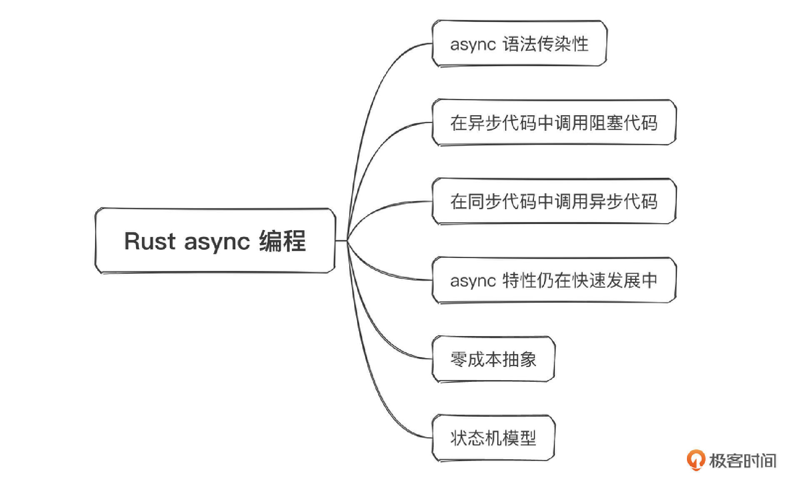

# 17｜tokio编程： Rust异步编程还有哪些需要注意的点？
你好，我是Mike。前面几节课，我们学习了Rust异步编程和tokio的基础知识，我们先来简单回顾下。

1. `async/.await` 语法
2. tokio基本概念和组件
3. 使用tokio编写一个网络并发应用
4. 使用Arc和Mutex在多个task之间共享数据
5. 在并发task之间使用Channel传递数据

通过学习这些内容，你应该已经能使用tokio开发Rust异步并发应用了。这节课，我们对Rust异步并发相关的知识点来做一点补遗。

## async其他知识点

Rust代码中的async函数，其实和Rust的普通函数是不相容的。async Rust就好像是Rust语言里的一个独立王国。

### async代码的传染性

Rust async代码具有传染性。前面我们给出了使用 `async/.await` 的两条规则。

1. async函数或block只有被 `.await` 后才被驱动。
2. `.await` 只能在async函数或block中使用。

这就导致在业务代码中（非tokio那个顶层Runtime代码），如果你需要调用一个async函数，那么你也需要让你现在这个调用者函数也是async的，你可以看我给出的这个例子。

```plain
// 我们定义foo1为一个异步函数
async fn foo1() -> u32 {
  100u32
}
// 我需要在foo2函数中调用foo1，那么这个foo2也必需要是async函数
async fn foo2() -> u32 {
  foo1().await
}
// 我需要在foo3函数中调用foo2，那么这个foo3也必需要是async函数
async fn foo3() -> u32 {
  foo2().await
}

#[tokio::main]
async main() {
  let num = foo3().await;
  println!("{}", num);
}

```

这就叫作async代码的传染性。这种传染性是由Rust的async语法带来的。

> 注：Rust中还有一个语法具有传染性——类型参数T。

但是实际工作中，我们经常会遇到异步代码与同步代码混合使用的情况。这类情况应该怎么处理呢？下面我们分情况来分析。

### async代码环境中的同步代码

常见的同步代码分两类，一类是直接在内存里的简单操作，比如 `vec.push()` 这种API接口的调用。这类操作在std Rust里怎么使用在async Rust里就怎么使用，一样的。

```plain
async fn foo1() -> u32 {
  let mut vec = Vec::new();
  vec.push(10);
}

```

另外有一类操作，要么是需要执行长时间的计算，要么是需要调用第三方已经写好的同步库的代码，你没有办法去修改它。对于这类函数的调用，你当然也可以直接调用：

```plain
async fn foo1() -> u32 {
  let result = a_heavy_work();
}

```

这样写当然是可以运行的，但会有性能上的问题：它会阻塞当前正在跑这个异步代码的系统线程（OS Thread，由tokio来管理维护），所以当前的这个系统线程就会被卡住，而不能再跑其他异步代码了。

好消息是，tokio专门给我们提供了另外的设施来处理这种情况，就是 `task::spawn_blocking()` 函数。你可以看一下它的使用方法。

```plain
#[tokio::main]
async fn main() {
    // 此任务跑在一个单独的线程中
    let blocking_task = tokio::task::spawn_blocking(|| {
        // 在这里面可以执行阻塞线程的代码
    });
    // 像下面这样用同样的方式等待这种阻塞式任务的完成
    blocking_task.await.unwrap();
}

```

只需要把CPU计算密集型任务放到 `task::spawn_blocking()` 里就可以了，tokio会帮我们单独开一个新的系统线程，来专门跑这个CPU计算密集型的task。然后和普通的tokio task一样，可以通过await来获取它的结果，当然，也可以用Oneshot channel把结果返回回来。

给这种CPU计算密集型任务单独开一个系统线程运行，就能保证我们当前跑异步任务的系统线程不会被这个CPU计算密集型任务占据，导致异步并发能力下降，因此我们得到了一个比较好的方案。

一般来讲，主体是async代码，只有一些小部分是同步代码的时候，使用 `task::spawn_blocking()` 比较合适。

### 同步代码环境中的async代码

那如果主体代码是同步代码（或者叫 std Rust 代码），但是局部想调用一些async接口，比如db driver只提供了async封装，像这种情况下该怎么办呢？

回想一下我们前面讲到的，展开 `#[tokio::main]`。

```plain
#[tokio::main]
async fn main() {
    println!("Hello world");
}

```

展开后，其实是下面这个样子：

```plain
fn main() {
    tokio::runtime::Builder::new_multi_thread()
        .enable_all()
        .build()
        .unwrap()
        .block_on(async {
            println!("Hello world");
        })
}

```

类似地，我们要在同步风格的代码中执行async代码，只需要手动 block\_on 这段异步代码就可以了。除了默认的系统多线程Runtime之外，tokio专门为这种临时的（以及测试的）场景提供了另一种单系统线程的runtime，就是 `new_current_thread()`。它的意思是就在当前程序执行的线程中建立tokio Runtime，异步任务就跑在当前这个线程中。比如：

```plain
async fn foo1() -> u32 {
    10
}

fn foo() {
    let rt = tokio::runtime::Builder::new_current_thread()
          .enable_all()
          .build().unwrap();

    let num = rt.block_on(foo1());  // 注意这一句的 foo1()，调用了此异步函数
    // 或者像下面这样写
    //let num = rt.block_on(async {
    //    foo1().await
    //});
    println!("{}", num);
}

fn main() {
    foo();
}
// 输出
10

```

就通过这种方式，我们在主体为std Rust的代码中，成功地调用了局部的async Rust代码，并得到了这段局部异步代码的返回值。

## Rust async实现原理

Rust 的async实现实际采用的是一种无栈协程（Stackless Coroutine）方案。它的实现是非常高效的，性能在所有支持异步语法的语言中属于最高的那一级，非常厉害。

### Rust async的背后原理

Rust语言实际会把 async 语法编译成 std Rust 中的状态机，然后通过运行时底层的 poll 机制来轮询这个状态机的状态。所以本质上来讲， `async/.await` 语法只是语法糖。

简单来说，Rust会把一个async函数转换成另一种东西，你可以看一下我给出的转换示例。

async函数：

```plain
async fn foo1() -> u32 {
  10
}

```

转换后：

```plain
struct FutureA {
    ...
}
impl Future for FutureA {
    ...
}

```

具体的转换和实现细节我们现在不需要掌握，只需要知道，Rust的这种实现并不是像Go或Java那样，在系统级线程的基础上，单独实现了一层结合GC内存管理且具有完整屏蔽性的轻量级线程，它没有选择在OS应用之间引入一个层（layer），而是在结构体之上构建一个状态机，以零成本抽象（zero cost abstract）为原则，尽量少地引入额外的消耗，配合 `async/.await` 语法糖，来达到简化程序员开发难度的效果。

这种方案成功地让Rust的异步并发能力达到业界顶尖水平。Rust异步语法从提案到稳定推出，前后经历了大量的讨论和修改，花了将近5年的时间，非常不容易，是整个Rust社区共同努力的结果，期间的故事称得上是全世界开源协作的典范。

### 其他一些要注意的问题

Rust async编程也一直处于不断地发展过程中，比如目前在 trait 里，就不能定义async 方法，比如：

```plain
trait MyTrait {
    async fn f() {}
}
// 编译错误
error[E0706]: trait fns cannot be declared `async`
 --> src/main.rs:4:5
  |
4 |     async fn f() {}
  |

```

为了解决这个问题，我们可以引入 `async_trait crate` 的 `async_trait` 宏来暂时过渡。

```plain
use async_trait::async_trait;

#[async_trait]    // 定义时加
trait MyTrait {
    async fn f() {}
}

struct Modal;

#[async_trait]    // impl 时也要加
impl MyTrait for Modal {}

```

请注意上述代码中，在定义trait和impl trait的时候，都需要添加 `#[async_trait]` 属性宏来标注。添加了这个宏标注后，trait里的 async fn 就可以像普通的async fn 那样在异步代码中被调用了。

目前使用这个宏会有一点性能上的开销，好在trait中的async fn这个特性Rust官方也快稳定下来了，估计在1.75版本正式推出，到时候就可以去掉这个宏标注了。

## 小结

这节课我补充了Rust异步并发编程中剩下的一些需要注意的知识点。

我们一共花了5节课的时间来讲解async Rust和tokio的使用，这是因为异步并发编程对于一个场景，也就是高性能高并发服务来说，至关重要。在后面的Web后端服务开发实战部分，我们还会继续基于tokio进行讲解。



## 思考题

你是如何理解 “async Rust是一个独立王国”这种说法的？欢迎你分享自己的见解，我们一起讨论，如果你觉得这节课的内容对你有帮助的话，也欢迎你把这节课的内容分享给其他朋友，我们下节课再见！

参考链接： [https://tokio.rs/tokio/topics/bridging](https://tokio.rs/tokio/topics/bridging)