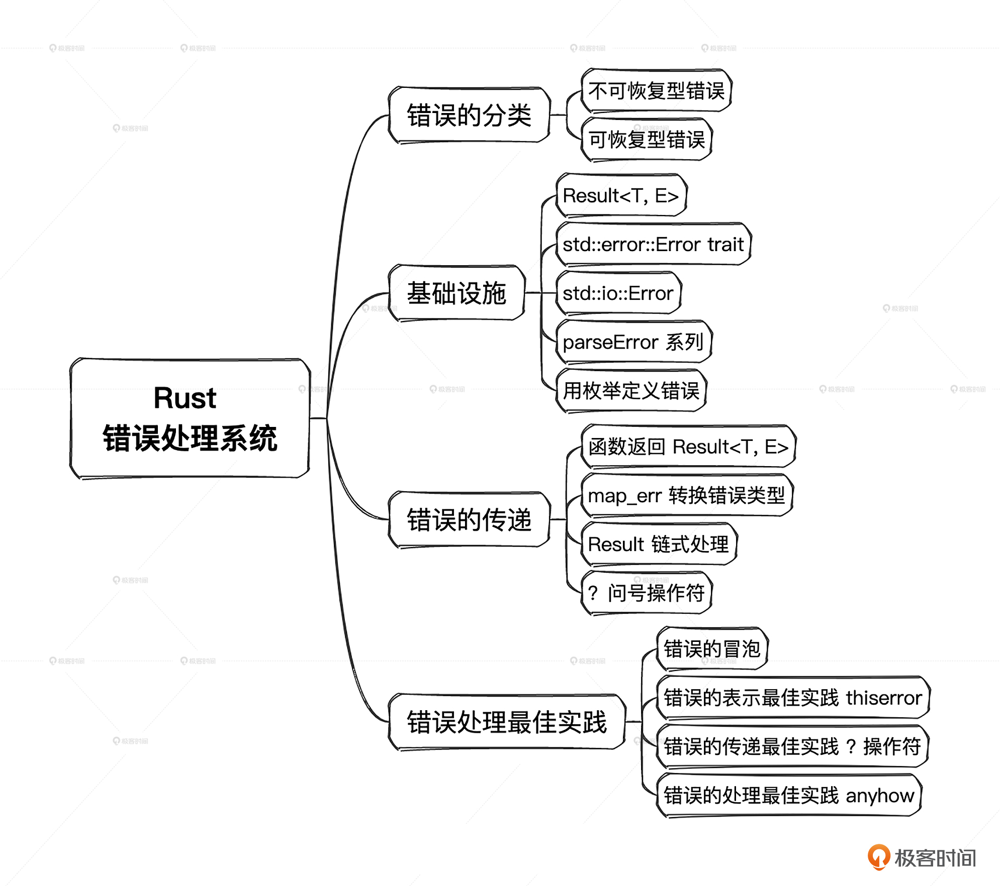

# 18｜错误处理系统：错误的构建、传递和处理
你好，我是Mike。今天我们一起来学习Rust语言中的错误表示、传递及处理相关的知识。Rust的错误处理很重要，也很系统。所以话不多说，我们直接进入正题。

## 错误的分类

错误是需要分类的，不同类型的错误可能有不同的处理策略。总的来看错误分成可恢复型错误和不可恢复型错误，下面我们具体来看看这两种类型。

### 不可恢复型错误

有些错误，我们碰到了后需要及早退出程序，或者直接不启动程序，而是打出错误信息。

Rust中，对这些错误的支持设施有4个。

- panic!：让程序直接崩掉，退出程序，同时可选择是否打印出栈回溯信息。
- todo!：常用于功能还未实现，执行到这里直接退出程序，并提示说这个功能处于准备做的状态。
- unimplemented!：常用于功能还未实现，执行到这里直接退出程序，并提示说这个功能处于未实现的状态。
- unreachable!：用于写在一些原则上不可能执行到的语句，比如一个 `loop {}` 死循环的后面，执行到那里的话，就表示肯定出错了，直接退出程序。

### 可恢复型错误

可恢复型错误指的是那一类错误，在遇到后，不应该让整个程序直接停止运行，而是在代码逻辑中分析可能的错误原因，要么尝试恢复性的处理方案，要么给用户返回自定义的错误信息，让用户明白任务未达到预期的原因。

在Rust中，一般使用 `Result<T, E>` 来承载可能会出错的函数返回值。 `Result<T, E>` 中的T代表正常情况下的返回类型，E代表出错情况下的返回类型。如何方便地构造E的实例，是一个重要的课题。

不可恢复型错误和可恢复型错误在某些时候界限不是那么清晰，在同一个地方，你既可以把它设计成可恢复型错误，也可以把它处理成不可恢复型错误。因此从本质上来说，是由业务逻辑来确定你要把它当成哪一类错误来处理。

## 错误相关的基础设施

### `Result<T, E>`

Rust中主要通过Result类型（实例）来包裹错误类型（实例），包裹后，Result可以通过函数返回值返回到上一层调用者函数中，再由上一层函数中的逻辑来决定是在这一层用某些逻辑处理这个错误，还是继续把这个错误抛到更上一层函数进行处理，我们也可以把包裹错误的 `Result<T, E>` 转换成 `panic!()` 或者在match的Err分支调用 `panic!()` 来中止程序的运行。

我们前面讲到过 `Result<T, E>` 解包的两个函数： `unwrap()` 和 `expect()`，起的作用就是把错误 Result 值转换成 `panic!()`，这两个方法的区别仅在于 `expect()` 可以为我们提供更多的信息，让我们知道这个panic的精确位置，前提是这个提示信息要独一无二，特别是在调用栈层次非常深的情况下，提供准确的panic位置信息非常重要。

从以上对函数中错误处理的描述中，我们可以知道，错误处理本身是一项系统性的工作，其中包含：

1. 错误的表示和构造；
2. 错误的传递；
3. 错误的处理。

据调查，一个软件项目发展到成熟阶段，用于错误处理的代码可能会占所有代码的三分之一以上。而Rust从语法和标准库层面，对错误处理做了根本上的原生支持，它要求我们必须对程序的健壮性负责，使得我们没法偷懒。在非要偷懒的情况下，也会留下明显足迹。

比如下面这个例子演示了在我们想偷懒的情况下，勤奋的Rustc小助手是如何提醒我们的。

```plain
fn foo() -> Result<String, String> {
    Ok("abc".to_string())
}
fn main() {
    foo();  // 这里Rustc小助手会警告你
}

```

在其他语言中，如果我们像上面示例中那样调用 `foo()` 函数，而忽略了它的返回值，一般是没问题的。但是在Rust的地盘，Rustc小助手会提醒我们，这里有一个Result没有被使用，你必须要处理一下，并给出了处理建议。

```plain
warning: unused `Result` that must be used
 --> src/main.rs:5:5
  |
5 |     foo();  // 这里Rustc小助手会警告你
  |     ^^^^^
  |
  = note: this `Result` may be an `Err` variant, which should be handled
  = note: `#[warn(unused_must_use)]` on by default
help: use `let _ = ...` to ignore the resulting value
  |
5 |     let _ = foo();  // 这里Rustc小助手会警告你
  |     +++++++

```

由此可见，小助手不会让我们放过任何一个可能的错误。

### Error trait

Rust中定义了一个抽象的Error trait，任何实现了这个trait的类型都被Rust生态认为是一个错误类型。

```plain
pub trait Error: Debug + Display {}

```

可以看到，一个类型要实现Error，必须同时为这个类型实现Debug和Display trait。前面提到过，Debug trait可以使用derive宏由Rust自动为你的类型实现，而Display trait需要你自己手动impl实现。

实现Error trait是Rust生态中的一种规范，也就是说如果你想在你的这层module里定义一种错误类型的话，为它实现Debug、Display、Error 后，生态就会把你的这个类型认成一种错误类型。这里就体现了trait作为一种社区协议的作用。

一个重要的点是，实现了Error trait的类型，可以被代入到 dyn Error 这个trait object里使用，而生态中很多库支持接受 `&dyn Error` 或 `Box<dyn Error>` 类型，这样你的代码就能和那些库无缝集成了。比如，让你自定义的错误类型从下面的函数中返回。

```plain
fn foo() -> Result<String, Box<dyn Error>> {
  // 可返回一个由Box包起来的自定义错误类型。
}

```

当然，这并不是说，对于 `std::result::Result<T, E>` 这个类型，这里面的E就一定要实现Error trait，这是两码事。 `Result<T, E>` 中的 E 可以是任意类型。我们再复习一下标准库里 `Result<T, E>` 的定义。

```plain
pub enum Result<T, E> {
    Ok(T),
    Err(E),
}

```

从这个enum可以看到，对E没有任何约束。因此，即使你的类型不实现Error trait，它还是能被代入 `Result<T, E>` 中作为错误类型而使用。请注意这点区别。

小提示， `Result<T, E>` 的变体 Ok 和 Err 已经被加入到 `pub std::prelude` 里了，因此在代码中可以直接使用，不需要在前面加 Result 前缀。

### std中的错误类型

Rust标准库里已经定义了一些错误类型，我们来看一下常用的几个。

#### std::io:Error

io Error，被定义成一个结构体，负责表示标准库里I/O相关场景的错误类型。

```plain
pub struct Error { /* private fields */ }

```

常见的I/O操作指的是标准输入输出、网络读写、文件读写等。在std::io模块中，对这种I/O上的读写做了统一的抽象，而类型io::Error也是这个抽象里的一部分。

我们可以用 `new()` 函数像下面这样创建一个io::Error实例， `new()` 函数第一个参数是ErrorKind枚举，第二个参数是具体的错误内容。

```plain
use std::io::{Error, ErrorKind};

// 错误可以从字符串中构造
let custom_error = Error::new(ErrorKind::Other, "oh no!");

```

其中 [ErrorKind](https://doc.rust-lang.org/std/io/enum.ErrorKind.html) 是一个枚举，目前包含40种变体，基本上把在标准库中能遇到的I/O错误都详尽地定义了。

```plain
pub enum ErrorKind {
    NotFound,
    PermissionDenied,
    ConnectionRefused,
    ConnectionReset,
    HostUnreachable,
    NetworkUnreachable,
    ConnectionAborted,
    NotConnected,
    AddrInUse,
    AddrNotAvailable,
    NetworkDown,
    BrokenPipe,
    AlreadyExists,
    WouldBlock,
    NotADirectory,
    IsADirectory,
    DirectoryNotEmpty,
    ReadOnlyFilesystem,
    FilesystemLoop,
    StaleNetworkFileHandle,
    InvalidInput,
    InvalidData,
    TimedOut,
    WriteZero,
    StorageFull,
    NotSeekable,
    FilesystemQuotaExceeded,
    FileTooLarge,
    ResourceBusy,
    ExecutableFileBusy,
    Deadlock,
    CrossesDevices,
    TooManyLinks,
    InvalidFilename,
    ArgumentListTooLong,
    Interrupted,
    Unsupported,
    UnexpectedEof,
    OutOfMemory,
    Other,
}

```

虽然很多，但这也仅限于标准库中I/O模块可能出现的错误类型，它远远不能覆盖全部，因此这个ErrorKind仅用于标准库I/O模块相关的错误类型。

#### parseError

标准库中定义了一组parse相关的错误类型。

- std::num::ParseIntError
- std::num::ParseFloatError
- std::char::ParseCharError
- std::str::ParseBoolError
- std::net::AddrParseError

这些错误类型是与FromStr trait相关的，也就是在把字符串解析到其他类型的时候可能会出现的错误类型，比如：

```plain
use std::net::IpAddr;
fn main() {
    let s = "100eee";
    if let Err(e) = s.parse::<i32>() {
        // e 这里是 ParseIntError
        println!("Failed conversion to i32: {e}");
    }

    let addr = "127.0.0.1:8080".parse::<IpAddr>();
    if let Err(e) = addr {
        // e 这里是 AddrParseError
        println!("Failed conversion to IpAddr: {e}");
    }
}
// 输出
Failed conversion to i32: invalid digit found in string
Failed conversion to IpAddr: invalid IP address syntax

```

### 用枚举定义错误

下面我们来看在Rust中使用Result作为函数返回值，在上层中处理的典型方式。

```plain
// 定义自己的错误类型，一般是一个枚举，因为可能有多种错误
enum HereError {
    Error1,
    Error2,
    Error3,
}
// 一个函数返回Err
fn bar() -> Result<String, HereError> {
    Err(HereError::Error3)
}

fn foo() {
    match bar() {
        Ok(_) => {}
        Err(err) => match err {  // 在上层中通过match进行处理
            HereError::Error1 => {}
            HereError::Error2 => {}
            HereError::Error3 => {}
        },
    }
}

```

通常我们会在当前模块中定义错误类型，一般是枚举类型，因为错误种类往往不止一个。如果某个接口返回了这个错误类型，在上层就需要match这个枚举类型进行错误处理。

到目前为止我们并没有给我们自定义的错误类型HereError实现Debug、Display和Error trait，所以我们的错误类型还仅限于自己玩，为了把它纳入Rust生态体系，我们需要给它实现这3个trait。但是我们没必要自己手动去实现，社区中已经有很好的工具crate: thiserror 可以帮助我们实现这个目的，继续往下看，待会儿就会讲到。

## 错误的传递

前面我们介绍了错误类型的定义和处理的基本方式，接下来，我们开始系统性地介绍错误的传递。

### 函数返回 `Result<T, E>`

前面已经讲过，在Rust中只要一个函数中可能有出错的情况发生，那么它的返回值就默认约定为Result。在继续讲之前，我们先对比一下其他语言中是怎么处理的。

C语言中，一般用同一种类型的特殊值表示异常。比如一个函数返回一个有符号整数，可以用0表示正常情况下的返回，用-1或其他负数值表示异步情况下的返回。但是这个约定并不是普遍共识，因此你可以在C语言中看到，大部分情况下函数返回0表示正常，但在一些特定情况下，返回0又表示不正确。缺乏强制约束给整个生态带来了混乱。

Java这种语言，提供强大的try-catch-throw，在语言层面捕获异常。这种形式虽然方便，但实际上会给语言Runtime带来负担，因为语言的Runtime要负责捕获代码中的异常，会有额外的性能损失。另外，由于try-catch-throw使用很方便，有时会看到程序员为了偷懒，将一大段代码全部包在try-catch-throw中的情况，无疑这会大大降低代码的质量，整个程序没办法对错误情况做精细地处理。

而Rust采取的方式是把异常情况独立出来一个维度，放在 `Result<T, E>` 的Err变体中。也就是说，错误在类型上就是以独立的维度存在的。比如：

```plain
fn foo(num: u32) -> Result<String, String> {
    if num == 10 {
        Ok("Hello world!".to_string())
    } else {
        Err("I'm wrong!".to_string())
    }
}

```

上述代码中的错误类型部分被定义为String类型，实际上你可以定义成任意类型，比如下面我们把错误定义成u32类型。

```plain
fn foo(num: u32) -> Result<String, u32> {
    if num == 10 {
        Ok("Hello world!".to_string())
    } else {
        Err(100)
    }
}

```

有时一个函数中的错误情况可能不止一种，这时候该怎样定义返回类型呢？惯用办法就是使用enum，前面其实已经见过了，这里再看一个示例。

```plain
enum MyError {
    Error1,
    Error2,
    Error3,
}

fn foo(num: u32) -> Result<String, MyError> {
    match num {
        10 => Ok("Hello world!".to_string()),
        20 => Err(MyError::Error1),
        30 => Err(MyError::Error2),
        _ => Err(MyError::Error3),
    }
}

```

这里Result的E部分，类型就是我们自定义的MyError。

另一种常用的办法是让函数返回 `Result<_, Box<dyn Error>>`，比如：

```plain
use std::error::Error;
use std::fmt;

#[derive(Debug)]
struct MyError;

impl fmt::Display for MyError {
    fn fmt(&self, f: &mut fmt::Formatter<'_>) -> fmt::Result {
        write!(f, "{}", self)
    }
}

impl Error for MyError {}

fn foo(num: u32) -> Result<String, Box<dyn Error>> {
    match num {
        10 => Ok("Hello world!".to_string()),
        _ => {
            let my_error = MyError;
            Err(Box::new(my_error))
        }
    }
}

```

可以看到，一旦把错误独立到另一个维度来处理后，我们得到了相当大的灵活性和安全性：可以借助类型系统来帮助检查正常情况与异常情况的不同返回，大大减少了编码出错的机率。

有了这套优秀的错误处理底层设施后，整个Rust生态上层建筑逐渐结构性地构建起来了，大家都遵从这个约定，用同样的方式来传递和处理错误，形成了一个健康良好的生态。

### map\_err转换错误类型

我们常常使用Result上的 `map_err` 方法手动转换错误类型。比如下面这个示例：

```plain
use std::fs::File;
use std::io::Read;

fn read_file() -> Result<String, String> {
    match File::open("example.txt").map_err(|err| format!("Error opening file: {}", err)) {
        Ok(mut file) => {
            let mut contents = String::new();
            match file
                .read_to_string(&mut contents)
                .map_err(|err| format!("Error reading file: {}", err))
            {
                Ok(_) => Ok(contents),
                Err(e) => {
                    return Err(e);
                }
            }
        }
        Err(e) => {
            return Err(e);
        }
    }
}

```

我们要在 `read_file()` 中打开一个文件，并读取文件全部内容到字符串中。整个过程中，有可能出现两个I/O错误：打开文件错误和读取文件错误。可以看到在示例中我们使用 `map_err` 将这两个I/O错误的类型都转换成了String类型，来和函数返回类型签名相匹配。然后，对两个操作的Result进行了match匹配。这个函数里的两个文件操作可能的错误都是std::io::Error类型的。

很多时候同一个函数中会产生不同的错误类型，这时仍然可以使用 `map_err` 显式地把不同的错误类型转换成我们需要的同一种错误类型。

### Result 链式处理

除了每次对Result进行match处理外，Rust中还流行一种方式，就是对Result进行链式处理。我们可以将上面打开文件并读取内容的例子改写成链式调用的风格。

代码如下：

```plain
use std::fs::File;
use std::io::Read;

fn read_file() -> Result<String, String> {
    File::open("example.txt")
        .map_err(|err| format!("Error opening file: {}", err))
        .and_then(|mut file| {
            let mut contents = String::new();
            file.read_to_string(&mut contents)
                .map_err(|err| format!("Error reading file: {}", err))
                .map(|_| contents)
        })
}

fn main() {
    match read_file() {
        Ok(n) => println!("{}", n),
        Err(err) => println!("Error: {}", err),
    }
}

```

可以明显看到，使用链式风格改写的示例比前面用match进行处理的示例简洁很多。这里用到了 `map_err`、 `and_then`、 `map` 三种链式操作，它们可以在不解开Result包的情况下直接对里面的内容进行处理。关于这几个方法的详细内容，你可以参考 [第 8 讲](https://time.geekbang.org/column/article/722702)。

这里需要说明的是，在第5行 `File::open()` 执行完，如果产生的 Result 是 Err，那么在第6行 `map_err()` 后，不会再走 `and_then()` 操作，而是直接从 `read_file()` 函数中返回这个 Result 了。如果第5行的操作产生的 Result 是 Ok，就会跳过第6行，进入第7行执行。

进入第7行后，会消解前面产生的Result，把 file 对象传进来使用。然后我们再去看第9行产生的Result，如果这个Result实例是Err，那么执行完第10行后，就直接从闭包返回了，返回的是Err值，这个值会进一步作为 `read_file()` 函数的返回值返回。而如果Result实例是Ok，就会跳过第10行，执行第11行，第11行将 contents 字符串move进来作为内层闭包的返回值，并进一步以 `Ok(contents)` 的形式作为 `read_file()` 函数的返回值返回。

你可能会惊叹，这种链式处理比前面的match操作优美太多，但是理解起来也困难太多。这是正常的，开始的时候我们对这种链式写法会比较陌生，不过没关系，可以多写写，慢慢理解，这就是一个熟能生巧的事情，本身其实并不复杂。

### ? 问号操作符

另一方面，前面的match写法，有没有办法简化呢？因为看上去好像有很多样板代码。

```plain
use std::fs::File;
use std::io::Read;

fn read_file() -> Result<String, String> {
    match File::open("example.txt").map_err(|err| format!("Error opening file: {}", err)) {
        Ok(mut file) => {
            let mut contents = String::new();
            match file
                .read_to_string(&mut contents)
                .map_err(|err| format!("Error reading file: {}", err))
            {
                Ok(_) => Ok(contents),
                Err(e) => {
                    return Err(e);
                }
            }
        }
        Err(e) => {
            return Err(e);
        }
    }
}

```

比如上面代码中的第13～15行和第18～20行，都是把错误 `Err(e)` 返回到上一层。

```plain
  Err(e) => {
      return Err(e);
  }

```

Rust中有一个 `？` 操作符，可以用来简化这种场景。我们把前面代码用 `？` 操作符改造一下。

```plain
use std::fs::File;
use std::io::Read;

fn read_file() -> Result<String, String> {
    let mut file =
        File::open("example.txt").map_err(|err| format!("Error opening file: {}", err))?;
    let mut contents = String::new();
    file.read_to_string(&mut contents)
        .map_err(|err| format!("Error reading file: {}", err))?;

    Ok(contents)
}

```

哇，神奇不？怎么行数缩短了这么多。

具体来说， `？` 操作符大体上等价于一个match语句。

```plain
let ret = a_result?;
等价于
let ret = match a_result {
    Ok(ret) => ret,
    Err(e) => return Err(e),   // 注意这里有一个return语句。
};

```

也就是说，如果result的值是Ok，就解包；如果是Err，就提前从此函数中返回这个Err。这实际是一种 **防御式编程**，遇到了错误，就提前返回。防御式编程能让函数体中的代码大大简化，可以减少很多层括号，相信你已经从上面的示例对比中感受到了。

细心的你可能已经发现了，这里的e是这个 `a_result` 里 `Err(e)` 中的 e。这个实例的类型是什么呢？使用return语句返回它的话，那么它是不是一定和函数中定义的返回类型中的错误类型一致呢？这个问题其实很重要。从上面的示例来看，我们明确地用 `map_err` 把 io::Error 转换成了 String 这种类型，所以是没问题的。我们可以来做个实验，把 `map_err` 去掉试试。

```plain
use std::fs::File;
use std::io::Read;

fn read_file() -> Result<String, String> {
    let mut file =
        File::open("example.txt")?;
    let mut contents = String::new();
    file.read_to_string(&mut contents)?;

    Ok(contents)
}

```

编译器报错了：

```plain
error[E0277]: `?` couldn't convert the error to `String`
 --> src/lib.rs:6:34
  |
4 | fn read_file() -> Result<String, String> {
  |                   ---------------------- expected `String` because of this
5 |     let mut file =
6 |         File::open("example.txt")?;
  |                                  ^ the trait `From<std::io::Error>` is not implemented for `String`
  |
  = note: the question mark operation (`?`) implicitly performs a conversion on the error value using the `From` trait
  = help: the following other types implement trait `From<T>`:
            <String as From<char>>
            <String as From<Box<str>>>
            <String as From<Cow<'a, str>>>
            <String as From<&str>>
            <String as From<&mut str>>
            <String as From<&String>>
  = note: required for `Result<String, String>` to implement `FromResidual<Result<Infallible, std::io::Error>>`

error[E0277]: `?` couldn't convert the error to `String`
 --> src/lib.rs:8:39
  |
4 | fn read_file() -> Result<String, String> {
  |                   ---------------------- expected `String` because of this
...
8 |     file.read_to_string(&mut contents)?;
  |                                       ^ the trait `From<std::io::Error>` is not implemented for `String`
  |
  = note: the question mark operation (`?`) implicitly performs a conversion on the error value using the `From` trait
  = help: the following other types implement trait `From<T>`:
            <String as From<char>>
            <String as From<Box<str>>>
            <String as From<Cow<'a, str>>>
            <String as From<&str>>
            <String as From<&mut str>>
            <String as From<&String>>
  = note: required for `Result<String, String>` to implement `FromResidual<Result<Infallible, std::io::Error>>`

```

提示说， `?` 操作符不能把错误类型转换成 String 类型。这也是初学者在使用 ？操作符时的一个常见错误，容易遇到错误类型不一致的问题。并且遇到这种错误时完全不知道发生了什么，更不知道怎么解决。

我们继续看错误提示，它说， `？` 操作符利用From trait尝试对错误类型做隐式转换，并列出了几种已经实现了的可以转换到String的错误类型。也就是说，Rust在处理 `？` 操作符的时候，会尝试对错误类型进行转换，试着看能不能自动把错误类型转换到函数返回类型中的那个错误类型上去。如果不行，就会报错。你可以参考 [第 11 讲](https://time.geekbang.org/column/article/724942)，回顾一下如何使用 `From<T> trait`。我们按照要求对 std::io::Error 实现一下这个转换就好了。

```plain
use std::fs::File;
use std::io::Read;

impl From<std::io::Error> for String {
    fn from(err: std::io::Error) -> Self {
        format!("{}", err)
    }
}

fn read_file() -> Result<String, String> {
    let mut file =
        File::open("example.txt")?;
    let mut contents = String::new();
    file.read_to_string(&mut contents)?;

    Ok(contents)
}

```

咦，不通过，提示：

```plain
error[E0117]: only traits defined in the current crate can be implemented for types defined outside of the crate
 --> src/lib.rs:4:1
  |
4 | impl From<std::io::Error> for String {
  | ^^^^^--------------------^^^^^------
  | |    |                        |
  | |    |                        `String` is not defined in the current crate
  | |    `std::io::Error` is not defined in the current crate
  | impl doesn't use only types from inside the current crate
  |
  = note: define and implement a trait or new type instead

```

发现它违反了 [第 9 讲](https://time.geekbang.org/column/article/723496) 我们说过的trait孤儿规则。怎么解决呢？好办，重新定义一个自己的类型就可以了，你可以看一下修改后的代码。

```plain
use std::fs::File;
use std::io::Read;

struct MyError(String);  // 用newtype方法定义了一个新的错误类型

impl From<std::io::Error> for MyError {
    fn from(err: std::io::Error) -> Self {
        MyError(format!("{}", err))
    }
}

fn read_file() -> Result<String, MyError> {
    let mut file =
        File::open("example.txt")?;
    let mut contents = String::new();
    file.read_to_string(&mut contents)?;

    Ok(contents)
}

```

这下就对了。

示例里，我们在第4行用newtype模式定义了一个自定义错误类型，里面包了String类型，然后在第6行对它实现 `From<std::io::Error>`，在第8行产生了错误类型实例。然后在第12行，把 `read_file()` 的返回类型改成了 `Result<String, MyError>`。

这样就可以了，如果出现打开文件错误或者读取文件错误， `？` 操作符会自动把std::io::Error类型转换到我们的MyError类型上去，并从 `read_file()` 函数里返回。不再需要我们每次手动写 `map_err` 转换错误类型了。整个代码结构看上去非常清爽，我们得到了一个非常不错的解决方案。

利用 `？` 操作符，我们可以在函数的嵌套调用中实现一种冒泡式的错误向上传递的效果。

## 错误处理系统最佳实践

有了前面的铺垫，下面我们来讲一下Rust中的错误处理系统最佳实践是什么。

### 错误的冒泡

通常我们编写的软件有很多依赖，在每个依赖甚至每个模块中，可能都有对应的错误子系统设计。一般会以一个crate为边界暴露出对象的错误类型及可能相关的处理接口。因此，如果我们从依赖树的角度来看，你编写的软件的错误系统也是以树的形式组织起来的，是一个层级系统。

在层级错误系统中，某一层出现的错误有的会在那一层处理，但有的也不一定会在那一层处理掉，而是采用类似冒泡的方式传递到更上层来处理。前面讲到的 ？操作符就是用于编写冒泡错误处理范式的便捷设施。

那么从下层传上来的错误，具体应该在哪个层次进行处理呢？这个问题没有统一的答案，是由具体的软件架构设计决定的。一般来说，一个软件它本身的架构也是在不断演进的，很可能开始的时候，你会在中间某一层给出一个处理方案，但是随着架构演化，可能最后会往上抛，甚至抛到界面层，抛给你的用户来处理。情况千变万化，需要具体问题具体分析。

那么，有没有最佳实践呢？经过Rust社区几年的探索，目前确实有一些实践经验得到了较高的评价，我们这里就来介绍一下。

前面讲过，一个完整的错误系统包括：错误的构造和表示、错误的传递、错误的处理。首先就是在错误的构造和表示上，目前Rust生态中有一个很棒的库： [thiserror](https://docs.rs/thiserror/)。

### 错误的表示最佳实践

前面我们讲过，我们定义的错误类型得实现std::error::Error 这个trait，才是一个在生态意义上来讲合格的错误类型。但是要靠自己完整地手动去实现这个Error，需要写不少重复的冗余代码。因为对于一个可靠的应用来说，每一个模块都可能会有其错误类型。

所以一个完整的软件，就会有非常多的错误类型，每次都写同样的样板代码，大家都不会喜欢。于是就出现了这样一个库 thiserror，它能为我们一体化标注式地生成那些样板代码。

使用 thiserror 的方式如下：

```plain
use thiserror::Error;    // 引入宏

#[derive(Error, Debug)]  // 这里derive Error宏
pub enum DataStoreError {
    #[error("data store disconnected")]  // 属性标注
    Disconnect(#[from] io::Error),       // 属性标注
    #[error("the data for key `{0}` is not available")]
    Redaction(String),
    #[error("invalid header (expected {expected:?}, found {found:?})")]
    InvalidHeader {
        expected: String,
        found: String,
    },
    #[error("unknown data store error")]
    Unknown,
}

```

利用thiserror，我们可以直接在枚举上drive Error宏。这就方便得多了。在这一个大宏的下面，还可以利用 `#[error("")]`、 `#[from]` 等属性宏对枚举的变体做更多的配置。

通过这样的标注，我们把目标类型转换成了一个合格的被Rust生态认识的错误类型。

### 错误的传递最佳实践

前面我们已经多次提到过，在Rust中使用 `？` 操作符就能方便地进行错误的冒泡传递。不过需要注意的是， `？` 返回的错误类型可能与函数返回值定义的错误类型不一样，遇到这种情况，就要手动做 `map_err`，手动实现 `From<T> trait`，或者利用thiserror 里提供的 `#[from]` 属性宏标注。

### 错误处理最佳实践

错误处理指的是要对传过来的错误进行处理。Rust生态中有一个anyhow crate，非常好用。

anyhow这个crate，提供了一套方便的功能，让我们可以快速（无脑）地接收和处理错误。你可以统一使用 `Result<T, anyhow::Error>` 或等价的 `anyhow::Result<T>` 作为一个函数的返回类型，担当错误的接收者。

这意味着什么呢？以前你需要自己定义一个模块级的Result，才能简写 std::result::Result。模块层级多了后，光维护这些Result类型，都是一件头痛的事情。

```plain
struct MyError;
type Result<String> = std::result::Result<String, MyError>;

```

现在你不需要自定义一个 Result type了。直接使用 `anyhow::Result<T>` 就可以。

```plain
fn foo() -> anyhow::Result<String> {}

```

这有什么好处呢？实际是又在一个更高的层次上定义了一种错误接收协议——你写的任何模块，都可以用这同一种定义，而不需要在不同的模块中定义不同的Result类型。不同的人也不需要定义各自的Result类型，大家都一样的，使用anyhow::Result就行了，这样交流起来就更方便。

使用 `anyhow::Result<T>` 作函数返回值，你在函数中可以使用 ？操作符来把错误向上传递，只要这个错误类型实现了std::error::Error 这个 trait 就行了。而我们前面讲过，这个trait是std标准库中的一个标准类型，如果你想让自己的错误类型融入社区，都应该实现这个trait。而前面的thiserror也是方便实现这个trait的一个工具库。这样是不是一下子就串起来了。std、anyhow 和 thiseror 可以无缝配合起来使用。

这样就产生了一个什么样的效果呢？你不用再为错误类型的不一致，也就是向上传递的错误类型与函数返回值的错误类型不一致，而头痛了。所以我们可以无脑写出下面的代码：

```plain
use anyhow::Result;

fn get_cluster_info() -> Result<ClusterMap> {
    let config = std::fs::read_to_string("cluster.json")?;
    let map: ClusterMap = serde_json::from_str(&config)?;
    Ok(map)
}

```

注意，上面第4行返回的错误类型和第5行返回的错误类型是不同的，但是都能无脑地扔给anyhow::Result，因为它们都实现了 std::error::Error trait。

当你使用 `anyhow::Result<T>` 接收到错误实例之后，下一步就是处理错误。可以使用 match 结合downcast 系列函数进行处理。

```plain
match root_cause.downcast_ref::<DataStoreError>() {
    Some(DataStoreError::Censored(_)) => Ok(..),
    None => Err(error),
}

```

因为 `anyhow::Result<T>` 定义的是统一的错误类型接收载体，所以在实际处理的时候，需要把错误还原成原来的类型，分别进行处理，这也是为什么需要 downcast 的原因，语法就和上面的示例差不多。这里也隐含了一个知识点，就是anyhow::Error其实保留了错误实例的原始类型信息，有了这些信息后面我们才能做正确的错误处理分派。

除此之外，anyhow还提供了几个辅助宏，用于简化错误实例的生成。其中一个是anyhow! 宏，它可以快速地构造出一次性的能被 `anyhow::Result<T>` 接收的错误。

```plain
return Err(anyhow!("Missing attribute: {}", missing));

```

可以看到，anyhow这个crate直接把Rust的错误处理的体验提升了一个档次，让我们可以以一种统一的形式设计项目的错误处理系统。std、anyhow和thiserror 它们一起构成了Rust语言错误处理的最佳实践。

> 注：更多anyhow的资料，请查阅 [链接](https://docs.rs/anyhow/)。

## 小结

这节课我们系统性地介绍了Rust语言的错误处理相关的知识，同时也介绍了目前Rust生态中已经探索出来的错误处理的最佳实践。

Rust本身只提供了一些基础设施， `Result<T, E>`、 `std::error::Error trait`、 `map_err`、 `？` 表达式、 `From<T> trait`、 `panic!` 系列宏等等。这些设施已经非常好了，但是在构建中大型工程的错误系统的时候，会比较繁琐，标准也没办法统一。

因此在这些基础设施之上，社区通过实践摸索出了 thiserror、anyhow 等优秀的crate，使Rust语言错误处理的工程体验提升了一个层次，达到了既好用又优美的状态。这两个库充分展现了Rust语言强大的表达能力，anyhow 主要通过Rust强大的类型系统实现，thiserror主要通过Rust强大的宏能力实现，而宏正是我们下节课要讲到的内容。

错误处理是软件中非常重要的组成部分，是软件稳定性和安全性的根源所在。Rust语言强迫我们必须做完善的错误处理，这也是Rust语言与众不同的地方。希望你足够重视，多实践，总结出自己的心得。



## 思考题

- 请你查阅Rust std资料，并说说对 std::error::Error 的理解。
- 请说明anyhow::Error与自定义枚举类型用作错误的接收时的区别。

欢迎你把你的思考和理解分享到评论区，和我一起讨论，如果你觉得有收获的话，也欢迎你把这节课的内容分享给其他朋友，我们下节课再见！