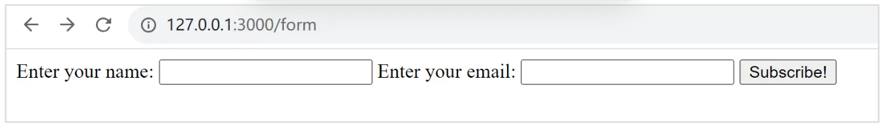
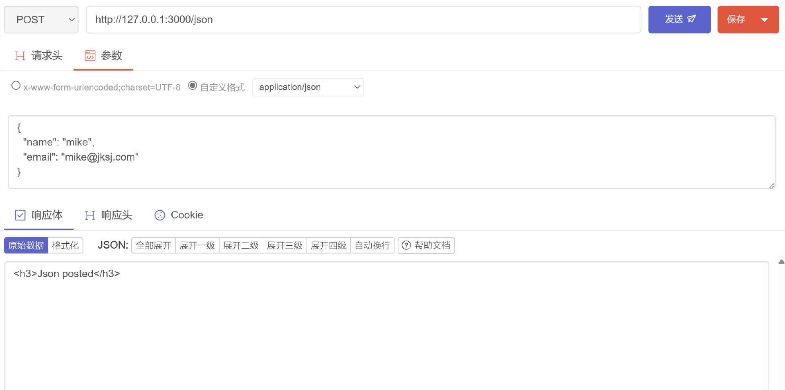
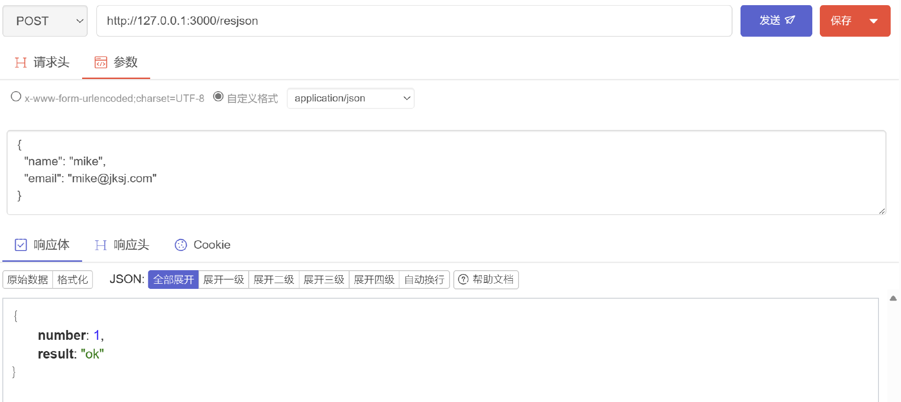
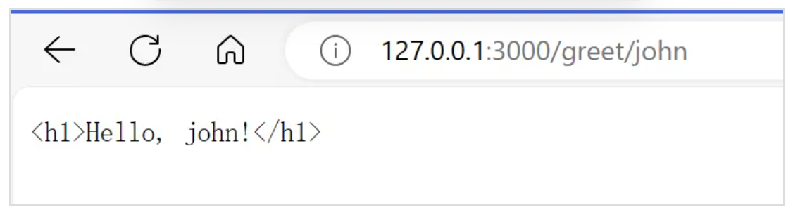
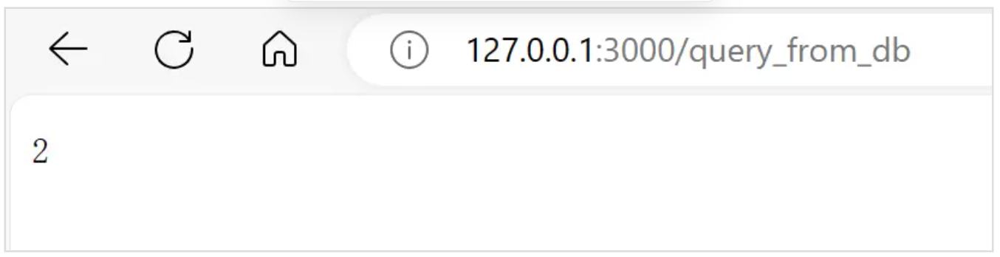
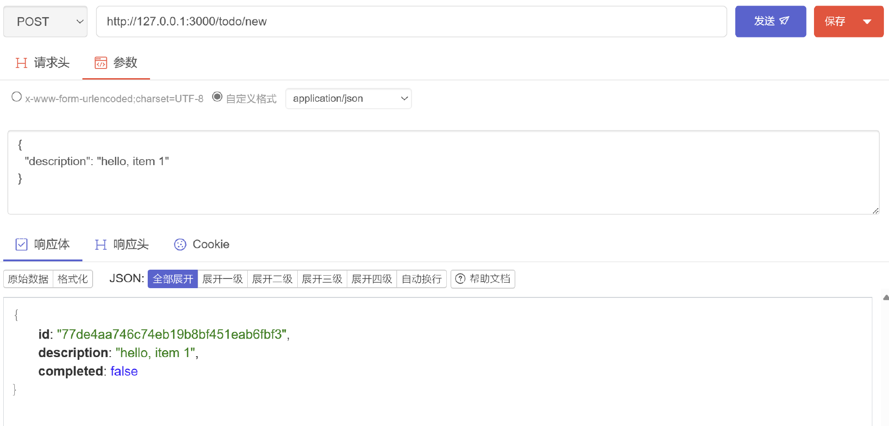
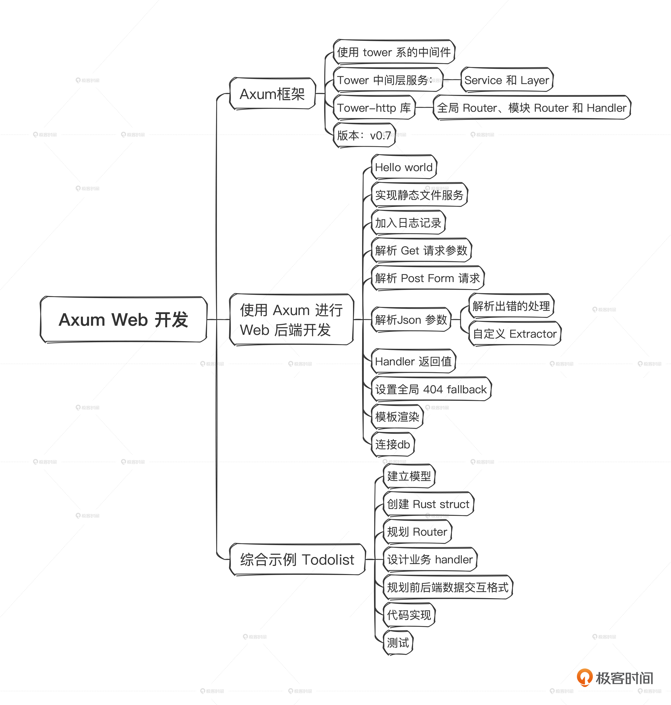

# 22｜Web开发（下）：如何实现一个Todo List应用？
你好，我是Mike，今天我们继续讲如何使用Axum开发Web后端。学完这节课的内容后，你应该能使用Axum独立开发一个简单的Web后端应用了。

第21讲，我们已经讲到了第4步，处理Get query请求，拿到query中的参数。下面我们讲如何处理Post请求并拿到参数。

这节课的代码适用于 Axum v0.7 版本。

## 基本步骤

### 第五步：解析 Post 请求参数

当我们想向服务端提交一些数据的时候，一般使用HTTP POST方法。Post的数据会放在HTTP的body中，在HTML页面上，通常会使用表单form收集数据。

和前面的Query差不多，Axum给我们提供了Form解包器，可以方便地取得form表单数据。你可以参考下面的示例。

```plain
#[derive(Deserialize, Debug)]
struct Input {
    name: String,
    email: String,
}

async fn accept_form(Form(input): Form<Input>) -> Html<&'static str> {
    tracing::debug!("form params {:?}", input);

    Html("<h3>Form posted</h3>")
}

```

可以看到，相比于前面的Query示例，form示例代码结构完全一致，只是解包器由Query换成了 Form。这体现了Axum具有相当良好的人体工程学，让我们非常省力。

我们这里在结构体上derive了 Deserialize，它是serde库提供的反序列化宏。serde库是Rust生态中用得最广泛的序列化和反序列化框架。

要测试Post请求，你需要安装一个浏览器插件，比如 Postman，它可以让你在浏览器中方便地构建一个Form格式的Post请求。

完整代码示例在 [这里](https://github.com/miketang84/jikeshijian/tree/master/2122-axumapp_stepbystep/axumapp05_form)，这个示例运行后，访问 `http://127.0.0.1:3000/form`，会出现一个表单。



在表单中填入数据后，可以观察到日志输出像下面这个样子：

```plain
2023-12-11T07:08:33.520071Z DEBUG axumapp05: listening on 127.0.0.1:3000
2023-12-11T07:08:33.720071Z DEBUG request{method=GET uri=/ version=HTTP/1.1}: tower_http::trace::on_request: started processing request
2023-12-11T07:08:33.720274Z DEBUG request{method=GET uri=/ version=HTTP/1.1}: tower_http::trace::on_response: finished processing request latency=0 ms status=200
2023-12-11T07:08:33.833684Z DEBUG request{method=GET uri=/favicon.ico version=HTTP/1.1}: tower_http::trace::on_request: started processing request
2023-12-11T07:08:33.833779Z DEBUG request{method=GET uri=/favicon.ico version=HTTP/1.1}: tower_http::trace::on_response: finished processing request latency=0 ms status=404
2023-12-11T07:09:09.309848Z DEBUG request{method=GET uri=/form version=HTTP/1.1}: tower_http::trace::on_request: started processing request
2023-12-11T07:09:09.309975Z DEBUG request{method=GET uri=/form version=HTTP/1.1}: tower_http::trace::on_response: finished processing request latency=0 ms status=200
2023-12-11T07:09:13.964549Z DEBUG request{method=POST uri=/form version=HTTP/1.1}: tower_http::trace::on_request: started processing request
2023-12-11T07:09:13.964713Z DEBUG request{method=POST uri=/form version=HTTP/1.1}: axumapp05: form params Input { name: "111", email: "2222" }
2023-12-11T07:09:13.964796Z DEBUG request{method=POST uri=/form version=HTTP/1.1}: tower_http::trace::on_response: finished processing request latency=0 ms status=200

```

我们可以看到，在日志的第9行 form 表单的数据已经解析出来了。

下一步我们研究如何处理传上来的Json格式的请求。

### 第六步：解析 Json 请求参数

在现代Web开发中，发POST请求更多的时候是提交Json数据，这时HTTP请求的content-type 是 application/json。这种情况Axum应该怎么处理呢？

还是一样的，非常简单。Axum提供了解包器Json，只需要把参数解包器修改一下就可以了，解析后的类型都不用变。你可以看一下修改后的代码。

```plain
#[derive(Deserialize, Debug)]
struct Input {
    name: String,
    email: String,
}

async fn accept_json(Json(input): Json<Input>) -> Html<&'static str> {
    tracing::debug!("json params {:?}", input);
    Html("<h3>Json posted</h3>")
}

```

完整代码示例在 [这里](https://github.com/miketang84/jikeshijian/tree/master/2122-axumapp_stepbystep/axumapp06_jsoninput)。这种Post请求在浏览器URL地址栏里面就不太好测试了。最好安装Postman等工具来测试。我用的Postwoman插件操作界面如下：



控制台log输出为：

```plain
2023-12-11T07:37:02.093884Z DEBUG axumapp06: listening on 127.0.0.1:3000
2023-12-11T07:37:07.665064Z DEBUG request{method=POST uri=/json version=HTTP/1.1}: tower_http::trace::on_request: started processing request
2023-12-11T07:37:07.665244Z DEBUG request{method=POST uri=/json version=HTTP/1.1}: axumapp06: json params Input { name: "mike", email: "mike@jksj.com" }
2023-12-11T07:37:07.665309Z DEBUG request{method=POST uri=/json version=HTTP/1.1}: tower_http::trace::on_response: finished processing request latency=0 ms status=200

```

可以看到，我们成功解析出了json参数，并转换成了Rust结构体。

截止目前，我们接触到了三个解包器：Query、Form、Json。Axum还内置很多高级解包器，感兴趣的话你可以点击这个 [链接](https://docs.rs/axum/latest/axum/extract/index.html) 了解一下。

### 解析出错了怎么办？

这里我们先暂停一下，回头想想。Axum帮我们自动做了参数的解析，这点固然很好、很方便。但是，如果参数没有解析成功，Axum就会自动返回一些信息，而这些信息我们根本没有接触到，好像也不能控制，这就一点也不灵活了。

Axum的设计者其实考虑到了这个问题，也提供了相应的解决方案——Rejection。只需要在写解包器的时候，把参数类型改成使用 Result 包起来，Result的错误类型为相应的解包器对应的Rejection类型就行了。比如Json解包器就对应JsonRejection，Form解包器就对应FormRejection。

```plain
async fn create_user(payload: Result<Json<Value>, JsonRejection>) {

```

用这种方式，我们能获得解析被驳回的详细错误原因，还可以根据这些原因来具体处理。比如我们可以返回自定义的错误信息模板。

比如：

```plain
use axum::{
    extract::{Json, rejection::JsonRejection},
    routing::post,
    Router,
};
use serde_json::Value;
async fn create_user(payload: Result<Json<Value>, JsonRejection>) {
    match payload {
        Ok(payload) => {
            // We got a valid JSON payload
        }
        Err(JsonRejection::MissingJsonContentType(_)) => {
            // Request didn't have `Content-Type: application/json`
            // header
        }
        Err(JsonRejection::JsonDataError(_)) => {
            // Couldn't deserialize the body into the target type
        }
        Err(JsonRejection::JsonSyntaxError(_)) => {
            // Syntax error in the body
        }
        Err(JsonRejection::BytesRejection(_)) => {
            // Failed to extract the request body
        }
        Err(_) => {
            // `JsonRejection` is marked `#[non_exhaustive]` so match must
            // include a catch-all case.
        }
    }
}
let app = Router::new().route("/users", post(create_user));

```

更多详细的Rejection的信息，请参考 [这里](https://docs.rs/axum/latest/axum/extract/rejection/index.html)。

### 自定义Extractor

当然，面对业务的千变万化，Axum还给了我们自定义解包器的能力。平时用得不多，但必要的时候你不会感觉被限制住。

这方面的内容属于扩展内容，有兴趣的话你可以自己研究一下。请参考 [这里](https://docs.rs/axum/latest/axum/extract/index.html#defining-custom-extractors)。

### 第七步：Handler返回值

Axum handler的返回类型也很灵活。除了前面例子里提到的 HTML 类型的返回之外，常见的还有 String、Json、Redirect 等类型。实际上，只要实现了 IntoResponse 这个 trait 的类型，都能用作 handler 的返回值。Axum会根据返回值的类型，对Http Response 的status code和header等进行自动配置，减少了开发者对细节的处理。

比如返回一个HTML：

```plain
async fn query(Json(params): Json<InputParams>) -> impl IntoResponse {
    Html("<h3>Test json</h3>")
}

```

返回一个String：

```plain
async fn query(Json(params): Json<InputParams>) -> impl IntoResponse {
    "Hello, world".
}

```

返回一个Json：

```plain
async fn query(Json(params): Json<InputParams>) -> impl IntoResponse {
    let ajson = ...;
    Json(ajson)
}

```

从上面代码中可以看到，在Axum里Json既是解包器，又可以用在response里面。

在Rust中，借助serde\_json提供的json!宏，你可以像下面这样方便地构造Json对象：

```plain
async fn accept_json(Json(input): Json<Input>) -> impl IntoResponse {
    tracing::debug!("json params {:?}", input);
    Json(json!({
        "result": "ok",
        "number": 1,
    }))
}

```

你还可以返回一个Redirect，自动重定向页面。

```plain
async fn query(Json(params): Json<InputParams>) -> impl IntoResponse {
    Redirect::to("/")
}

```

你甚至可以返回一个 `(StatusCode, String)`。

```plain
async fn query(Json(params): Json<InputParams>) -> impl IntoResponse {
    (StatusCode::Ok, "Hello, world!")
}

```

可以看到，形式变化多端，非常灵活。至于你可以返回哪些形式，可以在 [这里](https://docs.rs/axum/latest/axum/response/trait.IntoResponse.html#foreign-impls) 看到。

注意，如果一个handler里需要返回两个或多个不同的类型，那么需要调用 .into\_response() 转换一下。这里你可以回顾一下 [第14讲](https://time.geekbang.org/column/article/726207) 的知识点：impl trait 这种在函数中的写法，本质上仍然是编译期单态化，每次编译都会替换成一个具体的类型。

```plain
async fn query(Json(params): Json<InputParams>) -> impl IntoResponse {
    if some_flag {
        let ajson = ...;
        Json(ajson).into_response()
    } else {
        Redirect::to("/").into_response()
    }
}

```

有没有感觉到一丝丝震撼。Rust虽然是强类型语言，但是感觉Axum把它玩出了弱（动态）类型语言的效果。这固然是Axum的优秀之处，不过主要还是Rust太牛了。

关于返回Json的完整示例，请参考 [这里](https://github.com/miketang84/jikeshijian/tree/master/2122-axumapp_stepbystep/axumapp07_jsonres)。

测试效果图：



### 第八步：全局404 Fallback

有时，我们希望给全局的Router添加一个统一的404自定义页面，这在Axum中很简单，只需要一句话，像下面这样：

```plain
    let app = Router::new()
        .route("/", get(handler))
        .route("/query", get(query))
        .route("/form", get(show_form).post(accept_form))
        .route("/json", post(accept_json));

    let app = app.fallback(handler_404);

```

上面第7行就给没有匹配到任何一个url pattern的情况配置了一个 fallback，给了一个 404 handler，你自行在那个handler里面写你的处理逻辑就好了，比如直接返回一个404页面。

完整代码示例在 [这里](https://github.com/miketang84/jikeshijian/tree/master/2122-axumapp_stepbystep/axumapp08_global404)。

### 第九步：模板渲染

这里的模板渲染指服务端渲染，一般是在服务端渲染HTML页面。在Rust生态中有非常多的模板渲染库。常见的有 Askama、Terra等。这里我们以Askama为例来介绍一下。

Askama是一种Jinja-like语法的模板渲染引擎，支持使用Rust语言在模板中写逻辑。作为模板渲染库，它很有Rust的味道， **通过类型来保证写出的模板是正确的**。如果模板中有任何非逻辑错误，在编译的时候就能发现问题。带来的直接效果就是，可以节约开发者大量调试页面模板的时间。凡是使用过的人，都体会到了其中的便利。

先引入 askama。

```plain
cargo add askama

```

使用的时候，也很简单，你可以参考下面的代码示例。

```plain
#[derive(Template)]
#[template(path = "hello.html")]
struct HelloTemplate {
    name: String,
}

async fn greet(Path(name): Path<String>) -> impl IntoResponse {
    HelloTemplate { name } .to_string()
}

```

模板中使用的是Jinja语法，这是一种很常见的模板语法，如果不了解的可查阅 [相关资料](https://docs.jinkan.org/docs/jinja2/)。Askama的完整文档，请参考 [链接](https://djc.github.io/askama/askama.html)

本小节完整可运行示例，请参考 [这里](https://github.com/miketang84/jikeshijian/tree/master/2122-axumapp_stepbystep/axumapp09_template)。

运行效果：



### 第十步：使用连接池连接 PostgreSQL DB

一个真正的互联网应用大部分情况下都会用数据库来存储数据。因此，操作数据库是最常见的需求，而Axum就内置了这方面的支持。下面我们用 Postgres 来举例。

一般来讲，我们会定义一个全局应用状态，把所有需要全局共享的信息放进去。

```plain
struct AppState {
    // ...
}

```

全局状态能够被所有handler、中间件layer访问到，是一种非常有效的设计模式。

在下面示例中，我们用 Pool::builder()创建一个连接池对象，并传送到AppState的实例里。

```plain
let manager = PostgresConnectionManager::new_from_stringlike(
        "host=localhost user=postgres dbname=postgres password=123456",
        NoTls,
    )
    .unwrap();
let pool = Pool::builder().build(manager).await.unwrap();

let app_state = AppState { dbpool: pool};

```

再使用 router 的 .with\_state() 方法就可以把这个全局状态传递到每一个handler和中间件里了。

```plain
.with_state(app_state);

```

另一方面，在 handler 中使用 State 解包器来解出 app\_state 。

```plain
async fn handler(
    State(app_state): State<AppState>,
) {
    // use `app_state`...
}

```

这里，取出来的这个app\_state 就是前面创建的AppState的实例，在handler里直接使用就可以了。

当然除了上面的这些知识，你还需要在本地环境安装 PostgreSQL，或使用 Docker Compose 之类的工具快速构建依赖环境。这个步骤的完整可运行的代码在 [这里](https://github.com/miketang84/jikeshijian/tree/master/2122-axumapp_stepbystep/axumapp10_db)，你可以在安装好PostgreSQL数据库后，设置好数据库的密码等配置，编译此代码连上去测试。

在Ubuntu/Debian下，安装配置PostgreSQL可能用到的指令有下面这几种。

```plain
sudo apt install postgresql
sudo su postgres
psql
postgres=# ALTER USER postgres WITH PASSWORD '123456'; # 配置默认用户密码

```

测试界面：



这个示例输出log类似如下：

```plain
2023-12-11T09:20:41.919226Z DEBUG axumapp10: listening on 127.0.0.1:3000
2023-12-11T09:20:50.224031Z DEBUG request{method=GET uri=/query_from_db version=HTTP/1.1}: tower_http::trace::on_request: started processing request
2023-12-11T09:20:50.224099Z DEBUG request{method=GET uri=/query_from_db version=HTTP/1.1}: axumapp10: get db conn Pool(PoolInner(0x557c6994ed80))
2023-12-11T09:20:50.255306Z DEBUG request{method=GET uri=/query_from_db version=HTTP/1.1}: axumapp10: query_from_db: 1
2023-12-11T09:20:50.256060Z DEBUG request{method=GET uri=/query_from_db version=HTTP/1.1}: axumapp10: query_from_db: 2
2023-12-11T09:20:50.256109Z DEBUG request{method=GET uri=/query_from_db version=HTTP/1.1}: axumapp10: query_from_db: 3
2023-12-11T09:20:50.256134Z DEBUG request{method=GET uri=/query_from_db version=HTTP/1.1}: axumapp10: calc_result 2
2023-12-11T09:20:50.256218Z DEBUG request{method=GET uri=/query_from_db version=HTTP/1.1}: tower_http::trace::on_response: finished processing request latency=32 ms status=200

```

跟我们预期一致，说明成功连上了数据库。

下面，我们通过一个综合示例，把这些工作整合起来，构建一个Todo List应用的后端服务。

## 综合示例：实现一个 Todo List 应用

TodoList是最常见的Web应用示例，相当于前后端分离型Web应用领域中的Helloworld。一般说来，我们要做一个简单的互联网应用，最基本的步骤有下面几个：

1. 设计准备db schema。
2. 对应 db schema 生成对应的 Rust model types。
3. 规划 Router，加入需要的 http endpoints。
4. 规划 handlers。
5. 规划前后端数据交互方式，是用 form 格式还是 json 格式前后端交互数据，或者是否统一使用 Graphql 进行query和mutation。
6. 代码实现。
7. 测试。

下面我们就按照这个流程一步步来实现。

### 第一步：建立模型

这一步需要你对sql数据库的基本操作有一些了解。这里我们要创建数据库和表。

创建数据库：

```plain
create database todolist;

```

在 psql 中 使用 `\c todolist` 连上刚创建的todolist数据库，然后创建表。

```plain
create table todo (
   id varchar not null,
   description varchar not null,
   completed bool not null);

```

然后在psql中使用 `\d` 指令查看已经创建好的table。

```plain
todolist=# \d
        List of relations
 Schema | Name | Type  |  Owner
--------+------+-------+----------
 public | todo | table | postgres
(1 row)

```

如果你对SQL还不太熟悉，这里有一个简单的教程可供参考： [PostgreSQL 教程 \| 菜鸟教程 (runoob.com)](https://www.runoob.com/postgresql/postgresql-tutorial.html)

### 第二步：创建对应的Rust Struct

对应上面创建的todo table，我们设计出如下结构体类型：

```plain
#[derive(Debug, Serialize, Clone)]
struct Todo {
    id: String,
    description: String,
    completed: bool,
}

```

### 第三步：规划Router

Todolist会有增删改查的操作，也就是4个基本的url endpoints。另外，需要将数据库连接的全局状态传到各个handler中。

```plain
let app = Router::new()
    .route("/todos", get(todos_list))
    .route("/todo/new", post(todo_create))
    .route("/todo/update", post(todo_update))
    .route("/todo/delete/:id", post(todo_delete))
    .with_state(pool);

```

我们在这里添加了4个URL，分别对应query list、create、update、delete 四种操作。

### 第四步：设计业务对应的handler

一个标准的Todo List的后端服务，只需要对Todo模型做基本的增删改查就可以了。

1. create 创建一个Todo item。
2. update 更新一个Todo item。
3. delete 删除一个Todo item。
4. query list，加载一个Todo item list。在这个TodoList应用里，我们不需要对一个具体的item做query。

于是对应的，我们会有4个handlers。我们先把框架写出来。

```plain
async fn todo_create(
    State(pool): State<ConnectionPool>,
    Json(input): Json<CreateTodo>,
) -> Result<(StatusCode, Json<Todo>), (StatusCode, String)> {

async fn todo_update(
    State(pool): State<ConnectionPool>,
    Json(utodo): Json<UpdateTodo>,
) -> Result<(StatusCode, Json<String>), (StatusCode, String)> {

async fn todo_delete(
    Path(id): Path<String>,
    State(pool): State<ConnectionPool>,
) -> Result<(StatusCode, Json<String>), (StatusCode, String)> {

async fn todos_list(
    pagination: Option<Query<Pagination>>,
    State(pool): State<ConnectionPool>,
) -> Result<Json<Vec<Todo>>, (StatusCode, String)> {

```

上面我们设计好了 4 个handler的函数签名，这就相当于我们写了书的目录，后面要完成哪些东西就能心中有数了。函数签名里有一些信息还需要补充，比如HTTP请求上来后的入参类型。

下面定义了创建新item和更新item的入参DTO（data transform object），用来在Axum里把Http Request的参数信息直接转化成Rust的struct类型。

```plain
#[derive(Debug, Deserialize)]
struct CreateTodo {
    description: String,
}

#[derive(Debug, Deserialize)]
struct UpdateTodo {
    id: String,
    description: Option<String>,
    completed: Option<bool>,
}

```

有了这些类型，Axum会自动为我们做转换工作，我们在handler中拿到这些类型的实例，就可以直接写业务了。

### 第五步：规划前后端的数据交互方式

这一步需要做4件事情。

- query参数放在URL里面，用GET指令提交。
- delete操作的参数放在path里面，用 /todo/delete/:id 这种形式表达。
- create和update参数是放在body里面，用POST指令提交，用json格式上传。
- 从服务端返回给前端的数据都是以json格式返回。

这一步定义好了，就可以重新审视一下4个handler的函数签名，看是否符合我们的要求。

### 第六步：代码实现

前面那些步骤设计规划好后，实现代码就是一件非常轻松的事情了。基本上就是按照Axum的要求，写出相应的部分就行了。

你可以看一下完整可运行的 [示例](https://github.com/miketang84/jikeshijian/tree/master/2122-axumapp_stepbystep/axumapp11_todo)。在示例里，我们使用了bb8这个数据库连接池来连接pg数据库。这样我们就不需要去担心连接断开、重连这些底层的琐事了。

### 第七步：测试

一般，测试后端服务有几种方式：

1. 框架的单元和集成测试方法，不同的框架有不同的实现和使用方式，Axum里也有配套的设施。
2. Curl 命令行脚本测试。
3. Web浏览器插件工具测试。

三种方式并不冲突，是相互补充的。第3种方式常见的有Postman这种浏览器插件，它们可以很方便地帮我们对Web应用进行测试。

测试创建一个Item：



我们也可以多创建几个。

以下是创建了5个item的list返回，通过Get 方法访问 `http://127.0.0.1:3000/todos`。

```plain
[
{
"id": "77de4aa746c74eb19b8bf451eab6fbf3",
"description": "hello, item 1",
"completed": false
},
{
"id": "3c158df02c724695ac67d4cbff180717",
"description": "hello, item 2",
"completed": false
},
{
"id": "0c687f7b4d4442dc9c3381cc4d0e4a1d",
"description": "hello, item 3",
"completed": false
},
{
"id": "df0bb07aa0f84696896ad86d8f13a61c",
"description": "hello, item 4",
"completed": false
},
{
"id": "3ec8f48f5fd34cf9afa299427066ef35",
"description": "hello, item 5",
"completed": false
}
]

```

其他的更新和删除操作，你可以自己动手测试一下。

你阅读代码时，有3个地方需要注意：

1. 注意参数传入中的可省参数 Option 的处理。
2. handler的返回值用的Result，请注意业务处理过程中的错误转换。
3. pg db 的操作，因为我们没有使用ORM这种东西，因此纯靠手动拼sql字符串，并且手动转换从pg db返回的row值的类型。这比较原始，也比较容易出错。但是对于我们学习来讲，是有好处的。后面你做Web应用的时候，可以选择一个ORM，Rust生态中比较出名的有 sqlx、SeaORM、Rbatis 等。

## 小结

这节课我们学会了如何使用Axum进行Web后端开发。Web开发本身是一个庞大的领域，要精通需要花费大量的时间。我通过两节课的时间，抽出了里面的思路和重要步骤，快速带你体验了如何实现一个todolist app。

这节课我们贯彻了循序渐进的学习方式。先对大目标进行分解，了解要完成一个目标之前，需要掌握多少基础的知识点。然后，就一点一点去掌握好，理解透。这样一步一步把积木搭上来，实际也花不了多少时间。这实际是一种似慢实快的方法。在Rust中，这种方法比那种先总体瞟一眼教程，直接动手做开发，不清楚的地方再去查阅相关资料的方式，效果要好一些，并且会扎实很多。

Axum是一个相当强大灵活的框架，里面还有很多东西（比如：如何写一个中间件，自定义extractor，如何处理流文件上传等）值得你去探索。好在，我们已经掌握了Axum的基本使用方法了，Web开发的特点让我们可以小步快跑，一点一点加功能，能立即看到效果。只要肯花时间，这些都不是问题。



## 思考题

当Axum Handler中有多个参数的时候，你可以试着改变一下参数的顺序，看看效果有没有变化。并在这个基础上说一说你对 [声明式参数](https://docs.rs/axum/latest/axum/index.html#high-level-features) 概念的理解。

请你展开聊一聊，欢迎你留言和我分享、讨论，也欢迎你把这节课的内容分享给其他朋友，邀他一起学习，我们下节课再见！