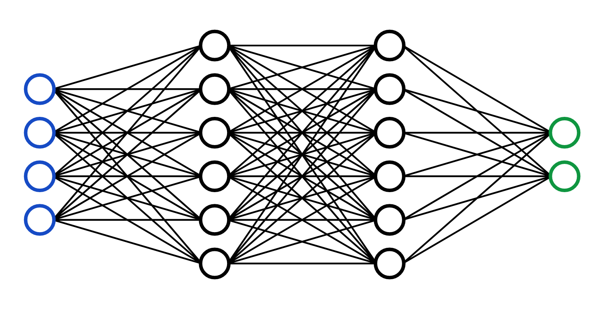
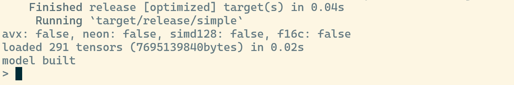
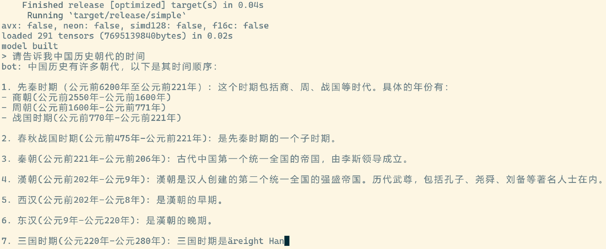

# 23｜Rust与大模型：用 Candle 做一个聊天机器人
你好，我是Mike。今天我们来聊一聊如何用Rust做一个基于大语言模型的聊天机器人。

大语言模型（LLM）是2023年最火的领域，没有之一。这波热潮是由OpenAI的ChatGPT在今年上半年发布后引起的，之后全世界的研究机构和科技公司都卷入了大模型的竞争中。目前业界应用大模型训练及推理的主要语言是Python和C/C++。Python一般用来实现上层框架，而C/C++一般起底层高性能执行的作用，比如著名的框架 PyTorch，它的上层业务层面是用Python写的，下层执行层面由C执行，因为GPU加速的部分只能由C/C++来调用。

看起来大语言模型好像和Rust没什么关系，必须承认，由于历史积累的原因，在AI这一块儿Rust的影响力还非常小。但从另一方面来讲呢，Rust是目前业界除Python、C++ 外，唯一有潜力在未来20年的AI 发展中发挥重要作用的语言了。为什么这么说呢？

首先Rust的性能与C/C++一致，并且在调用GPU能力方面也同样方便；其次，Rust强大的表达能力，不输于Python，这让人们使用Rust做业务并不难；然后，Rust的cargo编译成单文件的能力，以及对WebAssembly完善的支持，部署应用的时候非常方便，这比Py + C/C++组合需要安装的一堆依赖和数G的库方便太多。

目前Rust生态中其实已经有很多AI相关的基础设施了，你可以从我给出的 [链接](https://www.arewelearningyet.com/) 里找到。

世界上最大的机器学习模型仓库平台 HuggingFace（机器学习领域的Github） 推出了 Rust 机器学习框架 [Candle](https://github.com/huggingface/candle)。在这个官方代码仓库上，HuggingFace上解释了为什么要做一个Rust的机器学习框架。

1. Candle上云端的 Serverless 推理可行。PyTorch那一套体积太大，安装完得几个G，而Candle编译后的可执行文件才十几M到几十M。
2. Candle可以让你避免Python的 [GIL](https://www.backblaze.com/blog/the-python-gil-past-present-and-future/)，从而提高性能。
3. HuggingFace已经用Rust写了不少基础工具了，比如 [safetensors](https://github.com/huggingface/safetensors) 和 [tokenizers](https://github.com/huggingface/tokenizers)。

Elon Musk的 [x.ai](https://x.ai/) 发布后，页面上也有一段对Rust的溢美之词：Rust被证明是一个理想的选择，用于构建可扩展的、可靠的、可维护性的基础设施。它提供了高性能、丰富的生态系统，它能阻止大部分错误，这些错误在分布式系统中经常会碰到。由于我们的团队规模很小，基础设施的可靠性就显得至关重要，否则维护工作会浪费大量创新的时间。Rust给我们提供了信心，任何的代码修改或重构都可以产出可工作的程序，并且在最小监管下可以持续运行好几个月（而不会出问题）。

Musk甚至说Rust语言是未来 [构建 AGI](https://zhuanlan.zhihu.com/p/648565007) 的语言。

在使用Rust尝试做聊天机器人之前，我们先来了解一下相关的背景知识。

## 大语言模型背景知识

这节课我们还是主要讲Rust及Rust的应用，所以相关的背景知识我们就简单概括一下。

机器学习（Machine Learning，ML）泛指用计算机对数据集按照一定的算法进行数据处理、分析、聚类、回归等。在执行前，人往往不知道结果是什么，所以叫机器学习。机器学习可以用于自动提取信息，自动或辅助人类做决策。

而神经网络（Neural Network）是机器学习的一类算法，它是模拟人的大脑神经元和连接的一种算法。目前整个业界投入资源最多的就是在这类算法上面，在这个类别中的创新也是最多的，有种观点认为神经网络算法是通向真正的AI最可能正确的路径。



而深度学习（Deep Learning），其实就是层次很多很深的神经网络。你可以想象，层次越深，节点数（图里那些圈）越多，就越能模拟大脑。但是深度学习带来的问题就是，层次越深，节点数越多，则那些线（就是权重值）就会越多，呈指数级增长，那么计算量就会越来越大。其实之前十几、二十年AI进展不大，主要就是因为这个计算能力限制了。

通过无数人的探索，我们发现可以把深度学习的计算并行化，优化了很多工程上的算法。这样就能够在大家熟悉的主要用来玩游戏的GPU显卡上运行，大大提高了计算速度。这个视角，二十多年前Nvidia的老黄就看明白了，早早地提供好了基础设施，CUDA、CUDNN等。所以现在你就看到了，一卡难求，已经严重影响到了游戏玩家的生存。

### ChatGPT与LLaMA

那么ChatGPT是什么呢？英文是Chat Generative Pre-trained Transformer，是OpenAI提供的在线AI对话服务，具有令人惊叹的理解能力和回答能力。你可以把ChatGPT理解成一个为对话调优的预训练转换模型。GPT 3 有 1750 亿参数，有传言GPT 4 有 1.76万亿参数。参数是什么，就是图中节点之间的连线，你可以想象一下1750亿根线的场景。

OpenAI搞出了ChatGPT，让全世界惊掉了下巴，但是它是闭源的。于是Meta公司（前Facebook）的Yann LeCun（图灵奖得主）团队，搞了一个开源版本的GPT，叫 LLaMA。它也是在巨量的源数据集上进行的训练，生成了 70亿（7B），130亿（13B），650亿（65B）三个版本参数的大模型文件，可以供业界做学习和研究使用。现在已推出LLaMA 2，正在做LLaMA 3。

LLaMA搞出来后，掀起了LLM界的狂欢。全世界的团队在LLaMA的基础上，继续调优，推出了各种各样的大模型。比如国内清华的 ChatGLM, 零一万物的 Yi。国外的 Mistral、OpenChat、Starling 等。这块儿非常卷，大家都在争相推出自己调优后的版本，每天早上睡醒起来，都发现又推出了几个新的LLM。

这些训练好后的文件一般从几个G到几十G不等，也有几百G的。要运行它们，得有非常强大的机器才行。比如7B 的 LLaMA 2 文件，每个权重为一个 f16 浮点数，占两个字节，所以可以估算出要运行 LLaMA 2 模型，起码得有 14G 的内存或显存。内存还好，显存超过14G的个人用户真不多。并且，LLaMA2的模型文件是PyTorch导出的，只能由PyTorch框架来运行。

### llama.cpp与量子化方法

车到山前必有路，大神 Georgi Gerganov 搞了一个项目： [llama.cpp](https://github.com/ggerganov/llama.cpp)。它是一个用C/C++重新实现引擎的版本，不需要安装PyTorch，就可以运行LLaMA 2模型文件。最关键的是，它提出了一种量子化（quantization）方法，可以将权重从 16 位量子化到8位、6位、5位、4位，甚至2位。这样，就相当于等比缩小了占用内存的规模。比如，一个4位量子化版本的LLaMA 2 7B模型，就只需要不到4G的内存/显存就能运行。这样，就能适配大多数的个人计算机了。

这种量子化方法是个重大创新，它直接促进了LLM生态的进一步繁荣。现在HuggingFace上有大量量子化后的模型，比如 [openchat\_3.5.Q4\_K\_M.gguf](https://huggingface.co/TheBloke/openchat_3.5-GGUF/blob/main/openchat_3.5.Q4_K_M.gguf) 就是一个OpenChat的4位量子化的版本。我们下载的时候，直接下载这些量子化后的模型文件就可以了。

请注意，这些文件是训练后的成品，我们下载它是用来做推理（infer）的，而不是训练（train）的。当然，我们可以在这些成品模型上运行调优（fine tune）。

### 大模型文件格式

目前HuggingFace上有几种常见的LLM文件格式。

- bin格式：Pytorch导出的模型文件格式
- safetensors格式：HuggingFace定义的一种新的模型文件格式，有可能成为未来的主流格式。HuggingFace用Rust实现safetensors格式的解析，并导出为Py接口，请参见 [链接](https://huggingface.co/docs/safetensors/index)。
- ggml格式：llama.cpp 项目量子化模型的前期模型格式。
- gguf格式：llama.cpp项目量子化模型的后期模型格式，也是现在主流的量子化LLM格式。

### Rust的机器学习框架

Rust生态现在有几个比较不错的ML框架，最好的两个是： [Candle](https://github.com/huggingface/candle) 和 [burn](https://github.com/Tracel-AI/burn)。后续，我们以Candle为例来介绍。

## Candle介绍

据Candle官网介绍，它是一个极小主义机器学习框架，也就是没什么依赖，不像Pytorch那样装一堆东西，部署起来很麻烦。但其实它也能用来训练。

它有下面这些特性：

- HuggingFace出品。近水楼台先得月，Candle几乎能支持HuggingFace上所有的模型（有的需要经过转换）。
- 语法简单，跟PyTorch差不多。
- CPU、Cuda、Metal的支持。
- 让serverless和快速部署成为可能。
- 模型训练。
- 分布式计算（通过NCCL）。
- 开箱即用的模型支持，LLaMA、Whisper、 Falcon 等等。

Candle不仅仅是大模型深度学习框架，它还是一个机器学习框架，因此它也支持其他的机器学习算法和强化学习（reinforcement learning）。下面我们就来看看如何利用Candle框架做一个聊天机器人。

注：这节课的代码适用于 candle\_core v0.3 版本。

## 使用Candle做一个聊天机器人

### 下载模型文件

我对一些大模型进行了测试，发现OpenChat的对话效果比较好，所以下面我们用OpenChat LLM来进行展示。我们会用 [quantized 8bit](https://huggingface.co/TheBloke/openchat_3.5-GGUF/blob/main/openchat_3.5.Q8_0.gguf) 的版本。其实 4bit 的版本也是可以的，效果也非常好。

Candle 官方的示例比较复杂，我为这个课程定制了一个更简单的独立运行的 [示例](https://github.com/miketang84/jikeshijian/tree/master/23-candle_chat)。你可以将这个仓库克隆下来，进入目录。在运行代码之前，下载模型文件和tokenizer.json文件。

```plain
与代码目录同级的位置，创建一个目录
mkdir hf_hub
进入这个目录，请下载
https://huggingface.co/TheBloke/openchat_3.5-GGUF/blob/main/openchat_3.5.Q8_0.gguf
和
https://huggingface.co/openchat/openchat_3.5/blob/main/tokenizer.json
将这个 tokenizer.json 重命名为 openchat_3.5_tokenizer.json

```

目录结构：

```plain
23-candle_chat/
    Cargo.toml
    src/
hf_hub/
    openchat_3.5_tokenizer.json
    openchat_3.5.Q8_0.gguf

```

### 运行演示

然后，进入 23-candle\_chat/ 运行：

```plain
cargo run --release --bin simple

```

出现如下界面，就可以聊天了。



下面是我问的一个问题，bot的回答好像有点问题，这个模型用英文问的效果会好一些。



### 代码讲解

你可以看一下代码。

```plain
#![allow(unused)]

use std::fs::File;
use std::io::Write;
use std::path::PathBuf;
use tokenizers::Tokenizer;

use candle_core::quantized::gguf_file;
use candle_core::utils;
use candle_core::{Device, Tensor};
use candle_transformers::generation::LogitsProcessor;
use candle_transformers::models::quantized_llama as quantized_model;

use anyhow::Result;

mod token_output_stream;
use token_output_stream::TokenOutputStream;

struct Args {
    tokenizer: String,
    model: String,
    sample_len: usize,
    temperature: f64,
    seed: u64,
    repeat_penalty: f32,
    repeat_last_n: usize,
    gqa: usize,
}

impl Args {
    fn tokenizer(&self) -> Result<Tokenizer> {
        let tokenizer_path = PathBuf::from(&self.tokenizer);
        Tokenizer::from_file(tokenizer_path).map_err(anyhow::Error::msg)
    }

    fn model(&self) -> Result<PathBuf> {
        Ok(std::path::PathBuf::from(&self.model))
    }
}

fn main() -> anyhow::Result<()> {
    println!(
        "avx: {}, neon: {}, simd128: {}, f16c: {}",
        utils::with_avx(),
        utils::with_neon(),
        utils::with_simd128(),
        utils::with_f16c()
    );

    let args = Args {
        tokenizer: String::from("../hf_hub/openchat_3.5_tokenizer.json"),
        model: String::from("../hf_hub/openchat_3.5.Q8_0.gguf"),
        sample_len: 1000,
        temperature: 0.8,
        seed: 299792458,
        repeat_penalty: 1.1,
        repeat_last_n: 64,
        gqa: 8,
    };

    // load model
    let model_path = args.model()?;
    let mut file = File::open(&model_path)?;
    let start = std::time::Instant::now();

    // This is the model instance
    let model = gguf_file::Content::read(&mut file)?;
    let mut total_size_in_bytes = 0;
    for (_, tensor) in model.tensor_infos.iter() {
        let elem_count = tensor.shape.elem_count();
        total_size_in_bytes +=
            elem_count * tensor.ggml_dtype.type_size() / tensor.ggml_dtype.blck_size();
    }
    println!(
        "loaded {:?} tensors ({}bytes) in {:.2}s",
        model.tensor_infos.len(),
        total_size_in_bytes,
        start.elapsed().as_secs_f32(),
    );
    let mut model = quantized_model::ModelWeights::from_gguf(model, &mut file)?;
    println!("model built");

    // load tokenizer
    let tokenizer = args.tokenizer()?;
    let mut tos = TokenOutputStream::new(tokenizer);
    // left for future improvement: interactive
    for prompt_index in 0.. {
        print!("> ");
        std::io::stdout().flush()?;
        let mut prompt = String::new();
        std::io::stdin().read_line(&mut prompt)?;
        if prompt.ends_with('\n') {
            prompt.pop();
            if prompt.ends_with('\r') {
                prompt.pop();
            }
        }
        let prompt_str = format!("User: {prompt} <|end_of_turn|> Assistant: ");
        print!("bot: ");

        let tokens = tos
            .tokenizer()
            .encode(prompt_str, true)
            .map_err(anyhow::Error::msg)?;

        let prompt_tokens = tokens.get_ids();
        let mut all_tokens = vec![];
        let mut logits_processor = LogitsProcessor::new(args.seed, Some(args.temperature), None);

        let start_prompt_processing = std::time::Instant::now();
        let mut next_token = {
            let input = Tensor::new(prompt_tokens, &Device::Cpu)?.unsqueeze(0)?;
            let logits = model.forward(&input, 0)?;
            let logits = logits.squeeze(0)?;
            logits_processor.sample(&logits)?
        };
        let prompt_dt = start_prompt_processing.elapsed();
        all_tokens.push(next_token);
        if let Some(t) = tos.next_token(next_token)? {
            print!("{t}");
            std::io::stdout().flush()?;
        }

        let eos_token = "<|end_of_turn|>";
        let eos_token = *tos.tokenizer().get_vocab(true).get(eos_token).unwrap();
        let start_post_prompt = std::time::Instant::now();
        let to_sample = args.sample_len.saturating_sub(1);
        let mut sampled = 0;
        for index in 0..to_sample {
            let input = Tensor::new(&[next_token], &Device::Cpu)?.unsqueeze(0)?;
            let logits = model.forward(&input, prompt_tokens.len() + index)?;
            let logits = logits.squeeze(0)?;
            let logits = if args.repeat_penalty == 1. {
                logits
            } else {
                let start_at = all_tokens.len().saturating_sub(args.repeat_last_n);
                candle_transformers::utils::apply_repeat_penalty(
                    &logits,
                    args.repeat_penalty,
                    &all_tokens[start_at..],
                )?
            };
            next_token = logits_processor.sample(&logits)?;
            all_tokens.push(next_token);
            if let Some(t) = tos.next_token(next_token)? {
                print!("{t}");
                std::io::stdout().flush()?;
            }
            sampled += 1;
            if next_token == eos_token {
                break;
            };
        }
        if let Some(rest) = tos.decode_rest().map_err(candle_core::Error::msg)? {
            print!("{rest}");
        }
        std::io::stdout().flush()?;
        let dt = start_post_prompt.elapsed();
        println!(
            "\n\n{:4} prompt tokens processed: {:.2} token/s",
            prompt_tokens.len(),
            prompt_tokens.len() as f64 / prompt_dt.as_secs_f64(),
        );
        println!(
            "{sampled:4} tokens generated: {:.2} token/s",
            sampled as f64 / dt.as_secs_f64(),
        );
    }

    Ok(())
}

```

我们分段讲解这100多行代码。

第19行，定义了Args参数，这是模型必要的参数配置定义。第42～48行，看看有哪些CPU特性支持。第50～59行，实例化Args，这些参数都是硬编码进去的，除了两个文件的路径外，需要LLM相关知识才能理解。

第62～81行，加载大模型文件，并生成模型对象。我们这个模型是GGUF格式的，因此需要用gguf\_file模块来读。Tensor是LLM中的重要概念，它是一个多维数组，可以在CPU和GPU上计算，在GPU上还可以并行计算。一个大模型由很多的Tensor组成。我们这个模型中，加载进来了 291 个 Tensor。

第84行，加载tokenizer.json文件，并生成 tokenizer 实例。tokenizer 用于将输入和输出的文本转化为Tensor，变成大模型可理解的数据。第85行创建token输出流实例。第89～99行，建立问答界面，输入提示符为一个 > 号，输出为 `bot:` 开头。第101～104行将输入的问答转化为 tokens。这个tokens就是Tensor实例。

第106～122行，是用于处理输入，大模型对输入的token做一处理，你可以理解成大模型对你的输入问题先要进行一下理解，然后后面才能做出对应的回答。

LogitsProcessor 是一个用于修改模型输出概率分布的工具。我们可以看到，这个过程中使用的设备写死了，用的CPU。

第124行， `"<|end_of_turn|>"` 是 OpenChat 模式定义的一轮对话结束的标志。第125～156行，就是对问题的回答。用的设备仍然为CPU，我们可以猜测应该会很慢。它这里面还有对penalty机制的处理。细节也需要去查阅大模型NLP相关的知识。

第158～167行，是对本次处理性能的一个汇总。在我的电脑上，纯用CPU计算的话，只能达到1秒一个多token的速度，非常卡。有GPU加持的话，会快很多。

你可能发现了，第87行有个循环，它是用来实现 interactive 交互效果的，问完一句，回答完，还可以问下一句。

### 添加命令行参数

前面的simple示例，我们所有的参数都是写死在代码里面的。这样方便理解，但不方便使用。我们可以尝试为它添加命令行参数功能。

在Rust中，写一个命令行非常简单，直接用clap，改几行代码就可以了。将上面示例中的Args结构体的定义变成下面这样就可以了，然后在调用的时候使用 `Args::parse()` 生成 Args 实例。

```plain
#[derive(Parser, Debug)]
#[command(author, version, about, long_about = None)]
struct Args {
    #[arg(long, default_value = "../hf_hub/openchat_3.5_tokenizer.json")]
    tokenizer: String,
    #[arg(long, default_value = "../hf_hub/openchat_3.5.Q8_0.gguf")]
    model: String,
    #[arg(short = 'n', long, default_value_t = 1000)]
    sample_len: usize,
    #[arg(long, default_value_t = 0.8)]
    temperature: f64,
    #[arg(long, default_value_t = 299792458)]
    seed: u64,
    #[arg(long, default_value_t = 1.1)]
    repeat_penalty: f32,
    #[arg(long, default_value_t = 64)]
    repeat_last_n: usize,
    #[arg(long, default_value_t = 8)]
    gqa: usize,
}

fn main() {
    // ...
    let args = Args::parse();
    // ...
}

```

经过升级的命令有了下面这些参数：

```plain
$ cargo run --release --bin cli -- --help
    Finished release [optimized] target(s) in 0.04s
     Running `target/release/cli --help`
avx: false, neon: false, simd128: false, f16c: false
Usage: cli [OPTIONS]
Options:
      --tokenizer <TOKENIZER>            [default: ../hf_hub/openchat_3.5_tokenizer.json]
      --model <MODEL>                    [default: ../hf_hub/openchat_3.5.Q8_0.gguf]
  -n, --sample-len <SAMPLE_LEN>          [default: 1000]
      --temperature <TEMPERATURE>        [default: 0.8]
      --seed <SEED>                      [default: 299792458]
      --repeat-penalty <REPEAT_PENALTY>  [default: 1.1]
      --repeat-last-n <REPEAT_LAST_N>    [default: 64]
      --gqa <GQA>                        [default: 8]
  -h, --help                             Print help
  -V, --version                          Print version

```

是不是很方便？谁说Rust生产力不行的！

点击 [这里](https://github.com/miketang84/jikeshijian/tree/master/23-candle_chat) 可以找到源文件，你可以本地试试跑起一个大模型对话机器人。另外，Candle官方仓库中的 [示例](https://github.com/huggingface/candle/tree/main/candle-examples/examples/quantized) 功能更强大，但也更复杂，你可以继续深入研究。

## 小结

这节课我们一起探索了使用Rust利用Candle机器学习框架开发一个大模型聊天机器人的应用。Rust目前在AI界虽然还不够有影响力，但是未来是相当有潜力的，这也是为什么HuggingFace带头出一个Rust机器学习框架的原因。

不过这节课我们只是讲了怎么用起来，而如果要深入下去的话，机器学习、深度学习的基础知识就必不可少了。如果你有时间精力的话，你可以深入下去好好补充一下这方面的学术知识，毕竟未来几十年，AI是一个主要问题，也会是一个主要机会。目前AI发展速度太快了，有种学习跟不上业界发展速度的感觉。但是不管怎样，学好基础，永远不会过时。

另外，Rust AI这块儿，虽然已经小有起色，但是作为生态来讲，空白处还很多。所以这也正是学好Rust的机会，Rust可以在AI基建这块做大量的工作，这些工作可以服务于Rust社区，也可以服务于Python乃至整个AI社区。

## 思考题

你可以在我的示例上继续捣鼓，添加GPU的支持，在Linux、Windows、macOS多种平台上测试一下。欢迎你在评论区贴出你自己的代码，也欢迎你把这节课分享给其他朋友，我们下节课再见！