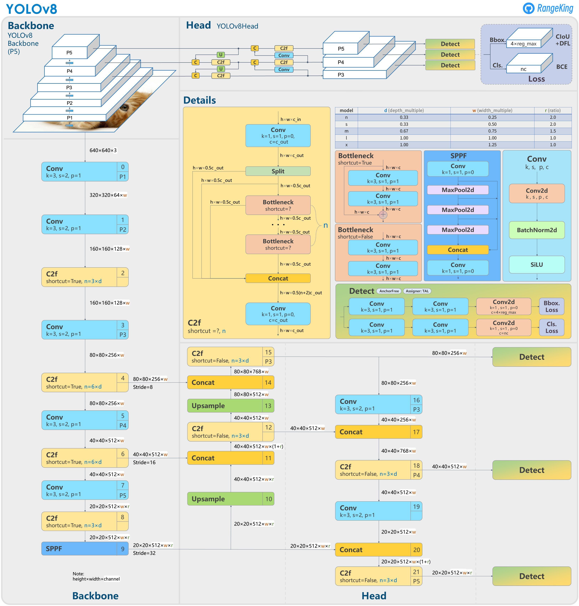
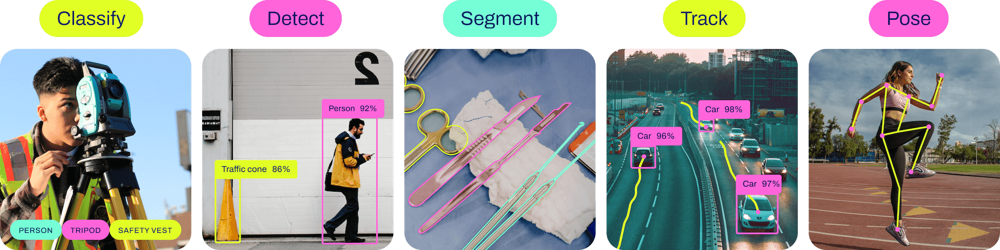
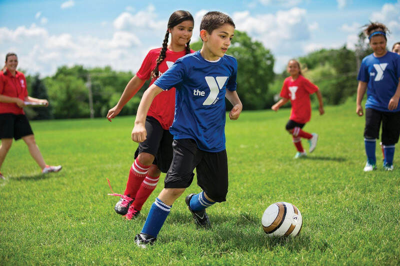
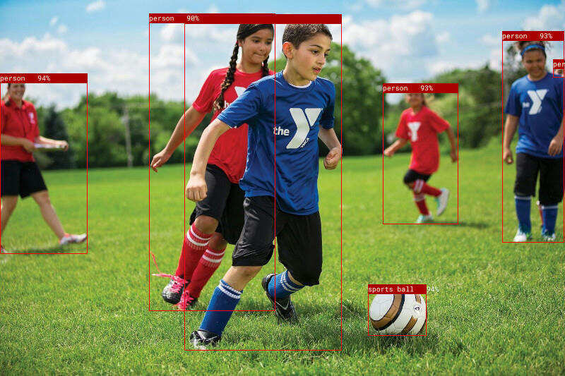
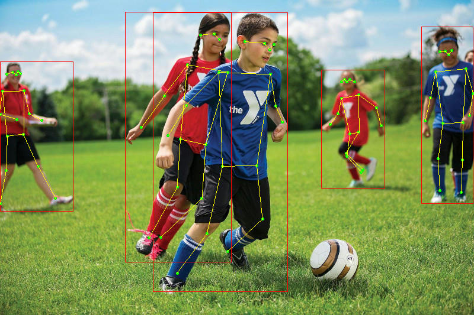

# 24｜Rust图像识别：利用YOLOv8识别对象
你好，我是Mike。这节课我们来学习如何使用Rust对图片中的对象进行识别。

图像识别是计算机视觉领域中的重要课题，而计算机视觉又是AI的重要组成部分，相当于AI的眼睛。目前图像识别领域使用最广泛的框架是 YOLO，现在已经迭代到了v8版本。而基于Rust机器学习框架Candle，可以方便地实现YOLOv8算法。因此，这节课我们继续使用Candle框架来实现图片的识别。

Candle框架有一个示例，演示了YOLOv8的一个简化实现。我在此基础上，将这个源码中的示例独立出来，做成了一个单独的项目，方便你学习（查看 [代码地址](https://github.com/miketang84/jikeshijian/tree/master/24-candle_yolov8)）。

注：这节课的代码适用于 candle\_core v0.3 版本。

## YOLO简介

YOLO（You Only Look Once）是一种目标检测算法，它可以在一次前向传递中检测出图像中的所有物体的位置和类别。因为只需要看一次，YOLO被称为Region-free方法，相比于Region-based方法，YOLO不需要提前找到可能存在目标的区域（Region）。YOLO在2016年被提出，发表在计算机视觉顶会CVPR（Computer Vision and Pattern Recognition）上。YOLO对整个图片进行预测，并且它会一次性输出所有检测到的目标信息，包括类别和位置。

YOLO也使用神经网络进行图像识别，一般来说，如果是推理的话，我们需要一个神经网络的预训练模型文件。下面你会看到，在运行示例的时候，会自动从HuggingFace下载对应的预训练模型。

YOLOv8的模型结构比起之前的版本，会复杂一些，我们来看一下官方整理的图片。



这节课我们主要是去使用，不展开关于这个模型的讲解。目前官方的预训练模型分成5个。

- N：nano。模型最小。探测速度最快，精度最低。
- S：small，模型比nano大。
- M：middle，模型比small大。
- L：large，模型比middle大，比x小。
- X：extra large，模型最大。探测速度最慢，精度最高。

在下面的示例中，我们可以通过参数来指定选择哪个模型。

## YOLOv8的能力

YOLO发展到第8代已经很强大了。它可以对图像做分类、探测、分段、轨迹、姿势等。



了解了YOLO的能力，下面我们开始实际用起来。

## 动手实验

下载源码：

```plain
git clone https://github.com/miketang84/jikeshijian
cd jikeshijian/24-candle_yolov8

```

### 物体探测

假设我们有这样一张图片。



编译运行下面这行代码。

```plain
cargo run --release -- assets/football.jpg --which m

```

请注意，这个运行过程中，会联网从HuggingFace上下载模型文件，需要科学上网环境。

运行输出：

```plain
$ cargo run --release -- assets/football.jpg --which m
ProxyChains-3.1 (http://proxychains.sf.net)
    Finished release [optimized] target(s) in 0.08s
     Running `target/release/candle_demo_yolov8 assets/football.jpg --which m`
Running on CPU, to run on GPU, build this example with `--features cuda`
model loaded
processing assets/football.jpg
generated predictions Tensor[dims 84, 5460; f32]
person: Bbox { xmin: 0.15629578, ymin: 81.735344, xmax: 99.46689, ymax: 281.7202, confidence: 0.94353473, data: [] }
person: Bbox { xmin: 433.88196, ymin: 92.59643, xmax: 520.25476, ymax: 248.76715, confidence: 0.933658, data: [] }
person: Bbox { xmin: 569.20465, ymin: 34.737877, xmax: 639.8049, ymax: 269.4999, confidence: 0.927611, data: [] }
person: Bbox { xmin: 209.33649, ymin: 16.313568, xmax: 388.09424, ymax: 388.7763, confidence: 0.92696583, data: [] }
person: Bbox { xmin: 169.212, ymin: 15.2717285, xmax: 312.59946, ymax: 345.16046, confidence: 0.900463, data: [] }
person: Bbox { xmin: 626.709, ymin: 65.91608, xmax: 639.791, ymax: 86.72856, confidence: 0.33487964, data: [] }
sports ball: Bbox { xmin: 417.45734, ymin: 315.16333, xmax: 484.62384, ymax: 372.86432, confidence: 0.93880117, data: [] }
writing "assets/football.pp.jpg"

```

在 assets 目录下生成 football.pp.jpg 文件，打开后效果如下：



可以看到，Yolo 正确识别了6个人，和一个运动球。

### 姿势探测

我们来看一下，对同一张图片，运行姿势探测的效果。

```plain
cargo run --release -- assets/football.jpg --which m --task pose

```

我们的工具在 assets 目录下生成 football.pp.jpg 文件，打开后效果如下：



效果是不是很cool。下面我们详细解释一下这次实战的代码。

## 源码解释

YOLOv8 神经网络模型的原理比较复杂，这节课我们主要讲解这个示例中Rust的用法，从中可以学到不少Rust相关知识。

```plain
// #[cfg(feature = "mkl")]
// extern crate intel_mkl_src;

// #[cfg(feature = "accelerate")]
// extern crate accelerate_src;

mod model;
use model::{Multiples, YoloV8, YoloV8Pose};
mod coco_classes;

use candle_core::utils::{cuda_is_available, metal_is_available};
use candle_core::{DType, Device, IndexOp, Result, Tensor};
use candle_nn::{Module, VarBuilder};
use candle_transformers::object_detection::{non_maximum_suppression, Bbox, KeyPoint};
use clap::{Parser, ValueEnum};
use image::DynamicImage;

// Keypoints as reported by ChatGPT :)
// Nose
// Left Eye
// Right Eye
// Left Ear
// Right Ear
// Left Shoulder
// Right Shoulder
// Left Elbow
// Right Elbow
// Left Wrist
// Right Wrist
// Left Hip
// Right Hip
// Left Knee
// Right Knee
// Left Ankle
// Right Ankle
const KP_CONNECTIONS: [(usize, usize); 16] = [
    (0, 1),
    (0, 2),
    (1, 3),
    (2, 4),
    (5, 6),
    (5, 11),
    (6, 12),
    (11, 12),
    (5, 7),
    (6, 8),
    (7, 9),
    (8, 10),
    (11, 13),
    (12, 14),
    (13, 15),
    (14, 16),
];

// 获取设备，Cpu还是Cuda或Metal
pub fn get_device(cpu: bool) -> Result<Device> {
    if cpu {
        Ok(Device::Cpu)
    } else if cuda_is_available() {
        Ok(Device::new_cuda(0)?)
    } else if metal_is_available() {
        Ok(Device::new_metal(0)?)
    } else {
        #[cfg(all(target_os = "macos", target_arch = "aarch64"))]
        {
            println!(
                "Running on CPU, to run on GPU(metal), build this example with `--features metal`"
            );
        }
        #[cfg(not(all(target_os = "macos", target_arch = "aarch64")))]
        {
            println!("Running on CPU, to run on GPU, build this example with `--features cuda`");
        }
        Ok(Device::Cpu)
    }
}
// 报告对象探测的结果，以及用图像处理工具在图上画出来标注
pub fn report_detect(
    pred: &Tensor,
    img: DynamicImage,
    w: usize,
    h: usize,
    confidence_threshold: f32,
    nms_threshold: f32,
    legend_size: u32,
) -> Result<DynamicImage> {
    let pred = pred.to_device(&Device::Cpu)?;
    let (pred_size, npreds) = pred.dims2()?;
    let nclasses = pred_size - 4;

    let mut bboxes: Vec<Vec<Bbox<Vec<KeyPoint>>>> = (0..nclasses).map(|_| vec![]).collect();
    // 选出符合置信区间的结果
    for index in 0..npreds {
        let pred = Vec::<f32>::try_from(pred.i((.., index))?)?;
        let confidence = *pred[4..].iter().max_by(|x, y| x.total_cmp(y)).unwrap();
        if confidence > confidence_threshold {
            let mut class_index = 0;
            for i in 0..nclasses {
                if pred[4 + i] > pred[4 + class_index] {
                    class_index = i
                }
            }
            if pred[class_index + 4] > 0. {
                let bbox = Bbox {
                    xmin: pred[0] - pred[2] / 2.,
                    ymin: pred[1] - pred[3] / 2.,
                    xmax: pred[0] + pred[2] / 2.,
                    ymax: pred[1] + pred[3] / 2.,
                    confidence,
                    data: vec![],
                };
                bboxes[class_index].push(bbox)
            }
        }
    }

    non_maximum_suppression(&mut bboxes, nms_threshold);

    // 在原图上标注，并打印标注的框的信息
    let (initial_h, initial_w) = (img.height(), img.width());
    let w_ratio = initial_w as f32 / w as f32;
    let h_ratio = initial_h as f32 / h as f32;
    let mut img = img.to_rgb8();
    let font = Vec::from(include_bytes!("roboto-mono-stripped.ttf") as &[u8]);
    let font = rusttype::Font::try_from_vec(font);
    for (class_index, bboxes_for_class) in bboxes.iter().enumerate() {
        for b in bboxes_for_class.iter() {
            println!("{}: {:?}", coco_classes::NAMES[class_index], b);
            let xmin = (b.xmin * w_ratio) as i32;
            let ymin = (b.ymin * h_ratio) as i32;
            let dx = (b.xmax - b.xmin) * w_ratio;
            let dy = (b.ymax - b.ymin) * h_ratio;
            if dx >= 0. && dy >= 0. {
                imageproc::drawing::draw_hollow_rect_mut(
                    &mut img,
                    imageproc::rect::Rect::at(xmin, ymin).of_size(dx as u32, dy as u32),
                    image::Rgb([255, 0, 0]),
                );
            }
            if legend_size > 0 {
                if let Some(font) = font.as_ref() {
                    imageproc::drawing::draw_filled_rect_mut(
                        &mut img,
                        imageproc::rect::Rect::at(xmin, ymin).of_size(dx as u32, legend_size),
                        image::Rgb([170, 0, 0]),
                    );
                    let legend = format!(
                        "{}   {:.0}%",
                        coco_classes::NAMES[class_index],
                        100. * b.confidence
                    );
                    imageproc::drawing::draw_text_mut(
                        &mut img,
                        image::Rgb([255, 255, 255]),
                        xmin,
                        ymin,
                        rusttype::Scale::uniform(legend_size as f32 - 1.),
                        font,
                        &legend,
                    )
                }
            }
        }
    }
    Ok(DynamicImage::ImageRgb8(img))
}
// 报告姿态探测的结果，以及用图像处理工具在图上画出来标注
pub fn report_pose(
    pred: &Tensor,
    img: DynamicImage,
    w: usize,
    h: usize,
    confidence_threshold: f32,
    nms_threshold: f32,
) -> Result<DynamicImage> {
    let pred = pred.to_device(&Device::Cpu)?;
    let (pred_size, npreds) = pred.dims2()?;
    if pred_size != 17 * 3 + 4 + 1 {
        candle_core::bail!("unexpected pred-size {pred_size}");
    }
    let mut bboxes = vec![];
    // 选出符合置信区间的结果
    for index in 0..npreds {
        let pred = Vec::<f32>::try_from(pred.i((.., index))?)?;
        let confidence = pred[4];
        if confidence > confidence_threshold {
            let keypoints = (0..17)
                .map(|i| KeyPoint {
                    x: pred[3 * i + 5],
                    y: pred[3 * i + 6],
                    mask: pred[3 * i + 7],
                })
                .collect::<Vec<_>>();
            let bbox = Bbox {
                xmin: pred[0] - pred[2] / 2.,
                ymin: pred[1] - pred[3] / 2.,
                xmax: pred[0] + pred[2] / 2.,
                ymax: pred[1] + pred[3] / 2.,
                confidence,
                data: keypoints,
            };
            bboxes.push(bbox)
        }
    }

    let mut bboxes = vec![bboxes];
    non_maximum_suppression(&mut bboxes, nms_threshold);
    let bboxes = &bboxes[0];

    // 在原图上标注，并打印标注的框和姿势的信息
    let (initial_h, initial_w) = (img.height(), img.width());
    let w_ratio = initial_w as f32 / w as f32;
    let h_ratio = initial_h as f32 / h as f32;
    let mut img = img.to_rgb8();
    for b in bboxes.iter() {
        println!("{b:?}");
        let xmin = (b.xmin * w_ratio) as i32;
        let ymin = (b.ymin * h_ratio) as i32;
        let dx = (b.xmax - b.xmin) * w_ratio;
        let dy = (b.ymax - b.ymin) * h_ratio;
        if dx >= 0. && dy >= 0. {
            imageproc::drawing::draw_hollow_rect_mut(
                &mut img,
                imageproc::rect::Rect::at(xmin, ymin).of_size(dx as u32, dy as u32),
                image::Rgb([255, 0, 0]),
            );
        }
        for kp in b.data.iter() {
            if kp.mask < 0.6 {
                continue;
            }
            let x = (kp.x * w_ratio) as i32;
            let y = (kp.y * h_ratio) as i32;
            imageproc::drawing::draw_filled_circle_mut(
                &mut img,
                (x, y),
                2,
                image::Rgb([0, 255, 0]),
            );
        }

        for &(idx1, idx2) in KP_CONNECTIONS.iter() {
            let kp1 = &b.data[idx1];
            let kp2 = &b.data[idx2];
            if kp1.mask < 0.6 || kp2.mask < 0.6 {
                continue;
            }
            imageproc::drawing::draw_line_segment_mut(
                &mut img,
                (kp1.x * w_ratio, kp1.y * h_ratio),
                (kp2.x * w_ratio, kp2.y * h_ratio),
                image::Rgb([255, 255, 0]),
            );
        }
    }
    Ok(DynamicImage::ImageRgb8(img))
}
// 选择模型尺寸
#[derive(Clone, Copy, ValueEnum, Debug)]
enum Which {
    N,
    S,
    M,
    L,
    X,
}
// 对象探测任务还是姿势探测任务
#[derive(Clone, Copy, ValueEnum, Debug)]
enum YoloTask {
    Detect,
    Pose,
}
// 命令行参数定义，基于Clap
#[derive(Parser, Debug)]
#[command(author, version, about, long_about = None)]
pub struct Args {
    /// 是否运行在CPU上面
    #[arg(long)]
    cpu: bool,

    /// 是否记录日志
    #[arg(long)]
    tracing: bool,

    /// 模型文件路径
    #[arg(long)]
    model: Option<String>,

    /// 用哪一个模型
    #[arg(long, value_enum, default_value_t = Which::S)]
    which: Which,

    images: Vec<String>,

    /// 模型置信门槛
    #[arg(long, default_value_t = 0.25)]
    confidence_threshold: f32,

    /// non-maximum suppression的阈值
    #[arg(long, default_value_t = 0.45)]
    nms_threshold: f32,

    /// 要执行的任务
    #[arg(long, default_value = "detect")]
    task: YoloTask,

    /// 标注的字体的大小
    #[arg(long, default_value_t = 14)]
    legend_size: u32,
}

impl Args {
    fn model(&self) -> anyhow::Result<std::path::PathBuf> {
        let path = match &self.model {
            Some(model) => std::path::PathBuf::from(model),
            None => {
                let api = hf_hub::api::sync::Api::new()?;
                let api = api.model("lmz/candle-yolo-v8".to_string());
                let size = match self.which {
                    Which::N => "n",
                    Which::S => "s",
                    Which::M => "m",
                    Which::L => "l",
                    Which::X => "x",
                };
                let task = match self.task {
                    YoloTask::Pose => "-pose",
                    YoloTask::Detect => "",
                };
                api.get(&format!("yolov8{size}{task}.safetensors"))?
            }
        };
        Ok(path)
    }
}

pub trait Task: Module + Sized {
    fn load(vb: VarBuilder, multiples: Multiples) -> Result<Self>;
    fn report(
        pred: &Tensor,
        img: DynamicImage,
        w: usize,
        h: usize,
        confidence_threshold: f32,
        nms_threshold: f32,
        legend_size: u32,
    ) -> Result<DynamicImage>;
}
// Yolov8为对象探测的类型载体
impl Task for YoloV8 {
    fn load(vb: VarBuilder, multiples: Multiples) -> Result<Self> {
        YoloV8::load(vb, multiples, /* num_classes=*/ 80)
    }

    fn report(
        pred: &Tensor,
        img: DynamicImage,
        w: usize,
        h: usize,
        confidence_threshold: f32,
        nms_threshold: f32,
        legend_size: u32,
    ) -> Result<DynamicImage> {
        report_detect(
            pred,
            img,
            w,
            h,
            confidence_threshold,
            nms_threshold,
            legend_size,
        )
    }
}
// YoloV8Pose为姿势探测的类型载体
impl Task for YoloV8Pose {
    fn load(vb: VarBuilder, multiples: Multiples) -> Result<Self> {
        YoloV8Pose::load(vb, multiples, /* num_classes=*/ 1, (17, 3))
    }

    fn report(
        pred: &Tensor,
        img: DynamicImage,
        w: usize,
        h: usize,
        confidence_threshold: f32,
        nms_threshold: f32,
        _legend_size: u32,
    ) -> Result<DynamicImage> {
        report_pose(pred, img, w, h, confidence_threshold, nms_threshold)
    }
}
// 主体运行逻辑
pub fn run<T: Task>(args: Args) -> anyhow::Result<()> {
    let device = get_device(args.cpu)?;
    // 选择模型尺寸，加载模型权重参数进来
    let multiples = match args.which {
        Which::N => Multiples::n(),
        Which::S => Multiples::s(),
        Which::M => Multiples::m(),
        Which::L => Multiples::l(),
        Which::X => Multiples::x(),
    };
    let model = args.model()?;
    let vb = unsafe { VarBuilder::from_mmaped_safetensors(&[model], DType::F32, &device)? };
    let model = T::load(vb, multiples)?;
    println!("model loaded");
    for image_name in args.images.iter() {
        println!("processing {image_name}");
        let mut image_name = std::path::PathBuf::from(image_name);
        let original_image = image::io::Reader::open(&image_name)?
            .decode()
            .map_err(candle_core::Error::wrap)?;
        let (width, height) = {
            let w = original_image.width() as usize;
            let h = original_image.height() as usize;
            if w < h {
                let w = w * 640 / h;
                //
                (w / 32 * 32, 640)
            } else {
                let h = h * 640 / w;
                (640, h / 32 * 32)
            }
        };
        let image_t = {
            let img = original_image.resize_exact(
                width as u32,
                height as u32,
                image::imageops::FilterType::CatmullRom,
            );
            let data = img.to_rgb8().into_raw();
            Tensor::from_vec(
                data,
                (img.height() as usize, img.width() as usize, 3),
                &device,
            )?
            .permute((2, 0, 1))?
        };
        let image_t = (image_t.unsqueeze(0)?.to_dtype(DType::F32)? * (1. / 255.))?;
        let predictions = model.forward(&image_t)?.squeeze(0)?;
        println!("generated predictions {predictions:?}");
        let image_t = T::report(
            &predictions,
            original_image,
            width,
            height,
            args.confidence_threshold,
            args.nms_threshold,
            args.legend_size,
        )?;
        image_name.set_extension("pp.jpg");
        println!("writing {image_name:?}");
        image_t.save(image_name)?
    }

    Ok(())
}
// 程序入口
pub fn main() -> anyhow::Result<()> {
    use tracing_chrome::ChromeLayerBuilder;
    use tracing_subscriber::prelude::*;

    let args = Args::parse();

    let _guard = if args.tracing {
        let (chrome_layer, guard) = ChromeLayerBuilder::new().build();
        tracing_subscriber::registry().with(chrome_layer).init();
        Some(guard)
    } else {
        None
    };

    match args.task {
        YoloTask::Detect => run::<YoloV8>(args)?,
        YoloTask::Pose => run::<YoloV8Pose>(args)?,
    }
    Ok(())
}

```

我挑选里面一些重要的内容来讲解一下。

第7～8行，加载模型模块。YOLOv8的模型实现都放在这里面，它在Candle的平台基础上实现了一个简易版本的 Darknet 神经网络引擎。第9行，加载coco数据集分类表。YOLOv8对数据分成80种类别。你可以打开 coco\_classes.rs 文件查看。

第11～14行，引入 Candle 基础组件。第15行引用clap赋能命令行功能。这个在上一讲中已经讲过了。第16行引入 image crate。我们在这个例子里处理图片使用的是 image 和 imageproc 两个 crate。

第36～53行是人体姿势的参数配置 ‎KP\_CONNECTIONS。

第57～77行，是在 candle 中获取能使用的设备的函数。可以看到，Linux和Windows下我们可以使用 CUDA，mac下我们可以使用 Metal。

第79～167行，report\_detect 是第一个任务，对象探测的业务代码。第169～258行，report\_pose 是第二个任务，姿势探测的业务代码。这两个任务我们等会儿还会再说到。

第260～267行，定义选用哪个模型，分别对应前面讲到的 N、S、M、L、X。第269～273行，定义对象探测和姿势探测两个不同的任务。第275～311行，定义命令行参数对象Args，你可以关注一下各个字段的默认值。第313～336行，定义model函数，实际是加载到模型的正确路径，如果本地没有，就会从HuggingFace上下载。

第338～349行，定义Task trait，它依赖另外两个trait：Module和Sized。Module来自 [candle\_nn crate](https://docs.rs/candle-nn/latest/candle_nn/trait.Module.html)，表示神经网络中的一个模块，有向前推理forward的功能。Sized来自 [Rust std 标准库](https://doc.rust-lang.org/std/marker/trait.Sized.html)，表示被实现的类型是固定尺寸的。

第351～375行，为YOLOv8实现Task trait，YOLOv8 就是我们用于目标探测的任务承载类型。第377～393，为YOLOv8Pose实现Task trait，YOLOv8Pose就是我们用于姿势探测的任务承载类型。

第395～459行是业务内容。第461～480行是main函数，里面做了一些日志配置，并且根据任务类型分配到YOLOv8或YOLOv8Pose两个不同的任务去。

我们看到，这里使用了 `run::<YoloV8>(args)` 这种写法，再对照run的函数签名：

```plain
pub fn run<T: Task>(args: Args) -> anyhow::Result<()> {

```

这个函数签名中有一个类型参数T，被Task约束。根据 [第 10 讲](https://time.geekbang.org/column/article/724776) 的内容，我们可以说类型T具有Task的能力。 `::<>` 是 turbofish 语法，用来将具体的类型传递进函数的类型参数中。

进入 `run()` 函数中，我们继续看。第405、406行，根据指定的不同的模型，将预训练模型的内容加载成 model 实例。第407行有个 `T::load()` 写法，实际就是 YOLOv8 和 YOLOv8Pose 上都实现了 `load()` 关联函数，它定义在Task trait中。

然后第409行可以批量对多个图片进行操作，这个需要你在命令行中传参数指定。我们前面的示例只处理一张图片。然后下面第415～426行，是对图片尺寸的规约化处理。因为YOLOV8只能在640px x 640px 的图片上进行检测，所以需要在代码中预处理一下。

第427～440行是将处理后的图片加载成 Tensor 对象。第441～442行，执行推理预测。第444～452行，调用各自任务的汇报业务。第453～455行，生成处理后的图片，写入磁盘中。

第444行出现了 `T::report()`，解释跟前面一样，实际就是 YOLOv8 和 YOLOv8Pose 上都实现了 `report()` 关联函数，它定义在Task trait中。然后这个 `T::report()` 会进一步路由到 `report_detect()` 和 `report_pose()` 函数中，各自调用。

在各自的 report 函数中，会对上一步YOLOv8预测的边框值按置信区间进行筛选，然后对图片添加标注，也就是画那些线和框。这样就生成了我们看到的效果图的内存对象。

到这里为止，全部代码就讲解完成了。细节比较生硬，还是图片好玩！

## 小结

这节课我们使用Rust实现了Yolov8算法探测图像中的对象和人物的姿势。从实现过程来说，并不比Python版本的实现复杂多少。而且从部署上来讲，Rust编译后就一个二进制可执行文件，对于做成一个软件（后面两讲我们会讲如何用GUI界面）要方便很多。

另一方面，代码中对于函数的返回值，使用了 `anyhow::Result<T>`。上节课我们讲过，使用anyhow的返回类型能够大大减少我们的心智负担。

这个版本的Yolov8的算法，是实现在Candle框架这个平台上的，你可以研究一下 model.rs 文件，可以看到，代码量非常少。因为有了Candle的基础设施，实现一个新的神经网络算法其实非常简单。

以前，当我们想学习图像识别的时候，我们就得求助于Python或C++。以后你也可以使用Rust玩起来了，我以后会持续地输出关于Rust在AI领域的应用，你可以持续关注，我们一起推进Rust在AI领域的影响力。

## 思考题

请你开启 cuda 或 metal 特性尝试一下，使用不同的预训练模型看一下效果差异。另外你还可以换用不同的图片来测试一下各种识别效果。

欢迎你把你实验的结果分享到评论区，也欢迎你把这节课的内容分享给其他朋友，邀他一起学习Rust，我们下节课再见！