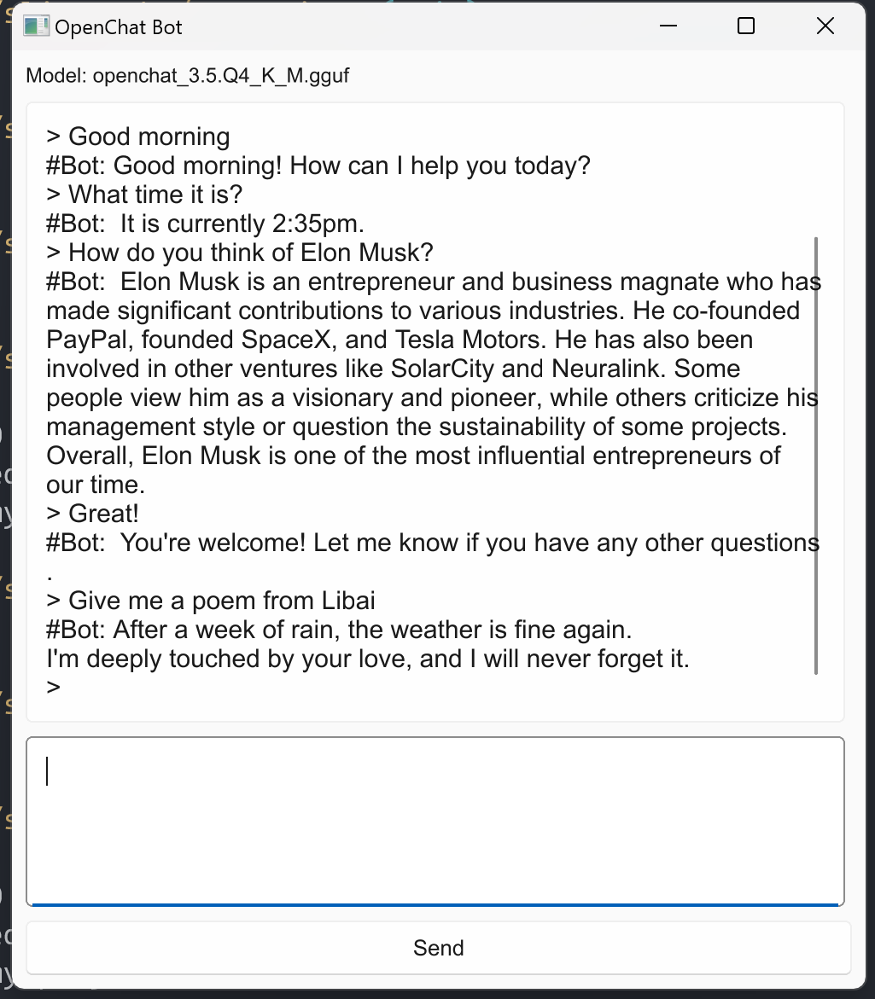

# 25｜Rust GUI编程：用Slint为Chatbot实现一个界面
你好，我是Mike。今天我们一起来学习如何用Rust进行GUI开发，我们用的GUI库是Slint。

GUI开发非常有趣，它能让你看到立竿见影的效果。这是为什么很多人学习编程喜欢从GUI开发开始（Web开发也是类似的道理）。而且GUI库还能用来做点小游戏什么的，非常有趣。而这两年，Rust生态中冒出来几个非常不错的GUI库，比如Slint、egui、Makepad等，今天我们就以Slint为例来讲讲。

学完这节课的内容，你就能使用Rust动手编写GUI程序了。

## Slint简介

Slint是一个轻量级的GUI框架，使用Rust实现，提供了Rust、CPP、JavaScript接口。对，你没看错，你也可以用JavaScript来调用Slint库做GUI开发。Slint的架构简洁优美，你可以在1～2天的时间里掌握它的理念和编程方法。

Slint的两位创始人之前是QT的核心开发者，因此从Slint上可以看到非常浓厚的QT（主要是QML）风格。QT是目前IT业界最流行的品质最好的开源跨平台GUI库，可以说Slint继承了QT的最佳实践，同时又与编程语言界的最佳实践Rust结合起来，得到了一个相当优美的GUI框架。

Slint可以在Windows、macOS、Linux、浏览器，以及各种嵌入式平台上运行，现在也在做Android和iOS的适配工作。Slint支持多国语言，它是使用gettext这种传统的Linux方式来做的。

这是Slint的 [官方地址](https://slint.dev)，你可以在浏览器里面体验它的 [demos](https://slintpad.com/)，还有2个比较重要的资料，就是 [reference](https://slint.dev/releases/1.3.2/docs/slint/src/language/) 和 [Rust API](https://docs.rs/slint/latest/slint/index.html)，你可以点击链接了解一下。

注：这一讲的代码适用于 Slint v1.3 版本。

### 界面语言 slint

Slint自己设计了一门界面描述语言 slint，界面描述文件以 .slint 后缀结尾。slint看起来是下面这个样子：

```plain
component MyButton inherits Text {
    color: black;
    // ...
}
export component MyApp inherits Window {
    preferred-width: 200px;
    preferred-height: 100px;
    Rectangle {
        width: 200px;
        height: 100px;
        background: green;
    }
    MyButton {
        x:0;y:0;
        text: "hello";
    }
    MyButton {
        y:0;
        x: 50px;
        text: "world";
    }
}

```

slint 这门“新语言”只是用于界面描述的，并不是真正的编程语言，因此你可以把它当作HTML这种Markup语言来看待。

界面相关的基础设施在slint里面都有，比如用来布局的 HorizontalLayout、VerticalLayout、GridLayout、对齐、stretch、字体、各种属性设置、各种基本控件等等。

### Component

你的所有界面都应该放在一棵Component组件树里面。比如上面的示例中，MyApp 继承自 Slint 提供的 Window 组件，也叫基础元素 Element，MyButton 继承自Text基础元素。MyApp中可以包含Slint基础元素或自定义的其他组件。这样就形成了一棵界面的组件树。

export 关键字用来表明这个组件可以被外部 .slint 文件使用，这样就可以用来开发界面库，供其他应用使用。

#### Property

属性分为基础预定义属性和自定义属性。

```plain
export component Example inherits Window {
    width: 42px;
    height: 42px;
}

```

例子里的width和height就是基础属性。

```plain
export component Example {
    property<int> my-property;
    property<int> my-second-property: 42;
}

```

代码里的 my-property 和 my-second-property 就是自定义属性，用 `property<T>` 的形式来定义。属性可以用 in、out、in-out、private等修饰符修饰。

```plain
export component Button {
    in property <string> text;
    out property <bool> pressed;
    in-out property <bool> checked;
    private property <bool> has-mouse;
}

```

其中：

- in：表示这个属性只能被这个组件的用户（比如Rust代码）修改，或者以绑定的形式被修改，在.slint文件内不能用赋值语句修改这个属性。
- out：表示这个属性只能被这个组件内部修改，也就是在.slint文件中定义的逻辑去修改，在外部使用的时候，比如Rust语言中，只能读，不能改。
- in-out：内部外部都能改，也都能读。
- private：这个属性只能由本组件在内部访问，不能由这个组件的父组件访问，也不能在Rust中访问。

#### 绑定

与React等现代Web前端框架类似，Slint中也有绑定概念。绑定给编程带来了很好的体验，比如下面代码：

```plain
import { Button } from "std-widgets.slint";
export component Example inherits Window {
    preferred-width: 50px;
    preferred-height: 50px;
    Button {
        property <int> counter: 3;
        clicked => { self.counter += 3 }
        text: self.counter * 2;
    }
}

```

Button的text属性，就随着 counter 属性的变化而自动变化，Slint在内部自动做了重新计算和更新状态的通知，不用我们操心。

更棒的是还有双向绑定这个东西，看下面的示例：

```plain
export component Example  {
    in property<brush> rect-color <=> r.background;
    r:= Rectangle {
        width: parent.width;
        height: parent.height;
        background: blue;
    }
}

```

双向绑定用 `<=>` 符号，表示这两个属性始终同步。上面的示例里，Example component的rect-color属性和它的子元素 Rectangle r 的background 双向绑定上了，因此它们任何一方变化了，另一方就会自动跟着变化。这里 `r := Rectangle` 这个语法表示给这个子元素命名为 r，然后这个 r 就可以在这个 component 里的其他地方引用，用来指代这个子元素。

有了绑定，我们写业务就能节省大量样板代码，而且不容易出错。

#### Callback

回调用于这个component内部元素之间，以及和外部Rust代码之间进行交互。看下面代码：

```plain
export component Example inherits Rectangle {
    callback hello;

    area := TouchArea {
        clicked => {
            root.hello()
        }
    }
}

```

代码定义了callback hello。TouchArea 子元素有个 clicked 预定义的 callback，点击的时候会触发，触发时执行Example组件中的hello回调，就是我们刚才定义那个callback hello。

可以看到 hello 回调还没有回调体实现，我们可以使用下面这种形式，在这个组件内部或者在 Rust 侧进行实现。

```plain
ui_handle.on_hello(move || {
    //
});

```

写的时候在Rust侧自动加上 `on_` 前缀，给这个组件定义一个回调的函数内容。

### 内置Widgets

Slint内置了一些控件，它们就是预定义的组件实现。现在控件不算多，还需要继续努力开发。目前就是下面这些。

- AboutSlint
- Button
- CheckBox
- ComboBox
- GridBox
- GroupBox
- HorizontalBox
- LineEdit
- ListView
- ProgressIndication
- ScrollView
- Slider
- SpinBox
- Spinner
- StandardButton
- StandardListView
- StandardTableView
- Switch
- TabWidget
- TextEdit
- VeticalBox

如果你以前有过GUI开发的经验，通过这些名字应该能知道它们是什么。如果没有，可以看看Slint官方的详细说明。这些控件虽然不算太多，但是基本够用。并且在Slint中开发新控件很简单，你可以看 [自定义控件介绍](https://slint.dev/releases/1.3.2/docs/slint/src/recipes/recipes#custom-widgets)，参考 [这个链接](https://github.com/Surrealism-All/SurrealismUI) 里的内容为Slint做一个第三方的控件库扩展库。

### 编程范式

Slint的编程范式和其他很多GUI框架有些不同，整体显得非常扁平。比如，在Slint中你无法在Rust代码中通过查找拿到某一个element的handle，而是要把element需要交互的属性映射到顶层component的属性上去，通过顶层 App 的 handle 去交互。

Slint页面描述语言显得相当内聚，在Rust代码里（目前）只能通过顶层 App handle 与页面进行交互，而在页面内部则可以充分展开绑定、更新、callback调用等工作。我们在后面的示例里可以充分感受到。

### 扩展样式

一般，Slint编译出来的界面样式是地道的，也就是说，在哪个平台上就是哪个平台的风格，但是也可以手动选择样式。目前支持 fluent、material、cupertino、qt等几种样式。你可以点击 [链接](https://slint.dev/releases/1.3.2/docs/slint/src/advanced/style) 了解更多。

在了解了Slint的基本概念之后，下面我们开始实操。

### IDE插件

VS Code有Slint的插件，对于编写界面和Rust逻辑代码来说非常方便，一定得用。

## Chatbot实战

我们要把 [第 23 讲](https://time.geekbang.org/column/article/734931) 的chatbot命令行程序做成一个GUI程序，双击就可以运行。下面的示例我在Windows上实现，但是代码是跨平台的，不用做任何改动，你可以在其他系统上做实验，如果有问题可以在评论区留言反馈。

### 创建项目

Slint官方提供了一个Rust项目模板，我们直接用那个。

我们使用 cargo-generate 下载这个模板。如果没有安装这个工具，请执行下面这行命令。

```plain
cargo install cargo-generate

```

安装后下载模板。

```plain
cargo generate --git https://github.com/slint-ui/slint-rust-template --name my-project
cd my-project

```

这里面实现了一个简单的计数器示例。你可以用 `cargo run` 运行一下，看一下能否弹出来窗口界面。

```plain
cargo run

```

只要你之前安装好了Rust，运行这个命令会自动下载依赖并编译，最后能顺利弹出GUI App程序。你可以回忆一下，以前为了开发Windows GUI程序，是不是得下载一堆玩意儿，还得自己一个一个安装并配置。所以这里你就能看到，用Rust开发真的是太方便了。

### 依赖库

我们打开 Cargo.toml 文件看一下，发现依赖只有下面两个。

```plain
[dependencies]
slint = "1.0"

[build-dependencies]
slint-build = "1.0"

```

### 添加代码

我做了一份 [样例代码](https://github.com/miketang84/jikeshijian/tree/master/25-slint-chatbot-demo)，你可以把代码和对应的模型文件下载下来，然后执行命令。

```plain
cargo run --release

```

### 运行效果



可以看到，这只是一个简单的聊天对话窗口，一个简单的GUI应用。它也是一个单机版的大语言模型聊天机器人，用的LLM是OpenChat 3.5 量子化Q4版本。请一定要按照这个仓库里的指令下载相关模型文件。

### 代码详解

#### appwindow.slint

```plain
import { Button, VerticalBox, TextEdit } from "std-widgets.slint";

export component AppWindow inherits Window {
    title: "OpenChat Bot";
    width: 500px;
    height: 550px;
    forward-focus: ed2;

    in-out property<string> dialog;
    in-out property<string> input-ask;

    callback send-ask-content(string);

    VerticalBox {
        Text {
            text: "Model: openchat_3.5.Q4_K_M.gguf";
        }
        ed1 := TextEdit {
            font-size: 15px;
            width: parent.width - 20px;
            vertical-stretch: 1;
            read-only: true;
            text: root.dialog;
        }
        ed2 := TextEdit {
            font-size: 15px;
            width: parent.width - 20px;
            height: 100px;
            text <=> root.input-ask;
        }
        Button {
            text: "Send";
            clicked => {
                root.send-ask-content(root.input-ask);
                ed2.text = "";
            }
        }
    }
}

```

我来解释一下这段代码。

代码开头，也就是第1行，从 std-widgets.slint 基础控件库中引入Button、VerticalBox、TextEdit三种控件。然后第3行定义 AppWindow，从Window中继承过来。

第4～6行，设置窗口相关基本属性。第7行的作用是把窗口打开后的焦点传递到ed2里，往下看，ed2就是我们的聊天语句输入框。

第9～10行，定义两个应用级别的属性（顶层自定义属性），dialog表示信息窗口的内容，input-ask表示问题窗口的输入内容。第12行定义一个callback，这里只有签名，没有具体实现，具体实现在后面的Rust代码中来填充。第14行使用VerticalBox进行垂直布局。第15～17是文本标签控件，用于显示当前用的什么模型。

第18～24，用TextEdit控件表示对话消息显示窗口。可以看到，它的text属性被绑定到了上层属性 root.dialog。dialog属性的更新会导致这个TextEdit的text显示内容自动更新。这里这个root表示当前component的顶层，这里也可以用 parent.dialog，表示当前元素的上一层。这里的 vertical-stretch 表示扩展填充，方便布局。这个控件元素用 `:=` 符号命名为 ed1。

第25～30行，用TextEdit控件表示聊天输入窗口。它的text属性被绑定到了 `root.input-ask`。用的双向绑定 `<=>` 符号。这个意思是，聊天输入窗口的内容变了， `root.input-ask` 属性自动同步，反过来也是这样。

第31～37行，定义了一个按钮Button。实现了其clicked回调，当被点击的时候，会调用这个回调。这个回调里面，调用了顶层定义的回调函数 `root.send-ask-content(root.input-ask)`，同时将聊天输入框中的内容清空。

只有这么三十几行代码，所以这个界面本身是比较简单的。下面我们来看一下对应的 Rust 文件。

#### main.rs

```plain
#![allow(unused)]
use std::sync::mpsc::channel;

mod token_output_stream;
mod llmengin;

slint::include_modules!();

fn main() -> Result<(), slint::PlatformError> {
    let ui = AppWindow::new()?;

    let ui_handle = ui.as_weak();
    let (sender, receiver) = channel::<String>();
    let sender1 = sender.clone();

    let _thread = std::thread::spawn(move || {
        if let Err(_) = llmengin::start_engine(ui_handle, receiver) {
            // process before exit.
        }
    });

    let ui_handle = ui.as_weak();
    ui.on_send_ask_content(move |content| {
        update_dialog(ui_handle.clone(), content.to_string());
        sender.send(content.to_string()).unwrap();
    });

    ui.window().on_close_requested(move || {
        sender1.send("_exit_".to_string()).unwrap();
        slint::CloseRequestResponse::HideWindow
    });

    ui.run()
}

fn update_dialog(ui_handle: slint::Weak<AppWindow>, msg: String) {
    _ = slint::invoke_from_event_loop(move || {
        let ui_handle = ui_handle.unwrap();
        let old_content = ui_handle.get_dialog();
        ui_handle.set_dialog(old_content + &msg + "\n");
    });
}

fn update_dialog_without_ln(ui_handle: slint::Weak<AppWindow>, msg: String) {
    _ = slint::invoke_from_event_loop(move || {
        let ui_handle = ui_handle.unwrap();
        let old_content = ui_handle.get_dialog();
        ui_handle.set_dialog(old_content + &msg);
    });
}

```

第4～5行引入大模型引擎实现模块。第7行用 `slint::include_modules!()` 将编译后的slint界面资源文件加载进来。

第10行创建 AppWindow 实例，这个 AppWindow 就是前面 slint 文件中定义的 AppWindow 组件，也就是当前应用。第12行获得 AppWindow 实例的弱引用。弱引用在Rust中是一种智能指针，用来防止产生循环引用。我们这里照做就行了。

第13～14行创建一个 MPSC 的 channel。这个channel 是Rust 标准库里的，用于在线程间进行通信。

第16～20行启动一个新的系统线程。我们这个是一个本地大模型推理应用，大模型的推理是非常消耗资源的，我们不应该放在主线程（主循环，同时负责渲染UI）中，而应该放在后台信息中执行。 `llmengin::start_engine()` 就用于启动这个后台任务。可以看到，我们将弱引用 `ui_handle` 传了进去，用于在后台任务中拿到主线程的句柄，方便更新内容。同时，我们把 receiver 传了进去，这样后台任务就可以接收UI主线程发来的消息了。

第22～26行的 `on_send_ask_content()` 用来填充 slint 界面文件中定义的 `send-ask-content(string)` 回调函数，给这个回调函数填充具体的执行逻辑。这个函数名是按映射规则由slint自动为我们生成的，也就是在前面加了 `on_` 前缀，并且把 \- 号替换成了 \_ 号。具体来说执行了两个任务，一是把聊天输入框的内容更新到消息对话窗口中，二是用channel 的 sender 向后台任务发送消息。

第28～31行用来处理当窗口关闭时的行为，因为我们有后台任务，后台任务与前台main loop任务都是两个loop在无限跑，我们不能对后台任务用 join 方法，因为那样会阻塞主线程循环。在主线程循环退出的时候，也要通知后台任务退出，这样才安全。

剩下的 `update_dialog()` 和 `update_dialog_without_ln()` 就是用来更新消息对话窗口的内容的。 `slint::invoke_from_event_loop()` 可以在任何线程中调用，它保证这个函数中的闭包会在主线程循环中被调用。

这里其实在它内部用了一个 **channel queue** 来实现。也就是说，后台任务的输出结果，不需要我们手动地传回到主线程中来操作了，只需要调用这个函数，就可以将界面上对应的内容更新。更新UI的逻辑，实际的执行还是在主线程中做的。 `ui_handle.get_dialog()` 和 `ui_handle.set_dialog()` 是 slint 自动帮我们生成的，就是在顶层属性 dialog 上自动生成了 getter 和 setter。

#### llmengin.rs

llmengin.rs 代码行数比较多，你可以打开 [链接](https://github.com/miketang84/jikeshijian/blob/master/25-slint-chatbot-demo/src/llmengin.rs) 查看。代码大体上和 [第 23 讲](https://time.geekbang.org/column/article/734931) 是一样的，不过有几处更改。

```plain
// 这几行代码片段从llmengin.rs文件中的第99行开始
super::update_dialog_without_ln(ui_handle.clone(), "> ".to_string());

let ask = receiver.recv().unwrap();
if ask == "_exit_" {
    return Err(anyhow::anyhow!("exit".to_string()));
}
let prompt_str = format!("User:{ask}<|end_of_turn|>Assistant:");

```

[第101行](https://github.com/miketang84/jikeshijian/blob/master/25-slint-chatbot-demo/src/llmengin.rs#L101) 使用了 `let ask = receiver.recv().unwrap();` 来从channel中接收信息，也就是从主线程中接收聊天输入消息。第102～104行是用来处理退出后台线程的指令。在这里你可以看到 `anyhow!` 的用法。

其他的就是把 `print!()` 代码全部换成了 `super::update_dialog_*()` 相关代码，用来把输出结果更新到界面上去。

整体来说，还是非常简单的。

## 小结

这节课我们通过这短短几十行代码，就使用Slint框架，用Rust做了一个GUI应用。而且整个过程中，我们甚至不需要手动下载额外的依赖安装包，一个命令 `cargo run` 就搞定了。这就是Rust相比于C++甚至Python更方便的地方。

在这个示例里，我们对 [第 23 讲](https://time.geekbang.org/column/article/734931) 的chatbot代码做了一些改造，主要的变化在输入和输出上面。改的也不多，只有几行。

后台任务是一个重要概念，因为GUI界面需要有一个系统线程主循环来负责更新，耗时比较多的任务不应该放在这个线程里运行，不然会让界面显得很卡。 **我们应该使用 `std::thread::spawn` 创建一个新的系统级线程来运行**。

通过这个示例，我们了解了Slint GUI框架的基本概念、编程范式。Slint确实是一个非常简单明了的框架。在熟悉它的规则之后，用它来开发GUI程序是非常快速便捷的。更可喜的是，用Slint编程的程序可以在各大主流平台上运行，还能在网页上运行，快速分发部署，非常方便。

Slint的设计风格延续了Qt（QML）的风格，可以说是业界的最佳实践。使用 **Rust + Slint**，我们能非常快速地实现我们的想法。还等什么，用Slint做一些有趣的东西吧！

## 思考题

这节课的示例非常原型化，代码还有很多可以改进的地方，请你思考一下并指出一两处。欢迎你把你的想法分享到评论区，也欢迎你把这节课的内容分享给需要的朋友，邀他一起学习Rust，我们下节课再见！