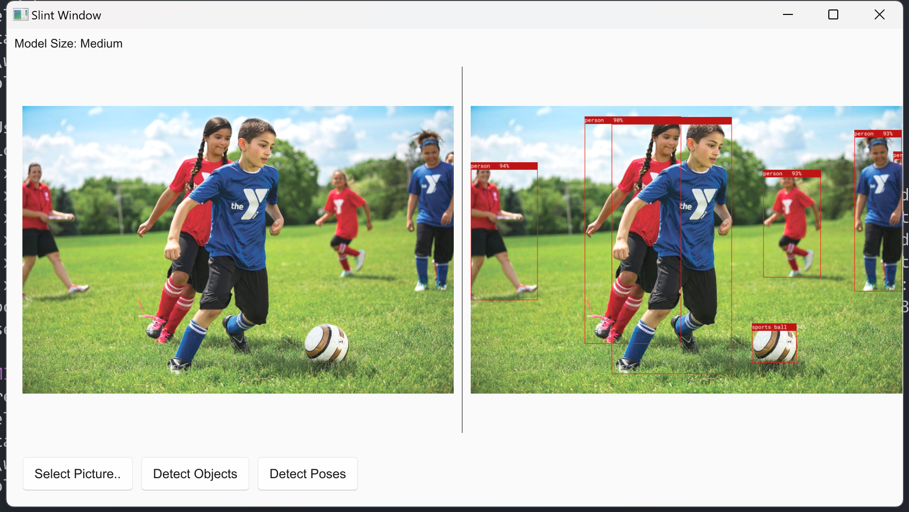
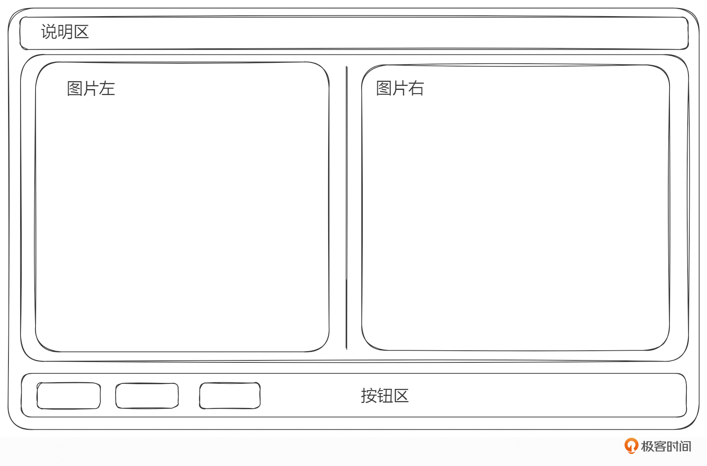
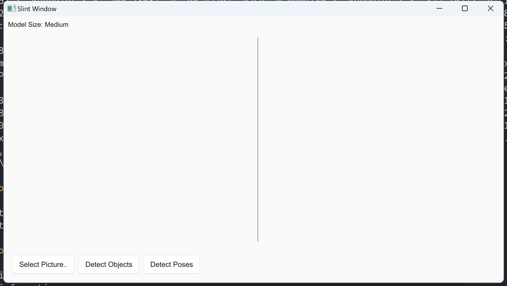
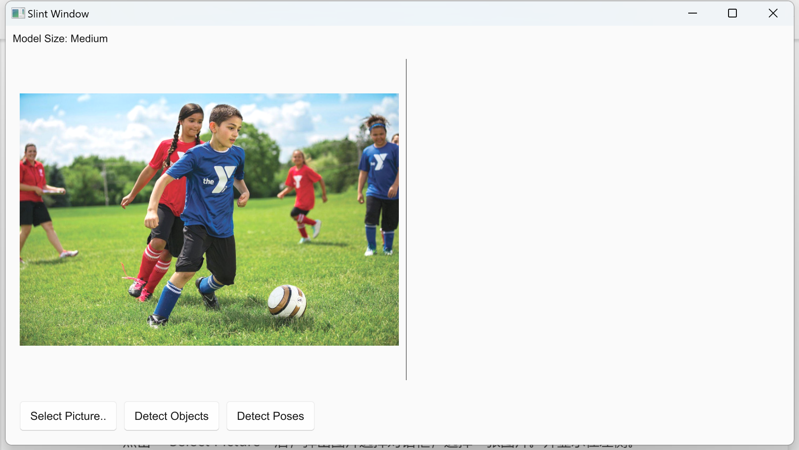
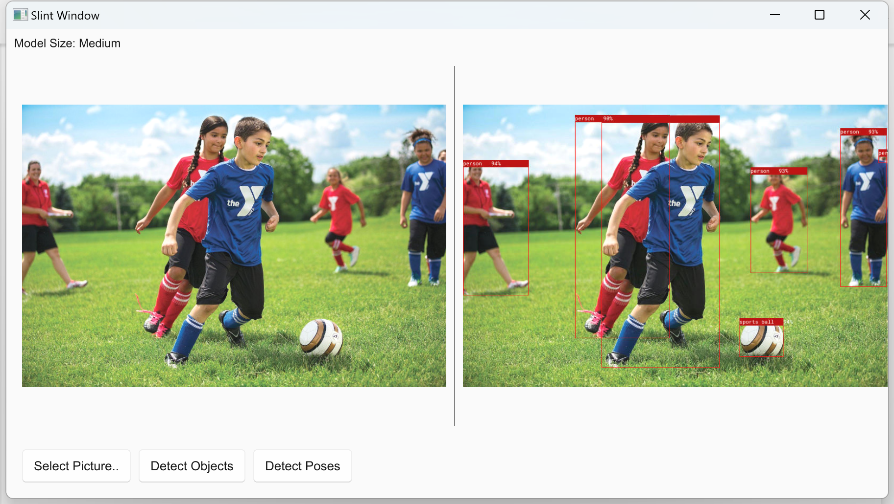
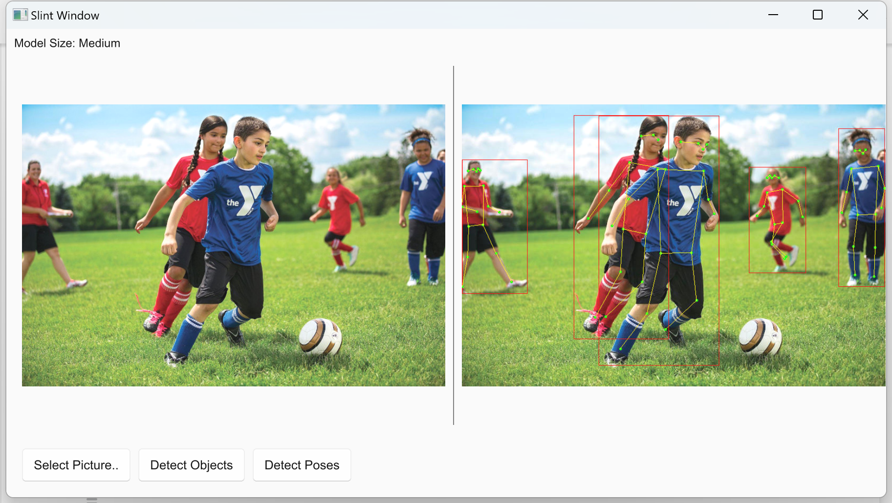
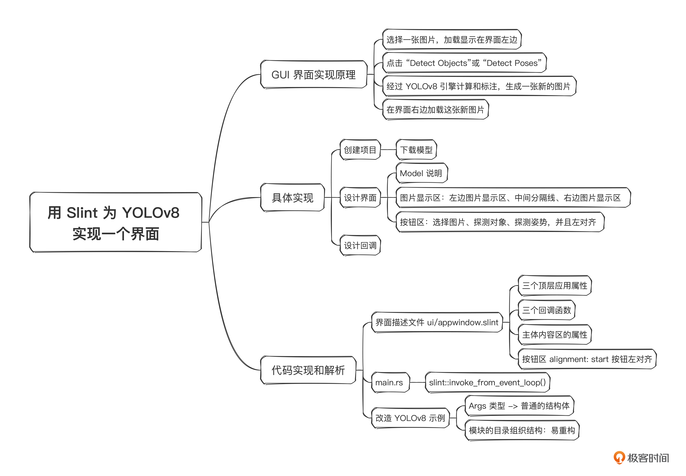

# 26｜Rust GUI编程：用Slint为YOLOv8实现一个界面
你好，我是Mike。

今天我们继续用Slint做一个小项目。这个项目的目标是为我们 [第 24 讲](https://time.geekbang.org/column/article/734943) 实现的用YOLOv8从图片中识别出对象及姿势的小应用提供一个GUI界面。

这个GUI程序非常实用，可以以一种真观对比的形式让你看到对原始图片经过AI加工后的效果。比如像下面这样：



## 原理解析

根据我们上节课学到的知识及第24讲里的操作流程，我们的实现应该分成4步。

1. 选择一张图片，加载显示在界面左边。
2. 点击 “Detect Objects”或 “Detect Poses”。
3. 经过YOLOv8引擎计算和标注，生成一张新的图片。
4. 在界面右边加载这张新图片。

下面让我们开始动手操作。

注：这节课的代码适用于 Slint v1.3 版本。

## 分步骤实现

### 创建项目

我们还是使用官方提供的Slint模板来创建，先下载模板。

```plain
cargo generate --git https://github.com/slint-ui/slint-rust-template --name slint-yolov8-demo
cd slint-yolov8-demo

```

运行 `cargo run` 测试一下。

### 设计界面

这个应用其实不复杂，你可以这样来分解这个界面。



1. 从上到下使用一个 VerticalBox，分成三部分：Model说明、图片显示区、按钮区。
2. 图片显示区使用一个 HorizontalBox，分成三部分：左边图片显示区、中间分隔线、右边图片显示区。图片使用 Image 基础元素来显示。
3. 按钮区，使用HorizontalBox排列三个按钮：选择图片、探测对象、探测姿势，并且左对齐。

这样界面就设计好了。

### 设计回调

这个小工具的回调任务的步骤也很清晰。

- 界面刚打开的时候，显示空白界面。

  

- 点击 “Select Picture”后，弹出图片选择对话框，选择一张图片，并显示在左侧。

  

- 点击“Detect Objects”，生成新图片，显示在右侧。

  

- 点击“Detect Poses”，生成新图片，显示在右侧。

  


整个项目回调的逻辑就描述完成了。

### 下载模型

我们最好先手动下载YOLOv8的两个模型文件，下载方式如下：

```plain
HF_HUB_ENABLE_HF_TRANSFER=1 HF_ENDPOINT=https://hf-mirror.com huggingface-cli download lmz/candle-yolo-v8 yolov8m.safetensors
HF_HUB_ENABLE_HF_TRANSFER=1 HF_ENDPOINT=https://hf-mirror.com huggingface-cli download lmz/candle-yolo-v8 yolov8m-pose.safetensors

```

这是为 HuggingFace candle框架定制的两个模型文件，我们下载的是 object 和 pose medium 大小的 safetensors 格式的模型文件，我们需要把它们拷贝到当前项目的根目录下。像下面这样：

```plain
$ ls -lh
total 101M
-rwxr-xr-x 1 mike mike 150K Dec  9 14:58 Cargo.lock
-rwxr-xr-x 1 mike mike  615 Dec  9 14:58 Cargo.toml
-rwxr-xr-x 1 mike mike 1.1K Dec  9 14:58 LICENSE
-rwxr-xr-x 1 mike mike  747 Dec  9 18:29 README.md
drwxr-xr-x 2 mike mike 4.0K Dec  9 18:27 assets
-rwxr-xr-x 1 mike mike   71 Dec  9 14:58 build.rs
-rwxr-xr-x 1 mike mike 168K Dec  9 14:58 football.jpg
drwxr-xr-x 3 mike mike 4.0K Dec  9 14:58 src
drwxr-xr-x 4 mike mike 4.0K Dec  9 15:03 target
drwxr-xr-x 2 mike mike 4.0K Dec  9 14:58 ui
-rw-r--r-- 1 mike mike  51M Dec  9 17:45 yolov8m-pose.safetensors
-rw-r--r-- 1 mike mike  50M Dec  9 17:45 yolov8m.safetensors

```

下面我们就开始动手写代码吧！

## 代码实现和解析

有了前面几讲的经验，我们应该能比较轻松地完成这次任务。

### 界面文件

我们先来看一下界面描述文件 ui/appwindow.slint 内容。

```plain
import { Button, VerticalBox , HorizontalBox} from "std-widgets.slint";

export component AppWindow inherits Window {
    width: 900px;
    height: 480px;

    in-out property <image> orig-image;
    in-out property <string> orig-image-path;
    in-out property <image> generated-image;

    callback select-orig-pic();
    callback probe-objects();
    callback probe-poses();

    VerticalBox {
        width: 100%;
        vertical-stretch: 1;
        Text {
            text: "Model Size: Medium";
        }
        HorizontalBox {
            width: 98%;
            vertical-stretch: 1;
            Image {
                width: 49%;
                source: root.orig-image;
            }
            Rectangle {
                width: 1px;
                background: gray;
            }
            Image {
                width: 49%;
                source: root.generated-image;
            }
        }
        HorizontalBox {
            alignment: start;
            height: 50px;
            Button {
                text: "Select Picture..";
                clicked => {
                    root.select-orig-pic();
                }
            }
            Button {
                text: "Detect Objects";
                clicked => {
                    root.probe-objects();
                }
            }
            Button {
                text: "Detect Poses";
                clicked => {
                    root.probe-poses();
                }
            }
        }

    }
}

```

我们设计了三个顶层应用属性。

```plain
    in-out property <image> orig-image;
    in-out property <string> orig-image-path;
    in-out property <image> generated-image;

```

注意，orig-image 和 generated-image 类型是 image，是slint语言中的图像类型。orig-image-path 类型是 string，是slint语言中的字符串类型，它与 Rust 中的字符串类型可以通过下面的代码互相转换。

```plain
slint string -> Rust String:  .to_string()
Rust String -> slint string:  .into()

```

根据前面设计回调部分，我们对应地设计了三个回调函数。

```plain
    callback select-orig-pic();
    callback probe-objects();
    callback probe-poses();

```

然后，你还要注意代码里 **主体内容区的属性**。我们使用 `vertical-stretch: 1;` 来让这个区域尽量填充，占领能够占领的最大区域，不留空白。然后我们使用 Image widget 来承载图片显示，并把它的 source 属性绑定到 root.orig-image 和 root.generated-image 上面。

然后下面的按钮区，我们使用 `alignment: start;` 将三个按钮左对齐，并给三个按钮的 clicked 回调写逻辑，调用到对应的顶层回调上面去。

这就是界面描述包含的内容。

### main.rs

接下来，我们看main文件内容。

```plain
use std::{path::PathBuf, sync::mpsc::channel};

use native_dialog::FileDialog;
use slint::{Image, Rgba8Pixel, SharedPixelBuffer};

slint::include_modules!();

mod yolov8engine;

fn main() -> Result<(), slint::PlatformError> {
    let ui = AppWindow::new()?;

    let ui_handle = ui.as_weak();
    ui.on_select_orig_pic(move || {
        let ui = ui_handle.unwrap();

        let path = FileDialog::new()
            .set_location("~")
            .add_filter("Pics", &["png", "jpg", "jpeg"])
            .show_open_single_file()
            .unwrap();

        // if selected pic file
        if let Some(path) = path {
            ui.set_orig_image_path(path.to_string_lossy().to_string().into());
            ui.set_orig_image(load_image(path));
        }
    });

    let (sender, receiver) = channel::<(String, String)>();
    let sender1 = sender.clone();
    let sender2 = sender.clone();

    let ui_handle = ui.as_weak();
    let _thread = std::thread::spawn(move || {
        loop {
            let ui_handle = ui_handle.clone();
            let (task, img_path) = receiver.recv().unwrap();
            if task.as_str() == "_exit_" {
                // end of this thread
                return;
            }

            let (task, model) = if task.as_str() == "detect" {
                (
                    yolov8engine::YoloTask::Detect,
                    Some("yolov8m.safetensors".to_string()),
                )
            } else {
                (
                    yolov8engine::YoloTask::Pose,
                    Some("yolov8m-pose.safetensors".to_string()),
                )
            };

            if let Ok(path) = yolov8engine::start_engine(task, model, img_path) {
                _ = slint::invoke_from_event_loop(move || {
                    let ui = ui_handle.unwrap();
                    ui.set_generated_image(load_image(PathBuf::from(path)));
                });
            } else {
            }
        }
    });

    let ui_handle = ui.as_weak();
    ui.on_probe_objects(move || {
        let ui = ui_handle.unwrap();
        let img_path = ui.get_orig_image_path().to_string();
        println!("{}", img_path);
        _ = sender.send(("detect".to_string(), img_path));
    });

    let ui_handle = ui.as_weak();
    ui.on_probe_poses(move || {
        let ui = ui_handle.unwrap();
        let img_path = ui.get_orig_image_path().to_string();
        println!("{}", img_path);
        _ = sender1.send(("pose".to_string(), img_path));
    });

    ui.window().on_close_requested(move || {
        sender2
            .send(("_exit_".to_string(), "".to_string()))
            .unwrap();
        slint::CloseRequestResponse::HideWindow
    });

    ui.run()
}

fn load_image(path: std::path::PathBuf) -> slint::Image {
    let mut a_image = image::open(path).expect("Error loading image").into_rgba8();

    image::imageops::colorops::brighten_in_place(&mut a_image, 20);

    let buffer = SharedPixelBuffer::<Rgba8Pixel>::clone_from_slice(
        a_image.as_raw(),
        a_image.width(),
        a_image.height(),
    );
    let image = Image::from_rgba8(buffer);

    image
}

```

main文件整体结构和上一讲差不多。这里我重点讲一下不同的地方。Slint里没有现成的文件选择组件，因此我们使用了 native\_dialog 这个 crate，它是一个跨平台的文件选择组件。FileDialog 这一段返回后的 path 是一个 `Option<PathBuf>`。如果选择了文件，就会是 `Some(path)`，如果没有选择文件，比如打开了文件选择框，但是又点击了取消按钮或者关闭按钮，就返回 None。

选择图片文件后，用这种 `set_* API` 把返回的完整路径填充到应用的顶层属性orig-image-path 和 orig-image 上去。

```plain
            ui.set_orig_image_path(path.to_string_lossy().to_string().into());
            ui.set_orig_image(load_image(path));

```

load\_image 会把文件从磁盘里读出来，转换成 Slint 的 image 类型。

后台任务和channel架构也和上节课差不多，我就不赘述了。注意这里使用了模式匹配语法来析构元组消息内容。

`yolov8engine::start_engine(task, model, img_path)` 是YOLOv8任务的执行器，分别传入任务类型 task、模型名字 model 和原始图片地址 img\_path 三个参数，并返回处理后的图片路径 path。然后调用 `slint::invoke_from_event_loop()` 来更新UI界面。

注意，由于我们的主要逻辑是在后台任务中处理的，不能直接在后台任务中更新 UI 界面，必须使用 `slint::invoke_from_event_loop()` 把更新界面的逻辑包起来。在slint内部，它还是通过一个 channel queue 把里面的相关值发送到主UI线程来处理。看起来整个过程是自动的，如果不加这个函数，而是直接调用 UI 对象指针，会出现什么问题呢？

没错，所有权问题！这可以看成是Rust的所有权系统在GUI领域的一次实践和验证，它可以在编译期间帮助我们发现和阻绝界面更新上的竞争问题。

这里，你可以想象一下，如果不创建后台任务，而是直接把业务逻辑写在回调函数里会怎样？也就是放在 `on_probe_objects()` 和 `on_probe_poses()` 中，你可以试一下。这里我分享一下我试验的结果：对于长时间执行的任务，Slint框架会主动把这些任务kill掉，以免对界面操作造成卡顿。

### 改造 YOLOv8 示例

剩下的主要工作就是看 `yolov8engine::start_engine(task, model, img_path)` 是怎么实现的了。

我们在 [第 24 讲](https://time.geekbang.org/column/article/734943) 实现的YOLOv8的工具是一个命令行界面工具，使用 clap 实现。为了能够整合进现在这个GUI程序，我们首先应该对它的Args类型进行转换，转换成普通的结构体，结构体的字段一部分固定下来，一部分从UI界面传进来。

```plain
    let args = Args {
        cpu: true,
        tracing: false,
        model,
        which: Which::M,
        images: vec![img_path],
        confidence_threshold: 0.25,
        nms_threshold: 0.45,
        task,
        legend_size: 14,
    };

```

如果你想让所有参数都可定制，完全可以在界面上做得更复杂，让这些参数可以通过界面上的控件来调整数值。

然后，我们再看一下模块的目录组织结构。

```plain
$ tree src/
src/
├── main.rs
└── yolov8engine
    ├── coco_classes.rs
    ├── mod.rs
    ├── model.rs
    └── roboto-mono-stripped.ttf

1 directory, 5 files

```

你会发现我们使用的是 2015 edition 的风格。这样做不丢人，很多人喜欢这种目录组织风格。这种风格还有一个好处是可以把第24讲的src代码直接拷贝进来，重命名成 yolov8engine，然后把里面的 main.rs 重命名成 mod.rs。整个代码的结构就重构完成了。

然后把 mod.rs 里面的 `fn main()` 函数改成 `start_engine(task, model, img_path)` 即可，这样整个代码结构也改造完成了，剩下的就是要处理一下函数参数的输入和返回值的类型。

在第24讲的代码中， `run()` 函数没有把生成的新图片的path返回回来，我们将其返回回来，并进一步通过 `start_engine()` 函数的返回值返回给这个GUI程序的 `main()` 函数。然后整个业务就完成了。

我把完成代码整理到 [这个地址](https://github.com/miketang84/jikeshijian/tree/master/26-slint-yolov8-demo) 了，你可以下载下来，按照说明运行一下看看效果，也可以基于这个代码随意改改，实现你的任何想法。

## 小结



这节课我们使用Slint GUI框架为 YOLOv8 对象和姿势引擎实现了一个图形化界面。有了这个GUI工具，任何人都可以来体验Rust的图像识别能力了。相比于命令行界面，我们将用户群体扩大到了普通用户。

Rust应用的分发也很简单，将编译后的文件拷贝到另一台电脑上就可以运行了，只需要针对不同的平台分别编译不同的目标格式可执行文件。它不像Python实现的对象和姿势识别工具需要先安装一大堆依赖。

我们花了两节课的时间来熟悉使用Slint GUI框架。它是Rust社区冉冉升起的一个明星框架，目前虽然说不上成熟，但是胜在 **小巧、灵活，可定制性很强**。如果它缺失一些控件什么的，你也可以自己实现。

我们这两节课与第23、24讲结合在一起，做了两组Rust的AI工具。 **AI时代刚刚来临，Rust在AI领域有着巨大的潜力和机会。** AI本身覆盖面非常广，比如学术研究、算法实现、训练、推理、部署、云端计算、单机版模型、集群应用、工业应用、行业工具、终端设备、用户界面等等。未来使用Rust作为工具，也是一个相当好的切入点。

## 思考题

这节课的代码实现有一个性能上的问题，就是每次点击 Detect Objects 或 Detect Poses 的时候，实际上都重复加载了模型，你想一想如何优化这个点？欢迎你把你的想法和优化代码分享到评论区，如果你觉得对你有帮助的话，也欢迎你把这节课的内容分享给其他朋友，我们下节课再见！