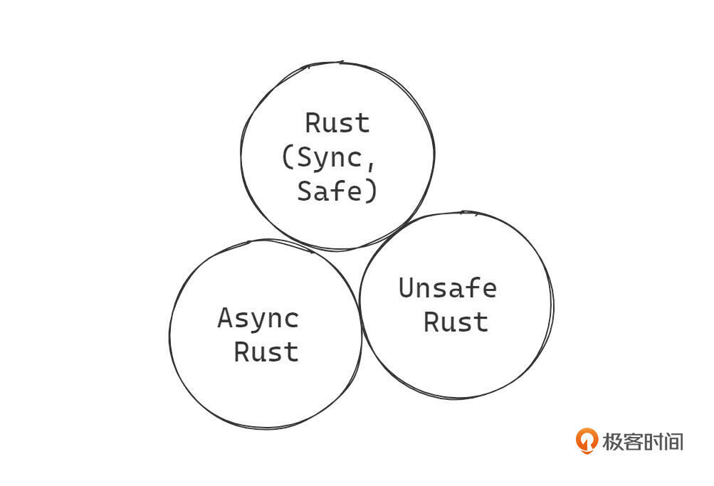
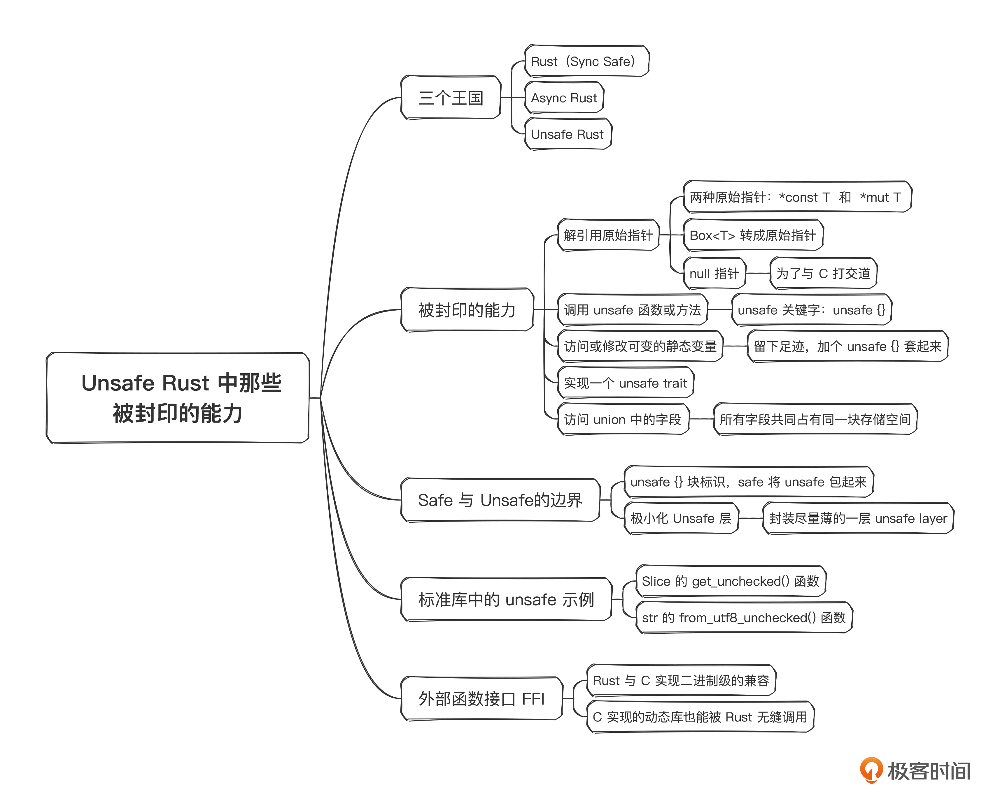

# 29｜Unsafe编程（上）： Unsafe Rust中那些被封印的能力
你好，我是Mike。

这门课目前已接近尾声，剩下的两节课我准备讲讲Rust中看起来有点黑魔法的部分——Unsafe Rust。这一节课我们先来聊聊相关的概念。

在前面课程的学习中，你有没有感觉到，Rust编译器就像是一个严厉的大师傅，或者一个贴心的小助手，在你身边陪你结对编程，你写代码的时候，他盯着屏幕，时不时提醒你。如果某个时刻，这个大师傅或小助手突然离开了，你会不会慌？就像刚提车，第一次独自上路的那种感觉。

## 三个王国

Unsafe Rust 就是这样一个领域，进入这个领域，你突然拥有了几种必杀技能，但是身边已经没有大师傅同行了，只能靠你自己完全控制这几种技能的使用。使用得好，威力无穷。使用不好，对自己也会造成巨大伤害。Unsafe Rust就是这样一个相对独立的领域。前面我们讲到过，Async Rust也是相对独立的一个附属王国，现在又多了一个Unsafe Rust这样的附属王国。



Rust语言可以看作是这三块疆域的合体，它们共同组成了一个联盟Rust王国。你甚至可以把Rust语言看成包含上面三种编程语言的一种混合语言。所以很多人抱怨Rust难学，也是可以理解的。

现在让我们把注意力集中在Unsafe Rust这个王国里面。它到底是什么样的？简单地说，你可以把它理解成这个王国里面住着一个C语言族的国王。也就是说，C语言能做的事情，Unsafe Rust都能做。C语言能做哪些事情呢？理论上来说，它能做计算机中的任何事情。因此，在Unsafe Rust中，你也能做计算机中的任何事情。C的强大威力来源于它锋利的指针，而在Unsafe Rust中也提供了这种能力。

## 被封印的能力

Safe Rust王国有些技能被封印了，而这些技能进入到Unsafe Rust王国后，就可以被揭开使用。具体来说，有5种技能。

1. 解引用原始指针
2. 调用unsafe函数或方法
3. 访问或修改可变的静态变量
4. 实现一个unsafe trait
5. 访问 union 中的字段

这里我们简单提一下这5个方面，我们从第5点讲起。union我们在课程里没有讲，这里我们简单了解下。它是一个类似于C中union的设计，也就是所有字段共同占有同一块存储空间。访问它的字段时，需要在 Unsafe Rust 中使用。

```plain
union IntOrFloat {
    i: u32,
    f: f32,
}
let mut u = IntOrFloat { f: 1.0 };
// 读取union字段时需要用 unsafe {} 包起来
assert_eq!(unsafe { u.i }, 1065353216);
// 更新了i，结果f字段的值也变化了。
u.i = 1073741824;
assert_eq!(unsafe { u.f }, 2.0);

```

我们一般用不到 union，如果需要深入研究，可以查看我给出的 [链接](https://doc.rust-lang.org/std/keyword.union.html)。

第4点，我们可以给 trait 实现 unsafe，这块内容比较深，所以在我们这门初级课程里不要求了解，如果你有兴趣可以查看我给出的 [链接](https://doc.rust-lang.org/nomicon/safe-unsafe-meaning.html)。

第3点也就是全局静态变量，前面我不提倡修改它，因为它是一种不太好的编程模型。但是如果你非要改的话，也是有办法的，那就留下足迹，加个 `unsafe {}` 套起来，比如 the book 里的 [示例](https://doc.rust-lang.org/book/ch19-01-unsafe-rust.html#accessing-or-modifying-a-mutable-static-variable)。

```plain
// 这里修饰为 mut
static mut COUNTER: u32 = 0;
fn add_to_count(inc: u32) {
    // 修改全局可变静态变量需要用 unsafe
    unsafe {
        COUNTER += inc;
    }
}
fn main() {
    add_to_count(3);
    // 访问全局可变静态变量也需要用 unsafe
    unsafe {
        println!("COUNTER: {}", COUNTER);
    }
}
// 输出
COUNTER: 3

```

下面我来重点讲解一下前2种场景。

### unsafe关键字

Rust中有一个 unsafe 关键字，用来显式地标明我们要进入 unsafe Rust 的领地。unsafe 关键字可以修饰 fn、trait，还可以在后面跟一个 {} 表明这是一个 unsafe 块，把可能不安全的逻辑包起来，像下面这样：

```plain
unsafe {
    //...
}

```

这里，需要说明一下，被 unsafe 标识或包起来的代码，并不是说一定有问题。它的准确意思是： **Rustc编译器不保证被unsafe标识的代码是安全的，你应该保证你写的代码是安全的**。

也就是说，unsafe 这个标识符，在代码中留下了明确的足迹，将交由Rustc全权保证安全的代码，和不交由Rustc全权保证安全的代码，分隔开了。

请注意上面这句话的用词，“不交由Rustc全权保证安全的代码部分”并不是说Rustc编译器就完全不检查 unsafe 里的代码了，实际Rustc只是对上面提到的5种技能不加检查。对于Safe Rust里的内容还是要做检查，跟之前一样。我们来看一个示例。

```plain
fn main() {
    let v = [1,2,3];

    unsafe {
        println!("COUNTER: {}", v[3]);
    }
}
// 编译输出
warning: unnecessary `unsafe` block
 --> src/main.rs:4:5
  |
4 |     unsafe {
  |     ^^^^^^ unnecessary `unsafe` block
  |
  = note: `#[warn(unused_unsafe)]` on by default

error: this operation will panic at runtime
 --> src/main.rs:5:33
  |
5 |         println!("COUNTER: {}", v[3]);
  |                                 ^^^^ index out of bounds: the length is 3 but the index is 3

```

示例中，我们需要重点关注 array 的下标索引越界的问题。我们在 [第 1 讲](https://time.geekbang.org/column/article/718865) 里已经讲过，array的下标索引越界会在编译期被检查出来，可以看到，即使放在 unsafe block 中，它仍然执行了检查。这印证了我们上面的说法： **被 unsafe 标识的代码，并不是让Rustc完全不管，而只是某几种技能让Rustc不管**。Safe Rust中的那些元素，Rustc该管的还是要管。

所以即使是Unsafe Rust，看上去也要比写 C 代码来得“安全”，犯错的风险更小一些。另外编译器指出这里 unsafe 块没什么用，可以去掉，我们确实没使用它。

### 原始指针

Rust中有两种原始指针（raw pointer）， `*const T` 和 `*mut T`。用法如下：

```plain
fn main() {
    let my_num: i32 = 10;
    let my_num_ptr: *const i32 = &my_num;
    let mut my_speed: i32 = 88;
    let my_speed_ptr: *mut i32 = &mut my_speed;

    unsafe {
        println!("my_num is: {}", *my_num_ptr);
        println!("my_speed is: {}", *my_speed_ptr);
    }
}
// 输出
my_num is: 10
my_speed is: 88

```

也就是可以将不可变引用 `&T` 转换成 `*const T` 指针。将可变引用 `&mut T` 转换成 `*mut T` 指针。你也可以用 [as 操作符](https://doc.rust-lang.org/book/ch19-01-unsafe-rust.html#dereferencing-a-raw-pointer) 来转换。

之前我们讲过，引用是必须有效的指针，而指针不一定是引用，在这里就得到了充分的体现。原始指针指向的数据不对的话，解引用有可能会导致段错误或其他未定义行为。因此引用转换为原始指针的时候，不需要包unsafe，解引用原始指针的时候，要用unsafe包起来。这就是我们上面说的那5种被封印的能力中的第一种能力： **在 unsafe Rust 中，可以解引用原始指针。**

一旦接触到了原始指针，也就开启了计算机底层系统的大门。你可以看我放在这里的两个链接，感受一下原始指针的复杂性。

- [https://doc.rust-lang.org/std/primitive.pointer.html](https://doc.rust-lang.org/std/primitive.pointer.html)
- [https://doc.rust-lang.org/std/ptr/index.html](https://doc.rust-lang.org/std/ptr/index.html)

### `Box<T>` 转成原始指针

`Box<T>` 是带所有权的智能指针，它有一个 `into_raw()` 函数可以转换成原始指针。这个转换对于内存里的资源没有影响。但是要再从raw pointer转回Box就要放在 unsafe 里包起来， `Box::from_raw()` 是 unsafe 的。

```plain
fn main() {
    let my_speed: Box<i32> = Box::new(88);
    let my_speed: *mut i32 = Box::into_raw(my_speed);

    unsafe {
        let _ = Box::from_raw(my_speed);
    }
}

```

这实际上也是对原始指针解引用的一个变形，所以要放在 unsafe 块里。

### null指针

之前我们说过，Rust中不存在null/nil值，所有的变量都必须初始化。这在Safe Rust里是正确的。但是在Unsafe Rust中，却提供了null指针的表示。

可以用 std::ptr 里的 `null()` 和 `null_mut()` 生成两种原始空指针。

```plain
fn main() {
    use std::ptr;

    let p: *const i32 = ptr::null();
    assert!(p.is_null());
    let p: *mut i32 = ptr::null_mut();
    assert!(p.is_null());
}

```

Rust中为什么会有空指针存在？有什么作用呢？那是因为C语言中有空指针这个东西。为了与C打交道，Rust中要有对应的设计，好与C库或者C应用程序对接，毕竟在Rust出来之前，C/C++ 已经建成了这个软件世界的地基。

### Safe与Unsafe的边界

在Rust中，unsafe函数必须在 unsafe 函数中调用，或使用 `unsafe {}` 块包起来调用。因此下面的代码是可以的：

```plain
fn foo() {
    let my_num_ptr = &10 as *const i32;
    let my_speed_ptr = &mut 88 as *mut i32;

    unsafe {
        println!("my_num is: {}", *my_num_ptr);
        println!("my_speed is: {}", *my_speed_ptr);
    }
}

fn main() {
    foo();
}

```

可以看到， `foo()` 函数中包含了 unsafe 块的调用。但是从 `main()` 函数的角度来看，它调用 `foo()` 时不需要在外面再套一层 `unsafe {}` 来调用了。这里实际体现了重要的一点， **Unsafe 与 Safe 的边界**。示例代码里两者的边界就在 `foo()` 函数中。

从 `main()` 的视角来看，它调用的 `foo()` 有可能是第三方库暴露出来的接口，并不知道里面具体的实现，只知道这个函数可以按Safe Rust的形式安全调用。这里的这个 `foo()` 就是 **对unsafe代码的safe封装**。

我们再来看一个实际一点的例子。

```plain
use std::slice;
fn split_at_mut(values: &mut [i32], mid: usize) -> (&mut [i32], &mut [i32]) {
    let len = values.len();
    let ptr = values.as_mut_ptr();
    assert!(mid <= len);
    unsafe {
        (
            slice::from_raw_parts_mut(ptr, mid),
            slice::from_raw_parts_mut(ptr.add(mid), len - mid),
        )
    }
}
fn main() {
    let mut vector = vec![1, 2, 3, 4, 5, 6];
    let (left, right) = split_at_mut(&mut vector, 3);
}

```

上面函数将一个 i32 数组的 slice 可变引用分成了前后两段slice可变引用。这在 Safe Rust 是做不到的，因为同时对原数组存在了两个可变引用，详情请看 [官方书](https://doc.rust-lang.org/book/ch19-01-unsafe-rust.html#creating-a-safe-abstraction-over-unsafe-code)。

在Unsafe Rust中可以做到，但是 `slice::from_raw_parts_mut()` 只能用 `unsafe {}` 包起来调用。而对业务开发者来说，在 `main()` 函数中以Safe Rust的形式直接使用 `split_at_mut()` 就行了，一切就好像 `split_at_mut()` 是真正safe的一样。在这里，它确实是safe的，只不过这个safe不是由Rustc来保证的safe，而是由我们程序员自己保证的safe。我们知道我们在干什么，两个 slice 并不重叠，不会有问题。

如果打破砂锅问到底的话，是不是几乎所有的Rust底层都有这个问题？跟踪到最底层代码的话，是不是都是 unsafe 的？如果是，那么Rust所标榜的 safe，岂不是一个虚幻的空中楼阁？

你的猜测大体是正确的。

### 极小化Unsafe层

从本质来说，世界是建立在unsafe上面的。

从硬件来说，我们编写程序来操作各种设备，内存、硬盘、显卡、网络设备等等，对它们的操作完全有可能是不安全的，这个错误可能来自各种层次，比如电源波动引起的故障、线路老化故障、晶体管损坏故障，甚至是太阳黑子爆发引起的故障等等。

从软件指令来说，当代码编译成二进制后，这个二进制可执行序列的威力是无穷大的，理论上可以对计算机内存和设备地址做任意访问，这也是hack行为的源头。只要hacker找到了你程序中的漏洞，它就可能在你的计算机中做任何危险的事情。这就是C这种靠指针吃饭的语言强大且危险的原因。

不管是从硬件层面还是软件层面，你的一个操作完全可能会得到一个未知的行为或未定义行为 [Undefined Behaviour](https://doc.rust-lang.org/reference/behavior-considered-undefined.html)。 **从Safe Rust的观点来看，一个会产生未定义行为的操作，就是Unsafe的**。而unsafe的操作，都必须明确地放在 `unsafe {}` 块中隔离。

因此，在Safe Rust看来，威力过大的技能，比如原始指针的解引用，可能访问到未初始化的地址，或者是已经释放后的地址，因此它是Unsafe的；外部的C/C++代码，它们都得靠程序员自己来保证安全性，因此它们是不可信任的，把它们都归类到 Unsafe 中；对外部设备的操作，已经超过内存资源的管理权限了，Rust自己鞭长莫及，因此把它归为不信任，归类到 Unsafe 中。

于是我们可以看到，Rust将所有代码分割成了 Safe 的和 Unsafe的两块，两块之间就通过明确的 `unsafe {}` 标识来隔离，这是Rust的基本世界观。

在这个世界观之上，基于Rust的软件体系还有一套抽象哲学——当需要Unsafe时，应该把它封装在一个极小层（minimalist layer），然后在它的上面建立上层建筑。

也就是说，如果不得不用Unsafe代码，那请封装尽量薄的一层unsafe layer，而在其之上完全使用safe rust编写。这个时候就可以回答这个问题了：如果是，那么Rust所标榜的 safe，岂不是一个虚幻的空中楼阁？

Rust通过这套方法学，让Safe Rust的代码部分可以自证安全，而Unsafe Rust的代码部分由程序员来保证安全。你可以想象一下，如果一个系统有10万行Rust代码，98%的代码是 Safe Rust，2%的代码是 Unsafe Rust，那么需要由人来审计的代码就只有2千行。那我们就可以把所有精力集中在这2千行代码的审计上，确保它们不会出问题。或者说即使出了问题，也可以去这2千行代码中去找原因。

而如果同样的这套系统，由10万行C/C++代码来实现，那么审计的时候，就必须审计 10万行代码，也就是 50 倍的审计工作量。遇到问题，也是在10万行代码里面去找原因。这个成本完全不可比拟。

因此，Rust 所标榜的 safe，完全不是空中楼阁。不仅不是空中楼阁，还是非常切实可行的一套软件工程方法学。

## 标准库中的unsafe示例

Rust标准库中有一些unsafe函数，我们来看两个。

### Slice的 [get\_unchecked()](https://doc.rust-lang.org/std/primitive.slice.html\#method.get_unchecked) 函数

```plain
fn main() {
    let x = &[1, 2, 4];

    unsafe {
        assert_eq!(x.get_unchecked(1), &2);
    }
}

```

在有 `get()` 的情况下，Rust标准库还提供这个 `get_unchecked()` 函数，原因其实也很简单，因为 `get()` 会进行边界检查，而 `get_unchecked()` 不会。在有些密集运算的情况下，边界检查对性能影响比较大，因此提供一个不做边界检查的版本，用来追求极致的速度。毕竟，Rust是一门与C/C++在同一层次的语言，不应该给Rust人为呆板地设置障碍，比如必须使用边界检查的安全版本。

### str的 [from\_utf8\_unchecked()](https://doc.rust-lang.org/std/str/fn.from_utf8_unchecked.html) 函数

```plain
fn main() {
    use std::str;

    // some bytes, in a vector
    let sparkle_heart = vec![240, 159, 146, 150];

    let sparkle_heart = unsafe { str::from_utf8_unchecked(&sparkle_heart) };

    assert_eq!("💖", sparkle_heart);
}

```

这个函数我们在 [第 4 讲](https://time.geekbang.org/column/article/720426) 聊字符串的时候提到过，它不检查字节序列为有效的UTF8编码，因此转出来可能不是有效的字符串。原因也很简单，还是为了性能。在有些场合下，绝对的性能就是绝对的王道，Rust不给你设置天花板。

## 外部函数接口 FFI

这里我提出一个问题，你来想一下。 **一门编程语言如何与另一门编程语言在语言层面交互呢？** 这个问题还真不好办。

事实上，像JavaScript就不太可能直接与Python进行交互。大部分语言之间是没办法直接交互的。但是，历史却留下一个有趣且可贵的遗产——所有主流语言基本都能与C语言交互，因为它们都需要用C来写扩展，提升性能。当然 C++ 是在语言层面直接包含了 C，这个另当别论。

Rust在设计之初， **与C实现二进制级的兼容** 就是一项重要目标。二进制兼容的意思其实就是Rust可以选择编译目标为符合C语言 [ABI](https://en.wikipedia.org/wiki/Application_binary_interface)（Application Binary Interface）的二进制格式。

ABI包含数据结构怎么对齐、存储，函数如何传参、返参、调用二进制格式信息等，而Rust就支持编译到遵循 C ABI 的二进制库目标上。这意味着用Rust编写的共享动态库 `.so`、 `.dll` 等在外界看来，与用C编译成的 `.so`、 `.dll` 动态库没什么区别，你甚至不知道是什么语言写成的。因此，Rust编写的动态库也能被 Python、JavaScript、Go、Java 等其他语言调用，它们都支持C ABI动态库。

另一方面， **C实现的动态库也能被Rust无缝调用**，因为Rust能识别C ABI。一个C的库函数，在C应用中运行和在Rust应用中运行没什么区别，性能也没有损失，就好像没有跨语言一样，这就是Rust的魔法所在。

这点与其他动态语言如 Python、JavaScript 等就有很大差别。这些动态语言到C语言的FFI边界会有不小的额外消耗。究其原因，就是因为入参与返参会有类型转换的工作，而在这些动态语言中，类型是被GC托管的，这里面就有很多细节要处理，会带来额外的消耗。而Rust就不存在这个问题，前面我们提示，Unsafe Rust里面住着一位C国王，就好像一家人一样，或者至少是关系很近的亲戚。

尽管如此，有关Rust与C的FFI的知识点还是非常多的，有许多要注意的地方，也不是一下子就能掌握的，需要在实际需求产生时抠各种细节。另外，Rust中的Unsafe其实要求你考虑更多，因为它比传统的C语言工程更详尽地考虑了 [未定义行为](https://doc.rust-lang.org/reference/behavior-considered-undefined.html) 的概念，它要求你尽可能地考虑周全， **因为封装给Safe Rust的功能被要求不能产生任何未定义行为**。所以Rust不仅是工程上的创新，在学术理论上也有一定程度的创新，目标就是写出更健壮的代码。

## 小结



这节课我们了解了有关Rust中Unsafe和FFI的基础概念。我们进入Unsafe Rust后，就可以使用一些必杀技能了。这些技能威力巨大，但是也充满风险，需要由程序员自己来保证使用上的安全性。

我们说Rust由三个王国组成，既然是王国，那么内容铁定不会少。从 `unsafe {}` 这个大门进入Unsafe Rust，实际就进入了计算机体系结构的底层，你会发现一片美丽新世界。这个世界中有 OS、内存结构、对齐、锁、ABI、调度、指令集、总线协议等等眼花缭乱的新东西。我们之前提到过一种观点， **学习Rust就是学习CS计算机科学，Unsafe Rust就是下沉之门**。

Rust与C有正统的血脉关系，可以实现真正的双向互通，而没有边界性能损失。这预示着未来在嵌入式、工业控制、航空航天、自动驾驶等领域，Rust都有非常大的潜力成为主流选手。绝大部分的人写熟了Rust以后就再也不想写C了，编程体验完全不可同日而语。长期来看，C语言的份额会逐渐缓慢地萎缩到一个比较小的范围，而Rust则会担当起C语言之前的重任。

我们要理解Rust将Safe建立在Unsafe的这套方法之上，这也是软件工业界几十年探索的一个重要成果。所以你会听到NASA、微软等机构呼吁新的软件开发不要再使用C/C++了，而应该用“安全编程”的语言来取代。从这个意义上来讲，Rust是划时代的语言。以后的语言可能会这么分类：Rust之后的语言与Rust之前的语言。

下节课我们会将Rust代码导出给C语言使用，并且进一步导出给Python使用，给Python实现一个自定义扩展。

## 思考题

Unsafe Rust比C语言更安全吗，为什么？欢迎你把自己的思考分享到评论区，也欢迎你把这节课的内容分享给需要的朋友，我们下节课再见！