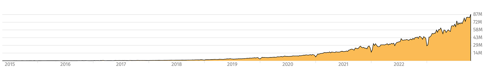
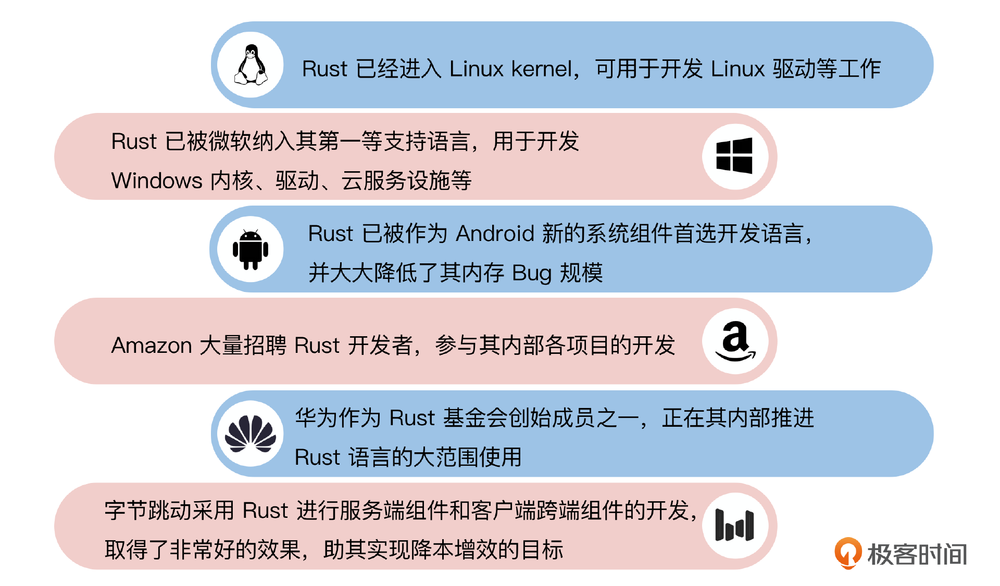
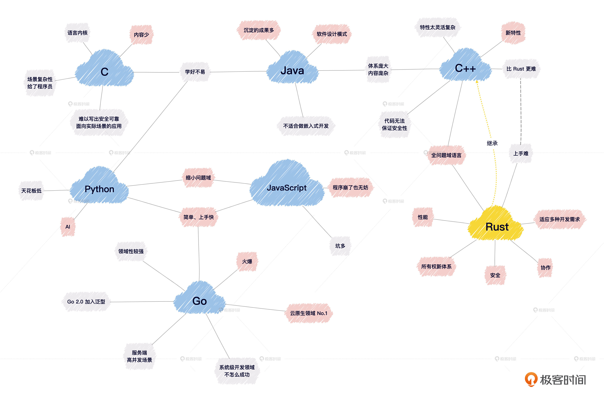
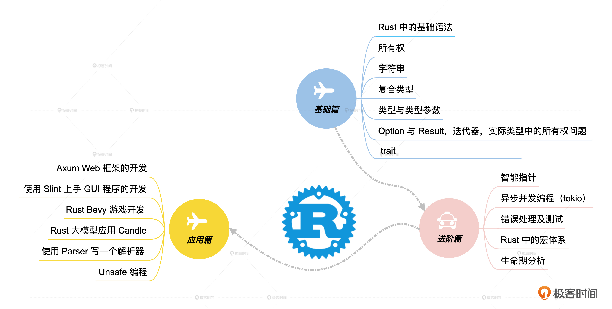

# 开篇词｜拥抱Rust浪潮，迎接更极致的编程体验
你好，我是唐刚，Rust 语言中文社区联合创始人。欢迎加入《Rust语言从入门到实战》，开启一段全新的学习旅程。

2014年我开始接触Rust，到现在已经8年多了，从拥护者到布道者，一直在学习积累。

我以前是一个C极大主义者，觉得用C语言就能完成我想做的任何事情。但后来C程序中的各种缓冲区溢出、段错误等问题一直困扰着我，不管我采用何种最佳实践集合，那些问题总是根除不了。

这也是我学习Rust的重要契机。那时我就有种直觉——它一定会成为未来的一股潮流。

于是我积极参与国内Rust语言社区的贡献和维护，2016年组织并参与撰写了中文社区第一本免费开源的Rust语言教程：RustPrimer（也许是世界上第一本，比官方书 The Rust Programming Book 还早）。后续几年又参与翻译了《Rust权威指南》和《Rust实战》两本书。同时，我还维护着国内Rust语言中文社区论坛 [Rustcc.cn](https://rustcc.cn/) 和 Rust语言中文社区公众号。

很幸运我亲历了Rust语言从诞生、成长，到被越来越多的开发者和企业接受的过程，也见证了Rust语言从初出茅庐的稚嫩到特性不断成熟、对初学者越来越友好的过程。难得的是，Rust始终保持初心： **对安全性的追求，对性能的不妥协。** 也正因如此，它连续8年被StackOverfow评为最受程序员喜爱的语言。

因为日常工作的关系，我对Rust语言在国内的发展状况和困难点比较了解。至少在前几年，Rust语言一直都还处于叫好不叫座的状态。喜欢的人确实多，但是能真正在工作中实践的少之又少。我想这与Rust语言上手难度比较高有直接的关系。

## 暗潮汹涌的 Rust

不过到了2023年，我发现互联网上自发地学习和宣传Rust的人变多了，在各大招聘网站上的Rust岗位也多了起来，分布在各个领域，如操作系统、服务端、中间件、云原生、数据库、大数据、区块链、嵌入式、大模型、客户端，甚至Web前端开发领域都涌现出一批业界不可忽视的项目。

也就是说，前期的观望期可能已经快结束了。而验证期过后，很可能是一个爆发期，如果你能赶在它爆发前掌握它，那对自身的竞争力来说会是一个极大的加成。我们来看一个数据， Rust官方的包仓库crates.io的下载量。

这是一个明显的指数曲线，crate下载量在以每年1.8倍的速度递增（已超过摩尔定律）。另外一方面，国内国外的一些大厂也都在力推Rust。

这些数据让我们对Rust的未来信心满满！

## Rust 为什么这么难学？

但是就像前面说的，Rust确实“难学”，这是一个必须面对的客观事实。难学最主要的原因是， **Rust语言中的概念和风格跟现在主流的编程语言不一致**，这导致了几个问题。

1. 需要重新理解一些基础概念，如变量赋值、可变性、所有权等。
2. 需要重新熟悉一些新的编程范式，如非OOP、Trait约束、链式操作等。
3. 以前习惯了的快速学习方法不顶用了，比如像Go语言快速过两遍语法就能上手做小工具。

这和前面20多年我们一直认为的“编程语言发展方向就是语法越来越简单易用”的理念背道而驰。其实，关于编程语言的发展方向还真不是这样，现在的趋势反而是在朝着 **类型化、健壮性** 方向发展。所以我们首先得调整一下心态。

其实，Rust之所以“难”，是因为 **编程这件事儿本身就很难**， **或者说客观世界的复杂性本来就在那里，你不可能投机取巧绕过它们。** 只是不同语言对这种客观复杂性的处理思路或者说设计哲学不一样，比如C语言就把场景复杂性留给了程序员，而像Java、Python和JavaScript这些高级语言则尽可能将内部复杂性进行封装和隐藏，所以相对来说会更容易入门。

而C++则是把复杂性留给了自己，这也导致了入门和学好它都比较困难。而Rust也基本继承自C++。它吸收了前辈语言很多优秀成分，从所有权理论出发，打造出了一个全新的体系。

与C++一样，Rust是一门全问题域语言，或者叫真正的全栈语言。它可以适应从嵌入式裸金属编程、OS开发，到上层数据库、大模型系统几乎所有层次的开发需求。Rust从一开始就被设计成一门立足安全、追求性能、迎合并行计算需求的语言。

## 不走寻常路的 Rust

Rust之前的语言，在 **内存管理** 上主要是走两条路子。第一条是为了追求高性能，内存管理基本上全权交给程序员。写出的程序是否安全，由程序员自己来保证。这类语言典型的就是C、C++。后来人们觉得第一条路对程序员要求太高了，太难了，因此转向了GC这条路。从Java开始的这些语言基本走的都是这条路。但是这条路子也有相当大的牺牲，比如运行时的负担、Stop The World等问题。

后来，C++中出现了一些智能指针的设计，用来帮助程序员减轻内存管理的痛苦。但是就像前面提到过的，这些创新改进无法从根本上解决C++写出不安全代码的问题。更别说很多程序员甚至都不愿意去使用这些新的特性。

而Rust语言选择了第三条路子： **使用所有权对资源进行管理。** 既不需要让程序员手动管理内存，也不需要借助GC来管理内存。这个方式灵感来源于RAII（Resource Acquisition Is Initialization，资源获取即初始化），但做得更精细。

Rust语言，不管吸收整合了多少种语言的优秀特性，从根本上来说，主要还是来自于C++，如果把Rust简单粗暴地理解为Better C++也不为过。但由于Rust语言完全重新设计，因此从一出生就没有了C++沉重的历史包袱，可以把很多特性做得更彻底。

## 如何不被 Rust 劝退，顺利入门？

好了，明白了Rust不是故意设计成这样来刁难我们之后，问题就转化成了另外一个：有没有一些好的方法能够让我们顺利地入门Rust而不被劝退呢？关键就在于 **上手期的顺利程度**。

因为Rust本身具有较多独特的语言元素，初学者第一次遇到这些元素时容易卡壳，导致编译不通过。如果卡壳的地方多了，并且搜索也找不到答案的话，就容易被击退。所以从入门到放弃就成了Rust社区中的一个梗。

到了2023年，Rust相关资料已经相当丰富了。但在如何引导新人更容易地上手这一块儿，无论是官方还是社区，做得都还远远不够。而我们的课程也正是这样一次探索成果的展示。我希望在这个课程中，用示例来引导你小阶梯地一步一步往上走。真正找到写Rust程序的感觉，体会到学习Rust语言的乐趣。

不过这门课程不会面面俱到，而是会专注于把Rust语言中最核心的概念讲透，详细解析对于初学者来说容易卡壳的地方。通过设计大量的代码示例，把这些细微精妙的东西讲清楚。

学习，从本质上来说，其实就是N+1的过程。就是要一点一点地理解新知识，将其消化，与已有的知识体系融合，学好一步后，再学下一步，也就是不能直接 N+2，要 N+1+1。跳过一步，也许后面就脱节了。因此你不需要着急，多花点时间把Rust的基础打好至关重要。Rust语言是一门全栈语言，它能够用很久。所以静下心来学习，似慢实快！

## 课程设计

为了实现这种 N+1+1 的效果，我把整个课程分成三部分。

#### 基础篇

在基础篇，我会给你详细讲解Rust语言的基础语法，学习Rust中最常用的语言组件，并用大量示例学习Rust所有权、类型Trait。Rust中的知识点非常多，但是我们初学者并不需要学完所有知识点才能开始写代码。因此我们在基础篇中将Rust必须掌握的部分拎出来，让你在有限的时间里掌握Rust语言的精髓。

#### 进阶篇

在学完基础篇的那些概念的基础上，我们在进阶篇中会学习智能指针、错误处理、宏、生命期初步分析、Rust异步并发编程等内容。因为异步并发编程在实际生产中使用越来越广泛，所以它的占比也是最大的。通过这部分的学习，我们将掌握使用Rust高效解决实际问题的方法。与Java类似，Rust的编程模式是非常固定的，学习起来并不困难。

#### 应用篇

第三阶段应用篇，我会带你在实际的项目中应用Rust。通过Web后端开发、前端 GUI开发、游戏开发、大模型实践、解析器开发和跨语言开发这6个不同领域的实战，你可以学会利用Rust生态中的框架快速解决问题。同时能感受到Rust语言的强大能力及其广泛的适用场景。在完成第三阶段的学习后，你可以选择一个方向继续深入，毕竟要想在任何一个方向上成为专家，都必须花大量的时间去积累。

纸上得来终觉浅，绝知此事要躬行。我们课程中含有大量的示例代码，希望你能跟着我一起手敲代码，体会架构设计和编译调试过程中的乐趣。我保证课程中的每一步进展，都是你可以理解的，我会尽量使用简短的代码或示意图来把问题说清楚。相信我，跟着我做，你一定会对Rust的理解到达一个新的层次。

下面我们就正式开始这一次的Rust学习之旅吧！