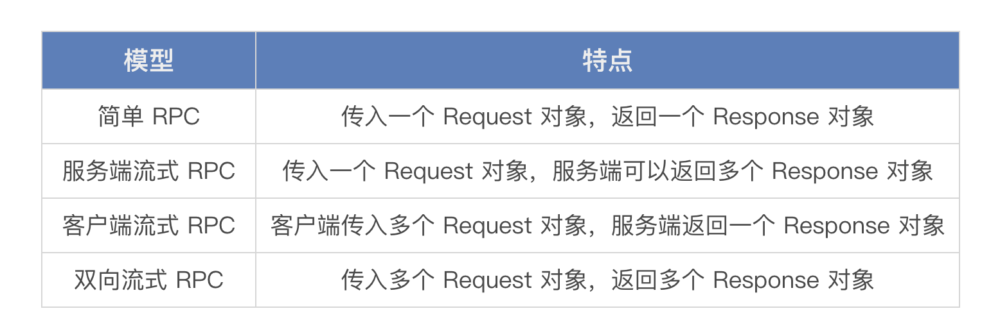
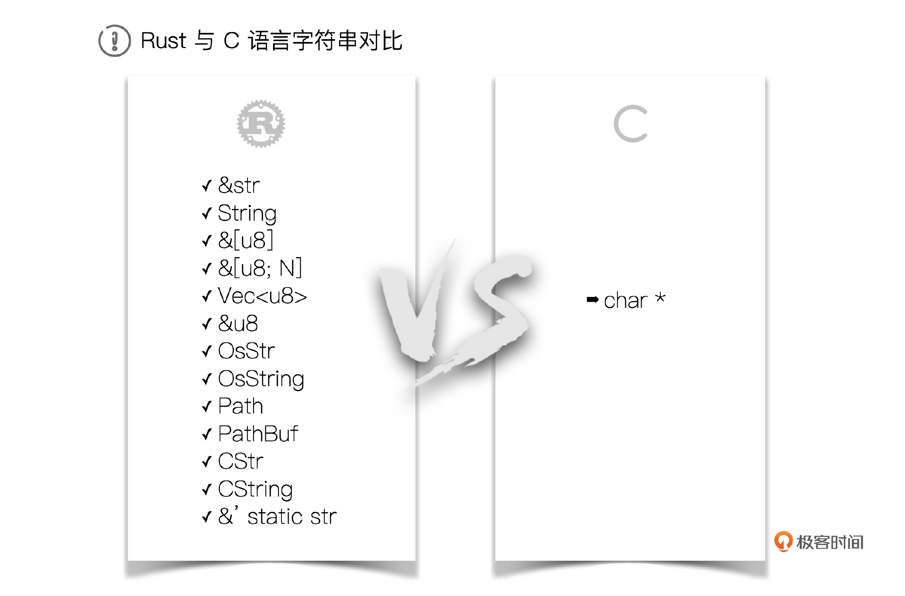

# 答疑课堂（三）｜第三章Rust应用篇思考题答案
你好，我是Mike。

你真的很棒！已经学完我们这门30讲正文内容了，最后我们还是和前面两章一样处理一下第三章应用篇的思考题。这部分思考题动手操作的内容比较多，我希望你真的可以自己动手敲敲代码，在我给的示例里做出自己想要的效果。

话不多说，我们开始吧！

### [21｜Web开发（上）：如何使用Axum框架进行Web后端开发？](https://time.geekbang.org/column/article/733433)

#### 思考题

请你说一说 Request/Response 模型是什么，Axum 框架和其他 gRPC 框架（比如 Tonic）有什么区别？

#### 答案

Request/Response 模型是一种通用的网络模型架构，用于简化跨越网络的数据传输操作。在这种模型中，客户端发送一个请求（Request），服务器端接收并处理该请求，然后返回一个响应（Response）给客户端。这种模型广泛应用于各种网络应用和协议中，如HTTP、FTP等。Request / Response 模型就是一来一回交互。

Axum 框架和其他 gRPC 框架主要是通信模式不一样。Axum提供了一种基于actor模型的通信模式。gRPC模型在Request / Response 模型基础上构造了更多的交互模型支持。



### [22｜Web开发（下）：如何实现一个Todo List应用？](https://time.geekbang.org/column/article/734130)

#### 思考题

当 Axum Handler 中有多个参数的时候，你可以试着改变一下参数的顺序，看看效果有没有变化。并在这个基础上说一说你对声明式参数概念的理解。

#### 答案

声明式参数，简单来说就是参数的顺序不影响意图表达。因此在Axum中，解包器之间可以任意互换，这让axum的handler不那么在意参数顺序，而在意意图表达。这种设计有助于降低心智负担。

但是也要注意，对于要消耗http request body的解包器，如Json、body等，需要放在最后，原因也很简单，消耗掉了别人就用不了了。

### [23｜Rust与大模型：用 Candle 做一个聊天机器人](https://time.geekbang.org/column/article/734931)

#### 思考题

你可以在我的示例上继续捣鼓，添加 GPU 的支持，在 Linux、Windows、macOS 多种平台上测试一下。

#### 答案

GPU用于模型推理加速。目前candle quantized 模型的GPU支持还在todolist之中，已经规划。这也是给candle做贡献的机会。safetensors 格式的模型GPU支持已经可用，可以看candle官方的示例，一般只需要在运行命令行的时候添加 `--features cuda` 就行，用 `--help` 查看。

### [24｜Rust图像识别：利用YOLOv8识别对象](https://time.geekbang.org/column/article/734943)

#### 思考题

请你开启 cuda 或 metal 特性尝试一下，使用不同的预训练模型看一下效果差异。另外你还可以换用不同的图片来测试一下各种识别效果。

#### 答案

开启 cuda 或 metal 特性只需要在命令行中加参数即可，具体可以 `--help` 看一下参数。

我们用的M模型做测试，你可以选择S、L、X等模型试试。S速度最快，精度最低，模型体积最小。越往上走，模型速度变慢，精度变高，模型体积变大。实际场合中，特别是摄像头实时监控，往往用S最多，因为需要最快速检测。

### [25｜Rust GUI编程：用Slint为Chatbot实现一个界面](https://time.geekbang.org/column/article/736713)

#### 思考题

这节课的示例非常原型化，代码还有很多可以改进的地方，请你思考一下并指出一两处。

#### 答案

1. 消息窗口没有处理自动滚动到最下面的逻辑。
2. 消息窗口可以像微信那样左右对齐布局，机器人的消息靠左，自己的消息靠右。

### [26｜Rust GUI编程：用Slint为YOLOv8实现一个界面](https://time.geekbang.org/column/article/737452)

#### 思考题

这节课的代码实现有一个性能上的问题，就是每次点击 Detect Objects 或 Detect Poses 的时候，实际上都重复加载了模型，你想一想如何优化这个点？

#### 答案

可以把加载模型的逻辑放在界面启动完成后，通过回调函数加载。因为yolo模型还是比较小，因此可以直接写在GUI界面的回调中加载。

当点击识别对象和识别姿势按钮时，直接调用加载后的模型执行推理。这样反应速度能加快不少。

### [27｜Rust Bevy游戏开发：用300行代码做一个贪吃蛇游戏](https://time.geekbang.org/column/article/738048)

#### 思考题

这节课的代码还有个问题，就是食物有可能在已经产生过的地方产生，也有可能在蛇身上产生，请问如何处理这个 Bug？

#### 答案

添加一个Resource，跟踪维护食物的Positions，随机产生食物的时候，需要遍历判断是否在已有的食物的Positions和蛇的Positions上。如果有就重新计算随机数，再重复这个过程。

食物的Positions可以用HashSet这种数据结构管理。需要注意的是，当食物被吃掉后，也需要在这个结构中对应的清理。

### [28｜Nom：用Rust写一个Parser解析器](https://time.geekbang.org/column/article/738631)

#### 思考题

请尝试用 Nom 解析一个简单版本的 CSV 格式文件。

#### 答案

首先，你需要添加 Nom 依赖：

```plain
cargo add nom

```

然后，你可以使用以下代码来解析 CSV 文件（一个简单示例）：

```plain
use nom::{
  bytes::complete::tag,
  character::complete::{alphanumeric1 as field, line_ending},
  multi::separated_list1,
  sequence::separated_pair,
  IResult,
};

fn csv_line(input: &str) -> IResult<&str, Vec<&str>> {
  separated_list1(tag(","), field)(input)
}

fn csv(input: &str) -> IResult<&str, Vec<Vec<&str>>> {
  separated_list1(line_ending, csv_line)(input)
}

fn main() {
  let input = "field1,field2,field3\nfield1,field2,field3";
  let result = csv(input);
  match result {
    Ok((_, parsed)) => {
      for line in parsed {
        println!("{:?}", line);
      }
    }
    Err(e) => println!("Error: {:?}", e),
  }
}

```

### [29｜Unsafe编程（上）： Unsafe Rust中那些被封印的能力](https://time.geekbang.org/column/article/739345)

#### 思考题

Unsafe Rust 比 C 语言更安全吗，为什么？

#### 答案

是的，总体来看Unsafe Rust 比 C 语言更安全。虽然是Unsafe，可以用指针。但是，Unsafe依然属于所有权这样的语法范畴。

来源：十八哥

### [30｜Unsafe编程（下）：使用Rust为Python写一个扩展](https://time.geekbang.org/column/article/739360)

#### 思考题

1. C语言中的char与Rust中的char的区别在哪里？
2. C语言的字符串与Rust中的String区别在哪里？
3. 如何将C语言的字符串类型映射到Rust的类型中来？

#### 答案

C语言中的char就是一个字节，Rust中的char是4个字节，存的是字符的unicode scalar值。



C中的字符串统一叫做 `char *`，这确实很简洁，相当于是统一的抽象。但是这个统一的抽象也付出了代价，就是丢失了很多额外的信息。Rust把字符串在各种场景下的使用给模型化、抽象化了。相比C语言的char \*，多了建模的过程，在这个模型里面多了很多额外的信息。

C语言的字符串与Rust中的String区别主要在于以下几个方面：

1. **存储方式**：在C语言中，字符串通常以字符数组的形式存储，通过以null字符（‘\\0’）作为字符串的结束标记。而在Rust中，String是动态分配的，基于UTF-8编码，并使用指针结构来追踪其起始和结束位置。
2. **内存管理**：在C语言中，字符串的内存管理需要手动处理，包括分配、释放等。而在Rust中，String的内存管理由Rust的所有权机制自动管理，无需手动释放。
3. **安全性**：C语言由于其原始的内存管理方式，容易导致内存泄漏、缓冲区溢出等问题。而Rust的类型系统和内存管理机制提供了更强的安全性保障，杜绝了这类问题的发生。

由于这些不同，C语言的字符串类型在Rust中映射为 [CStr](https://doc.rust-lang.org/std/ffi/struct.CStr.html)。