# 12 TypeScript 内置的高级类型有哪些？
学完了 6 个类型体操的套路之后，各种类型编程逻辑我们都能写出来，但其实一些常见的类型不用自己写， TypeScript 内置了很多，这节我们就来看下 TypeScript 内置了哪些高级类型吧。

## Parameters
Parameters 用于提取函数类型的参数类型。

源码是这样的：

```Plain Text
type Parameters<T extends (...args: any) => any> 
    = T extends (...args: infer P) => any 
        ? P 
        : never;

```
类型参数 T 为待处理的类型，通过 extends 约束为函数，参数和返回值任意。

通过 extends 匹配一个模式类型，提取参数的类型到 infer 声明的局部变量 P 中返回。

这样就实现了函数参数类型的提取：

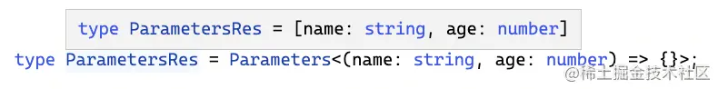

[试一下](https://link.juejin.cn/?target=https%3A%2F%2Fwww.typescriptlang.org%2Fplay%3F%23code%2FFDAuE8AcFMAIAUCGAnRBbaprIM4CVodYBeBFdTbHAHgAoA7CgLlh1GQEt6BzAGlkTdoLegFc0AI2wBKEgD5YAbwC%2BcgNwggA "https://www.typescriptlang.org/play?#code/FDAuE8AcFMAIAUCGAnRBbaprIM4CVodYBeBFdTbHAHgAoA7CgLlh1GQEt6BzAGlkTdoLegFc0AI2wBKEgD5YAbwC+cgNwggA")

这就是个简单的模式匹配，学完套路一轻轻松松就写出来了。

## ReturnType
ReturnType 用于提取函数类型的返回值类型。

源码是这样的：

```Plain Text
type ReturnType<T extends (...args: any) => any> 
    = T extends (...args: any) => infer R 
        ? R 
        : any;

```
类型参数 T 为待处理的类型，通过 extends 约束为函数类型，参数和返回值任意。

用 T 匹配一个模式类型，提取返回值的类型到 infer 声明的局部变量 R 里返回。

这样就实现了函数返回值类型的提取：

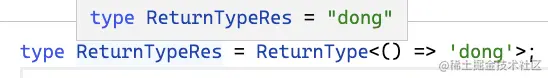

[试一下](https://link.juejin.cn/?target=https%3A%2F%2Fwww.typescriptlang.org%2Fplay%3F%23code%2FC4TwDgpgBAShwFcBOA7AKuCcDOUC8s8y6mAPABQCU%2BAfFAOQAmA9igOb00DcAUEA "https://www.typescriptlang.org/play?#code/C4TwDgpgBAShwFcBOA7AKuCcDOUC8s8y6mAPABQCU+AfFAOQAmA9igOb00DcAUEA")

和提取函数参数类型差不多，也是个简单的模式匹配。

## ConstructorParameters
构造器类型和函数类型的区别就是可以被 new。

Parameters 用于提取函数参数的类型，而 ConstructorParameters 用于提取构造器参数的类型。

源码是这样的：

```Plain Text
type ConstructorParameters<
    T extends abstract new (...args: any) => any
> = T extends abstract new (...args: infer P) => any 
    ? P 
    : never;

```
类型参数 T 是待处理的类型，通过 extends 约束为构造器类型，加个 abstract 代表不能直接被实例化（其实不加也行）。

用 T 匹配一个模式类型，提取参数的部分到 infer 声明的局部变量 P 里，返回 P。

这样就实现了构造器参数类型的提取：

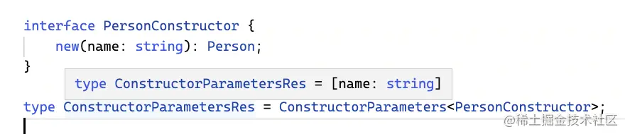

[试一下](https://link.juejin.cn/?target=https%3A%2F%2Fwww.typescriptlang.org%2Fplay%3F%23code%2FJYOwLgpgTgZghgYwgAgArQM4HsTIN4BQyxyIcAthAFzIZhSgDmA3AQL4EGiSyIrpRsIAMI46UAK4IwWKPiIkQEAO4AKMpRrimAShoChrDgTABPAA4pRIcVJlRUcKBQg8MAJQgZkAXmTXbaVlHZ0o3AB4DHAD6O1kAPlYgA "https://www.typescriptlang.org/play?#code/JYOwLgpgTgZghgYwgAgArQM4HsTIN4BQyxyIcAthAFzIZhSgDmA3AQL4EGiSyIrpRsIAMI46UAK4IwWKPiIkQEAO4AKMpRrimAShoChrDgTABPAA4pRIcVJlRUcKBQg8MAJQgZkAXmTXbaVlHZ0o3AB4DHAD6O1kAPlYgA")

构造器参数的提取依然是模式匹配。

## InstanceType
提取了构造器参数的类型，自然也可以提取构造器返回值的类型，就是 InstanceType。

源码是这样的：

```Plain Text
type InstanceType<
    T extends abstract new (...args: any) => any
> = T extends abstract new (...args: any) => infer R 
    ? R 
    : any;

```
整体和 ConstructorParameters 差不多，只不过提取的不再是参数了，而是返回值。

通过模式匹配提取返回值的类型到 infer 声明的局部变量 R 里返回。

这样就实现了构造器的实例类型的提取：

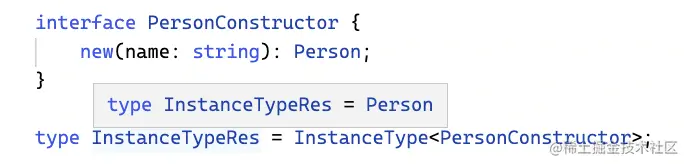

[试一下](https://link.juejin.cn/?target=https%3A%2F%2Fwww.typescriptlang.org%2Fplay%3F%23code%2FJYOwLgpgTgZghgYwgAgArQM4HsTIN4BQyxyIcAthAFzIZhSgDmA3AQL4EGiSyIrpRsIAMI46UAK4IwWKPiIkQEAO4AKMpRrimAShoChrDgTABPAA4oAkiDpwQSACoWIAJQgZkAXmQ27DiGdLAB4DHFFbeikZKAA%2BVk4gA "https://www.typescriptlang.org/play?#code/JYOwLgpgTgZghgYwgAgArQM4HsTIN4BQyxyIcAthAFzIZhSgDmA3AQL4EGiSyIrpRsIAMI46UAK4IwWKPiIkQEAO4AKMpRrimAShoChrDgTABPAA4oAkiDpwQSACoWIAJQgZkAXmQ27DiGdLAB4DHFFbeikZKAA+Vk4gA")

## ThisParameterType
函数里可以调用 this，这个 this 的类型也可以约束：

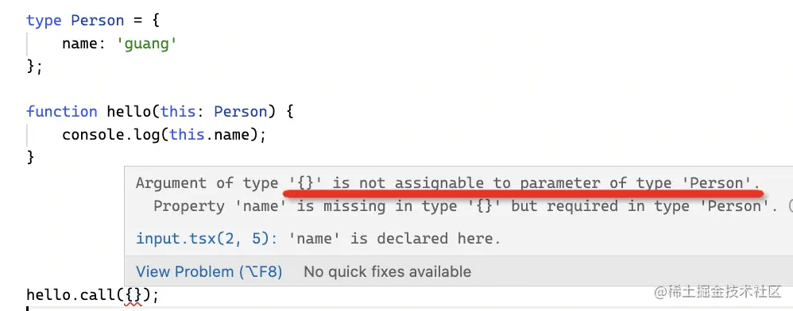

同样，this 的类型也可以提取出来，通过 ThisParameterType 这个内置的高级类型：

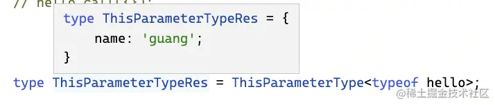

它的源码是这样的：

```Plain Text
type ThisParameterType<T> = 
    T extends (this: infer U, ...args: any[]) => any 
        ? U 
        : unknown;

```
类型参数 T 为待处理的类型。

用 T 匹配一个模式类型，提取 this 的类型到 infer 声明的局部变量 U 里返回。

这样就实现了 this 类型的提取。

[试一下](https://link.juejin.cn/?target=https%3A%2F%2Fwww.typescriptlang.org%2Fplay%3F%23code%2FC4TwDgpgBAChBOBnA9gOygXigbwFBQKlQEMBbCALigHIBzAV2NVutwF8BuXXAM3tQDGwAJZooACwgAbKcgAUwccMRU4SNAEoc%2BQgLQopEAHSzaCpYiMlyGrm24B6BxOmyjA4jLnY2t7qEgoABULGGJ4MghgBCDwCAAlCERMYNDwyOj4WMgAHgCIZB4XGWQAPi5cIA "https://www.typescriptlang.org/play?#code/C4TwDgpgBAChBOBnA9gOygXigbwFBQKlQEMBbCALigHIBzAV2NVutwF8BuXXAM3tQDGwAJZooACwgAbKcgAUwccMRU4SNAEoc+QgLQopEAHSzaCpYiMlyGrm24B6BxOmyjA4jLnY2t7qEgoABULGGJ4MghgBCDwCAAlCERMYNDwyOj4WMgAHgCIZB4XGWQAPi5cIA")

## OmitThisParameter
提取出 this 的类型之后，自然可以构造一个新的，比如删除 this 的类型可以用 OmitThisParameter。

它的源码是这样的：

```Plain Text
type OmitThisParameter<T> = 
    unknown extends ThisParameterType<T> 
        ? T 
        : T extends (...args: infer A) => infer R 
            ? (...args: A) => R 
            : T;

```
类型参数 T 为待处理的类型。

用 ThisParameterType 提取 T 的 this 类型，如果提取出来的类型是 unknown 或者 any，那么 unknown extends ThisParameterType 就成立，也就是没有指定 this 的类型，所以直接返回 T。

否则，就通过模式匹配提取参数和返回值的类型到 infer 声明的局部变量 A 和 R 中，用它们构造新的函数类型返回。

这样，就实现了去掉 this 类型的目的：

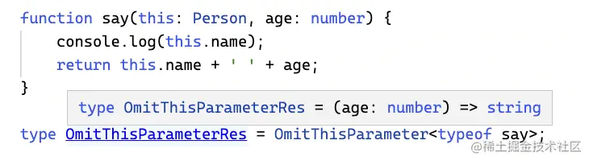

[试一下](https://link.juejin.cn/?target=https%3A%2F%2Fwww.typescriptlang.org%2Fplay%3F%23code%2FC4TwDgpgBAChBOBnA9gOygXigbwFBQKlQEMBbCALigHIBzAV2NVutwF8BuXXAM3tQDGwAJZooiYiAAUwABbDEVOEjQAaKMVqUi9UgCMEAShz5CAtCgA2EAHSXktGfMQ2S5Q10JR4EYPXjocgquZNAA1DSREZoQXGzcoJBQAPKkwsAAKs4wxPChwAgAShCImClpmdm5%2BQgAPIkQyDzikgB8XNxAA "https://www.typescriptlang.org/play?#code/C4TwDgpgBAChBOBnA9gOygXigbwFBQKlQEMBbCALigHIBzAV2NVutwF8BuXXAM3tQDGwAJZooiYiAAUwABbDEVOEjQAaKMVqUi9UgCMEAShz5CAtCgA2EAHSXktGfMQ2S5Q10JR4EYPXjocgquZNAA1DSREZoQXGzcoJBQAPKkwsAAKs4wxPChwAgAShCImClpmdm5+QgAPIkQyDzikgB8XNxAA")

这个类型除了模式匹配做提取外，也用到了重新构造做变换，稍微复杂一些。

## Partial
索引类型可以通过映射类型的语法做修改，比如把索引变为可选。

```Plain Text
type Partial<T> = {
    [P in keyof T]?: T[P];
};

```
类型参数 T 为待处理的类型。

通过映射类型的语法构造一个新的索引类型返回，索引 P 是来源于之前的 T 类型的索引，也就是 P in keyof T，索引值的类型也是之前的，也就是 T\[P\]。

这样就实现了把索引类型的索引变为可选的效果：

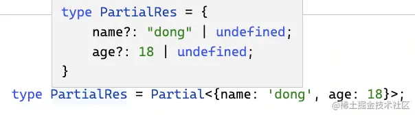

[试一下](https://link.juejin.cn/?target=https%3A%2F%2Fwww.typescriptlang.org%2Fplay%3F%23code%2FC4TwDgpgBACghgJ2ASzgGwEoQM5QLyyIroA8A3gHZwC2EAXFAOQAmA9hQOaMA0UcH9KAEYAHAF8AfAG4AUEA "https://www.typescriptlang.org/play?#code/C4TwDgpgBACghgJ2ASzgGwEoQM5QLyyIroA8A3gHZwC2EAXFAOQAmA9hQOaMA0UcH9KAEYAHAF8AfAG4AUEA")

## Required
可以把索引变为可选，也同样可以去掉可选，也就是 Required 类型：

```Plain Text
type Required<T> = {
    [P in keyof T]-?: T[P];
};

```
类型参数 T 为待处理的类型。

通过映射类型的语法构造一个新的索引类型，索引取自之前的索引，也就是 P in keyof T，但是要去掉可选，也就是 -?，值的类型也是之前的，就是 T\[P\]。

这样就实现了去掉可选修饰的目的：

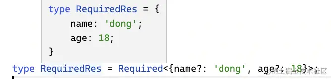

[试一下](https://link.juejin.cn/?target=https%3A%2F%2Fwww.typescriptlang.org%2Fplay%3F%23code%2FFAFwngDgpgBASlAjgVwJYCcoBMEGcYC88SamWAPAN4B2AhgLZQD8AXDAORYD21A5uwBoYtXszYBGABwBfAHwBuYEA "https://www.typescriptlang.org/play?#code/FAFwngDgpgBASlAjgVwJYCcoBMEGcYC88SamWAPAN4B2AhgLZQD8AXDAORYD21A5uwBoYtXszYBGABwBfAHwBuYEA")

## Readonly
同样的方式，也可以添加 readonly 的修饰：

```Plain Text
type Readonly<T> = {
    readonly [P in keyof T]: T[P];
};

```
类型参数 T 为待处理的类型。

通过映射类型的语法构造一个新的索引类型返回，索引和值的类型都是之前的，也就是 P in keyof T 和 T\[P\]，但是要加上 readonly 的修饰。

这样就实现了加上 readonly 的目的：


[试一下](https://link.juejin.cn/?target=https%3A%2F%2Fwww.typescriptlang.org%2Fplay%3F%23code%2FFAFwngDgpgBASlAhgEwPYDsA2YEGcYC88SaWYAPAN7qIC2UAXDAOSkDmzANDIm4zAEYAHAF8AfAG5g0oA "https://www.typescriptlang.org/play?#code/FAFwngDgpgBASlAhgEwPYDsA2YEGcYC88SaWYAPAN7qIC2UAXDAOSkDmzANDIm4zAEYAHAF8AfAG5g0oA")

## Pick
映射类型的语法用于构造新的索引类型，在构造的过程中可以对索引和值做一些修改或过滤。

比如可以用 Pick 实现过滤：

```Plain Text
type Pick<T, K extends keyof T> = {
    [P in K]: T[P];
};

```
类型参数 T 为待处理的类型，类型参数 K 为要过滤出的索引，通过 extends 约束为只能是 T 的索引的子集。

构造新的索引类型返回，索引取自 K，也就是 P in K，值则是它对应的原来的值，也就是 T\[P\]。

这样就实现了过滤的目的：

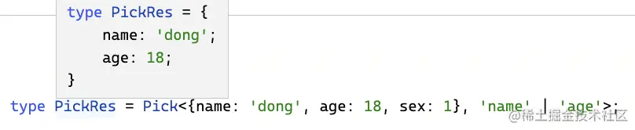

[试一下](https://link.juejin.cn/?target=https%3A%2F%2Fwww.typescriptlang.org%2Fplay%3F%23code%2FFAFwngDgpgBACgSwMYGsBKUDOMC89koA8A3gHYCGAtlAFwwDkAJgPakDm9ANDOW7TAEYAHN0xQAHnQEBfbvQrV6MAD4NeUegD4A3MD16gA "https://www.typescriptlang.org/play?#code/FAFwngDgpgBACgSwMYGsBKUDOMC89koA8A3gHYCGAtlAFwwDkAJgPakDm9ANDOW7TAEYAHN0xQAHnQEBfbvQrV6MAD4NeUegD4A3MD16gA")

## Record
Record 用于创建索引类型，传入 key 和值的类型：

```Plain Text
type Record<K extends keyof any, T> = {
    [P in K]: T;
};

```
这里很巧妙的用到了 keyof any，它的结果是 string | number | symbol：

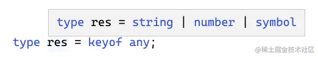

但如果你开启了 keyOfStringsOnly 的编译选项，它就只是 stirng 了：

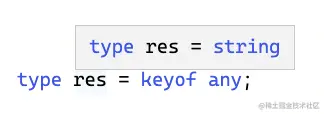

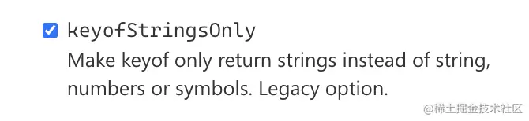

用 keyof any 是动态获取的，比直接写死 string | number | symbol 更好。

继续讲 Record 这个类型，它用映射类型的语法创建了新的索引类型，索引来自 K，也就是 P in K，值是传入的 T。

这样就用 K 和 T 构造出了对应的索引类型。

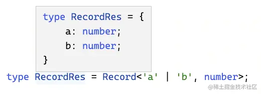

当传入的 K 是 string | number | symbol，那么创建的就是有可索引签名的索引类型：

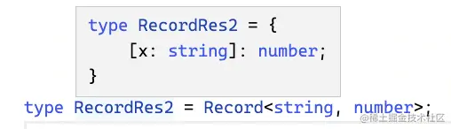

[试一下](https://link.juejin.cn/?target=https%3A%2F%2Fwww.typescriptlang.org%2Fplay%3FstrictFunctionTypes%3Dfalse%26keyofStringsOnly%3Dtrue%23code%2FC4TwDgpgBAShDGB7ATgEzgZygXlglqAPAOQCGxUAPlMQEbEA0UAdgK4C2tEyAfANwAoAaEh4kaTACYcYgoQzBkAS2YBzJm07d%2BAoA "https://www.typescriptlang.org/play?strictFunctionTypes=false&keyofStringsOnly=true#code/C4TwDgpgBAShDGB7ATgEzgZygXlglqAPAOQCGxUAPlMQEbEA0UAdgK4C2tEyAfANwAoAaEh4kaTACYcYgoQzBkAS2YBzJm07d+AoA")

## Exclude
当想从一个联合类型中去掉一部分类型时，可以用 Exclude 类型：

```Plain Text
type Exclude<T, U> = T extends U ? never : T;

```
联合类型当作为类型参数出现在条件类型左边时，会被分散成单个类型传入，这叫做分布式条件类型。

所以写法上可以简化， T extends U 就是对每个类型的判断。

过滤掉 U 类型，剩下的类型组成联合类型。也就是取差集。

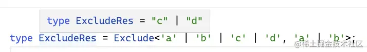

[试一下](https://link.juejin.cn/?target=https%3A%2F%2Fwww.typescriptlang.org%2Fplay%3FstrictFunctionTypes%3Dfalse%26keyofStringsOnly%3Dtrue%23code%2FFAFwngDgpgBAogDwMYBsCuATKAlKBnGAXnmXSwB4ByAQ0pgB8ZKAjOxypNpjSgGidoMmrAHwBuYMCA "https://www.typescriptlang.org/play?strictFunctionTypes=false&keyofStringsOnly=true#code/FAFwngDgpgBAogDwMYBsCuATKAlKBnGAXnmXSwB4ByAQ0pgB8ZKAjOxypNpjSgGidoMmrAHwBuYMCA")

这里用了分布式条件类型的性质，写法上可以简化。

## Extract
可以过滤掉，自然也可以保留，Exclude 反过来就是 Extract，也就是取交集：

```Plain Text
type Extract<T, U> = T extends U ? T : never;

```


[试一下](https://link.juejin.cn/?target=https%3A%2F%2Fwww.typescriptlang.org%2Fplay%3FstrictFunctionTypes%3Dfalse%26keyofStringsOnly%3Dtrue%23code%2FFAFwngDgpgBAogDxAJwIYGMQCUoGcYC88SamAPAOSoUwA%2BMFARjfReiwwCYUA0D1dBswB8AbmDAgA "https://www.typescriptlang.org/play?strictFunctionTypes=false&keyofStringsOnly=true#code/FAFwngDgpgBAogDxAJwIYGMQCUoGcYC88SamAPAOSoUwA+MFARjfReiwwCYUA0D1dBswB8AbmDAgA")

## Omit
我们知道了 Pick 可以取出索引类型的一部分索引构造成新的索引类型，那反过来就是去掉这部分索引构造成新的索引类型。

可以结合 Exclude 来轻松实现：

```Plain Text
type Omit<T, K extends keyof any> = Pick<T, Exclude<keyof T, K>>;

```
类型参数 T 为待处理的类型，类型参数 K 为索引允许的类型（string | number | symbol 或者 string）。

通过 Pick 取出一部分索引构造成新的索引类型，这里用 Exclude 把 K 对应的索引去掉，把剩下的索引保留。

这样就实现了删除一部分索引的目的：

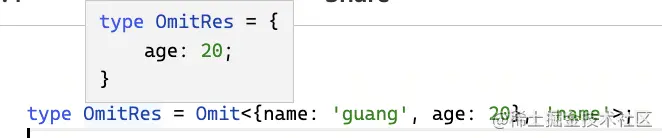

[试一下](https://link.juejin.cn/?target=https%3A%2F%2Fwww.typescriptlang.org%2Fplay%3FstrictFunctionTypes%3Dfalse%26keyofStringsOnly%3Dtrue%23code%2FC4TwDgpgBA8gtgS2AJQgZygXlo4AeAbwDsBDOCALgHIBzAVxKJqoBooSbKoAmABgF82VUuSoA%2BANxA "https://www.typescriptlang.org/play?strictFunctionTypes=false&keyofStringsOnly=true#code/C4TwDgpgBA8gtgS2AJQgZygXlo4AeAbwDsBDOCALgHIBzAVxKJqoBooSbKoAmABgF82VUuSoA+ANxA")

## Awaited
在递归那节我们写过取 Promise 的 ValuType 的高级类型，这个比较常用，ts 也给内置了，就是 Awaited。

它的实现比我们当时写的完善一些：

```Plain Text
type Awaited<T> =
    T extends null | undefined
        ? T 
        : T extends object & { then(onfulfilled: infer F): any }
            ? F extends ((value: infer V, ...args: any) => any)
                ? Awaited<V>
                : never 
            : T;

```
类型参数 T 是待处理的类型。

如果 T 是 null 或者 undefined，就返回 T。

如果 T 是对象并且有 then 方法，那就提取 then 的参数，也就是 onfulfilled 函数的类型到 infer 声明的局部变量 F。

继续提取 onfullfilled 函数类型的第一个参数的类型，也就是 Promise 返回的值的类型到 infer 声明的局部变量 V。

递归的处理提取出来的 V，直到不再满足上面的条件。

这样就实现了取出嵌套 Promise 的值的类型的目的:

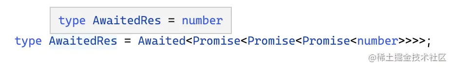

为什么要提取 then 方法的第一个参数的返回值类型看下 Promise 的结构就明白了：

```Plain Text
new Promise(() => {
    // xxx
}).then((value) => {
});

```
then 第一个参数是 onfullfilled 的回调，从它的第一个参数就能拿到返回的值的类型。

对比下我们之前的实现：

```Plain Text
type DeepPromiseValueType2<T> = 
    T extends Promise<infer ValueType> 
        ? DeepPromiseValueType2<ValueType>
        : T;

```
内置的高级类型不再限制必须是 Promise，而是只要对象且有 then 方法就可以，这样更通用了一些。

[试一下](https://link.juejin.cn/?target=https%3A%2F%2Fwww.typescriptlang.org%2Fplay%3F%23code%2FC4TwDgpgBAgg7gQwJbAgEwEoQM5QLyyIroA8ACgE4D2AtkthOdXQ07fYwHYCuNARhAoA%2BEUIDcAKClA "https://www.typescriptlang.org/play?#code/C4TwDgpgBAgg7gQwJbAgEwEoQM5QLyyIroA8ACgE4D2AtkthOdXQ07fYwHYCuNARhAoA+EUIDcAKClA")

## NonNullable
NonNullable 就是用于判断是否为非空类型，也就是不是 null 或者 undefined 的类型的，实现比较简单：

```Plain Text
type NonNullable<T> = T extends null | undefined ? never : T;

```
当传入 null 时： 


当传入非空类型时：

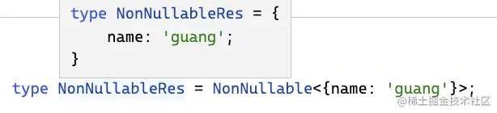

[试一下](https://link.juejin.cn/?target=https%3A%2F%2Fwww.typescriptlang.org%2Fplay%3F%23code%2FC4TwDgpgBAcg9gOxgVwDaoIYCNUQEoQDOUAvLIiutrgDwJqoB8A3AFCiTlIPX5EBMpLpUw4INAN4IMAWwgAuKAHIA5sgwIVSgL4tWQA "https://www.typescriptlang.org/play?#code/C4TwDgpgBAcg9gOxgVwDaoIYCNUQEoQDOUAvLIiutrgDwJqoB8A3AFCiTlIPX5EBMpLpUw4INAN4IMAWwgAuKAHIA5sgwIVSgL4tWQA")

## Uppercase、Lowercase、Capitalize、Uncapitalize
这四个类型是分别实现大写、小写、首字母大写、去掉首字母大写的。

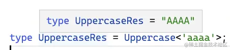


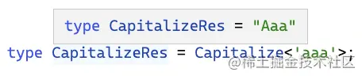


它们的源码时这样的：

```Plain Text
type Uppercase<S extends string> = intrinsic;

type Lowercase<S extends string> = intrinsic;

type Capitalize<S extends string> = intrinsic;

type Uncapitalize<S extends string> = intrinsic;

```
啥情况，intrinsic 是啥？

这个 intrinsic 是固有的意思，就像 js 里面的有的方法打印会显示 \[native code\] 一样。这部分类型不是在 ts 里实现的，而是编译过程中由 js 实现的。

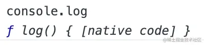

我们可以在源码里找到对应的处理代码：

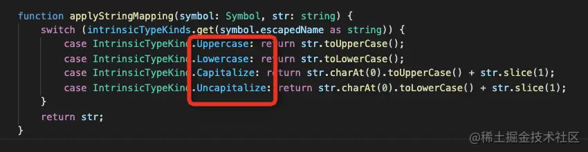

其实就是 ts 编译器处理到这几个类型时就直接用 js 给算出来了。

为啥要这样做呢？

因为快啊，解析类型是要处理 AST 的，性能比较差，用 js 直接给算出来那多快呀。

这几个类型的原理在原理篇也会带大家 debug 下源码。

[试一下](https://link.juejin.cn/?target=https%3A%2F%2Fwww.typescriptlang.org%2Fplay%3FstrictFunctionTypes%3Dfalse%26keyofStringsOnly%3Dtrue%23code%2FC4TwDgpgBAqmkCcDGBDAzhAShNUC8s8Ey6EAPAOQrUoUB8A3AFBOiRQAyA9gO7GoZsuAtz4kMlAILT6zVuGgBhFGACWwFABtVALyw58UZWo3a9lGrJZtoMAHaoTW3fuGwHK9c-MVJ1K0A "https://www.typescriptlang.org/play?strictFunctionTypes=false&keyofStringsOnly=true#code/C4TwDgpgBAqmkCcDGBDAzhAShNUC8s8Ey6EAPAOQrUoUB8A3AFBOiRQAyA9gO7GoZsuAtz4kMlAILT6zVuGgBhFGACWwFABtVALyw58UZWo3a9lGrJZtoMAHaoTW3fuGwHK9c-MVJ1K0A")

这基本就是全部的内置高级类型了。

## 总结
虽然我们学完 6 个套路，各种类型编程逻辑都能写了，但是常用的类型 TS 已经内置了。

这些内置的高级类型用我们学的套路很容易可以实现。

比如用模式匹配可以实现：Parameters、ReturnType、ConstructorParameters、InstanceType、ThisParameterType。

用模式匹配 + 重新构造可以实现：OmitThisParameter

用重新构造可以实现：Partial、Required、Readonly、Pick、Record

用模式匹配 + 递归可以实现： Awaited

用联合类型在分布式条件类型的特性可以实现： Exclude

此外还有 NonNullable 和四个编译器内部实现的类型：Uppercase、Lowercase、Capitalize、Uncapitalize。

这些类型也不咋需要记，就算忘记了自己也能很快的实现。重点还是放在 6 个类型编程的套路上。

[本文的案例合并](https://link.juejin.cn/?target=https%3A%2F%2Fwww.typescriptlang.org%2Fplay%3F%23code%2FFAFwngDgpgBACgQwE4ILZRFJBnASlbGAXnmTQy2wB4AKAO3IC4ZsQkBLOgcwBoYEuUZnQCuqAEZYAlMQB8MAN4BfWQG5goSLHwgRSOgBUt%2BQiR17DW2jKLyA5ABMA9tztqNnTEgBmCAMawcJQuisAw4TAM6MysHNzqSh50Xr4B8MF0AMIusSJ%2BIE5IoRGRUADu9EwsbJxcUsxBOC4JGuDQMNl0ufmFiCjoXngExB05bHkFSH3kg1SN2C6d3ZPumu0Akl0gCHQBRtAmI5usO3tW84tjSBOFq94iuyDsIQAWUAA27040IC-s2A0MjIFGEIn4ck53lAAHRfLg-P7YaFRKBSFrAAD0GJgb0%2BTmhfgQnxoyjRrS0MAMiOmAyw%2ByghxIVP%2BNIoSHpVDaUCc3hxHy%2Bdwe%2BWedBYCDACP%2BgKadD4AiEkTEkiQwNB4XBXUhMLhkqRKLJJSQGAsMF%2B-2R5BgAGoYHZbdb%2BIJ0VyYAB5VDsEDM7CsryMt0er3Usi0pCcrQ8sVgVYu92e-1xkBUBQoxh2LgiHZcOxywTMABMAAYlHw7Ci3Oo1oFkE8if6%2BrX3snU7bnK5cwqAIwADhUlZd%2BAAjiJ2EaHP6hyOx83yAB%2BZiOFzZjvzmA9vvk9r4BBt95gCdQHcuPcz6Ktpc5x1d3urKvwdh%2BADW9Yfj9PCsX7avzB7fGwUAADx-EtbXLGAAB9bXlCsNDvfBwSQcdhjMKAEIcKg7AQO1ILscRL1ECQsBjCl4MKJDsHzEZSMQqhYlqPgCOVW8XQAUQAvx3hEBwGWQmA2I4rioAwrCINtPDRLsPxsNbS9MOk3CYLvNi2H8EB-WUlB8mE%2BTxJwqSJIcWSRJwvDbzvAA5FxzJET4EHEKF-UsuhrNs%2ByhNET5iPaJyXPeOyHIISiSB8my-Lc98FwzLM7A3WCXQAVQgaAkEJf9-US5LUqEzCEFyxSXQAGScMosCy-0ipKlKEH-DCAEF6vyilMgQCBPSJdgAC8eNMDoWra95Ouy3KsK82B4t2PrtgGrr0om1qpsGuq8rM2DgCAA "https://www.typescriptlang.org/play?#code/FAFwngDgpgBACgQwE4ILZRFJBnASlbGAXnmTQy2wB4AKAO3IC4ZsQkBLOgcwBoYEuUZnQCuqAEZYAlMQB8MAN4BfWQG5goSLHwgRSOgBUt+QiR17DW2jKLyA5ABMA9tztqNnTEgBmCAMawcJQuisAw4TAM6MysHNzqSh50Xr4B8MF0AMIusSJ+IE5IoRGRUADu9EwsbJxcUsxBOC4JGuDQMNl0ufmFiCjoXngExB05bHkFSH3kg1SN2C6d3ZPumu0Akl0gCHQBRtAmI5usO3tW84tjSBOFq94iuyDsIQAWUAA27040IC-s2A0MjIFGEIn4ck53lAAHRfLg-P7YaFRKBSFrAAD0GJgb0+TmhfgQnxoyjRrS0MAMiOmAyw+yghxIVP+NIoSHpVDaUCc3hxHy+dwe+WedBYCDACP+gKadD4AiEkTEkiQwNB4XBXUhMLhkqRKLJJSQGAsMF+-2R5BgAGoYHZbdb+IJ0VyYAB5VDsEDM7CsryMt0er3Usi0pCcrQ8sVgVYu92e-1xkBUBQoxh2LgiHZcOxywTMABMAAYlHw7Ci3Oo1oFkE8if6+rX3snU7bnK5cwqAIwADhUlZd+AAjiJ2EaHP6hyOx83yAB+ZiOFzZjvzmA9vvk9r4BBt95gCdQHcuPcz6Ktpc5x1d3urKvwdh+ADW9Yfj9PCsX7avzB7fGwUAADx-EtbXLGAAB9bXlCsNDvfBwSQcdhjMKAEIcKg7AQO1ILscRL1ECQsBjCl4MKJDsHzEZSMQqhYlqPgCOVW8XQAUQAvx3hEBwGWQmA2I4rioAwrCINtPDRLsPxsNbS9MOk3CYLvNi2H8EB-WUlB8mE+TxJwqSJIcWSRJwvDbzvAA5FxzJET4EHEKF-UsuhrNs+yhNET5iPaJyXPeOyHIISiSB8my-Lc98FwzLM7A3WCXQAVQgaAkEJf9-US5LUqEzCEFyxSXQAGScMosCy-0ipKlKEH-DCAEF6vyilMgQCBPSJdgAC8eNMDoWra95Ouy3KsK82B4t2PrtgGrr0om1qpsGuq8rM2DgCAA")