# 15 类型编程综合实战二
想提升类型编程水平，还是要多做一些有难度的案例，这节我们提高下难度，加大训练强度。

## 函数重载的三种写法
ts 支持函数重载，也就是同名的函数可以有多种类型定义。

重载的写法一共有三种：

```Plain Text
declare function func(name: string): string;
declare function func(name: number): number;

```
这种大家比较常用，声明两个同名函数，就能达到重载的目的：

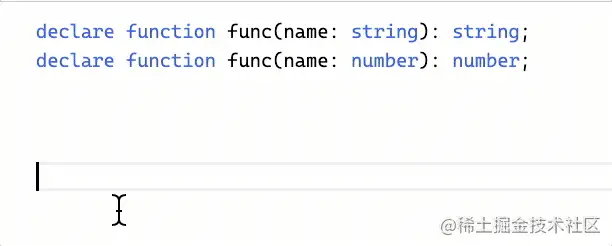

当然，如果有函数的实现，那就不用带 declare 了：

```Plain Text
function add(a: number, b: number): number;
function add(a: string, b: string): string;
function add(a: any, b: any) {
    return a + b;
}

```
当传入 number 参数时： 

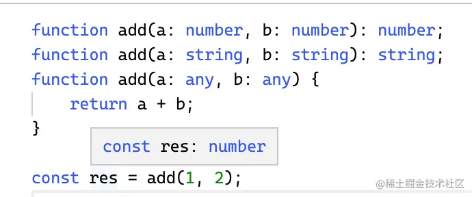

传入 string 参数时： 

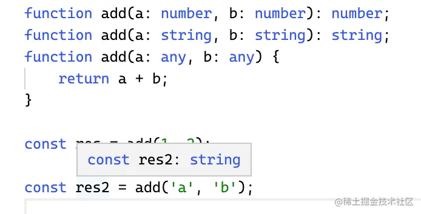

函数可以用 interface 的方式声明，同样，也可以用 interface 的方式声明函数重载：

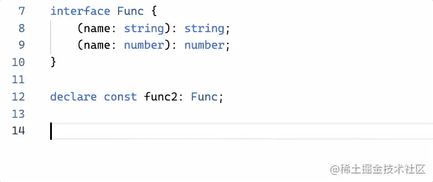

函数类型可以取交叉类型，也就是多种类型都可以，其实也是函数重载的意思：

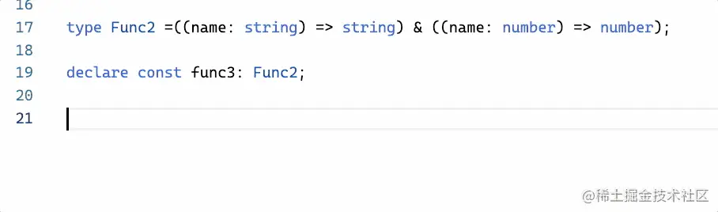

[试一下](https://link.juejin.cn/?target=https%3A%2F%2Fwww.typescriptlang.org%2Fplay%3Fts%3D4.5.0-beta%23code%2FPTAEl-FQHU0WcTF94goAJgUwMYBsCGAnZoBmArgHaoAuAlgPbEEmoAUxmAtsgFygDOZ2FxAcwCUnHn0EBuJGiy46pSjXmNmbTsUIsARsmwjQG7bqnwipBgHJMFoVLOMAjLfgv%2BZXfkyo8AMXqgAb3hQENAmVg5uXn5hUWjJYNDwtQNNHT11NONQeABfFxQMHDxUGh5lACZOP1ITewrLa2d6hicTeDIATwAHX3oK0ABeBmTIsRihIYA%2BKPFhUAAyMNHMoz1p1LXnaSK5UuJy%2BwBmav66%2BiPGmzsL1u37RVpMREQGTFX0gBpQLQ-dfUM6RuCmoTxebzic2%2Bv1mE0hMWB5FBoGer3eKOInWhnEwmMmQVCoFwZEI2CeoAA1D8pPl4PtyrguEMUeCHN8Ktt6WQicguANBizXlYLN8LFprvAgA "https://www.typescriptlang.org/play?ts=4.5.0-beta#code/PTAEl-FQHU0WcTF94goAJgUwMYBsCGAnZoBmArgHaoAuAlgPbEEmoAUxmAtsgFygDOZ2FxAcwCUnHn0EBuJGiy46pSjXmNmbTsUIsARsmwjQG7bqnwipBgHJMFoVLOMAjLfgv+ZXfkyo8AMXqgAb3hQENAmVg5uXn5hUWjJYNDwtQNNHT11NONQeABfFxQMHDxUGh5lACZOP1ITewrLa2d6hicTeDIATwAHX3oK0ABeBmTIsRihIYA+KPFhUAAyMNHMoz1p1LXnaSK5UuJy+wBmav66+iPGmzsL1u37RVpMREQGTFX0gBpQLQ-dfUM6RuCmoTxebzic2+v1mE0hMWB5FBoGer3eKOInWhnEwmMmQVCoFwZEI2CeoAA1D8pPl4PtyrguEMUeCHN8Ktt6WQicguANBizXlYLN8LFprvAgA")

声明多个同名函数类型、interface 声明多个函数签名、交叉类型，一共这三种函数重载的方式。

这里讲函数重载是为了下面这个复杂类型做铺垫的：

## UnionToTuple
要求把联合类型转成元组类型，大家有思路没？

也就是 'a' | 'b' | 'c' 转成 \['a', 'b', 'c'\]。

没思路很正常，因为这里用到了一些特殊的特性。我们先来过一下用到的特性：

我们知道 ReturnType 是 ts 内置的一个高级类型，它可以取到函数返回值的类型。但如果这个函数有多个重载呢？

第一种重载方式：

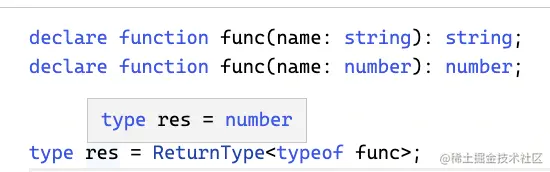

第二种重载方式：

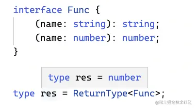

第三种重载方式：

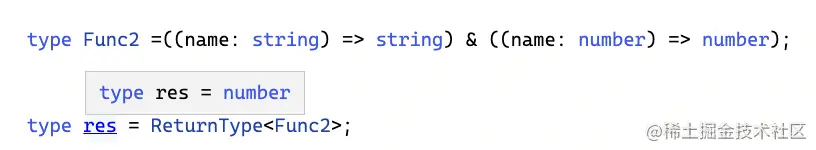

**取重载函数的 ReturnType 返回的是最后一个重载的返回值类型。**

但这与联合类型有什么关系呢？

重载函数不是能通过函数交叉的方式写么，而我们又能实现联合转交叉。

所以就能拿到联合类型的最后一个类型：

```Plain Text
type UnionToIntersection<U> = 
    (U extends U ? (x: U) => unknown : never) extends (x: infer R) => unknown
        ? R
        : never

type UnionToFuncIntersection<T> = UnionToIntersection<T extends any ? () => T : never>;

```
UnionToIntersection 的实现在套路六里讲了，忘了的可以去翻一下。

这里简单讲一下：U extends U 是触发分布式条件类型，构造一个函数类型，通过模式匹配提取参数的类型，利用函数参数的逆变的性质，就能实现联合转交叉。

因为函数参数的类型要能接收多个类型，那肯定要定义成这些类型的交集，所以会发生逆变，转成交叉类型。

然后是 UnionToFuncIntersection 的类型：

我们对联合类型 T 做下处理，用 T extends any 触发分布式条件类型的特性，它会把联合类型的每个类型单独传入做计算，最后把计算结果合并成联合类型。把每个类型构造成一个函数类型传入。

这样，返回的交叉类型也就达到了函数重载的目的：

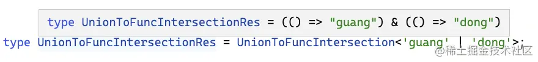

然后再通过 ReturnType 取返回值的类型，就取到了联合类型的最后一个类型：

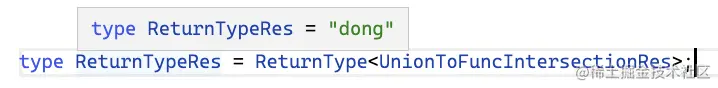

取到最后一个类型后，再用 Exclude 从联合类型中把它去掉，然后再同样的方式取最后一个类型，构造成元组类型返回，这样就达到了联合转元组的目的：

```Plain Text
type UnionToTuple<T> = 
    UnionToIntersection<
        T extends any ? () => T : never
    > extends () => infer ReturnType
        ? [...UnionToTuple<Exclude<T, ReturnType>>, ReturnType]
        : [];

```
类型参数 T 为待处理的联合类型。

T extends any 触发了分布式条件类型，会把每个类型单独传入做计算，把它构造成函数类型，然后转成交叉类型，达到函数重载的效果。

通过模式匹配提取出重载函数的返回值类型，也就是联合类型的最后一个类型，放到数组里。

通过 Exclude 从联合类型中去掉这个类型，然后递归的提取剩下的。

这样就完成了联合转元组的目的：

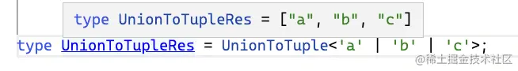

[试一下](https://link.juejin.cn/?target=https%3A%2F%2Fwww.typescriptlang.org%2Fplay%3Fts%3D4.5.0-beta%23code%2FC4TwDgpgBAqgdgSwPZwCpIJJ2BATgZwgGNhk4AeGAPigF4oAoKZqAChiggA8c4ATfLCgB%2BNlwBcsAJR0aAVzgBrOEgDucKJLgQAbnhndeAsZIRwAZnigAlGbXlKV6pi1ejrL18y268DBqCQsIgo6KhyYAA2EOSoNPSewWToWDgExKQo5ImuqJw8EPyCAIZwICJsdjR5Pnq4iTSGhcasVVBmlrg2EMByuGjgEDksogDaAHST8MlI4VExAKJcRJFyfDGoADTdvf2og1RU29Y9fQOQALrD3lCjFwDc-gGDSaGzEdEngvTTb3PR5AA5MVAVAAD5QQEAI1BEMBREBVHuQA "https://www.typescriptlang.org/play?ts=4.5.0-beta#code/C4TwDgpgBAqgdgSwPZwCpIJJ2BATgZwgGNhk4AeGAPigF4oAoKZqAChiggA8c4ATfLCgB+NlwBcsAJR0aAVzgBrOEgDucKJLgQAbnhndeAsZIRwAZnigAlGbXlKV6pi1ejrL18y268DBqCQsIgo6KhyYAA2EOSoNPSewWToWDgExKQo5ImuqJw8EPyCAIZwICJsdjR5Pnq4iTSGhcasVVBmlrg2EMByuGjgEDksogDaAHST8MlI4VExAKJcRJFyfDGoADTdvf2og1RU29Y9fQOQALrD3lCjFwDc-gGDSaGzEdEngvTTb3PR5AA5MVAVAAD5QQEAI1BEMBREBVHuQA")

回过头来看一下，联合类型的处理之所以麻烦，是因为不能直接 infer 来取其中的某个类型，我们是利用了**取重载函数的返回值类型拿到的是最后一个重载类型的返回值**这个特性，把联合类型转成交叉类型来构造重载函数，然后取返回值类型的方式来取到的最后一个类型。然后加上递归，就实现了所有类型的提取。

## join
不知道大家是否还记得“类型编程的意义”那节的 currying 函数的类型定义，那个还是挺复杂的。我们再来做个类似的练习。

```Plain Text
const res = join('-')('guang', 'and', 'dong');

```
有这样一个 join 函数，它是一个高阶函数，第一次调用传入分隔符，第二次传入多个字符串，然后返回它们 join 之后的结果。

比如上面的 res 是 guang-and-dong。

如果要给这样一个 join 函数加上类型定义应该怎么加呢？要求精准的提示函数返回值的类型。

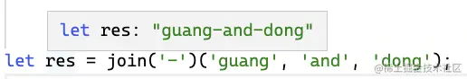

我们可以这样来定义这个类型：

```Plain Text
declare function join<
    Delimiter extends string
>(delimiter: Delimiter):
    <Items extends string[]>
        (...parts: Items) => JoinType<Items, Delimiter>;

```
类型参数 Delimiter 是第一次调用的参数的类型，约束为 string。

join 的返回值是一个函数，也有类型参数。类型参数 Items 是返回的函数的参数类型。

返回的函数类型的返回值是 JoinType 的计算结果，传入两次函数的参数 Delimiter 和 Items。

这里的 JoinType 的实现就是根据字符串元组构造字符串，用到提取和构造，因为数量不确定，还需要递归。

所以 JoinType 高级类型的实现就是这样的：

```Plain Text
type JoinType<
    Items extends any[],
    Delimiter extends string,
    Result extends string = ''
> = Items extends [infer Cur, ...infer Rest]
        ? JoinType<Rest, Delimiter, `${Result}${Delimiter}${Cur & string}`>
        : RemoveFirstDelimiter<Result>;

```
类型参数 Items 和 Delimiter 分别是字符串元组和分割符的类型。Result 是用于在递归中保存中间结果的。

通过模式匹配提取 Items 中的第一个元素的类型到 infer 声明的局部变量 Cur，后面的元素的类型到 Rest。

构造字符串就是在之前构造出的 Result 的基础上，加上新的一部分 Delimiter 和 Cur，然后递归的构造。这里提取出的 Cur 是 unknown 类型，要 & string 转成字符串类型。

如果不满足模式匹配，也就是构造完了，那就返回 Result，但是因为多加了一个 Delimiter，要去一下。

```Plain Text
type RemoveFirstDelimiter<
    Str extends string
> = Str extends `${infer _}${infer Rest}` 
        ? Rest
        : Str;

```
去掉开始的 Delimiter 就是个简单字符串字面量类型的提取，就不多解释了。

这样，就实现了 join 的类型定义：

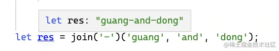

[试一下](https://link.juejin.cn/?target=https%3A%2F%2Fwww.typescriptlang.org%2Fplay%3Fts%3D4.5.0-beta%23code%2FCYUwxgNghgTiAEAzArgOzAFwJYHtXwCsctUAeAKHivgBEQIsBbLDEGeEAD1dWAGd4fDDBIBzcgD4AFKAbNWMAFy16TFmwCUiytVIBJVowFce-QcLEBtALoSd1alIB0LgA6wMfZQZBGN8AF4JeAApYlQAFQBPVxB9Qz4AGhU5dRgJAG5ycgwYhAAlXxwANxAAMSwYITpUhVIAZWEObhBeASERVFFggPhG9hNWswADABIAbxJENngAfQBfCamZwqF54fgAfnhVjGV%2BrJy80PDo2IoHHyNm0wEoVCibRPsUtQUbofaLLueHVeQIBgPm1zJ1RIF4ABySGSCFXYwtEGWZbsADCyBgyRcThROxAQmsLwc2zCJDOcV2yRqbzYyTG43%2BgMW42p8jYzPR7AAZKCxOs7A4HMpCowSuVKtVVGyYKRGRhMtlyBAQEC4AJekQSFJIQBaSEabWiZD3USQ5KQ%2B7AM1Q4B4U0aLJAA "https://www.typescriptlang.org/play?ts=4.5.0-beta#code/CYUwxgNghgTiAEAzArgOzAFwJYHtXwCsctUAeAKHivgBEQIsBbLDEGeEAD1dWAGd4fDDBIBzcgD4AFKAbNWMAFy16TFmwCUiytVIBJVowFce-QcLEBtALoSd1alIB0LgA6wMfZQZBGN8AF4JeAApYlQAFQBPVxB9Qz4AGhU5dRgJAG5ycgwYhAAlXxwANxAAMSwYITpUhVIAZWEObhBeASERVFFggPhG9hNWswADABIAbxJENngAfQBfCamZwqF54fgAfnhVjGV+rJy80PDo2IoHHyNm0wEoVCibRPsUtQUbofaLLueHVeQIBgPm1zJ1RIF4ABySGSCFXYwtEGWZbsADCyBgyRcThROxAQmsLwc2zCJDOcV2yRqbzYyTG43+gMW42p8jYzPR7AAZKCxOs7A4HMpCowSuVKtVVGyYKRGRhMtlyBAQEC4AJekQSFJIQBaSEabWiZD3USQ5KQ+7AM1Q4B4U0aLJAA")

索引类型是我们处理最多的类型，再来练习个索引类型的：

## DeepCamelize
Camelize 是 guang-and-dong 转 guangAndDong，这个我们上节实现过。现在要求递归的把索引类型的 key 转成 CamelCase 的。

比如这样一个索引类型：

```Plain Text
type obj = {
    aaa_bbb: string;
    bbb_ccc: [
        {
            ccc_ddd: string;
        },
        {
            ddd_eee: string;
            eee_fff: {
                fff_ggg: string;
            }
        }
    ]
}

```
要求转成这样：

```Plain Text
type DeepCamelizeRes = {
    aaaBbb: string;
    bbbCcc: [{
        cccDdd: string;
    }, {
        dddEee: string;
        eeeFff: {
            fffGgg: string;
        };
    }];
}

```
这要求在 KebabCase 转 CamelCase 的基础上，加上索引类型的递归处理，比较综合。

我们实现下：

```Plain Text
type DeepCamelize<Obj extends Record<string, any>> = 
    Obj extends unknown[]
        ? CamelizeArr<Obj>
        : { 
            [Key in keyof Obj 
                as Key extends `${infer First}_${infer Rest}`
                    ? `${First}${Capitalize<Rest>}`
                    : Key
            ] : DeepCamelize<Obj[Key]> 
        };

```
类型参数 Obj 为待处理的索引类型，约束为 Record<string, any>。

判断下是否是数组类型，如果是的话，用 CamelizeArr 处理。

否则就是索引类型，用映射类型的语法来构造新的索引类型，Key 为之前的 Key，也就是 Key in keyof Obj，但要做一些变化，也就是 as 重映射之后的部分。

这里的 KebabCase 转 CamelCase 就是提取 \_ 之前的部分到 First，之后的部分到 Rest，然后构造新的字符串字面量类型，对 Rest 部分做首字母大写，也就是 Capitialize。

值的类型 Obj\[Key\] 要递归的处理，也就是 DeepCamelize<Obj\[Key\]>。

其中的 CamelizeArr 的实现就是递归处理每一个元素：

```Plain Text
type CamelizeArr<Arr> = Arr extends [infer First, ...infer Rest]
    ? [DeepCamelize<First>, ...CamelizeArr<Rest>]
    : []

```
通过模式匹配提取 Arr 的第一个元素的类型到 First，剩余元素的类型到 Rest。

处理 First 放到数组中，剩余的递归处理。

这样我们就实现了索引类型的递归 Camelize：

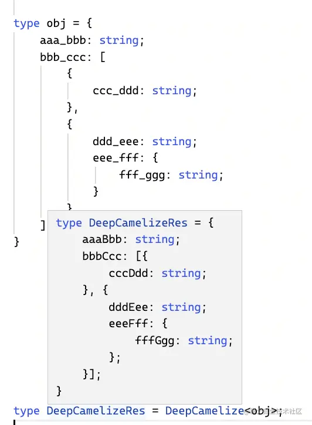

[试一下](https://link.juejin.cn/?target=https%3A%2F%2Fwww.typescriptlang.org%2Fplay%3Fts%3D4.5.0-beta%23code%2FC4TwDgpgBAwghgWwgGwJYC8IEEBOOA8uOAfFALxRFQQAewEAdgCYDOUA2qgwGYQ5QAxVDhbAANFAB00rr34AlCKIC6AKCgaoAfg4ARCBDDwkaTPiEjgxCdMnGUGbHnyLRxNZqgAuDmtWhIKH1De1MIfAB5ACMAK2o6RlYoRQBjAHscJnxRHC4Acwk4BhBiUgp1TWi42npmNgBXBgBrBjSAdwZ2D09NHVDHIkjY4gqe7ygAbyhRsc12AGkIECguKCaltO4oKunZvag4NkXlmsS2AAMAEgnZPkFhUQBfAH1r24UlYEfzmf3ZnSuEwsT2u8DAqGAcDCLk%2BxG%2Bvz%2BPR8xwRY2U42CRkQDjMVQWS2UpFRUEeAG5VP5wNA0rFyJMZnBGc8oiyfDl8uTPCyos8UnyfOxiRNiZ4%2BSlnkxJWzgLkGHlObNHmIhSLNJKmM8DBBpbL5aqNFrntxjT5hYiesbuM88jadRz9STiY8ZmpnZTApj%2BphXHTPdjoTSYsRyUA "https://www.typescriptlang.org/play?ts=4.5.0-beta#code/C4TwDgpgBAwghgWwgGwJYC8IEEBOOA8uOAfFALxRFQQAewEAdgCYDOUA2qgwGYQ5QAxVDhbAANFAB00rr34AlCKIC6AKCgaoAfg4ARCBDDwkaTPiEjgxCdMnGUGbHnyLRxNZqgAuDmtWhIKH1De1MIfAB5ACMAK2o6RlYoRQBjAHscJnxRHC4Acwk4BhBiUgp1TWi42npmNgBXBgBrBjSAdwZ2D09NHVDHIkjY4gqe7ygAbyhRsc12AGkIECguKCaltO4oKunZvag4NkXlmsS2AAMAEgnZPkFhUQBfAH1r24UlYEfzmf3ZnSuEwsT2u8DAqGAcDCLk+xG+vz+PR8xwRY2U42CRkQDjMVQWS2UpFRUEeAG5VP5wNA0rFyJMZnBGc8oiyfDl8uTPCyos8UnyfOxiRNiZ4+SlnkxJWzgLkGHlObNHmIhSLNJKmM8DBBpbL5aqNFrntxjT5hYiesbuM88jadRz9STiY8ZmpnZTApj+phXHTPdjoTSYsRyUA")

递归是很常用的套路，比如之前遇到一个这样的需求：

## AllKeyPath
需求是拿到一个索引类型的所有 key 的路径。

比如这样的索引类型：

```Plain Text
type Obj = {
    a: {
        b: {
            b1: string
            b2: string
        }
        c: {
            c1: string;
            c2: string;
        }
    },
}

```
希望返回 a、a.b、a.b.b1、a.b.b2、a.c、a.c.c1、a.c.c2 这些全部的 path。

这里需要遍历 Key，用映射类型的语法，然后要递归构造 path，最后取所有 key 的遍历结果。

也就是这样写：

```Plain Text
type AllKeyPath<Obj extends Record<string, any>> = {
  [Key in keyof Obj]: 
    Key extends string
      ? Obj[Key] extends Record<string, any>
        ? Key | `${Key}.${AllKeyPath<Obj[Key]>}`
        : Key
      : never
}[keyof Obj];

```
参数 Obj 是待处理的索引类型，通过 Record<string, any> 约束。

用映射类型的语法，遍历 Key，并在 value 部分根据每个 Key 去构造以它为开头的 path。

因为推导出来的 Key 默认是 unknown，而其实明显是个 string，所以 Key extends string 判断一下，后面的分支里 Key 就都是 string 了。

如果 Obj\[Key\] 依然是个索引类型的话，就递归构造，否则，返回当前的 Key。

我们最终需要的是 value 部分，所以取 \[keyof Obj\] 的值。keyof Obj 是 key 的联合类型，那么传入之后得到的就是所有 key 对应的 value 的联合类型。

这样就完成了所有 path 的递归生成：

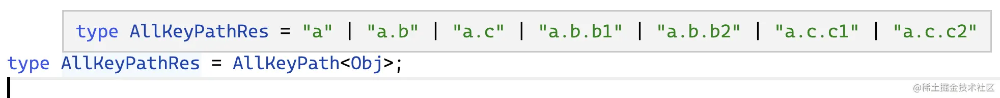

[试一下](https://link.juejin.cn/?target=https%3A%2F%2Fwww.typescriptlang.org%2Fplay%3Fts%3D4.5.0-beta%23code%2FC4TwDgpgBA8gRgKygXigbwFBW1AhgLnSxxLkMxMpzgEZCBnYAJwEsA7Ac2KtICYHm7LjygBfbpQDG5CSMl0ojVpwDcsnpP6LBq9dnElRAGgziMoSFACCAGxsBpCCAAKuYAAsAPPCQQAHsAQbAAm9FAAShCSAPZMwZ5KQkZ4bCAAfGkoRNgA2o4gUOxQANZO0QBmsIgAuoQS%2BVD%2BgSFhiZzqAPxVCHlO1Y0BQaERUbHxbRzJuKlpelBdDQA%2BUAAGACRo%2BaIAdBu2Dk6uHt6IvSDVaaIrc4T56oRsEABuEEymOaUgFd3Vahjm4Gg%2B3yR3ckTCqGBhzcXh8aTUQA "https://www.typescriptlang.org/play?ts=4.5.0-beta#code/C4TwDgpgBA8gRgKygXigbwFBW1AhgLnSxxLkMxMpzgEZCBnYAJwEsA7Ac2KtICYHm7LjygBfbpQDG5CSMl0ojVpwDcsnpP6LBq9dnElRAGgziMoSFACCAGxsBpCCAAKuYAAsAPPCQQAHsAQbAAm9FAAShCSAPZMwZ5KQkZ4bCAAfGkoRNgA2o4gUOxQANZO0QBmsIgAuoQS+VD+gSFhiZzqAPxVCHlO1Y0BQaERUbHxbRzJuKlpelBdDQA+UAAGACRo+aIAdBu2Dk6uHt6IvSDVaaIrc4T56oRsEABuEEymOaUgFd3Vahjm4Gg+3yR3ckTCqGBhzcXh8aTUQA")

最后再练习下内置的高级类型，这些比较常用：

## Defaultize
实现这样一个高级类型，对 A、B 两个索引类型做合并，如果是只有 A 中有的不变，如果是 A、B 都有的就变为可选，只有 B 中有的也变为可选。

比如下面这样：

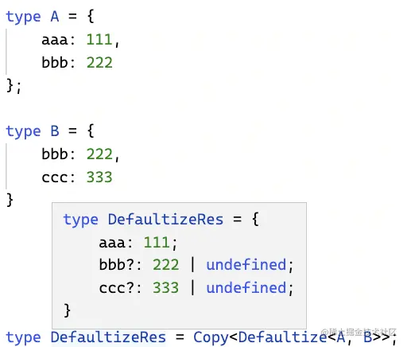

aaa 是只有 A 有的，所以不变。

bbb 是两者都有的，变为可选。

ccc 是只有 B 有的，变为可选。

怎么实现这样的高级类型呢？

**索引类型处理可以 Pick 出每一部分单独处理，最后取交叉类型来把处理后的索引类型合并到一起。**

上面的类型就可以这样实现：

```Plain Text
type Defaultize<A, B> = 
    & Pick<A, Exclude<keyof A, keyof B>>
    & Partial<Pick<A, Extract<keyof A, keyof B>>>
    & Partial<Pick<B, Exclude<keyof B, keyof A>>>

```
Pick 出 A、B 中只有 A 有的部分，也就是去 A 中去掉了 B 的 key： Exclude<keyof A, keyof B>。

然后 Pick 出 A、B 都有的部分，也就是 Extract<keyof A, keyof B>。用 Partial 转为可选。

之后 Pick 出只有 B 有的部分，也就是 Exclude<keyof B, keyof A>。用 Partial 转为可选。

最后取交叉类型来把每部分的处理结果合并到一起。

这样就实现了我们的需求：

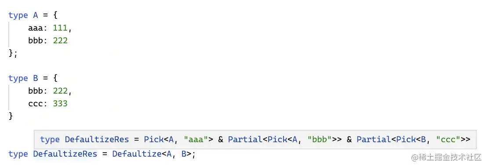

为啥这里没显示最终的类型呢？

因为 ts 只有在类型被用到的时候才会去做类型计算，根据这个特点，我们可以用映射类型的语法构造一个一摸一样的索引类型来触发类型计算。

```Plain Text
type Copy<Obj extends Record<string, any>> = {
    [Key in keyof Obj]: Obj[Key]
}

```
这就是标准的映射类型的语法，就不多解释了。

这样就能看到最终的类型：

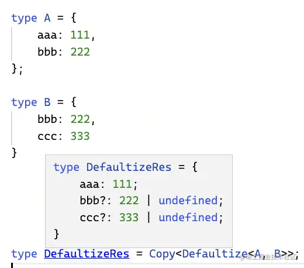

[试一下](https://link.juejin.cn/?target=https%3A%2F%2Fwww.typescriptlang.org%2Fplay%3Fts%3D4.5.0-beta%23code%2FC4TwDgpgBAIhBmBDArgG2ASwF4QDwEEAaKAIQD4oBeKAKCnqgDIoAFDAYwGsDiBRAD3apkAEzycIIAPbwoRKBOmzyZOg2YtEAJ0yJUuNlx5QBwLYnbBcimXOI3lZJ2vobtu-Ye4k%2Bg4WOtJWx8FINl8J1UaUEgoAGEpMBBcAHkAIwArKAh%2BYAgAOxEAZygAJQh2KS0RXCKzDHyAc2JEfJAnKigAbxcoAG0AaUkoBtClKHSMgF0ALgnMwckpmgBfGmjwaHxOnoYoRAO5gEYTwl60i7mAJhvVgG51mOgSHfPLqBurs732X7mAZkBq0em1gCBQ6GwEHKJWoCSSuDgSDQmBwxhUDxoQA "https://www.typescriptlang.org/play?ts=4.5.0-beta#code/C4TwDgpgBAIhBmBDArgG2ASwF4QDwEEAaKAIQD4oBeKAKCnqgDIoAFDAYwGsDiBRAD3apkAEzycIIAPbwoRKBOmzyZOg2YtEAJ0yJUuNlx5QBwLYnbBcimXOI3lZJ2vobtu-Ye4k+g4WOtJWx8FINl8J1UaUEgoAGEpMBBcAHkAIwArKAh+YAgAOxEAZygAJQh2KS0RXCKzDHyAc2JEfJAnKigAbxcoAG0AaUkoBtClKHSMgF0ALgnMwckpmgBfGmjwaHxOnoYoRAO5gEYTwl60i7mAJhvVgG51mOgSHfPLqBurs732X7mAZkBq0em1gCBQ6GwEHKJWoCSSuDgSDQmBwxhUDxoQA")

## 总结
这节我们又做了很多高难度的案例，提高练习的难度才能更好的提升类型编程水平。

首先我们学会了函数重载的三种写法，这个是为后面的联合转元组做铺垫的，联合转元组利用了**提取重载函数的返回值会返回最后一个重载的返回值类型**的特性，通过联合转交叉构造出重载类型来提取的联合类型中的类型，然后递归的处理。

之后我们实现了 join 的类型定义，这个综合用到了元组的提取和字符串字面量类型的构造，再加上递归。

然后我们又实现了 DeepCamelize，递归的处理索引类型，把 Key 转为 CamelCase 的形式，比较综合的案例。

之后实现了 AllKeyPath 的类型，通过映射类型遍历 Key，用它来递归构造不同的 Path，最后取 value，就是结果。

最后练习了内置的高级类型 Pick、Exclude、Extract、Partial 等，**处理索引类型的常用套路就是 Pick 出每一部分单独做处理，最后取交叉类型把结果合并到一起**。

能够实现这些高难度的类型，相信你的类型编程水平就已经很不错了。

[本文案例的合并](https://link.juejin.cn/?target=https%3A%2F%2Fwww.typescriptlang.org%2Fplay%3Fts%3D4.5.0-beta%23code%2FPTAEl-FQHU0WcTF94goAJgUwMYBsCGAnZoBmArgHaoAuAlgPbEEmoAUxmAtsgFygDOZ2FxAcwCUnHn0EBuJGiy46pSjXmNmbTsUIsARsmwjQG7bqnwipBgHJMFoVLOMAjLfgv%2BZXfkyo8AMXqgAb3hQENAmVg5uXn5hUWjJYNDwtQNNHT11NONQeABfFxQMHDxUGh5lACZOP1ITewrLa2d6hicTeDIATwAHX3oK0ABeBmTIsRihIYA%2BKPFhUAAyMNHMoz1p1LXnaSK5UuJy%2BwBmav66%2BiPGmzsL1u37RVpMREQGTFX0gBpQLQ-dfUM6RuCmoTxebzic2%2Bv1mE0hMWB5FBoGer3eKOInWhnEwmMmQVCoFwZEI2CeoAA1D8pPl4PtyrguA4hijwQ5vhVtvSyETkFwBoNWa8rBZvhYtNcXCBQABVYiggAqVAVhG66GQLi6vVl8poSoAksR3NguGhHgAeGUzQWJEIMGWgZAAD3cxEQXFloAA-GEnZwZZNBjMSABrYhUADutHUyAAbv9HS7kG6PQw-aB%2BPhdKAAEqB4PEMOR4i2wne3Olwkx%2BPYTU9PByxXK1Xq80K605QmNvVUQ3G01ImjmyuhBWJ13ujGdcsMfOgMfV3SlmbOiepueZ7M55AkskK%2BsjkI%2BgDaADpz93iEqVWrkOaAKJOjCEFBt77b3dX%2BtTKbvnekr9egAXUPUBOGPID2i1BtdSvZtb23D1BUva8WzvEVQAAH1AcULCwnDUAsKYTGlAArKh%2BAKGRimUR5QHI-hh0JAARZB0AoFgKGNcdk0ncZBHgKYGBQdjOONThWNErj-nYUtzX1dwWA9VdeI9fiBAgqZQIYc9T26HAyC4TgFOQJS5wAKQowC7xMpTvkkjjpOwYi621bcWCoeMfAoE0yAcsTdHNABlXgeJTWFBA7ELsDCycAAMABIAk3GKAH1ciSlLcz5Mhcji8tELIThopMaDQEs-h916JjQls5Sk3C3FOggz5S38pzYrU%2BIBFawlEMIdAeRU8L1JZCwLEElk6s60BjyygBhUlvl0rLCpAstQh9CrrPNQr7LYxzjW%2BRKAn6waMoCdrjQuxaYqWdS8q0jaQk4dzPOQbzfKuwKzrIFyXHVHlGRZBjiEsABaGxLAEQhcQEUUcNxRAEYsRAaHh7ZpVY5BunmiJ0FQTBTVcvA8bYdiAC9kAAQWwbBzVp5yWUZma5uILMYs%2BnhlvPVacvWzbZux3H8YoKnzS5v6edPMmDqpxndpyqYBZe2aQI6etQGF2XKbvAB5LRSJm7dSmwRBzXU74mp-FlSwNo3hsnUNwyjCDQJ9HWxZpunzXtp7ns4AJO2ewljwAaWQad%2BFAENI6ofBQHt4OQ42onQAj6dHY9E6ssl3JUsy9mtxyvLQJTwWTrzpK8e6LjMF1xWeCmUvy-LzgM7L0IgLArXkBxz3xft8PI6AmZQNyEiwGp9B0AzgAFTAyAACw17UqENlkCVCTAd9SrR9-hBJCX3rRUtQc-wNArfy-P1BUpeRBD4EKQQ9yXrnuvlOH9Svuxm6l-W6-1SvgEBgdO4bRAfgVKAgYFPwAeXfIr9SwgVpGVbWosqaIRZOg8mXtzTr1Iv9MqSdBSf3RJ-Y%2BYDW4-AcE-cBPwqgRQEOPUCqAqGt1QLQph8CU6oEYepHhhJEGhDfnkEmoBp6z0jgvZevsN5Z2yqbc2lspw21IYkYeUdaCx06PHROhsgKcFLBnGa6kRw%2BiHhnbuCiTZUDNhbbqVtMT%2Bw2j6Ex2EToZ1yKeJKkj56LyXnI0imjR4twDunSOI5Fy1lyMeHRej7aQRcKvPAfjpEBKwYKNJnQZGBIIf9eAWNkCeAGpQKm4jWIlMGng6m3wABCHZSxLDnhQVAIYGbfEfM%2BV88SE61JjnHBODSXGLFAAvbAlB67mhaW0jpoBHy8C8GQc0vSJHfFWcMkZzSDIUCmTM9pdTOlPnQC%2BO8Gz1mDIkT%2BLSKTQDzSoN0ToQTjZoDscoxxqiOyf00RmbRlzEmcEsSPMRtzqab1LDvdEDhoXvxCCfTgFREV5FKprOp4Lj4H1AIiiosLQC304EcQlIK0HFMwKUr2mS7kPKeZUsl1Txb9OGSYIAA "https://www.typescriptlang.org/play?ts=4.5.0-beta#code/PTAEl-FQHU0WcTF94goAJgUwMYBsCGAnZoBmArgHaoAuAlgPbEEmoAUxmAtsgFygDOZ2FxAcwCUnHn0EBuJGiy46pSjXmNmbTsUIsARsmwjQG7bqnwipBgHJMFoVLOMAjLfgv+ZXfkyo8AMXqgAb3hQENAmVg5uXn5hUWjJYNDwtQNNHT11NONQeABfFxQMHDxUGh5lACZOP1ITewrLa2d6hicTeDIATwAHX3oK0ABeBmTIsRihIYA+KPFhUAAyMNHMoz1p1LXnaSK5UuJy+wBmav66+iPGmzsL1u37RVpMREQGTFX0gBpQLQ-dfUM6RuCmoTxebzic2+v1mE0hMWB5FBoGer3eKOInWhnEwmMmQVCoFwZEI2CeoAA1D8pPl4PtyrguA4hijwQ5vhVtvSyETkFwBoNWa8rBZvhYtNcXCBQABVYiggAqVAVhG66GQLi6vVl8poSoAksR3NguGhHgAeGUzQWJEIMGWgZAAD3cxEQXFloAA-GEnZwZZNBjMSABrYhUADutHUyAAbv9HS7kG6PQw-aB+PhdKAAEqB4PEMOR4i2wne3Olwkx+PYTU9PByxXK1Xq80K605QmNvVUQ3G01ImjmyuhBWJ13ujGdcsMfOgMfV3SlmbOiepueZ7M55AkskK+sjkI+gDaADpz93iEqVWrkOaAKJOjCEFBt77b3dX+tTKbvnekr9egAXUPUBOGPID2i1BtdSvZtb23D1BUva8WzvEVQAAH1AcULCwnDUAsKYTGlAArKh+AKGRimUR5QHI-hh0JAARZB0AoFgKGNcdk0ncZBHgKYGBQdjOONThWNErj-nYUtzX1dwWA9VdeI9fiBAgqZQIYc9T26HAyC4TgFOQJS5wAKQowC7xMpTvkkjjpOwYi621bcWCoeMfAoE0yAcsTdHNABlXgeJTWFBA7ELsDCycAAMABIAk3GKAH1ciSlLcz5Mhcji8tELIThopMaDQEs-h916JjQls5Sk3C3FOggz5S38pzYrU+IBFawlEMIdAeRU8L1JZCwLEElk6s60BjyygBhUlvl0rLCpAstQh9CrrPNQr7LYxzjW+RKAn6waMoCdrjQuxaYqWdS8q0jaQk4dzPOQbzfKuwKzrIFyXHVHlGRZBjiEsABaGxLAEQhcQEUUcNxRAEYsRAaHh7ZpVY5BunmiJ0FQTBTVcvA8bYdiAC9kAAQWwbBzVp5yWUZma5uILMYs+nhlvPVacvWzbZux3H8YoKnzS5v6edPMmDqpxndpyqYBZe2aQI6etQGF2XKbvAB5LRSJm7dSmwRBzXU74mp-FlSwNo3hsnUNwyjCDQJ9HWxZpunzXtp7ns4AJO2ewljwAaWQad+FAENI6ofBQHt4OQ42onQAj6dHY9E6ssl3JUsy9mtxyvLQJTwWTrzpK8e6LjMF1xWeCmUvy-LzgM7L0IgLArXkBxz3xft8PI6AmZQNyEiwGp9B0AzgAFTAyAACw17UqENlkCVCTAd9SrR9-hBJCX3rRUtQc-wNArfy-P1BUpeRBD4EKQQ9yXrnuvlOH9Svuxm6l-W6-1SvgEBgdO4bRAfgVKAgYFPwAeXfIr9SwgVpGVbWosqaIRZOg8mXtzTr1Iv9MqSdBSf3RJ-Y+YDW4-AcE-cBPwqgRQEOPUCqAqGt1QLQph8CU6oEYepHhhJEGhDfnkEmoBp6z0jgvZevsN5Z2yqbc2lspw21IYkYeUdaCx06PHROhsgKcFLBnGa6kRw+iHhnbuCiTZUDNhbbqVtMT+w2j6Ex2EToZ1yKeJKkj56LyXnI0imjR4twDunSOI5Fy1lyMeHRej7aQRcKvPAfjpEBKwYKNJnQZGBIIf9eAWNkCeAGpQKm4jWIlMGng6m3wABCHZSxLDnhQVAIYGbfEfM+V88SE61JjnHBODSXGLFAAvbAlB67mhaW0jpoBHy8C8GQc0vSJHfFWcMkZzSDIUCmTM9pdTOlPnQC+O8Gz1mDIkT+LSKTQDzSoN0ToQTjZoDscoxxqiOyf00RmbRlzEmcEsSPMRtzqab1LDvdEDhoXvxCCfTgFREV5FKprOp4Lj4H1AIiiosLQC304EcQlIK0HFMwKUr2mS7kPKeZUsl1Txb9OGSYIAA")