# 20 原理篇：如何阅读 TypeScript 源码
讲类型编程的时候，分布式条件类型是比较麻烦的一个点：


 

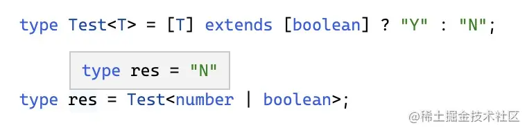

Test 这个高级类型，有一个泛型参数 T，当 T 传入的类型为联合类型的时候，有两种情况：

* 如果 checkType（extends 左边的类型） 是 T，则把联合类型拆开后解析类型，最后合并成一个联合类型返回。
* 如果 checkType 不是 T，把联合类型整体作为 T 来解析，返回解析后的类型。

这个语法叫 Distributive Condition Type，分布式条件类型。设计的目的就是为了简化 `Test<number> | Test<boolean>` 的情况。

我们通过这个语法的实现作为抓手，来探究一下 ts 源码应该怎么读。

## 类型的表示法：类型对象
ts 会把源码进行 parse，生成 AST，然后从 AST 中解析出类型信息。

ts 的类型信息是通过类型对象来存储的，我们来看几个例子。（可视化的查看 AST 可以使用 [astexplorer.net](https://link.juejin.cn/?target=https%3A%2F%2Fastexplorer.net%2F%23%2Fgist%2Fbd6031c7ab25e3d33e8899b3914e9357%2Ff36b635cedba9a6939953631e66868ab322f65d2 "https://astexplorer.net/#/gist/bd6031c7ab25e3d33e8899b3914e9357/f36b635cedba9a6939953631e66868ab322f65d2") 这个网站。）

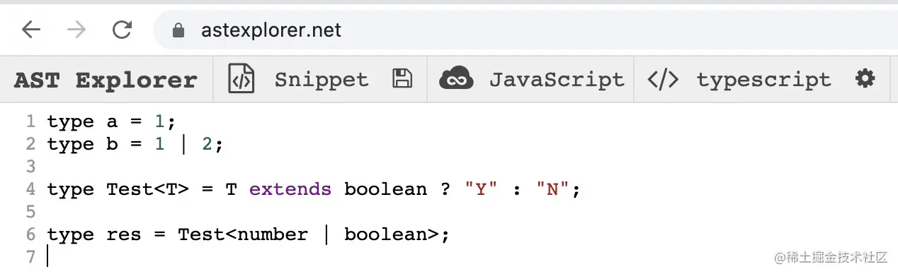

上面定义了四个类型：

a 类型是 `LiteralType`，字面量类型，literal 属性保存具体的字面量，这里是 NumericLiteral，数字字面量。

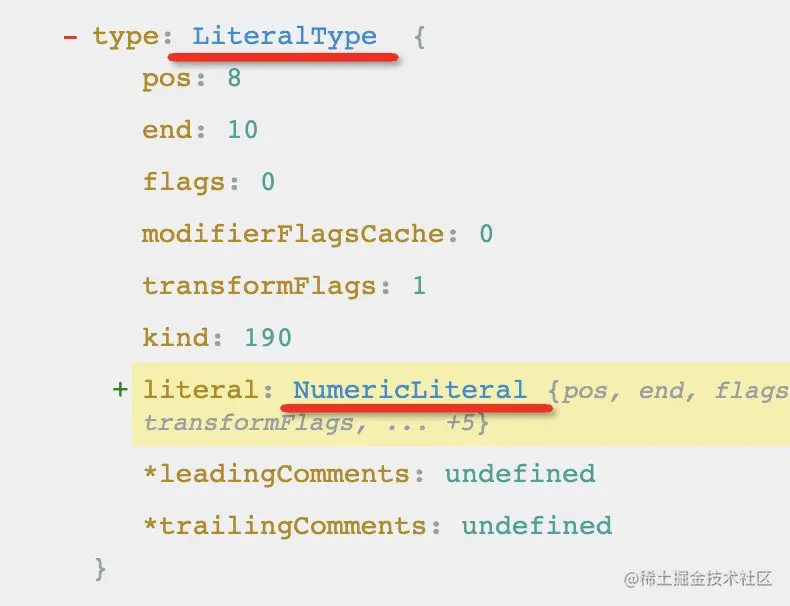

b 类型是 `UnionType`，联合类型，types 属性保存了它所包含的类型，这里是两个 LiteralType

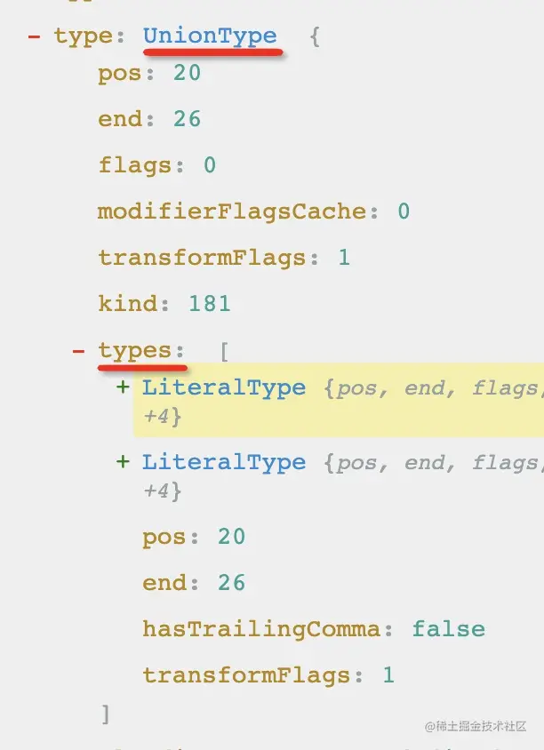

T extends boolean 这部分是一个 `ConditionType`，有 checkType、extendsType、trueType、falseType 四个属性分别代表不同的部分。

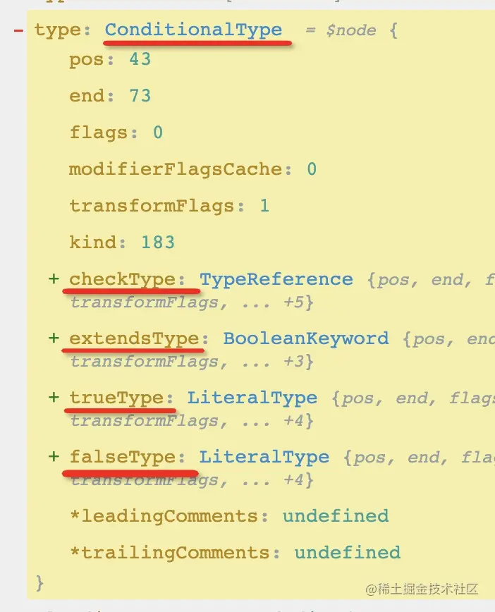

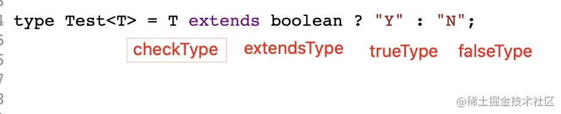

可以看到，T 是一个 `TypeReference` 类型，也就是它只是一个变量引用，具体的值还是泛型参数传入的类型。

Test<number | boolean> 也是一个 `TypeReference`，类型引用。有 typeName 和 typeArguments 两个属性，typeName 就是它引用的类型 Test，typeArguments 就是泛型参数的值，这里是 UnionType。

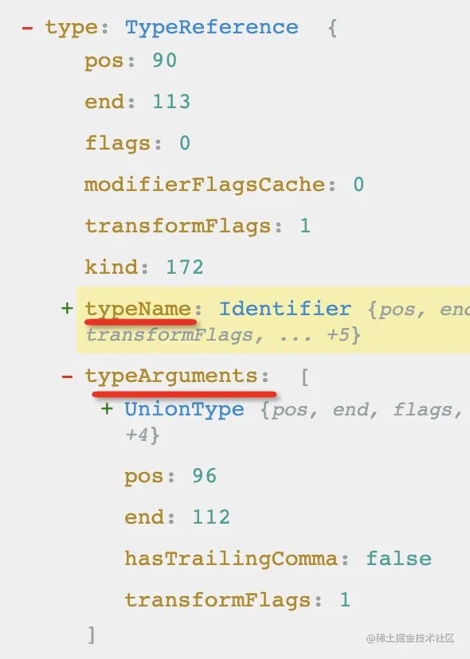

所以说，类型在 ts 里面都是通过类型对象来表示的。

比较特别的是 `TypeReference` 类型，它只是一个引用，具体的类型还得把类型参数传入所引用的类型，然后求出最终类型。比如这里的 Test<number | boolean> 的类型，最终的类型是把参数 number | boolean 传入定义的那个 ConditionType 来求出的。这就是 ts 的`高级类型`。

理解了类型是怎么表示的，高级类型和泛型参数都是什么，接下来我们就可以正式通过调试 ts 源码来看下 ConditionType 的解析过程了。

## VSCode 调试 Typescript 源码
首先，我们要把 ts 源码下载下来（加个 depth=1 可以下载单 commit，速度比较快），这里我们看的是 **4.6.0 版本的源码**

```Plain Text
git clone --depth=1 git@github.com:microsoft/TypeScript.git

```
然后可以看到 lib 目录下有 tsc.js 和 typescript.js，这两个分别是 ts 的命令行和 api 的入口。

但是，这些是编译以后的 js 代码，源码在 src 下，是用 ts 写的。

怎么把编译后的 js 代码和 ts 源码关联起来呢？ sourcemap！

编译源码：

```Plain Text
yarn 
yarn run build:compiler

```
然后就可以看到多了一个 built 目录，下面有 tsc.js、typescript.js 这两个入口文件，而且也有了 sourcemap：

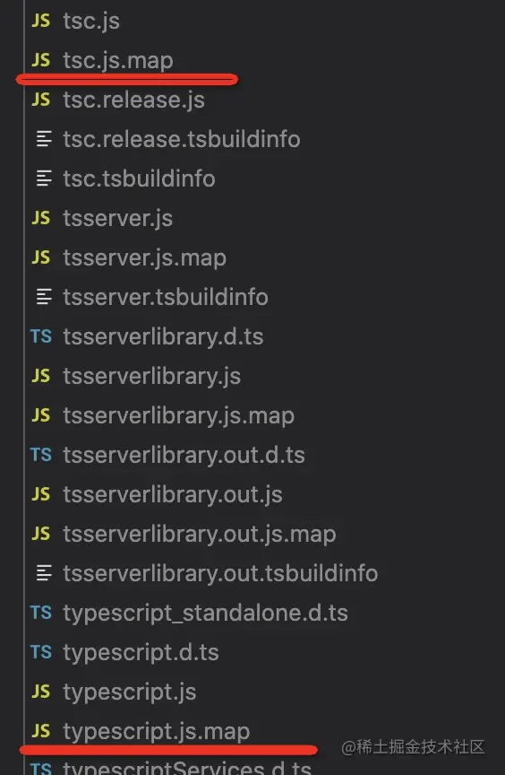

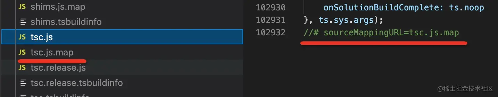

接下来就可以直接调试 ts 源码，而不是编译后的 js 代码了。

我们来试试：

### vscode 直接调试 ts
vscode 在项目根目录下的 .vscode/launch.json 下保存调试配置：

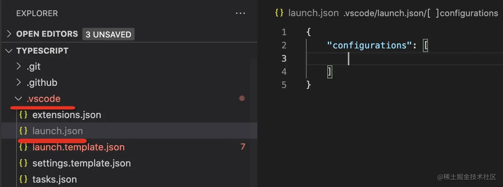

我们添加一个调试配置：

```Plain Text
{
    "name": "调试 ts 源码",
    "program": "${workspaceFolder}/built/local/tsc.js",
    "request": "launch",
    "skipFiles": [
        "<node_internals>/**"
    ],
    "args": [
        "./input.ts"
    ],
    "stopOnEntry": true,
    "type": "node"
}

```
含义如下：

* name： 调试配置的名字
* program：调试的目标程序的地址
* request：有 launch 和 attch 两个取值，代表启动新的还是连上已有的
* skipFiles：调试的时候跳过一些文件，这里配置的是跳过 node 内部的那些文件，调用栈会更简洁
* args：命令行参数
* stopOnEntry：是否在首行加个断点
* type：调试的类型，这里是用 node 来跑

保存之后就可以在调试面板看到该调试选项：

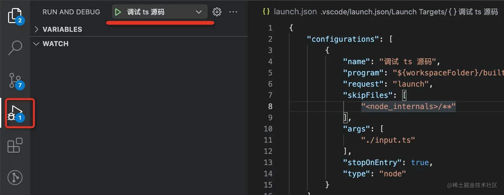

这里我们设计的 input.ts 是这样的：

```Plain Text
type Test<T> = T extends boolean ? "Y" : "N";

type res = Test<number | boolean>;

```
在 ts 的 checker.ts 部分打个断点，然后点击启动调试。

然后，看，这断住的地方，就是 ts 源码啊，不是编译后的 js 文件。这就是 sourcemap 的作用。

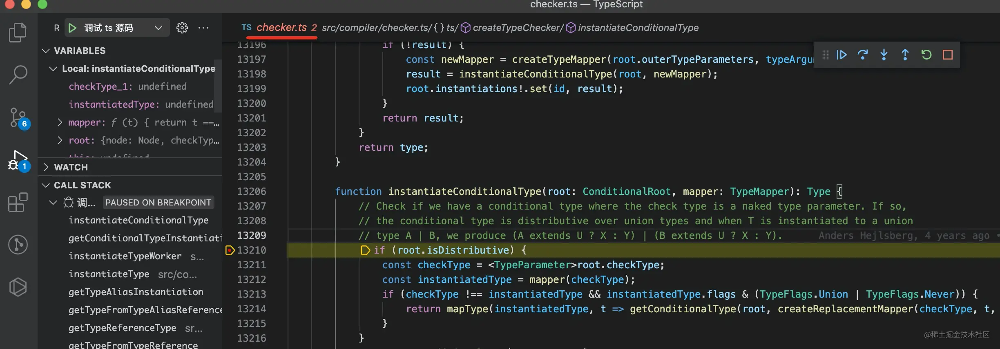

还可以在左边文件树看到源码的目录结构，这比调试编译后的 js 代码爽多了。

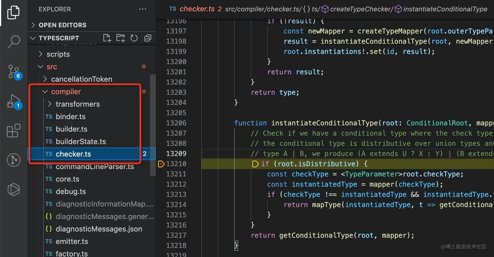

会了通过 sourcemap 调试源码之后，我们该进入主题了： 通过源码探究分布式条件类型的实现原理。

其实我们上面使用的是 tsc.js 的命令行入口来调试的，这样其实代码比较多，很难理清要看哪部分代码。怎么办呢？

接下来就是我的秘密武器了，用 typescript compiler api。

## typescript compiler api
ts 除了命令行工具的入口外，也提供了 api 的形式，只是我们很少用。但它对于探究 ts 源码实现有很大的帮助。

我们定义个 test.js 文件，引入 typescript 的包：

```Plain Text
const ts = require("./built/local/typescript");

```
然后用 ts 的 api 传入编译配置，并 parse 源码成 ast：

```Plain Text
const filename = "./input.ts";
const program = ts.createProgram([filename], {
    allowJs: false
});
const sourceFile = program.getSourceFile(filename);

```
这里的 createProgram 第二个参数是编译配置，就是 compilerOptions。

program.getSourceFile 返回的就是 ts 的 AST。

并且还可以拿到 typeChecker：

```Plain Text
const typeChecker = program.getTypeChecker();

```
然后呢？typeChecker 是类型检查的 api，我们可以遍历 AST 找到检查的 node，然后调用 checker 的 api 进行检查：

```Plain Text
function visitNode(node) {
    if (node.kind === ts.SyntaxKind.TypeReference)  {
        const type = typeChecker.getTypeFromTypeNode(node);

        debugger;
    }

    node.forEachChild(child =>
        visitNode(child)
    );
}

visitNode(sourceFile);

```
我们判断了如果 AST 是 TypeReference 类型，则用 typeChecker.getTypeFromTypeNode 来解析类型。

接下来就可以精准的调试该类型解析的逻辑了，相比命令行的方式来说，更方便理清逻辑。

完整代码如下：

```Plain Text
const ts = require("./built/local/typescript");

const filename = "./input.ts";
const program = ts.createProgram([filename], {
    allowJs: false
});
const sourceFile = program.getSourceFile(filename);
const typeChecker = program.getTypeChecker();

function visitNode(node) {
    if (node.kind === ts.SyntaxKind.TypeReference)  {
        const type = typeChecker.getTypeFromTypeNode(node);

        debugger;
    }

    node.forEachChild(child =>
        visitNode(child)
    );
}

visitNode(sourceFile);

```
我们改下调试配置，然后开始调试：

```Plain Text
{
    "name": "调试 ts 源码",
    "program": "${workspaceFolder}/test.js",
    "request": "launch",
    "skipFiles": [
        "<node_internals>/**"
    ],
    "args": [
    ],
    "type": "node"
}

```
在 typeChecker.getTypeFromTypeNode 这行打个断点，我们去看下具体的类型解析过程。

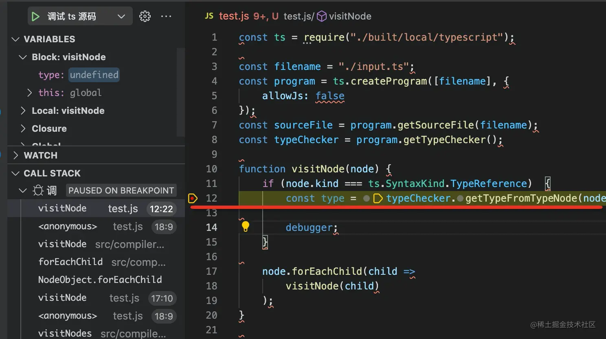

然后，XDM，打起精神，本文的高潮部分来了：

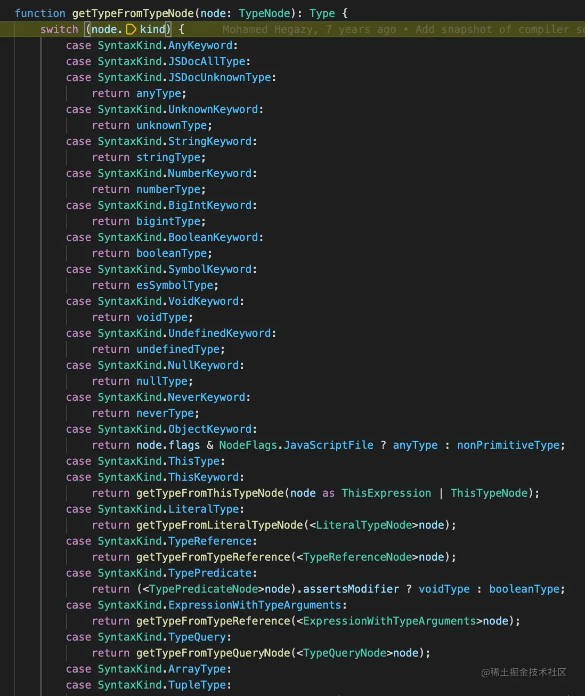

我们进入了 getTypeFromTypeNode 方法，这个方法就是根据 AST 的类型来做不同的解析，返回类型对象的。各种类型解析的逻辑都是从这里进入的，这是一个重要的交通枢纽。

然后我们进入了 TypeReference 的分支，因为 Test<number | boolean> 就是一个类型引用嘛。

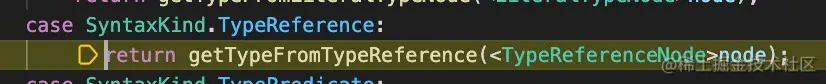

TypeReference 的类型就是它引用的类型，它引用了 ConditionType，所以会再解析 T extends boolean 这个 ConditionType 的类型：

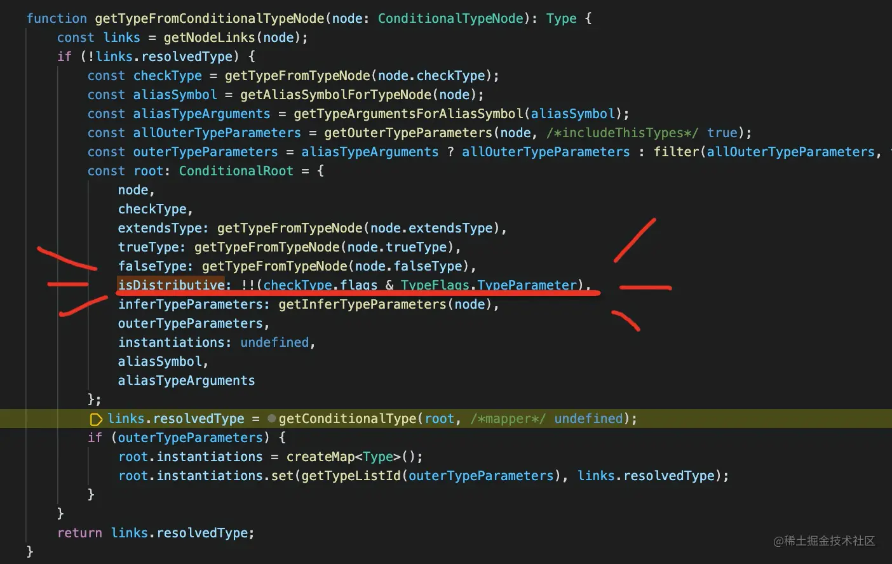

所有的类型都是按照 ast node 的 id 存入一个 nodeLinks 的 map 中来缓存，只有第一次需要解析，之后直接拿结果。比如上图的 resolvedType 就存入了 nodeLinks 来缓存。

然后，XDM，看到闪闪发光的那行代码了么？

解析 ConditionType 的类型的时候会根据 checkType 部分是否是类型参数（TypeParameter，也就是泛型）来设置 isDistributive 属性。

之后解析 TypeReference 类型的时候，会传入具体的类型来实例化：


这里就判断了 conditionType 的 isDistributive 属性，如果是，则把 unionType 的每个类型分别传入来解析，最后合并返回。

如图，我们走到了 isDistributive 为 true 的这个分支。

那么解析出的类型就是 'Y' | 'N' 的联合类型。

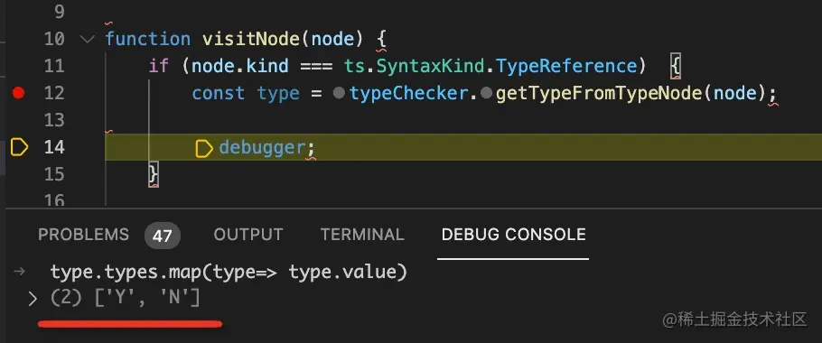

那我们把 input.ts 代码改一下呢：

```Plain Text
type Test<T> = [T] extends [boolean] ? "Y" : "N";

type res = Test<number | boolean>;

```
checkType 不直接写类型参数 T 了。

再跑一次：

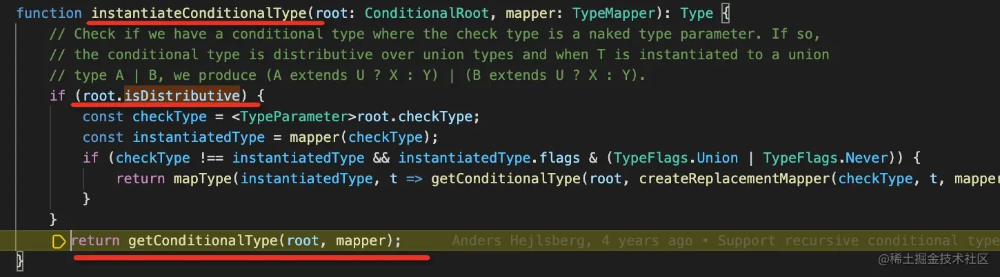

这次没进去了。

难道说？

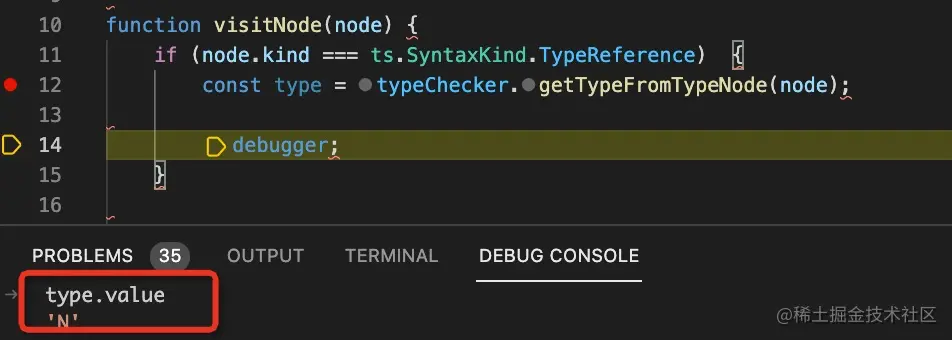

确实，这样的结果就是 N。

说明了什么？说明了 `ConditionType 是根据 checkType 是否是类型参数来设置了 isDistributive 属性，之后解析 TypeReference 的时候根据 isDistributive 的值分别做了不同的解析。`

那么只要 checkType 不是 T 就行了。

所以这样也行：


这样也行：

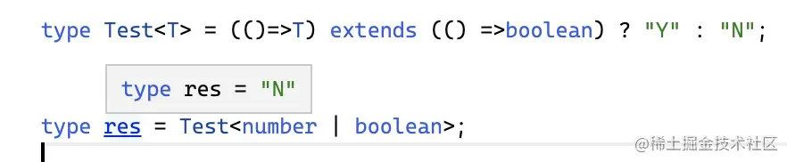

我们经常用 \[T\] 来避免 distributive 只不过这样比较简洁，看完源码我们知道了，其实别的方式也行。

就这样，我们通过源码理清了这个语法的实现原理。

## 总结
我们以探究 distributive condition type 的实现原理为目的来阅读了 typescript 源码。

首先把 typescript 源码下载下来，执行编译，生成带有 sourcemap 的代码，之后在 vscode 里调试，这样可以直接调试编译前的源码，信息更多。

typescript 有 cli 和 api 两种入口，用 cli 的方式无关代码太多，比较难理清，所以我们用 api 的方式来写了一段测试代码，之后打断点来调试。

ts 的类型信息保存在类型对象中，这个可以用 [astexplorer.net](https://link.juejin.cn/?target=https%3A%2F%2Fastexplorer.net%2F%23%2Fgist%2Fbd6031c7ab25e3d33e8899b3914e9357%2Ff36b635cedba9a6939953631e66868ab322f65d2 "https://astexplorer.net/#/gist/bd6031c7ab25e3d33e8899b3914e9357/f36b635cedba9a6939953631e66868ab322f65d2") 来可视化的查看。

用 typeChecker.getTypeFromTypeNode 可以拿到某个类型的具体值，我们就是通过这个作为入口来探究各种类型的解析逻辑。

源码中比较重要的有这么几点：

* getTypeFromTypeNode 方法是通过 node 获取类型的入口方法，所有 AST 的类型对象都是通过这个方法拿到
* nodeLinks 保存了解析后的类型，key 为 node id，这样解析一遍就好了，下次拿缓存。

之后我们看了 ConditionType 的解析逻辑会根据 checkType 是否为类型参数来设置 isDistributive 属性，然后 TypeReference 实例化该类型的时候会根据 isDistributive 的值进入不同的处理逻辑，这就是它的实现原理。

理解了原理之后，我们再使用 distributive condition type 就心里有底了，还可以创造很多变形使用，不局限于 \[T\]。

本文以调试一个类型解析逻辑的原理为抓手探究了 ts 源码阅读方式，调试 ts 别的部分的代码，或者调试其他的库也是类似的。

大家想探究某个类型语法实现原理的时候，可以通过源码层面来彻底搞清楚。