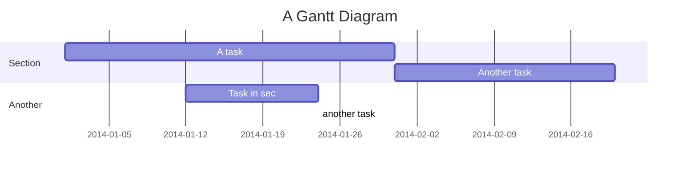
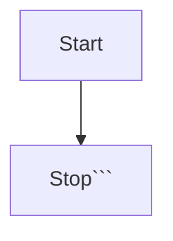
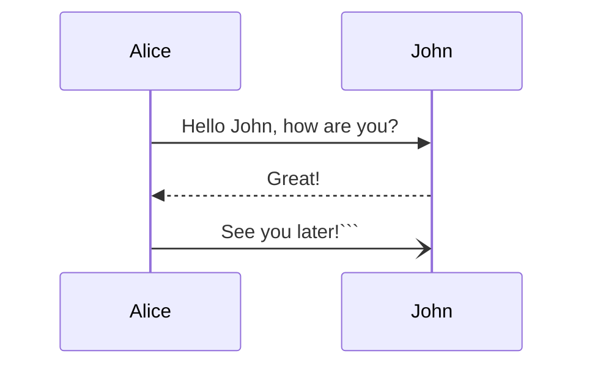
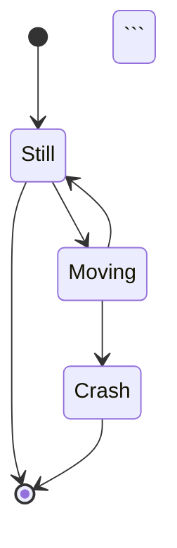
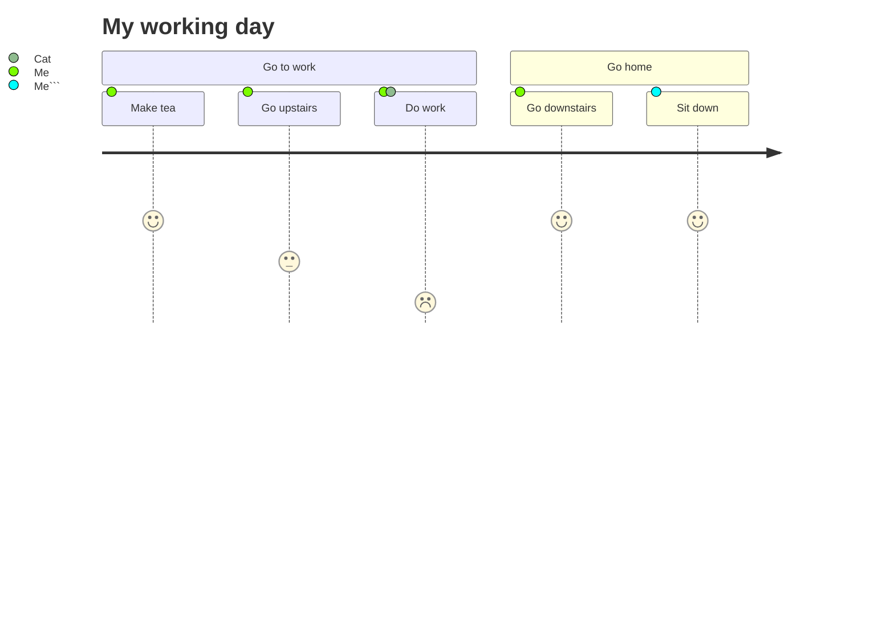

## 掘金 Markdown 编辑器

> 我们建议掘友使用 Markdown 编辑器来写作文章


掘金 Markdown 编辑器整合了 Markdown 标准语法，可以看[官方文档](https://www.markdownguide.org/basic-syntax/)

## 新的改变

工欲善其事，必先利其器。

为了让掘友们更好的创作出优秀的内容，我们针对大家对编辑器的反馈和建议，我们对Markdown编辑器进行了全新改造，增加诸多功能拓展与语法支持，除了标准的Markdown编辑器功能，我们增加了如下几点新功能，期待您更好的创作。
 1. **全新的界面设计** ，将会带来全新的写作体验；
 2. 全新的 **KaTeX数学公式** 语法；
 3. 新增 Markdown 主题样式和代码高亮， **Markdown 主题和代码样式可以自己去选择高亮样式**；
 4. 支持**更多的mermaid图表[^1]**；
 5. 增加了 **多屏幕编辑** Markdown文章功能；
 6. 修复和增加了 **写作模式、预览模式、左右区域同步滚轮设置** 等功能；
 [^1]: [Mermaid语法说明](https://mermaidjs.github.io/)
 


编辑器第一个版本主要是优化了一些历史体验问题和新增了一些大家常用功能，更多的功能支持还请期待后续版本的更新。
> 编辑器目前已经开源，贡献地址：https://github.com/bytedance/bytemd


>掘金编辑器主题样式同样开源，贡献地址：https://juejin.cn/post/6893360456530919437


## 功能快捷键
>功能快捷键后续会迭代，暂时支持如下

**粗体：** Ctrl/ Command +B

**斜体：** Ctrl/ Command +I

**链接：** Ctrl/ Command + K

**图片：** Ctrl/Command + Shift +I

**有序列表：** Ctrl/Command+shift +O

**无序列表：** Ctrl/Command+shift +U

**代码：** Ctrl/Command + Shift +K

**代码块：** Ctrl/Command + Shift + C

## 标题
Markdown 语法：

```
# 第一级标题 `<h1>`
## 第二级标题 `<h2>`
###### 第六级标题 `<h6>`
```

展示效果如下：

# 第一级标题 `<h1>`

## 第二级标题 `<h2>`

### 第六级标题 `<h6>`

## 文本样式

Markdown 语法：

```
**掘金编辑器上线了**
*掘金编辑器上线了*
```
掘金编辑器快捷键为：`CMD + B `、`CMD + I `

**掘金编辑器上线了**

*掘金编辑器上线了*


## 列表

### 无序列表

Markdown 语法快捷键为：`Ctrl/Command+shift +U`

**效果如下：**
- 项目一 
- 项目二
- 项目三


### 有序列表

Markdown 语法快捷键为：`Ctrl/Command+shift +O`

**效果如下：**
1. 项目一 
2. 项目二
3. 项目三


### 任务列表（Task lists）

**Markdown 语法：**
```
- [ ] 任务一 未做任务 `- + 空格 + [ ]`
- [x] 任务二 已做任务 `- + 空格 + [x]`

```

**效果如下：**

- [ ]  任务一 未做任务 `+ 空格 + [ ]`
- [x]  任务二 已做任务 `+ 空格 + [x]`

## 图片

Markdown 语法：
```

```
`Ctrl/Command + Shift +I` 可插入Markdown语法。除此之外，还可以用**拖放图片**、`CMD + V` 粘贴这两种方式来增加图片。效果如下：


## 链接

Markdown 语法：

```
[这里是掘金技术社区](https://juejin.cn/)
```

`Ctrl/Command + K` 可插入Markdown语法。

[这里是掘金技术社区](https://juejin.cn/)


## 行内代码

Markdown 语法：

```
像这样即可：`<hello>` `world`

```

`Ctrl/Command + Shift +K` 可插入Markdown语法。效果如下：


像这样即可：`<hello>` `world`


## 多行或者一段代码

Markdown 语法：

```

```js
for (var i = 1; i <= 5; i++) {
  (function(j) {
    setTimeout(function timer() {
      console.log(j);
    }, j * 1000);
  })(i);
}


```

`Ctrl/Command + Shift + C` 可插入Markdown语法。效果如下：

```js
for (var i = 1; i <= 5; i++) {
  (function(j) {
    setTimeout(function timer() {
      console.log(j);
    }, j * 1000);
  })(i);
}
```
### 代码高亮
目前我们支持100多种代码高亮样式，可以使用 [highlight.js ](https://github.com/highlightjs/highlight.js)中的所有样式：所有样式：
- [样式列表](https://github.com/highlightjs/highlight.js/tree/master/src/styles)
- [样式预览](https://highlightjs.org/static/demo/)


## 表格
一个简单的表格是这么创建的：
项目     | Value
-------- | -----
电脑  | $100
手机  | $10
鼠标  | $1

### 设定内容居中、居左、居右


使用`:---------:`居中

使用`:----------`居左

使用`----------:`居右

```
Markdown 语法:

使用`:---------:`居中
使用`:----------`居左
使用`----------:`居右
| 第一列       | 第二列         | 第三列        |
|:-----------:| -------------:|:-------------|
| 第一列文本居中 | 第二列文本居右  | 第三列文本居左 |
```


| 第一列       | 第二列         | 第三列        |
|:-----------:| -------------:|:-------------|
| 第一列文本居中 | 第二列文本居右  | 第三列文本居左 |


## 删除线

Markdown 语法：

```
加删除线像这样用： ~~删除这些~~

```

效果如下：

加删除线像这样用： ~~删除这些~~

## 分隔线

以下三种方式都可以生成分隔线：

```
***

*****

- - -

```

效果如下：

---

---

---


## KaTeX数学公式

您也可以访问 [MathJax][2] 参考更多使用方法。
 [^2]: [MathJax更多语法参考](https://math.meta.stackexchange.com/questions/5020/mathjax-basic-tutorial-and-quick-reference)


**行内公式:**

```
$E=mc^2$
```

**效果如下：**

这是一个行内公式$E=mc^2$您学废了吗？


**块级公式:**

```
$$ 
x = \dfrac{-b \pm \sqrt{b^2 - 4ac}}{2a}
$$
```
**效果如下:**
$$ 
x = \dfrac{-b \pm \sqrt{b^2 - 4ac}}{2a}
$$

>您可以找到更多关于的信息 **LaTeX** 数学表达式[地址](http://meta.math.stackexchange.com/questions/5020/mathjax-basic-tutorial-and-quick-reference) [^2]


## 顺序图或流程图
您可以使用Mermaid生成各类图表。更多语法可以参考 [Mermaid](https://mermaidjs.github.io/)

### 甘特图

```



### 流程图

```



### 时序图

```



### 类图

```
```mermaid
classDiagram
Animal <|-- Duck
Animal <|-- Fish
Animal <|-- Zebra
Animal : +int age
Animal : +String gender
Animal: +isMammal()
Animal: +mate()
class Duck{
+String beakColor
+swim()
+quack()
}
class Fish{
-int sizeInFeet
-canEat()
}
class Zebra{
+bool is_wild
+run()
}```
```


### 状态图

```



### 饼状图

```


### 关系图


```
```mermaid
erDiagram
CUSTOMER ||--o{ ORDER : places
ORDER ||--|{ LINE-ITEM : contains
CUSTOMER }|..|{ DELIVERY-ADDRESS : uses```

```


### 旅程图

```



### 编辑器插入视频

-   打开需要要嵌入的视频，复制顶端地址栏或分享入口链接即可。


-   图片：见下


## 掘金富文本编辑器

除了 Markdown 编辑器之外，我们了解到部分掘金用户是公司的 HR、产品经理或者其他岗位，因此我们也支持富文本功能。


> 特别注意，在切换编辑器时，当前编辑器内内容可能丢失，请务必备份并看清提示语句


## 草稿

在掘金里写文章时，我们的编辑器会自动保存您的内容并且可以在[草稿](https://juejin.cn/editor/drafts)中找到：


>特别注意的是，草稿一经发布无法再转为草稿。


[1]: https://mermaidjs.github.io/
[2]: https://math.meta.stackexchange.com/questions/5020/mathjax-basic-tutorial-and-quick-reference


